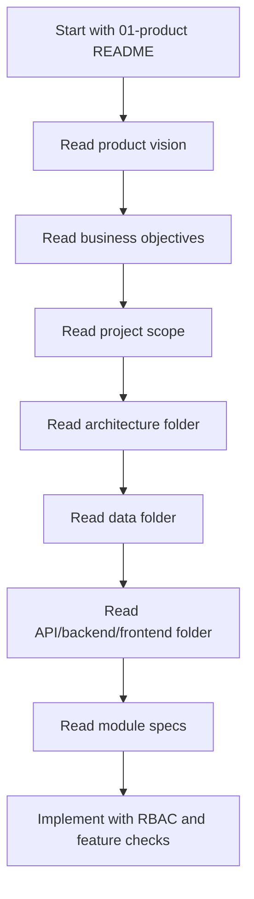

# 01 Product Knowledge Base

## 1. Purpose

This folder defines the product-level authority for the Unified Commerce Platform.

It explains what the platform is, why it exists, who it serves, and what business capabilities are in scope.

It must be read before module design, API design, backend implementation, frontend implementation, or testing.

The product folder does not replace architecture, database, API, backend, frontend, or security folders.

It gives the business and product baseline that those folders must implement.

## 2. Approved source hierarchy

| Priority | Source | Usage |
|---:|---|---|
| 1 | Scope document | Defines product scope and operational modules |
| 2 | Database design | Defines entities, relationships, tenant ownership, and constraints |
| 3 | Backend architecture | Defines backend layering and implementation style |
| 4 | Frontend architecture | Defines frontend structure, routing, state, and shells |
| 5 | This folder | Explains product intent and scope interpretation |

When a Markdown file conflicts with the approved source documents, the approved source documents win.

When product text is unclear, check [[../03-data/README]] and [[../02-architecture/README]] before implementation.

## 3. Enterprise scope position

This platform is not an MVP.

It is a large multi-tenant enterprise SaaS system.

The system combines POS, E-Commerce, tenant management, catalog, inventory, payments, returns, offline sync, and reporting.

Implementation must not simplify the model into a single-store POS.

Every tenant-owned record must be scoped to a tenant or linked through a tenant-owned parent.

Every operational feature must support configurable access, except platform-admin-only features.

## 4. Product documents in this folder

| File | Responsibility | Read before |
|---|---|---|
| [[product-vision]] | Long-term platform direction | Scope changes and architecture decisions |
| [[business-objectives]] | Business outcomes and stakeholder goals | Feature prioritization and acceptance criteria |
| [[project-scope]] | Product capability boundaries | Module specs and implementation planning |
| [[README]] | Navigation and rules | Any 01-product file |

## 5. Product interpretation model

The product model has four levels.

1. Platform ownership.

2. Tenant ownership.

3. Outlet or channel operation.

4. User, role, permission, and feature access.

This means features must not be treated as globally available just because code exists.

A feature must pass entitlement, runtime configuration, permission, and role checks before use.

## 6. Configurable access rule

All non-platform features must be configurable per tenant.

A tenant may have POS enabled but E-Commerce disabled.

A tenant may allow one role to create products but not publish products online.

A tenant may allow outlet managers to approve discounts but block cashiers from doing so.

A tenant may enable returns but restrict cross-outlet returns to managers.

A tenant may enable offline POS only for selected outlets or devices.

This behavior must be documented and implemented through configuration and RBAC, not hardcoded role names.

## 7. Access-control layers

| Layer | Database ownership | Product meaning |
|---|---|---|
| Platform feature catalog | `platform_features` | Platform-known capability list |
| Tenant entitlement | `tenant_feature_entitlements` | Platform allows tenant to use feature |
| Runtime feature flag | `feature_flags` | Tenant/outlet/user-level enablement |
| Permission catalog | `permissions` | System action codes |
| Role definition | `roles` | Tenant-owned role model |
| Permission assignment | `role_permissions` | Role gets action rights |
| Feature assignment | `role_feature_assignments` | Role gets access to enabled feature |
| User assignment | `tenant_user_roles`, `outlet_user_roles` | User receives tenant/outlet authority |

## 8. Required reading flow

## 9. Platform actors

| Actor | Product responsibility | Access behavior |
|---|---|---|
| Platform Admin | Creates tenants and controls platform entitlements | Platform-controlled |
| Tenant Admin | Configures tenant operations and roles | Tenant-configurable |
| Outlet Manager | Operates outlet workflows | Tenant/outlet role-controlled |
| Cashier | Performs POS checkout and session actions | Outlet role-controlled |
| Inventory Staff | Handles stock workflows | Permission-controlled |
| E-Commerce Operator | Handles orders and fulfillment | Permission-controlled |
| Customer | Uses online storefront and account | Tenant-scoped customer access |

## 10. Product module families

The product scope is grouped into capability families.

| Family | Examples |
|---|---|
| Foundation | Tenants, outlets, settings, themes |
| Access | Auth, staff, roles, permissions, feature assignment |
| Commerce Core | Catalog, pricing, tax, inventory |
| POS Operations | Tills, sessions, sales, cash drawer, receipts |
| E-Commerce | Storefront, cart, checkout, orders, fulfillment |
| Financial Controls | Payments, refunds, discounts, coupons |
| Post-sale | Returns, exchanges, loyalty-ready customer history |
| Reliability | Offline sync, audit, reports |

## 11. Implementation expectation

Product documents must drive module boundaries.

Database tables must drive entity ownership.

Backend services must enforce business rules.

Frontend must represent configured access and workflow state.

Testing must verify tenant isolation and permission behavior.

No feature should be implemented as a fixed menu item without access checks.

No backend endpoint should rely only on frontend hiding.

## 12. Documentation style rules

Each document must explain the system-specific reason behind the feature.

Each document must name ownership boundaries clearly.

Each document must mention tenant-specific behavior where the topic is tenant-owned.

Each document must link to dependent documents where the topic crosses folders.

Each document must avoid generic SaaS language that does not map to this system.

## 13. Product-to-database reference rule

When a product requirement creates or changes persisted data, it must map to a database table.

If no database table exists, do not invent one during implementation.

Raise a clarification or architecture change request.

Examples:

| Requirement | Database anchor |
|---|---|
| Tenant feature enablement | `tenant_feature_entitlements` |
| Tenant role management | `roles`, `role_permissions` |
| Outlet staff assignment | `outlet_user_roles` |
| POS session control | `till_sessions` |
| Offline sync conflict | `offline_sync_conflicts` |
| Receipt reprint audit | `receipt_print_logs`, `audit_logs` |

## 14. Frontend alignment rule

Frontend screens must follow the approved frontend structure.

Product features belong under `features/` when reusable.

Full workflow screens belong under `pages/`.

POS workflow shell areas belong under `shells/`.

Shared calculations may live in `shared-kernel/`, but backend remains final authority.

## 15. Backend alignment rule

Backend features must follow the approved Clean Architecture structure.

Controllers receive requests and return responses.

Application services orchestrate workflows.

Domain models hold pure business rules.

Infrastructure handles persistence and integrations.

Repositories do not own business decisions.

## 16. Product acceptance rule

A product feature is not complete until these are true.

- It has a tenant ownership rule.
- It has a permission rule.
- It has a feature entitlement or feature flag rule when feature-gated.
- It has a database mapping.
- It has a backend validation rule.
- It has a frontend visibility or disabled-state rule.
- It has audit behavior when sensitive.

## 17. Anti-patterns

Do not hardcode access by role name.

Do not assume every tenant uses every feature.

Do not mix platform admin and tenant staff identity models.

Do not store stock quantity on products or variants.

Do not let frontend totals become financial source of truth.

Do not silently accept offline conflicts.

Do not create cache or generic tables not approved by the database design.

## 18. Related folders

Use [[../02-architecture/README]] for system architecture decisions.

Use [[../03-data/README]] for database and data ownership decisions.

Use [[../04-api/README]] for endpoint standards.

Use [[../05-backend/README]] for backend implementation rules.

Use [[../06-frontend/README]] for frontend implementation rules.

Use [[../07-modules/README]] for module-level specifications.

Use [[../09-security-and-compliance/README]] for security and RBAC controls.

Use [[../14-ai-ide-rules/README]] before using Cursor or AI code generation.
