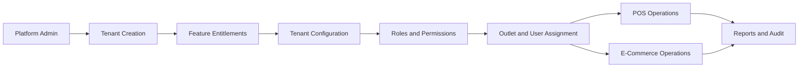

# Business Objectives

## 1. Objective summary

The business objective is to deliver a unified commerce platform for tenants that operate POS, E-Commerce, or both.

The platform must support independent tenant operations on one shared SaaS foundation.

Each tenant must control its own outlets, users, roles, catalog, inventory, customers, payments, orders, returns, reports, settings, and themes.

The system must not force fixed operational behavior across all customers.

Tenant-level features must be configurable based on customer business requirements, roles, rights, and enabled features.

## 2. Strategic objectives

| Objective | Meaning | System impact |
|---|---|---|
| Unified commerce | POS and E-Commerce share core catalog, inventory, customers, payments, and reporting | Avoid duplicate systems |
| Multi-tenant SaaS | Many businesses run independently on the same platform | Enforce tenant isolation |
| Configurable operations | Each tenant can adapt the platform to its business model | Use feature entitlements, flags, roles, and permissions |
| Reliable retail counter | POS must support fast cashier workflows and offline resilience | Build POS session, local cache, and sync controls |
| Auditable control | Sensitive actions must be traceable | Use audit logs and immutable ledgers |
| Scalable implementation | Modules must be independently understandable | Use documented module boundaries |

## 3. Tenant business outcomes

Tenants should be able to operate physical stores, online sales, or hybrid operations from one system.

Tenants should manage users without asking platform engineers to change code.

Tenants should control which staff can sell, refund, discount, adjust stock, print receipts, or manage settings.

Tenants should configure outlet-level behavior when business rules differ by location.

Tenants should view sales, stock, payments, returns, and cash reports without mixing data with other tenants.

Tenants should keep POS operation running when connectivity is poor if offline mode is enabled.

## 4. Platform business outcomes

The platform owner should onboard tenants using a repeatable tenant creation and entitlement process.

The platform owner should enable or disable platform features per tenant.

The platform owner should support different subscription or operating modes without changing feature code.

The platform owner should maintain a platform-owned permission and feature catalog.

The platform owner should protect tenant data separation and operational auditability.

The platform owner should avoid custom forks for each customer by using configuration.

## 5. Actor objective matrix

| Actor | Primary objective | Required configurable control |
|---|---|---|
| Platform Admin | Create tenants and enable platform features | Platform entitlement management |
| Tenant Admin | Configure business operations | Tenant roles, permissions, feature flags |
| Outlet Manager | Control outlet workflows | Outlet-scoped roles and approvals |
| Cashier | Complete sales quickly | Limited POS permissions |
| Inventory Staff | Maintain stock accuracy | Inventory permissions and outlet assignment |
| E-Commerce Operator | Process online orders | Order and fulfillment permissions |
| Customer | Browse, buy, track, and return where allowed | Tenant-scoped customer account behavior |

## 6. Business capability map

## 7. Objective: tenant-specific access customization

The system must support tenant-owned role models.

A tenant can create a role named `Senior Cashier`, `Outlet Supervisor`, or `Stock Controller`.

The role name itself must not grant authority.

Authority comes from permissions and feature assignments.

Backend code must check permission codes and feature availability, not display names.

Frontend code may hide or disable actions based on access context, but backend validation is mandatory.

## 8. Permission-driven business examples

| Business case | Wrong implementation | Correct implementation |
|---|---|---|
| Cashier discount | Hardcode cashier max discount | Check discount policy and role permission |
| Receipt reprint | Show button to all managers | Require receipt reprint permission |
| Stock adjustment | Allow all inventory users | Require stock adjustment permission and audit |
| Cross-outlet return | Hardcode blocked or allowed | Tenant setting plus permission rule |
| Offline POS | Enable globally | Tenant/outlet/device feature flag |

## 9. Objective: unified catalog

The catalog must be shared across POS and E-Commerce.

Products may be POS-only, online-only, or available in both channels.

Variants carry SKU and barcode behavior.

Pricing, tax, return policy, images, and stock visibility must support channel-specific behavior.

The database already supports products, variants, attributes, categories, brands, suppliers, price lists, tax classes, and return policies.

## 10. Objective: inventory accuracy

Inventory must be outlet-wise and variant-wise.

Every stock change must be traceable through stock movements.

Online orders reserve stock.

POS sales deduct stock from the active outlet.

Returns may restock, quarantine, or discard items.

Offline sync must never silently corrupt stock.

## 11. Objective: POS operational speed

POS workflow must be barcode-first.

The scan/search input should remain ready for scanning.

Cashier screens must show cart, totals, customer, discounts, payments, and receipt status clearly.

The frontend architecture supports POS shells for product grid, cart, payment, customer, discount, return, and receipt.

The backend must validate all final sale totals, stock movements, payments, permissions, and session state.

## 12. Objective: cash and session control

Real POS operation requires till sessions.

Opening float, cash in, cash out, expected cash, counted cash, variance, and manager approval must be supported.

Cash reporting must reconcile with payments and till sessions.

Billing may be blocked when the till session is not open if the tenant enables session control.

## 13. Objective: payment and refund traceability

Payments must be recorded separately from sales and orders.

Split payments must allocate payment amounts to sales or orders.

Refunds must reference original captured payments.

Cash, card, QR, wallet, bank transfer, and gateway-backed methods must be supported through tenant payment configuration.

Secrets must not be stored directly in tenant payment configuration.

## 14. Objective: post-sale controls

Returns and exchanges must be separate documents.

They must reference original sale or order where required.

Return quantities must not exceed eligible quantities.

Non-returnable items and expired windows must be blocked or manager-overridden based on configuration.

Refund and exchange difference handling must follow payment rules.

## 15. Objective: E-Commerce operations

Online storefront must expose only enabled and published products.

Cart checkout must revalidate price, tax, discounts, and stock.

Orders must store address snapshots.

Order, payment, and fulfillment statuses must be standardized.

Pickup and delivery must use fulfillment-ready workflows.

## 16. Objective: offline resilience

Offline POS is a business continuity capability.

It depends on local product, price, tax, and session cache.

Offline transactions must use unique client transaction IDs.

Sync must validate duplicates, closed sessions, stale data, payment rules, and stock conflicts.

Conflicts must become explicit conflict records.

## 17. Objective: reporting and audit

Managers need sales, payment, stock, tax, discount, return, cash, and offline sync visibility.

Reports must be based on transaction data or approved read models.

Audit logs must capture sensitive actions with actor, tenant, entity, action, old values, new values, and timestamp.

Normal users must not edit audit logs.

## 18. Success criteria

| Area | Success signal |
|---|---|
| Tenant isolation | No query leaks another tenant's data |
| Configurability | Tenant can change access without code deployment |
| POS reliability | Cashier can complete core billing quickly |
| Inventory integrity | Every stock movement has a document reference |
| Payment control | Payments and refunds are traceable and allocated |
| Offline safety | Duplicate and conflict cases are handled explicitly |
| Auditability | Sensitive actions are searchable and immutable |

## 19. Non-objectives

This folder does not define UI pixel design.

This folder does not define final API contracts.

This folder does not define database migrations.

This folder does not define deployment pipelines.

Those belong to the relevant architecture, API, data, frontend, backend, and delivery folders.

## 20. Business objective dependencies

Read [[product-vision]] for long-term product direction.

Read [[project-scope]] for detailed capability boundaries.

Read [[../07-modules/README]] for module-level implementation documents.

Read [[../09-security-and-compliance/README]] for permission and security rules.
