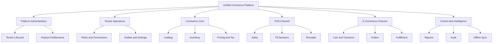

# Product Vision

## 1. Vision statement

The Unified Commerce Platform is an enterprise multi-tenant SaaS system for businesses that need POS and E-Commerce operations on one controlled foundation.

The platform vision is to let each tenant run its own commerce model without custom code forks.

The same system must support store-first retailers, online-first sellers, and hybrid businesses.

The platform must unify catalog, inventory, customers, payments, returns, receipts, reporting, and audit.

The platform must also allow each tenant to configure access, features, roles, and rights according to its business requirements.

## 2. Product identity

This product is not a single-shop POS.

This product is not only an online store.

This product is not a fixed-role admin panel.

This product is a configurable unified commerce operating platform.

The product must be reliable enough for retail counters and structured enough for enterprise controls.

## 3. Vision principles

| Principle | Meaning |
|---|---|
| Unified foundation | POS and E-Commerce share core business data |
| Tenant independence | Each tenant operates in isolated business space |
| Configurable access | Rights are assigned through RBAC and features |
| Backend authority | Server validates final business decisions |
| Auditability | Sensitive actions are traceable |
| Offline resilience | POS can continue where enabled during connectivity loss |
| Modular evolution | Capabilities are documented and implemented by module |

## 4. Capability vision map

## 5. Tenant-first product model

Tenants are the business boundary.

Outlets are operational locations inside tenants.

Users are staff identities inside tenants.

Roles are tenant-owned definitions.

Permissions are platform-owned action codes assigned to tenant roles.

Features are platform-owned capabilities enabled for tenants and assigned to roles.

Runtime flags can further control feature availability at tenant, outlet, or user scope.

## 6. Why configurability is central

Different customers will operate differently.

One tenant may require manager approval for every refund.

Another tenant may allow outlet managers to approve refunds below a threshold.

One tenant may use POS only.

Another tenant may use POS, E-Commerce, pickup, delivery, offline POS, and returns.

Hardcoded access would force wrong workflows and expensive customizations.

Configurable RBAC and feature assignment are therefore part of the product vision, not optional enhancements.

## 7. Channel vision

The POS channel must serve fast cashier workflows.

The E-Commerce channel must serve browse, cart, checkout, order, and fulfillment workflows.

Both channels must use the same core product, price, tax, customer, payment, inventory, and reporting foundations.

Channel differences must be represented through flags, settings, price lists, fulfillment rules, and permissions.

## 8. Platform administration vision

Platform administrators control SaaS-level setup.

They create tenants, manage tenant status, enable platform features, and support platform-level operations.

Platform administrators are not tenant staff.

Platform admin identity must remain separate from tenant user identity.

Platform-admin-only features do not need tenant configurability.

Tenant operational features do need tenant configurability.

## 9. Tenant administration vision

Tenant administrators configure the business once platform features are enabled.

They manage outlets, staff users, tenant roles, outlet roles, feature assignment, settings, themes, payment methods, and operational rules.

Tenant administrators should not need database access or code changes.

Tenant administrators must not enable platform-disabled features.

## 10. POS vision

POS must be optimized for speed, clarity, and reliability.

Cashiers need scan-first operation and visible totals.

Managers need overrides, discounts, refunds, cash variance approval, and operational reports.

Outlet context must be clear because sales deduct outlet stock.

Till session context must be clear because cash reconciliation depends on it.

Offline state must be visible when offline mode is active.

## 11. E-Commerce vision

E-Commerce must expose tenant-approved online products.

Customers should browse, add to cart, checkout, and track orders.

Orders must integrate with stock reservation, payment status, fulfillment, delivery or pickup, and customer history.

Guest checkout should remain tenant-scoped.

Customer identities must not be globally merged across tenants.

## 12. Catalog vision

The catalog is the shared commercial product foundation.

Products define business items.

Variants define sellable units with SKU and barcode.

Attributes support variant and product detail structures.

Images and descriptions support online presentation.

Return policies and tax classes support operational rules.

Price lists support channel and outlet pricing behavior.

## 13. Inventory vision

Inventory must be reliable and auditable.

Stock belongs to outlet and variant.

Available quantity must consider reservations.

Stock movements are immutable history.

Adjustments, transfers, purchase receipts, returns, sales, and stocktakes all create stock movement records.

Offline conflicts must never silently adjust stock without traceability.

## 14. Financial control vision

Payments and refunds must support POS and E-Commerce.

Payment records must be separated from sale and order documents.

Allocations connect payments to sales and orders.

Refunds connect to original payments.

Split payments and partial refunds must be traceable.

Receipts must preserve frozen transaction payloads.

## 15. Reporting vision

Reporting must support daily management decisions.

Reports should cover sales, payments, tax, inventory, discounts, returns, exchanges, cash, and offline sync.

Read models may improve performance, but transaction data remains the source of truth.

Report access must be permission-controlled.

## 16. Architecture vision

The backend must follow Clean Architecture.

The API layer must remain thin.

Application services must orchestrate use cases.

Domain models must hold pure business rules.

Infrastructure must handle persistence and integrations.

The frontend must follow modular feature, shell, page, state, and shared-kernel structure.

## 17. Product growth vision

The approved database includes wishlist, reviews, loyalty, membership, OTP, and attribute templates.

These are valid product capabilities for the big project.

They should still follow the same tenant-configurable access model.

Advanced AI import and courier integration can be expanded through documented modules and feature gates.

## 18. Decision guardrails

Do not design tenant features as global fixed behavior.

Do not combine platform users and tenant users.

Do not allow direct cross-tenant data access.

Do not bypass backend permission checks.

Do not make frontend calculations the financial source of truth.

Do not implement offline sync without idempotency and conflict handling.

## 19. Vision success statement

The platform succeeds when a new tenant can be onboarded, configured, staffed, permissioned, stocked, sold through POS and online channels, audited, and reported without custom engineering work for ordinary business differences.

## 20. Related reading

Read [[business-objectives]] for measurable business outcomes.

Read [[project-scope]] for exact product capability boundaries.

Read [[../02-architecture/README]] for architecture rules.

Read [[../03-data/README]] for data ownership and table mapping.
