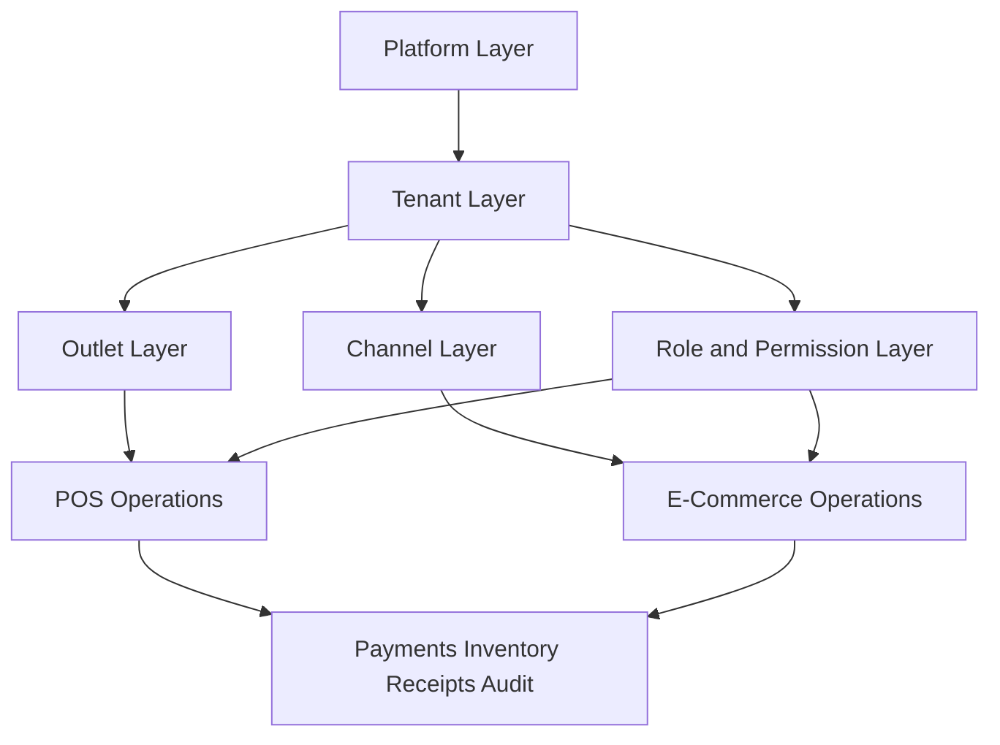
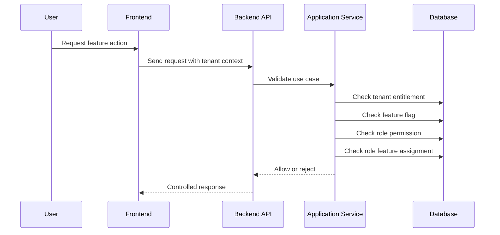

# Project Scope

## 1. Scope summary

The project scope is a full Unified Commerce SaaS platform.

It includes POS, E-Commerce, tenant administration, catalog, inventory, payments, refunds, receipts, returns, exchanges, offline POS, reporting, audit, configuration, and feature access control.

The system must support POS-only, E-Commerce-only, and hybrid tenant operating modes.

This document defines product boundaries only.

Detailed implementation belongs to module, API, backend, frontend, data, security, and testing documents.

## 2. Scope rule for tenant configurability

All non-platform features are tenant-configurable.

Tenant configurability includes feature enablement, role assignment, permission assignment, user-right customization, outlet assignment, and runtime flags.

No tenant operational feature should be implemented as fixed access behavior.

Platform-admin-only features remain platform-controlled.

## 3. Scope architecture overview

## 4. In-scope module list

| No. | Module | Scope position |
|---:|---|---|
| 1 | Platform and Tenant Management | Tenant lifecycle and platform entitlements |
| 2 | Authentication, Staff Identity, RBAC, and Feature Access | Identity and configurable access |
| 3 | Data Import and AI-Assisted Onboarding | CSV/Excel import and later AI-assisted extraction |
| 4 | Product and Catalog Management | Shared POS and online catalog |
| 5 | Tax and Pricing Rules | Tax, pricing, discount interaction, refund reversal |
| 6 | Inventory and Stock Management | Outlet-wise stock and movement ledger |
| 7 | POS Device, Terminal, and Hardware Management | POS devices, tills, printers, scanners |
| 8 | Cash Drawer, Shift, and Session Management | Till sessions and cash reconciliation |
| 9 | POS Sales and Checkout | Scan, cart, sale, payment trigger, receipt trigger |
| 10 | Payments, Refunds, and Receipt Management | Payments, allocations, refunds, receipts |
| 11 | Discounts, Coupons, and Approval Management | Discounts, coupons, limits, approvals |
| 12 | Returns and Exchanges | Return and exchange documents |
| 13 | E-Commerce Storefront, Cart, Checkout, and Orders | Online buying workflow |
| 14 | Order Status and Workflow Rules | Status lifecycle validation |
| 15 | Fulfillment, Pickup, and Delivery | Pickup, delivery, tracking readiness |
| 16 | Customer Management | Tenant-scoped customer records |
| 17 | Offline-First POS and Sync | Local billing and server reconciliation |
| 18 | Reporting, Dashboards, and Audit | Reports and traceability |
| 19 | Tenant Configuration, Feature Flags, and Themes | Runtime configuration |
| 20 | Security, Validation, and Operational Controls | Cross-cutting control layer |

## 5. Platform and tenant management scope

Platform admin can create tenants.

Platform admin can set tenant status, currency, timezone, locale, and operating mode.

Platform admin can enable platform features for a tenant.

Tenant admin can configure only enabled tenant features.

Tenant admin can create and manage outlets within the tenant.

Suspended tenants must not process new sales or orders unless platform policy explicitly allows it.

Relevant tables include `platform_users`, `tenants`, `outlets`, `outlet_addresses`, and `document_sequences`.

## 6. Identity and access scope

Staff users are tenant-bound.

Platform users are separate from tenant staff users.

Permissions are platform-owned catalog values.

Roles are tenant-owned definitions.

Role permissions are tenant-scoped mappings.

Tenant role assignment and outlet role assignment are both in scope.

Feature assignment to roles is in scope.

Relevant tables include `users`, `roles`, `permissions`, `role_permissions`, `tenant_user_roles`, `outlet_user_roles`, `platform_features`, `tenant_feature_entitlements`, and `role_feature_assignments`.

## 7. Access validation workflow

## 8. Product and catalog scope

Categories, brands, suppliers, products, variants, attributes, images, tax classes, return policies, and price lists are in scope.

SKU and barcode are variant-level concepts.

Products can be POS sellable, online sellable, or both.

Sellable product behavior must be validated before POS or online use.

Stock quantity must not be stored on products or variants.

Catalog features must be permission-controlled and tenant-configurable.

## 9. Tax and pricing scope

Tax classes and tax rates are in scope.

Price lists and price list items are in scope.

The system must support channel-aware pricing.

Tax calculation must be consistent across POS, E-Commerce, receipts, returns, refunds, and reports.

Frontend may preview totals using shared-kernel calculators.

Backend must recalculate and validate final totals.

## 10. Inventory scope

Inventory balances are stored by tenant, outlet, and variant.

Stock movements are immutable ledger records.

Purchase receipts, stock adjustments, transfers, stocktakes, sales, returns, exchanges, and reservations are in scope.

Online stock reservation and reservation release are in scope.

Negative stock behavior must be controlled by tenant setting or explicit policy.

Offline stock conflict handling is in scope.

## 11. POS devices and sessions scope

Tills, POS devices, till sessions, cash movement types, cash movements, and cash count denominations are in scope.

A POS device belongs to one tenant and one outlet.

A POS device must use the correct outlet context for sale and stock deduction.

A till session controls cashier shift and cash reconciliation.

Session control can affect whether billing is allowed.

## 12. POS sales scope

Barcode scan product entry is in scope.

Product search and quick add are in scope.

Cart management, quantity changes, item remove, hold sale, recall sale, void, and payment trigger are in scope.

Completed sale cancellation and price override require permission and audit.

Completed sales create sale lines, payments, stock movements, and receipts.

## 13. Payments, refunds, and receipts scope

Cash, card, QR, wallet, bank transfer, and gateway-backed payment readiness are in scope.

Payment provider configuration is tenant-owned but must not store secrets directly.

Payment allocations to sales and orders are in scope.

Refunds must reference original payment records.

Receipts, receipt templates, print logs, reprints, and receipt barcode lookup are in scope.

Receipt reprint must be permission-controlled and audited.

## 14. Discounts and coupons scope

Discount types, scopes, policies, requests, coupons, discount applications, and coupon redemptions are in scope.

Line, sale, and order discounts are in scope.

Approval thresholds are in scope.

Coupon expiry, usage count, customer limits, channel rules, and stacking rules are in scope.

Discount refund allocation must be handled consistently.

## 15. Returns and exchanges scope

Returns and exchanges are separate business documents.

Return and exchange workflows can reference original POS sales or E-Commerce orders.

Partial returns are in scope.

Return policy validation is in scope.

Damaged, opened, expired, restock, quarantine, and discard behavior is in scope.

Cross-channel and cross-outlet return rules must be tenant-configurable.

## 16. E-Commerce scope

Online product listing, product detail, variant selection, cart, guest cart, checkout, order creation, address snapshots, order history, and order tracking readiness are in scope.

Only online-enabled products should appear online.

Checkout must revalidate stock, price, tax, discounts, and payment state.

Guest customers remain tenant-scoped.

## 17. Fulfillment scope

Delivery methods, zones, zone rates, deliveries, delivery items, and delivery tracking are in scope.

Pickup and delivery flows are both in scope.

Pickup uses ready-for-pickup and collected behavior.

Delivery uses shipped, out-for-delivery, delivered, failed, returned, or cancelled behavior.

Courier API integration can be implemented through provider readiness, but manual tracking is supported.

## 18. Offline POS scope

Offline billing is in scope where offline mode is enabled.

Local product, price, tax, and rule cache are in scope.

Offline sale, payment, receipt, cash movement, stock movement, return, and exchange sync items are in scope.

Duplicate prevention uses client entity IDs and client transaction IDs.

Server-side sync validation is mandatory.

Conflicts must be recorded in offline conflict tables.

## 19. Reporting and audit scope

Daily sales, payment, inventory, discount, return, exchange, tax, cash, and offline sync reporting are in scope.

Reporting read models are allowed.

Read models are not source of truth.

Audit logs are required for sensitive actions.

Feature configuration changes must be auditable.

## 20. Out-of-scope for this folder

This file does not define exact UI layouts.

This file does not define final API payloads.

This file does not define database migrations.

This file does not define test automation code.

Detailed module specifications must be written under [[../07-modules/README]].

API details must be written under [[../04-api/README]].

Backend implementation rules must be written under [[../05-backend/README]].

Frontend implementation rules must be written under [[../06-frontend/README]].

Security rules must be written under [[../09-security-and-compliance/README]].

## 21. Scope acceptance checklist

- Tenant boundary is defined.
- Feature entitlement behavior is defined.
- Tenant role and permission behavior is defined.
- Database ownership is known.
- Backend final authority is clear.
- Frontend visibility is not treated as security.
- Offline and audit behavior is considered where relevant.
- Module dependencies are not ignored.
