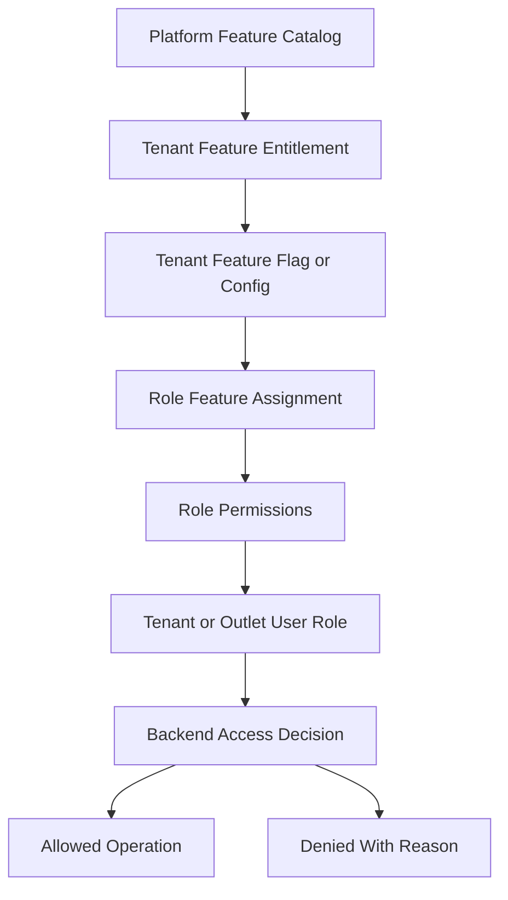
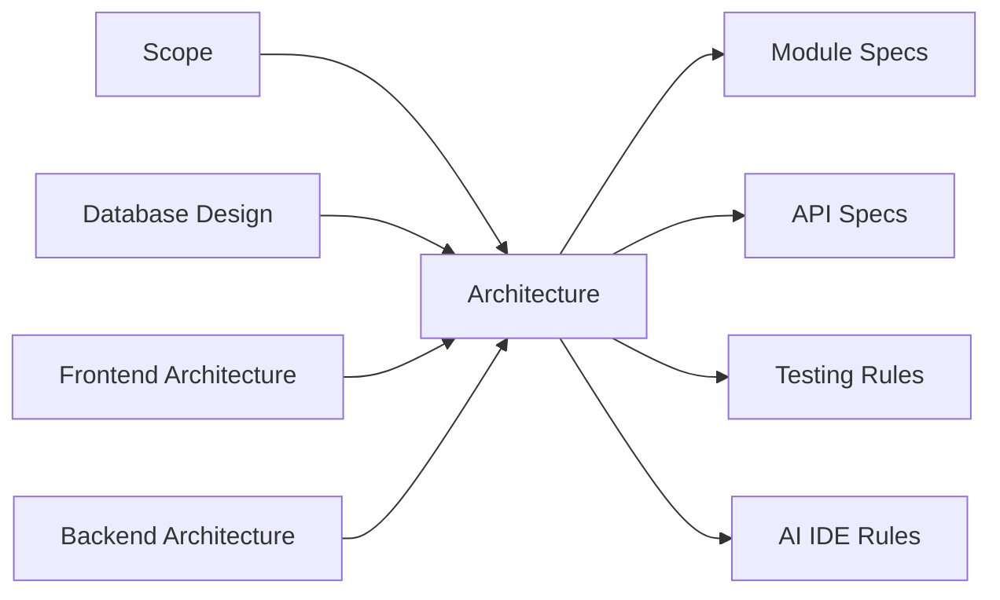

# Architecture Folder Guide

> This document defines architecture guidance for the Unified Commerce platform using the approved scope, database design, frontend architecture, and backend architecture only.

## Related Documents
- [[system-overview]]
- [[architecture-principles]]
- [[tenancy-architecture]]
- [[backend-architecture]]
- [[frontend-architecture]]

## Architecture Authority

| Area | Authority | Rule |
|---|---|---|
| Business scope | Scope document | Defines supported platform, POS, e-commerce, offline, reports, and admin capabilities. |
| Data model | Database design | Defines tenant ownership, entities, relationships, status fields, ledgers, and audit records. |
| Backend | Backend architecture | Defines Clean Architecture, service orchestration, repositories, validation, and transaction control. |
| Frontend | Frontend architecture | Defines bootstrap, layouts, feature modules, state, offline, peripherals, and shared UI kernels. |
| Access control | RBAC and feature model | Tenant features are configurable; backend remains the final authority. |

## Folder Purpose

The `02-architecture` folder defines the architecture baseline for the full Unified Commerce system.
It is not a generic design folder and must not be used to introduce undocumented patterns.
The folder explains how multi-tenancy, configurable access, frontend modules, backend services, security, offline sync, and scalability fit together.

## Reading Order

| Step | File | Why it matters |
|---:|---|---|
| 1 | [[system-overview]] | Understand the whole SaaS platform boundary. |
| 2 | [[architecture-principles]] | Understand non-negotiable design rules. |
| 3 | [[tenancy-architecture]] | Understand tenant isolation and customer-level configuration. |
| 4 | [[role-permission-capability-model]] | Understand configurable RBAC and feature access. |
| 5 | [[backend-architecture]] | Understand backend module and layer ownership. |
| 6 | [[frontend-architecture]] | Understand frontend module and state ownership. |
| 7 | [[security-architecture]] | Understand protection rules and backend authority. |
| 8 | [[offline-first-architecture]] | Understand offline POS constraints and sync safety. |
| 9 | [[scalability-considerations]] | Understand growth, reporting, and operational scaling. |

## Tenant-Configurable Access Rule

All non-platform features must support tenant/customer-level configuration.
Platform-admin-only features remain controlled by platform users and platform policy.
Tenant operational features must be enabled, assigned, and permission-checked before use.
Access must not be hardcoded by fixed job titles such as cashier, manager, or tenant admin.
A role name is only a label; the actual authority comes from assigned permissions and feature access.

| Layer | Responsibility |
|---|---|
| Platform feature entitlement | Decides whether a tenant can use a platform capability. |
| Tenant feature flag | Decides whether the entitled capability is active for tenant, outlet, or user scope. |
| Role permission | Decides whether a role can perform a specific action. |
| User role assignment | Decides whether a user receives tenant-level or outlet-level authority. |
| Backend enforcement | Performs final validation for every sensitive operation. |
| Frontend adaptation | Shows, hides, disables, or explains actions based on effective access. |

## Documentation Rules

- Do not add architecture that is not supported by the approved source documents.
- Do not remove tenant isolation from any tenant-owned table or service.
- Do not make role behavior fixed in UI or backend code.
- Do not treat frontend hiding as security.
- Do not bypass the database ownership rules when designing APIs.
- Do not create duplicate source-of-truth records for payments, stock, sales, orders, or sync queues.

## Architecture Map

## Ownership Boundaries

| Topic | Do not confuse with | Correct owner |
|---|---|---|
| Tenant creation | Tenant admin settings | Platform admin flow and tenant foundation. |
| Feature entitlement | Runtime flag | Platform-level availability before tenant configuration. |
| Permission | Role label | Permission code is the action authority. |
| Frontend calculation | Final business calculation | Backend validates final totals and stock. |
| Offline queue | Business transaction source | Accepted server records are the source of truth. |

## Standard Validation Sequence

1. Resolve authenticated actor and actor type.
2. Resolve tenant context from authenticated claims or trusted request context.
3. Verify tenant status is active for operational actions.
4. Verify outlet context where the action is outlet-scoped.
5. Verify platform feature entitlement for the tenant.
6. Verify runtime feature flag for tenant, outlet, or user scope.
7. Verify user role assignment at tenant or outlet scope.
8. Verify required permission code for the action.
9. Validate input, status transition, ownership, and idempotency.
10. Write audit records for sensitive or configuration-changing operations.

## Required Architecture Review Before Coding

A feature is ready for implementation only when these are clear:

- Tenant ownership and outlet ownership.
- Required feature entitlement and runtime feature flag.
- Required permission code and role assignment path.
- Database tables and transaction boundaries.
- API request, response, validation, and error behavior.
- Frontend page, feature module, state store, and guard behavior.
- Audit requirement for sensitive action.
- Offline behavior if POS can use the feature offline.

- Implementation consideration 1: keep tenant, outlet, feature, role, permission, and audit behavior explicit in this area.
- Implementation consideration 2: keep tenant, outlet, feature, role, permission, and audit behavior explicit in this area.
- Implementation consideration 3: keep tenant, outlet, feature, role, permission, and audit behavior explicit in this area.
- Implementation consideration 4: keep tenant, outlet, feature, role, permission, and audit behavior explicit in this area.
- Implementation consideration 5: keep tenant, outlet, feature, role, permission, and audit behavior explicit in this area.
- Implementation consideration 6: keep tenant, outlet, feature, role, permission, and audit behavior explicit in this area.
- Implementation consideration 7: keep tenant, outlet, feature, role, permission, and audit behavior explicit in this area.
- Implementation consideration 8: keep tenant, outlet, feature, role, permission, and audit behavior explicit in this area.
- Implementation consideration 9: keep tenant, outlet, feature, role, permission, and audit behavior explicit in this area.
- Implementation consideration 10: keep tenant, outlet, feature, role, permission, and audit behavior explicit in this area.
- Implementation consideration 11: keep tenant, outlet, feature, role, permission, and audit behavior explicit in this area.
- Implementation consideration 12: keep tenant, outlet, feature, role, permission, and audit behavior explicit in this area.
- Implementation consideration 13: keep tenant, outlet, feature, role, permission, and audit behavior explicit in this area.
- Implementation consideration 14: keep tenant, outlet, feature, role, permission, and audit behavior explicit in this area.
- Implementation consideration 15: keep tenant, outlet, feature, role, permission, and audit behavior explicit in this area.
- Implementation consideration 16: keep tenant, outlet, feature, role, permission, and audit behavior explicit in this area.
- Implementation consideration 17: keep tenant, outlet, feature, role, permission, and audit behavior explicit in this area.
- Implementation consideration 18: keep tenant, outlet, feature, role, permission, and audit behavior explicit in this area.
- Implementation consideration 19: keep tenant, outlet, feature, role, permission, and audit behavior explicit in this area.
- Implementation consideration 20: keep tenant, outlet, feature, role, permission, and audit behavior explicit in this area.
- Implementation consideration 21: keep tenant, outlet, feature, role, permission, and audit behavior explicit in this area.
- Implementation consideration 22: keep tenant, outlet, feature, role, permission, and audit behavior explicit in this area.
- Implementation consideration 23: keep tenant, outlet, feature, role, permission, and audit behavior explicit in this area.
- Implementation consideration 24: keep tenant, outlet, feature, role, permission, and audit behavior explicit in this area.
- Implementation consideration 25: keep tenant, outlet, feature, role, permission, and audit behavior explicit in this area.
- Implementation consideration 26: keep tenant, outlet, feature, role, permission, and audit behavior explicit in this area.
- Implementation consideration 27: keep tenant, outlet, feature, role, permission, and audit behavior explicit in this area.
- Implementation consideration 28: keep tenant, outlet, feature, role, permission, and audit behavior explicit in this area.
- Implementation consideration 29: keep tenant, outlet, feature, role, permission, and audit behavior explicit in this area.
- Implementation consideration 30: keep tenant, outlet, feature, role, permission, and audit behavior explicit in this area.
- Implementation consideration 31: keep tenant, outlet, feature, role, permission, and audit behavior explicit in this area.
- Implementation consideration 32: keep tenant, outlet, feature, role, permission, and audit behavior explicit in this area.
- Implementation consideration 33: keep tenant, outlet, feature, role, permission, and audit behavior explicit in this area.
- Implementation consideration 34: keep tenant, outlet, feature, role, permission, and audit behavior explicit in this area.
- Implementation consideration 35: keep tenant, outlet, feature, role, permission, and audit behavior explicit in this area.
- Implementation consideration 36: keep tenant, outlet, feature, role, permission, and audit behavior explicit in this area.
