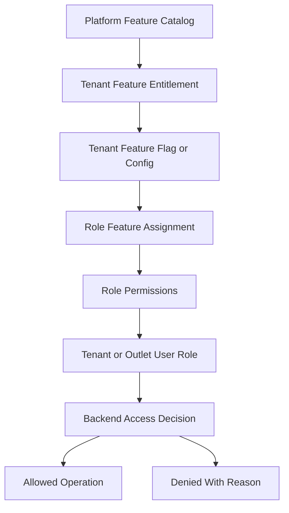
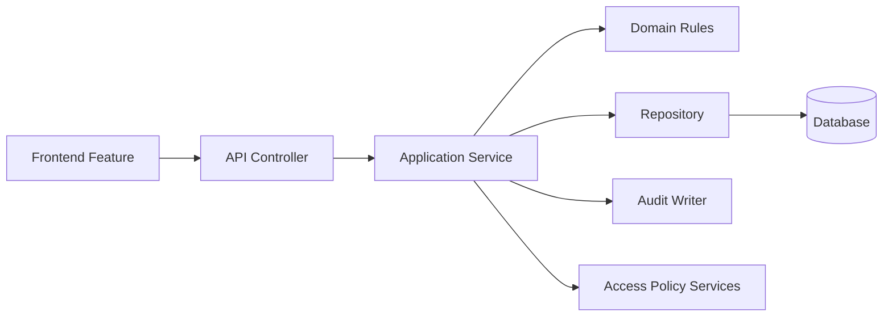

# Architecture Principles

> This document defines architecture guidance for the Unified Commerce platform using the approved scope, database design, frontend architecture, and backend architecture only.

## Related Documents
- [[system-overview]]
- [[tenancy-architecture]]
- [[security-architecture]]
- [[scalability-considerations]]

## Architecture Authority

| Area | Authority | Rule |
|---|---|---|
| Business scope | Scope document | Defines supported platform, POS, e-commerce, offline, reports, and admin capabilities. |
| Data model | Database design | Defines tenant ownership, entities, relationships, status fields, ledgers, and audit records. |
| Backend | Backend architecture | Defines Clean Architecture, service orchestration, repositories, validation, and transaction control. |
| Frontend | Frontend architecture | Defines bootstrap, layouts, feature modules, state, offline, peripherals, and shared UI kernels. |
| Access control | RBAC and feature model | Tenant features are configurable; backend remains the final authority. |

## Principle Summary

These principles are mandatory for the full enterprise project.
They protect tenant isolation, configurable access, transaction integrity, offline safety, and long-term maintainability.

| No. | Principle | Meaning |
|---:|---|---|
| 1 | Tenant isolation first | Every tenant-owned record is isolated by tenant context or tenant-owned parent. |
| 2 | Configurable access | Tenant feature behavior depends on entitlements, flags, roles, and permissions. |
| 3 | Backend authority | Backend validates security, stock, tax, pricing, payment, sync, and audit. |
| 4 | Ledger-based inventory | Stock changes require traceable movement records. |
| 5 | Payment traceability | Payment records, transactions, allocations, and refunds must remain auditable. |
| 6 | Offline acceptance control | Offline data is not trusted until server validation accepts it. |
| 7 | Modular ownership | Each module owns its workflow and data boundaries. |
| 8 | No random schema expansion | Tables must follow the approved database design unless architecture is updated. |

## Tenant-Configurable Access Rule

All non-platform features must support tenant/customer-level configuration.
Platform-admin-only features remain controlled by platform users and platform policy.
Tenant operational features must be enabled, assigned, and permission-checked before use.
Access must not be hardcoded by fixed job titles such as cashier, manager, or tenant admin.
A role name is only a label; the actual authority comes from assigned permissions and feature access.

| Layer | Responsibility |
|---|---|
| Platform feature entitlement | Decides whether a tenant can use a platform capability. |
| Tenant feature flag | Decides whether the entitled capability is active for tenant, outlet, or user scope. |
| Role permission | Decides whether a role can perform a specific action. |
| User role assignment | Decides whether a user receives tenant-level or outlet-level authority. |
| Backend enforcement | Performs final validation for every sensitive operation. |
| Frontend adaptation | Shows, hides, disables, or explains actions based on effective access. |



## Backend Authority Principle

Frontend logic improves user experience, but backend logic protects business correctness.

```csharp
public async Task AccessCheck(Guid tenantId, Guid actorUserId, string featureKey, string permissionCode)
{
    await tenantStatusPolicy.RequireActiveTenant(tenantId);
    await featurePolicy.RequireTenantEntitlement(tenantId, featureKey);
    await featurePolicy.RequireRuntimeEnabled(tenantId, featureKey);
    await permissionPolicy.RequirePermission(tenantId, actorUserId, permissionCode);
}
```

## Transaction Principle

Operations that modify money, stock, orders, sales, or sync status must run inside explicit transaction boundaries.

| Workflow | Transaction must include |
|---|---|
| POS sale completion | Sale, sale lines, payments, stock movements, receipt, audit. |
| Online order placement | Order, order items, address snapshot, reservation, payment allocation, status history. |
| Return completion | Return, return lines, refund allocation, stock movement, audit. |
| Offline sync item acceptance | Sync item, created server record, conflict/audit update. |

## Module Boundary Diagram



## Standard Validation Sequence

1. Resolve authenticated actor and actor type.
2. Resolve tenant context from authenticated claims or trusted request context.
3. Verify tenant status is active for operational actions.
4. Verify outlet context where the action is outlet-scoped.
5. Verify platform feature entitlement for the tenant.
6. Verify runtime feature flag for tenant, outlet, or user scope.
7. Verify user role assignment at tenant or outlet scope.
8. Verify required permission code for the action.
9. Validate input, status transition, ownership, and idempotency.
10. Write audit records for sensitive or configuration-changing operations.

## Prohibited Shortcuts

- Do not hardcode cashier, manager, or tenant admin authority.
- Do not trust tenant IDs from uncontrolled client input when authenticated claims exist.
- Do not update stock balance without a stock movement reference.
- Do not mark payment captured without a payment transaction or manual reference where applicable.
- Do not silently accept offline conflicts.
- Do not use reports as financial source of truth.
- Do not store payment secrets or plain OTP values.

- Implementation consideration 1: keep tenant, outlet, feature, role, permission, and audit behavior explicit in this area.
- Implementation consideration 2: keep tenant, outlet, feature, role, permission, and audit behavior explicit in this area.
- Implementation consideration 3: keep tenant, outlet, feature, role, permission, and audit behavior explicit in this area.
- Implementation consideration 4: keep tenant, outlet, feature, role, permission, and audit behavior explicit in this area.
- Implementation consideration 5: keep tenant, outlet, feature, role, permission, and audit behavior explicit in this area.
- Implementation consideration 6: keep tenant, outlet, feature, role, permission, and audit behavior explicit in this area.
- Implementation consideration 7: keep tenant, outlet, feature, role, permission, and audit behavior explicit in this area.
- Implementation consideration 8: keep tenant, outlet, feature, role, permission, and audit behavior explicit in this area.
- Implementation consideration 9: keep tenant, outlet, feature, role, permission, and audit behavior explicit in this area.
- Implementation consideration 10: keep tenant, outlet, feature, role, permission, and audit behavior explicit in this area.
- Implementation consideration 11: keep tenant, outlet, feature, role, permission, and audit behavior explicit in this area.
- Implementation consideration 12: keep tenant, outlet, feature, role, permission, and audit behavior explicit in this area.
- Implementation consideration 13: keep tenant, outlet, feature, role, permission, and audit behavior explicit in this area.
- Implementation consideration 14: keep tenant, outlet, feature, role, permission, and audit behavior explicit in this area.
- Implementation consideration 15: keep tenant, outlet, feature, role, permission, and audit behavior explicit in this area.
- Implementation consideration 16: keep tenant, outlet, feature, role, permission, and audit behavior explicit in this area.
- Implementation consideration 17: keep tenant, outlet, feature, role, permission, and audit behavior explicit in this area.
- Implementation consideration 18: keep tenant, outlet, feature, role, permission, and audit behavior explicit in this area.
- Implementation consideration 19: keep tenant, outlet, feature, role, permission, and audit behavior explicit in this area.
- Implementation consideration 20: keep tenant, outlet, feature, role, permission, and audit behavior explicit in this area.
- Implementation consideration 21: keep tenant, outlet, feature, role, permission, and audit behavior explicit in this area.
- Implementation consideration 22: keep tenant, outlet, feature, role, permission, and audit behavior explicit in this area.
- Implementation consideration 23: keep tenant, outlet, feature, role, permission, and audit behavior explicit in this area.
- Implementation consideration 24: keep tenant, outlet, feature, role, permission, and audit behavior explicit in this area.
- Implementation consideration 25: keep tenant, outlet, feature, role, permission, and audit behavior explicit in this area.
- Implementation consideration 26: keep tenant, outlet, feature, role, permission, and audit behavior explicit in this area.
- Implementation consideration 27: keep tenant, outlet, feature, role, permission, and audit behavior explicit in this area.
- Implementation consideration 28: keep tenant, outlet, feature, role, permission, and audit behavior explicit in this area.
- Implementation consideration 29: keep tenant, outlet, feature, role, permission, and audit behavior explicit in this area.
- Implementation consideration 30: keep tenant, outlet, feature, role, permission, and audit behavior explicit in this area.
- Implementation consideration 31: keep tenant, outlet, feature, role, permission, and audit behavior explicit in this area.
- Implementation consideration 32: keep tenant, outlet, feature, role, permission, and audit behavior explicit in this area.
- Implementation consideration 33: keep tenant, outlet, feature, role, permission, and audit behavior explicit in this area.
- Implementation consideration 34: keep tenant, outlet, feature, role, permission, and audit behavior explicit in this area.
- Implementation consideration 35: keep tenant, outlet, feature, role, permission, and audit behavior explicit in this area.
- Implementation consideration 36: keep tenant, outlet, feature, role, permission, and audit behavior explicit in this area.
- Implementation consideration 37: keep tenant, outlet, feature, role, permission, and audit behavior explicit in this area.
