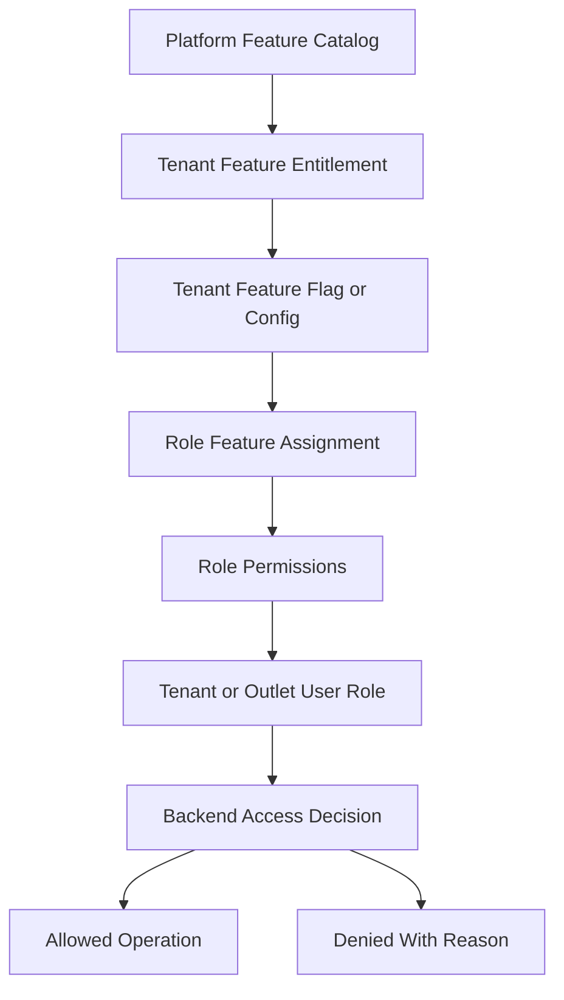
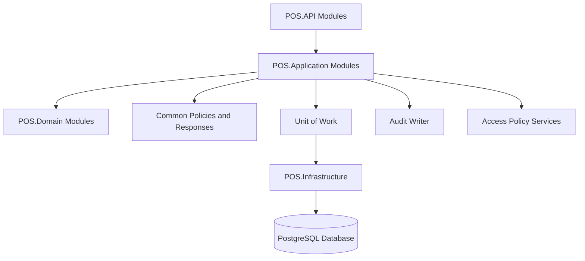

# Backend Architecture

> This document defines architecture guidance for the Unified Commerce platform using the approved scope, database design, frontend architecture, and backend architecture only.

## Related Documents
- [[system-overview]]
- [[role-permission-capability-model]]
- [[security-architecture]]
- [[offline-first-architecture]]
- [[../05-backend/README]]

## Architecture Authority

| Area | Authority | Rule |
|---|---|---|
| Business scope | Scope document | Defines supported platform, POS, e-commerce, offline, reports, and admin capabilities. |
| Data model | Database design | Defines tenant ownership, entities, relationships, status fields, ledgers, and audit records. |
| Backend | Backend architecture | Defines Clean Architecture, service orchestration, repositories, validation, and transaction control. |
| Frontend | Frontend architecture | Defines bootstrap, layouts, feature modules, state, offline, peripherals, and shared UI kernels. |
| Access control | RBAC and feature model | Tenant features are configurable; backend remains the final authority. |

## Backend Style

The backend follows Clean Architecture with feature-based modules.
The API layer receives requests and delegates use cases to Application services.
The Domain layer owns pure business rules and value behavior.
The Infrastructure layer owns persistence, repositories, external integrations, and Unit of Work.

## Layer Responsibilities

| Layer | Responsibility | Must not do |
|---|---|---|
| API | Controllers, request/response DTOs, middleware, filters | Business transaction orchestration. |
| Application | Use cases, validation, access checks, workflow orchestration | Direct database provider logic. |
| Domain | Entities, value objects, pure rules | HTTP, EF Core, external service calls. |
| Infrastructure | Repositories, DbContext, external gateways, UnitOfWork | UI decisions or business shortcuts. |

## Tenant-Configurable Access Rule

All non-platform features must support tenant/customer-level configuration.
Platform-admin-only features remain controlled by platform users and platform policy.
Tenant operational features must be enabled, assigned, and permission-checked before use.
Access must not be hardcoded by fixed job titles such as cashier, manager, or tenant admin.
A role name is only a label; the actual authority comes from assigned permissions and feature access.

| Layer | Responsibility |
|---|---|
| Platform feature entitlement | Decides whether a tenant can use a platform capability. |
| Tenant feature flag | Decides whether the entitled capability is active for tenant, outlet, or user scope. |
| Role permission | Decides whether a role can perform a specific action. |
| User role assignment | Decides whether a user receives tenant-level or outlet-level authority. |
| Backend enforcement | Performs final validation for every sensitive operation. |
| Frontend adaptation | Shows, hides, disables, or explains actions based on effective access. |



## Backend Module Map



## Required Backend Modules

| Module | Why required |
|---|---|
| Tenants and outlets | Root isolation and operating context. |
| Auth and identity | Actor context and secure login. |
| RBAC and feature access | Configurable tenant permissions. |
| Catalog and pricing | Product, variants, tax, price lists. |
| Inventory | Balances, ledger, reservations, transfers. |
| POS devices and till sessions | Counter operation context. |
| Sales | POS sale completion workflow. |
| Payments and refunds | Payment capture, allocation, refund handling. |
| Receipts | Receipt generation and reprint audit. |
| Discounts | Coupons, approvals, applications. |
| Returns and exchanges | Post-sale workflows and stock/payment impact. |
| Orders and fulfillment | E-commerce checkout and delivery/pickup. |
| Offline sync | Queue validation, acceptance, conflict handling. |
| Reporting and audit | Read models and traceability. |

## API Contract Example

```http
GET /api/v1/pos/sales HTTP/1.1
Authorization: Bearer <access-token>
X-Tenant-Id: <tenant-id>
X-Outlet-Id: <outlet-id-when-required>
```

```json
{
  "tenantId": "tenant-uuid",
  "outletId": "outlet-uuid",
  "featureKey": "pos.sales",
  "permissionCode": "pos.sale.create",
  "allowed": true,
  "reason": "feature_entitled_role_permission_granted"
}
```

## Controller Example

```csharp
[HttpPost]
public async Task<ActionResult<ApiResponse<SaleResponse>>> CreateSale(CreateSaleRequest request)
{
    var result = await saleService.CompleteSaleAsync(request, HttpContext.ToActorContext());
    return Ok(ApiResponse.Success(result));
}
```

## Service Transaction Example

```csharp
await unitOfWork.BeginAsync();
await accessPolicy.RequireAsync(ctx, "pos.sales", "pos.sale.create");
var sale = await saleWorkflow.CreateSaleAsync(request, ctx);
await paymentWorkflow.AllocatePaymentsAsync(sale, request.Payments, ctx);
await inventoryWorkflow.PostSaleOutMovementsAsync(sale, ctx);
await receiptWorkflow.GenerateReceiptAsync(sale, ctx);
await audit.LogAsync(ctx, "sale.completed", sale.Id);
await unitOfWork.CommitAsync();
```

## Standard Validation Sequence

1. Resolve authenticated actor and actor type.
2. Resolve tenant context from authenticated claims or trusted request context.
3. Verify tenant status is active for operational actions.
4. Verify outlet context where the action is outlet-scoped.
5. Verify platform feature entitlement for the tenant.
6. Verify runtime feature flag for tenant, outlet, or user scope.
7. Verify user role assignment at tenant or outlet scope.
8. Verify required permission code for the action.
9. Validate input, status transition, ownership, and idempotency.
10. Write audit records for sensitive or configuration-changing operations.

## Backend Non-Negotiables

- Do not implement CQRS or MediatR unless the approved backend architecture changes.
- Use service pattern and repository pattern consistently.
- Do not create generic cache tables outside the approved schema.
- Do not let controllers perform direct persistence logic.
- Do not accept tenant_id blindly from request body.
- Use idempotency for payment, order, sale sync, and offline replay scenarios.
- Audit sensitive actions such as refunds, voids, stock adjustments, feature changes, role changes, and receipt reprints.

- Implementation consideration 1: keep tenant, outlet, feature, role, permission, and audit behavior explicit in this area.
- Implementation consideration 2: keep tenant, outlet, feature, role, permission, and audit behavior explicit in this area.
- Implementation consideration 3: keep tenant, outlet, feature, role, permission, and audit behavior explicit in this area.
- Implementation consideration 4: keep tenant, outlet, feature, role, permission, and audit behavior explicit in this area.
- Implementation consideration 5: keep tenant, outlet, feature, role, permission, and audit behavior explicit in this area.
- Implementation consideration 6: keep tenant, outlet, feature, role, permission, and audit behavior explicit in this area.
- Implementation consideration 7: keep tenant, outlet, feature, role, permission, and audit behavior explicit in this area.
- Implementation consideration 8: keep tenant, outlet, feature, role, permission, and audit behavior explicit in this area.
- Implementation consideration 9: keep tenant, outlet, feature, role, permission, and audit behavior explicit in this area.
- Implementation consideration 10: keep tenant, outlet, feature, role, permission, and audit behavior explicit in this area.
- Implementation consideration 11: keep tenant, outlet, feature, role, permission, and audit behavior explicit in this area.
