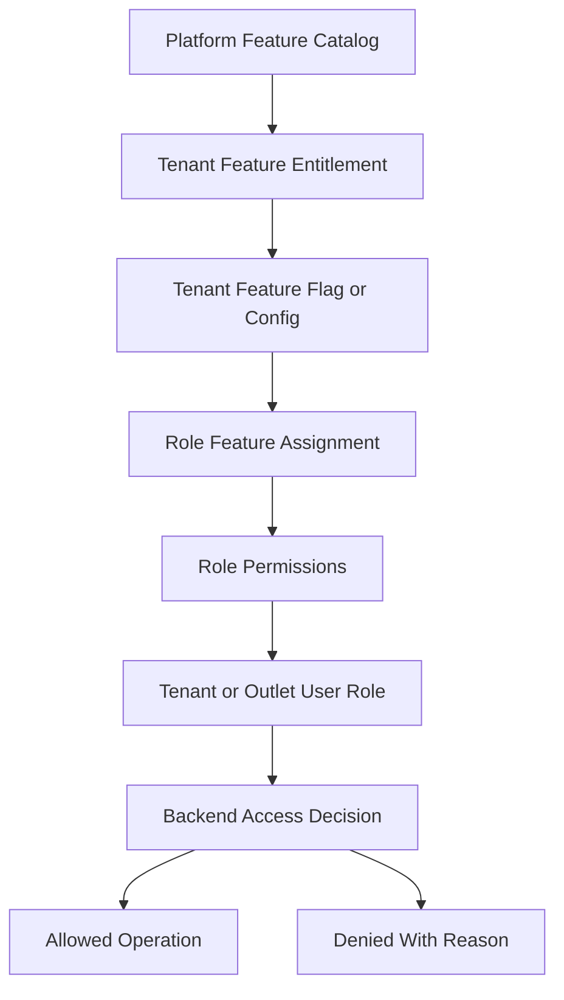
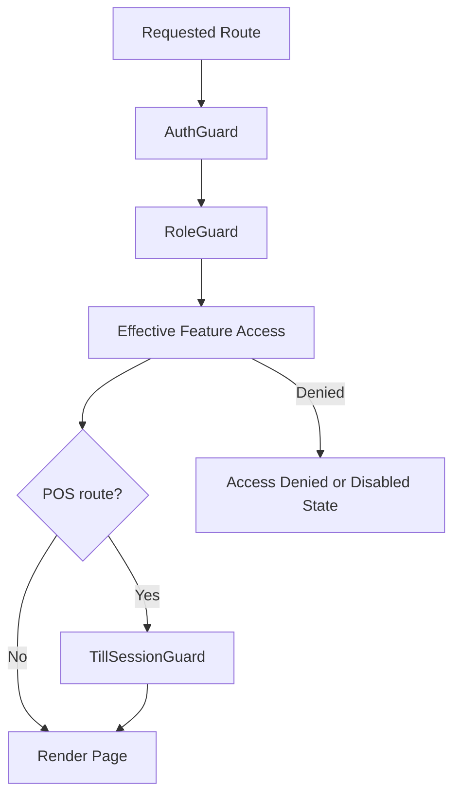
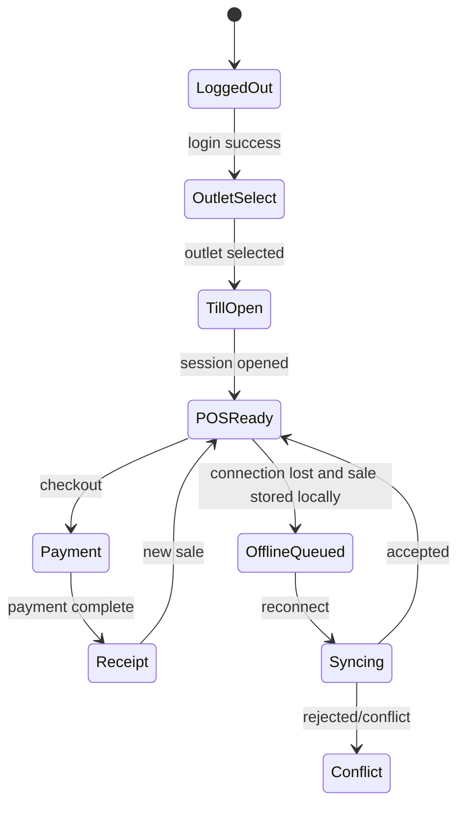

# Frontend Architecture

> This document defines architecture guidance for the Unified Commerce platform using the approved scope, database design, frontend architecture, and backend architecture only.

## Related Documents
- [[system-overview]]
- [[role-permission-capability-model]]
- [[offline-first-architecture]]
- [[../06-frontend/README]]

## Architecture Authority

| Area | Authority | Rule |
|---|---|---|
| Business scope | Scope document | Defines supported platform, POS, e-commerce, offline, reports, and admin capabilities. |
| Data model | Database design | Defines tenant ownership, entities, relationships, status fields, ledgers, and audit records. |
| Backend | Backend architecture | Defines Clean Architecture, service orchestration, repositories, validation, and transaction control. |
| Frontend | Frontend architecture | Defines bootstrap, layouts, feature modules, state, offline, peripherals, and shared UI kernels. |
| Access control | RBAC and feature model | Tenant features are configurable; backend remains the final authority. |

## Frontend Style

The frontend is organized around bootstrap, core services, feature modules, shells, pages, state stores, and shared kernels.
POS screens must be fast, touch-friendly, low-typing, and resilient during poor connectivity.
Admin screens must support tenant configuration, role management, feature visibility, and operational control.

## Frontend Directory Ownership

| Area | Responsibility |
|---|---|
| bootstrap | App startup, router, guards, providers, layouts. |
| core/api | HTTP client, endpoints, query client. |
| core/auth | Token and session management. |
| core/offline | Sync queue and connectivity monitor. |
| core/peripherals | Printer, scanner, cash drawer bridges. |
| features | Business feature UI, hooks, services, types. |
| shells | POS composition zones such as cart, product grid, payment, receipt. |
| pages | Route-level screens. |
| state | App, session, till, cart, UI, offline state stores. |
| shared-kernel | Money, tax, pricing, discount, receipt, invoice helpers. |

## Tenant-Configurable Access Rule

All non-platform features must support tenant/customer-level configuration.
Platform-admin-only features remain controlled by platform users and platform policy.
Tenant operational features must be enabled, assigned, and permission-checked before use.
Access must not be hardcoded by fixed job titles such as cashier, manager, or tenant admin.
A role name is only a label; the actual authority comes from assigned permissions and feature access.

| Layer | Responsibility |
|---|---|
| Platform feature entitlement | Decides whether a tenant can use a platform capability. |
| Tenant feature flag | Decides whether the entitled capability is active for tenant, outlet, or user scope. |
| Role permission | Decides whether a role can perform a specific action. |
| User role assignment | Decides whether a user receives tenant-level or outlet-level authority. |
| Backend enforcement | Performs final validation for every sensitive operation. |
| Frontend adaptation | Shows, hides, disables, or explains actions based on effective access. |



## Frontend Route Guard Flow



## UI Access Behavior

| Scenario | UI behavior | Backend behavior |
|---|---|---|
| Feature not entitled | Hide or mark as unavailable. | Reject operation. |
| Feature flag disabled | Show disabled state with reason where useful. | Reject operation. |
| Permission missing | Hide button or show locked action. | Reject operation. |
| Outlet role missing | Block outlet route/workflow. | Reject operation. |
| Till session inactive | Redirect to till open or locked screen. | Reject sale completion. |

## Frontend API Example

```ts
export async function getEffectiveAccess(featureKey: string, permissionCode: string) {
  return http.get('/api/v1/access/effective', {
    params: { featureKey, permissionCode },
  });
}
```

## POS State Flow



## Standard Validation Sequence

1. Resolve authenticated actor and actor type.
2. Resolve tenant context from authenticated claims or trusted request context.
3. Verify tenant status is active for operational actions.
4. Verify outlet context where the action is outlet-scoped.
5. Verify platform feature entitlement for the tenant.
6. Verify runtime feature flag for tenant, outlet, or user scope.
7. Verify user role assignment at tenant or outlet scope.
8. Verify required permission code for the action.
9. Validate input, status transition, ownership, and idempotency.
10. Write audit records for sensitive or configuration-changing operations.

## Frontend Non-Negotiables

- Do not treat hidden UI as security.
- Do not hardcode cashier or manager actions based on role names.
- Do not duplicate backend source-of-truth business calculations permanently in client state.
- Use shared-kernel calculations for preview only and expect backend recalculation.
- Keep offline queue durable and visible to the cashier/operator.
- Always show clear sync status, payment status, and till session state.
- Keep POS cart interactions large, fast, and touch-ready.

- Implementation consideration 1: keep tenant, outlet, feature, role, permission, and audit behavior explicit in this area.
- Implementation consideration 2: keep tenant, outlet, feature, role, permission, and audit behavior explicit in this area.
- Implementation consideration 3: keep tenant, outlet, feature, role, permission, and audit behavior explicit in this area.
- Implementation consideration 4: keep tenant, outlet, feature, role, permission, and audit behavior explicit in this area.
- Implementation consideration 5: keep tenant, outlet, feature, role, permission, and audit behavior explicit in this area.
- Implementation consideration 6: keep tenant, outlet, feature, role, permission, and audit behavior explicit in this area.
- Implementation consideration 7: keep tenant, outlet, feature, role, permission, and audit behavior explicit in this area.
- Implementation consideration 8: keep tenant, outlet, feature, role, permission, and audit behavior explicit in this area.
- Implementation consideration 9: keep tenant, outlet, feature, role, permission, and audit behavior explicit in this area.
- Implementation consideration 10: keep tenant, outlet, feature, role, permission, and audit behavior explicit in this area.
- Implementation consideration 11: keep tenant, outlet, feature, role, permission, and audit behavior explicit in this area.
- Implementation consideration 12: keep tenant, outlet, feature, role, permission, and audit behavior explicit in this area.
- Implementation consideration 13: keep tenant, outlet, feature, role, permission, and audit behavior explicit in this area.
- Implementation consideration 14: keep tenant, outlet, feature, role, permission, and audit behavior explicit in this area.
- Implementation consideration 15: keep tenant, outlet, feature, role, permission, and audit behavior explicit in this area.
- Implementation consideration 16: keep tenant, outlet, feature, role, permission, and audit behavior explicit in this area.
- Implementation consideration 17: keep tenant, outlet, feature, role, permission, and audit behavior explicit in this area.
- Implementation consideration 18: keep tenant, outlet, feature, role, permission, and audit behavior explicit in this area.
- Implementation consideration 19: keep tenant, outlet, feature, role, permission, and audit behavior explicit in this area.
- Implementation consideration 20: keep tenant, outlet, feature, role, permission, and audit behavior explicit in this area.
- Implementation consideration 21: keep tenant, outlet, feature, role, permission, and audit behavior explicit in this area.
- Implementation consideration 22: keep tenant, outlet, feature, role, permission, and audit behavior explicit in this area.
- Implementation consideration 23: keep tenant, outlet, feature, role, permission, and audit behavior explicit in this area.
- Implementation consideration 24: keep tenant, outlet, feature, role, permission, and audit behavior explicit in this area.
- Implementation consideration 25: keep tenant, outlet, feature, role, permission, and audit behavior explicit in this area.
- Implementation consideration 26: keep tenant, outlet, feature, role, permission, and audit behavior explicit in this area.
