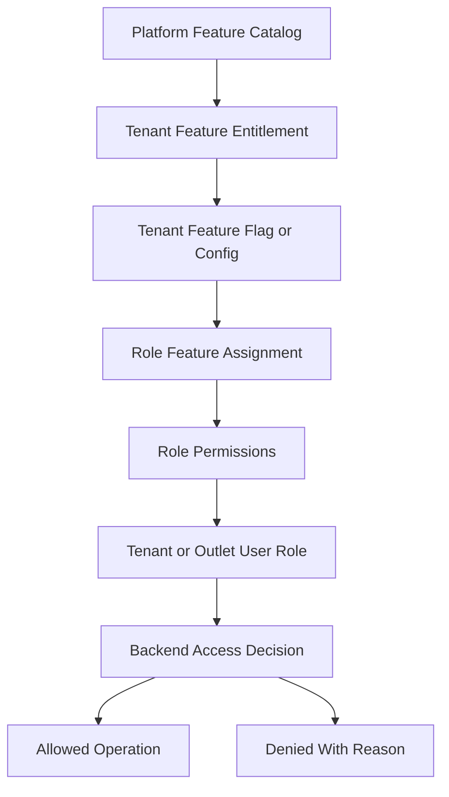
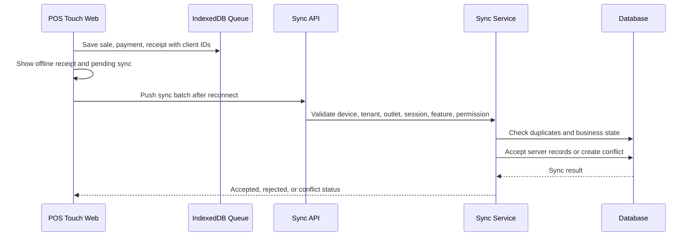

# Offline First Architecture

> This document defines architecture guidance for the Unified Commerce platform using the approved scope, database design, frontend architecture, and backend architecture only.

## Related Documents
- [[backend-architecture]]
- [[frontend-architecture]]
- [[security-architecture]]
- [[scalability-considerations]]

## Architecture Authority

| Area | Authority | Rule |
|---|---|---|
| Business scope | Scope document | Defines supported platform, POS, e-commerce, offline, reports, and admin capabilities. |
| Data model | Database design | Defines tenant ownership, entities, relationships, status fields, ledgers, and audit records. |
| Backend | Backend architecture | Defines Clean Architecture, service orchestration, repositories, validation, and transaction control. |
| Frontend | Frontend architecture | Defines bootstrap, layouts, feature modules, state, offline, peripherals, and shared UI kernels. |
| Access control | RBAC and feature model | Tenant features are configurable; backend remains the final authority. |

## Offline Purpose

Offline-first POS allows core counter billing to continue when connectivity is poor or unavailable.
Offline mode is not a separate source of truth.
The server validates and accepts, rejects, or marks conflicts when offline data syncs back.

## Offline Scope

| Capability | Offline behavior |
|---|---|
| Product lookup | Uses locally cached product, variant, barcode, and price data. |
| Tax/discount preview | Uses cached safe rules for cashier preview. |
| Cash payment | Can be recorded offline if tenant policy allows. |
| Card/QR payment | Allowed only when external confirmation/manual rule exists; otherwise blocked. |
| Receipt print | Can print local receipt with offline indicator. |
| Sync | Queued records are replayed when connection returns. |
| Conflict | Server creates explicit conflict instead of silently corrupting data. |

## Tenant-Configurable Access Rule

All non-platform features must support tenant/customer-level configuration.
Platform-admin-only features remain controlled by platform users and platform policy.
Tenant operational features must be enabled, assigned, and permission-checked before use.
Access must not be hardcoded by fixed job titles such as cashier, manager, or tenant admin.
A role name is only a label; the actual authority comes from assigned permissions and feature access.

| Layer | Responsibility |
|---|---|
| Platform feature entitlement | Decides whether a tenant can use a platform capability. |
| Tenant feature flag | Decides whether the entitled capability is active for tenant, outlet, or user scope. |
| Role permission | Decides whether a role can perform a specific action. |
| User role assignment | Decides whether a user receives tenant-level or outlet-level authority. |
| Backend enforcement | Performs final validation for every sensitive operation. |
| Frontend adaptation | Shows, hides, disables, or explains actions based on effective access. |



## Offline Data Flow



## Offline Tables

| Table | Purpose | Source-of-truth note |
|---|---|---|
| offline_sync_batches | One reconnect/sync attempt from POS device. | Technical sync grouping only. |
| offline_sync_items | Generic queue item received from device. | Staging, not final business transaction. |
| offline_sale_sync_queue | Typed sale staging extension. | Accepted sales go to sales/sale_lines. |
| offline_payment_sync_queue | Typed payment staging extension. | Accepted payments go to payments/allocations. |
| offline_sync_conflicts | Explicit conflict record. | Must be resolved or ignored intentionally. |
| offline_sync_audit_logs | Technical lifecycle trace. | Business actions still use audit_logs. |

## API Contract Example

```http
GET /api/v1/offline-sync/batches HTTP/1.1
Authorization: Bearer <access-token>
X-Tenant-Id: <tenant-id>
X-Outlet-Id: <outlet-id-when-required>
```

```json
{
  "tenantId": "tenant-uuid",
  "outletId": "outlet-uuid",
  "featureKey": "pos.sales",
  "permissionCode": "pos.sale.create",
  "allowed": true,
  "reason": "feature_entitled_role_permission_granted"
}
```

## Offline Sync Acceptance Rules

- Validate tenant, outlet, device, and till session compatibility.
- Validate client transaction ID for idempotency and duplicate prevention.
- Validate sale totals using server-side pricing, tax, and discount logic where possible.
- Validate stock movement impact and create conflict if stock cannot be accepted cleanly.
- Validate payment method is allowed offline by tenant configuration.
- Store rejected reasons using controlled error codes.
- Never create duplicate sales or payments on retry.

## Conflict Types

| Conflict | Example | Required action |
|---|---|---|
| duplicate | Same client sale replayed. | Return existing mapping or reject duplicate. |
| stock_mismatch | Online reservation consumed stock. | Create conflict for review. |
| price_changed | Cached price differs materially. | Apply policy or create conflict. |
| closed_session | Till session no longer valid. | Reject or route to manager workflow. |
| validation_failed | Invalid payload or missing reference. | Reject with reason. |

## Standard Validation Sequence

1. Resolve authenticated actor and actor type.
2. Resolve tenant context from authenticated claims or trusted request context.
3. Verify tenant status is active for operational actions.
4. Verify outlet context where the action is outlet-scoped.
5. Verify platform feature entitlement for the tenant.
6. Verify runtime feature flag for tenant, outlet, or user scope.
7. Verify user role assignment at tenant or outlet scope.
8. Verify required permission code for the action.
9. Validate input, status transition, ownership, and idempotency.
10. Write audit records for sensitive or configuration-changing operations.

- Implementation consideration 1: keep tenant, outlet, feature, role, permission, and audit behavior explicit in this area.
- Implementation consideration 2: keep tenant, outlet, feature, role, permission, and audit behavior explicit in this area.
- Implementation consideration 3: keep tenant, outlet, feature, role, permission, and audit behavior explicit in this area.
- Implementation consideration 4: keep tenant, outlet, feature, role, permission, and audit behavior explicit in this area.
- Implementation consideration 5: keep tenant, outlet, feature, role, permission, and audit behavior explicit in this area.
- Implementation consideration 6: keep tenant, outlet, feature, role, permission, and audit behavior explicit in this area.
- Implementation consideration 7: keep tenant, outlet, feature, role, permission, and audit behavior explicit in this area.
- Implementation consideration 8: keep tenant, outlet, feature, role, permission, and audit behavior explicit in this area.
- Implementation consideration 9: keep tenant, outlet, feature, role, permission, and audit behavior explicit in this area.
- Implementation consideration 10: keep tenant, outlet, feature, role, permission, and audit behavior explicit in this area.
- Implementation consideration 11: keep tenant, outlet, feature, role, permission, and audit behavior explicit in this area.
- Implementation consideration 12: keep tenant, outlet, feature, role, permission, and audit behavior explicit in this area.
- Implementation consideration 13: keep tenant, outlet, feature, role, permission, and audit behavior explicit in this area.
- Implementation consideration 14: keep tenant, outlet, feature, role, permission, and audit behavior explicit in this area.
- Implementation consideration 15: keep tenant, outlet, feature, role, permission, and audit behavior explicit in this area.
- Implementation consideration 16: keep tenant, outlet, feature, role, permission, and audit behavior explicit in this area.
- Implementation consideration 17: keep tenant, outlet, feature, role, permission, and audit behavior explicit in this area.
- Implementation consideration 18: keep tenant, outlet, feature, role, permission, and audit behavior explicit in this area.
- Implementation consideration 19: keep tenant, outlet, feature, role, permission, and audit behavior explicit in this area.
- Implementation consideration 20: keep tenant, outlet, feature, role, permission, and audit behavior explicit in this area.
