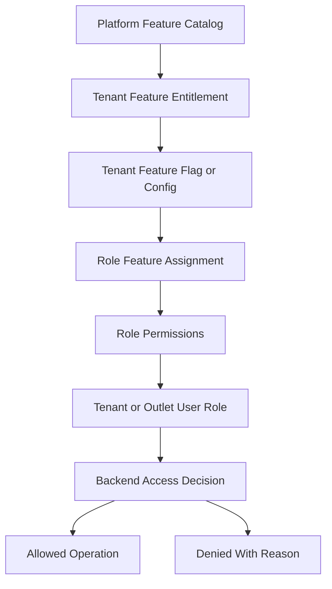
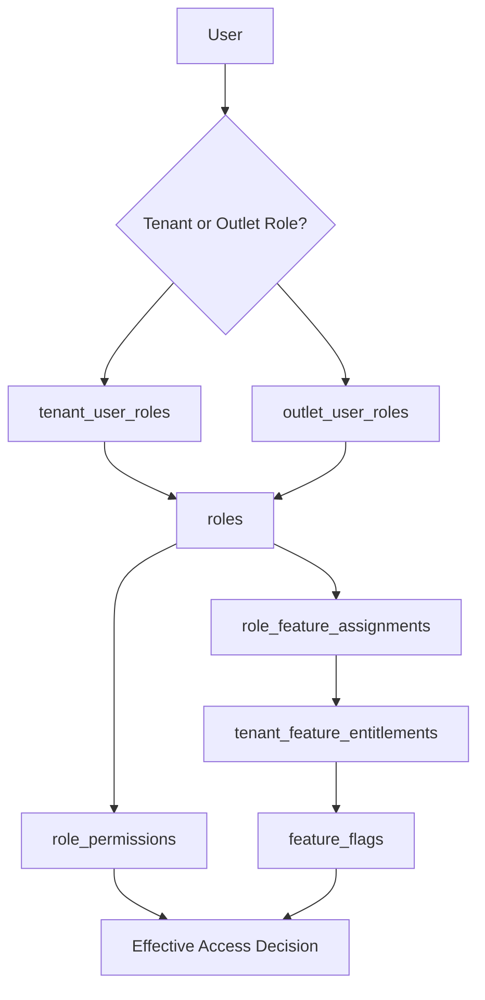

# Role Permission Capability Model

> This document defines architecture guidance for the Unified Commerce platform using the approved scope, database design, frontend architecture, and backend architecture only.

## Related Documents
- [[tenancy-architecture]]
- [[security-architecture]]
- [[backend-architecture]]
- [[frontend-architecture]]

## Architecture Authority

| Area | Authority | Rule |
|---|---|---|
| Business scope | Scope document | Defines supported platform, POS, e-commerce, offline, reports, and admin capabilities. |
| Data model | Database design | Defines tenant ownership, entities, relationships, status fields, ledgers, and audit records. |
| Backend | Backend architecture | Defines Clean Architecture, service orchestration, repositories, validation, and transaction control. |
| Frontend | Frontend architecture | Defines bootstrap, layouts, feature modules, state, offline, peripherals, and shared UI kernels. |
| Access control | RBAC and feature model | Tenant features are configurable; backend remains the final authority. |

## Model Purpose

This model defines how feature capability, permission authority, and user rights work together.
It exists to prevent fixed access behavior and to support tenant-specific business requirements.

## Core Tables

| Table | Ownership | Purpose |
|---|---|---|
| platform_features | Platform | Catalog of platform features. |
| tenant_feature_entitlements | Platform-to-tenant | Enables a platform feature for a tenant. |
| feature_flags | Tenant runtime | Enables or configures feature behavior by tenant, outlet, or user scope. |
| roles | Tenant | Tenant-owned role definitions with tenant/outlet scope. |
| permissions | Platform | Platform-owned permission catalog. |
| role_permissions | Tenant | Maps tenant roles to permission codes. |
| role_feature_assignments | Tenant | Assigns entitled features to roles. |
| tenant_user_roles | Tenant | Assigns tenant-scope roles to users. |
| outlet_user_roles | Tenant/outlet | Assigns outlet-scope roles to users. |

## Tenant-Configurable Access Rule

All non-platform features must support tenant/customer-level configuration.
Platform-admin-only features remain controlled by platform users and platform policy.
Tenant operational features must be enabled, assigned, and permission-checked before use.
Access must not be hardcoded by fixed job titles such as cashier, manager, or tenant admin.
A role name is only a label; the actual authority comes from assigned permissions and feature access.

| Layer | Responsibility |
|---|---|
| Platform feature entitlement | Decides whether a tenant can use a platform capability. |
| Tenant feature flag | Decides whether the entitled capability is active for tenant, outlet, or user scope. |
| Role permission | Decides whether a role can perform a specific action. |
| User role assignment | Decides whether a user receives tenant-level or outlet-level authority. |
| Backend enforcement | Performs final validation for every sensitive operation. |
| Frontend adaptation | Shows, hides, disables, or explains actions based on effective access. |



## Permission Decision Example

A cashier-like role may or may not create sales depending on tenant configuration.
The label `Cashier` alone does not grant authority.

| Tenant | Role name | Feature | Permission | Result |
|---|---|---|---|---|
| Tenant A | Cashier | pos.sales enabled | pos.sale.create assigned | Allowed |
| Tenant B | Cashier | pos.sales enabled | pos.sale.create not assigned | Denied |
| Tenant C | Cashier | pos.sales disabled | pos.sale.create assigned | Denied |
| Tenant D | Sales Associate | pos.sales enabled | pos.sale.create assigned | Allowed |

## Effective Access Diagram



## Permission Code Examples

| Module | Permission code examples |
|---|---|
| POS sales | pos.sale.create, pos.sale.void, pos.sale.hold, pos.price.override |
| Payments | payment.capture, payment.refund.approve, payment.method.configure |
| Inventory | inventory.adjust.create, inventory.adjust.approve, inventory.transfer.create |
| Catalog | catalog.product.create, catalog.product.update, catalog.price.update |
| Returns | return.create, return.approve, exchange.create |
| Receipts | receipt.print, receipt.reprint |
| Tenant admin | staff.create, role.configure, feature.configure |

## API Contract Example

```http
GET /api/v1/access/effective HTTP/1.1
Authorization: Bearer <access-token>
X-Tenant-Id: <tenant-id>
X-Outlet-Id: <outlet-id-when-required>
```

```json
{
  "tenantId": "tenant-uuid",
  "outletId": "outlet-uuid",
  "featureKey": "pos.sales",
  "permissionCode": "pos.sale.create",
  "allowed": true,
  "reason": "feature_entitled_role_permission_granted"
}
```

## Backend Policy Pseudocode

```csharp
public async Task<bool> CanExecute(Guid tenantId, Guid userId, string featureKey, string permissionCode, Guid? outletId)
{
    if (!await entitlement.Enabled(tenantId, featureKey)) return false;
    if (!await flags.EnabledForScope(tenantId, featureKey, outletId, userId)) return false;
    if (!await roles.UserHasPermission(tenantId, userId, permissionCode, outletId)) return false;
    return true;
}
```

## Standard Validation Sequence

1. Resolve authenticated actor and actor type.
2. Resolve tenant context from authenticated claims or trusted request context.
3. Verify tenant status is active for operational actions.
4. Verify outlet context where the action is outlet-scoped.
5. Verify platform feature entitlement for the tenant.
6. Verify runtime feature flag for tenant, outlet, or user scope.
7. Verify user role assignment at tenant or outlet scope.
8. Verify required permission code for the action.
9. Validate input, status transition, ownership, and idempotency.
10. Write audit records for sensitive or configuration-changing operations.

## Implementation Notes

- Permissions are platform catalog values and should not have tenant_id.
- Roles are tenant-owned and can vary by customer.
- Outlet-scope roles must only grant outlet-relevant access.
- Feature entitlement must exist before role feature assignment is allowed.
- UI should display unavailable actions with reason where helpful, but backend denial is mandatory.

- Implementation consideration 1: keep tenant, outlet, feature, role, permission, and audit behavior explicit in this area.
- Implementation consideration 2: keep tenant, outlet, feature, role, permission, and audit behavior explicit in this area.
- Implementation consideration 3: keep tenant, outlet, feature, role, permission, and audit behavior explicit in this area.
- Implementation consideration 4: keep tenant, outlet, feature, role, permission, and audit behavior explicit in this area.
- Implementation consideration 5: keep tenant, outlet, feature, role, permission, and audit behavior explicit in this area.
- Implementation consideration 6: keep tenant, outlet, feature, role, permission, and audit behavior explicit in this area.
- Implementation consideration 7: keep tenant, outlet, feature, role, permission, and audit behavior explicit in this area.
- Implementation consideration 8: keep tenant, outlet, feature, role, permission, and audit behavior explicit in this area.
- Implementation consideration 9: keep tenant, outlet, feature, role, permission, and audit behavior explicit in this area.
- Implementation consideration 10: keep tenant, outlet, feature, role, permission, and audit behavior explicit in this area.
- Implementation consideration 11: keep tenant, outlet, feature, role, permission, and audit behavior explicit in this area.
