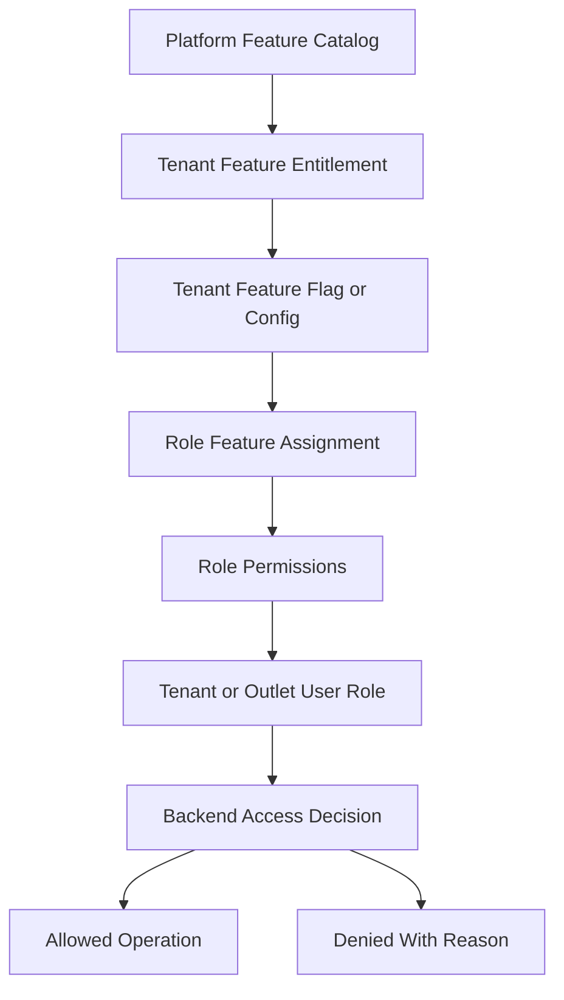
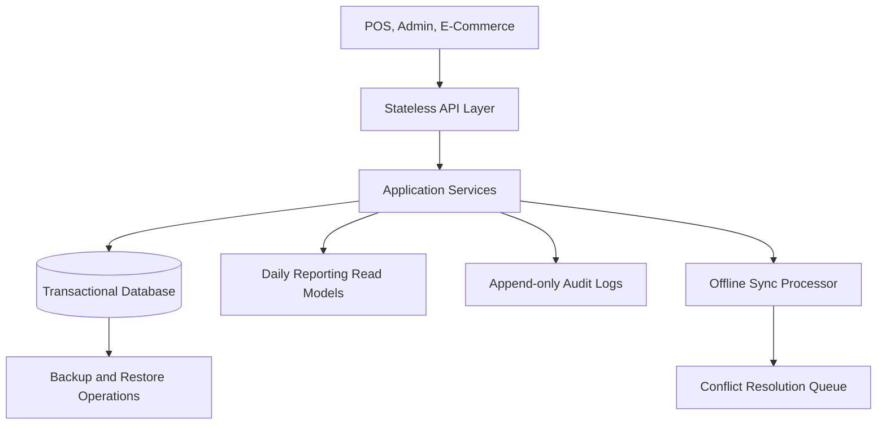

# Scalability Considerations

> This document defines architecture guidance for the Unified Commerce platform using the approved scope, database design, frontend architecture, and backend architecture only.

## Related Documents
- [[system-overview]]
- [[backend-architecture]]
- [[offline-first-architecture]]
- [[../11-delivery-and-operations/README]]

## Architecture Authority

| Area | Authority | Rule |
|---|---|---|
| Business scope | Scope document | Defines supported platform, POS, e-commerce, offline, reports, and admin capabilities. |
| Data model | Database design | Defines tenant ownership, entities, relationships, status fields, ledgers, and audit records. |
| Backend | Backend architecture | Defines Clean Architecture, service orchestration, repositories, validation, and transaction control. |
| Frontend | Frontend architecture | Defines bootstrap, layouts, feature modules, state, offline, peripherals, and shared UI kernels. |
| Access control | RBAC and feature model | Tenant features are configurable; backend remains the final authority. |

## Scalability Purpose

The system must support growth across tenants, outlets, POS devices, e-commerce traffic, offline sync bursts, reporting volume, and audit records.
Scalability must not weaken tenant isolation or configurable access control.

## Scaling Dimensions

| Dimension | Growth pressure | Design response |
|---|---|---|
| Tenants | More customer businesses | Tenant-scoped indexes and isolated configuration. |
| Outlets | More stores per tenant | Outlet-aware stock, till, device, and report design. |
| POS traffic | More checkout events | Fast sale transactions, idempotency, lean API payloads. |
| E-commerce traffic | More carts/orders | Reservation logic, order status history, payment allocation. |
| Offline sync | Burst replay after reconnect | Batch processing, dedupe, conflict queues. |
| Reports | Large transaction history | Daily summary read models. |
| Audit | Sensitive action volume | Append-only audit design and retention strategy. |

## Tenant-Configurable Access Rule

All non-platform features must support tenant/customer-level configuration.
Platform-admin-only features remain controlled by platform users and platform policy.
Tenant operational features must be enabled, assigned, and permission-checked before use.
Access must not be hardcoded by fixed job titles such as cashier, manager, or tenant admin.
A role name is only a label; the actual authority comes from assigned permissions and feature access.

| Layer | Responsibility |
|---|---|
| Platform feature entitlement | Decides whether a tenant can use a platform capability. |
| Tenant feature flag | Decides whether the entitled capability is active for tenant, outlet, or user scope. |
| Role permission | Decides whether a role can perform a specific action. |
| User role assignment | Decides whether a user receives tenant-level or outlet-level authority. |
| Backend enforcement | Performs final validation for every sensitive operation. |
| Frontend adaptation | Shows, hides, disables, or explains actions based on effective access. |

## Scalability Architecture

## Database Scaling Considerations

| Area | Consideration |
|---|---|
| Tenant-scoped queries | Use tenant_id in filters and indexes for tenant-owned records. |
| Outlet stock | inventory_balances should be queried by tenant_id, outlet_id, variant_id. |
| Sales/order history | Use business_date and tenant_id for operational reports. |
| Offline sync | Dedupe indexes on tenant_id, device_id, entity_type, client IDs. |
| Payments | Idempotency indexes prevent duplicate payment creation. |
| Read models | Daily summaries reduce dashboard load on transaction tables. |

## API Scalability Rules

- Keep API endpoints stateless except trusted authentication/session context.
- Use pagination for lists such as products, orders, sales, customers, logs, and sync items.
- Use filters by tenant, outlet, channel, status, date range, and search terms.
- Avoid returning large nested aggregates unless the workflow requires them.
- Use idempotency keys for duplicate-prone commands.
- Prefer async processing for heavy reports, imports, and sync conflict reconciliation when required.

## Reporting Strategy

| Report type | Source | Note |
|---|---|---|
| Daily sales | daily_sales_summaries | Read model, not source of truth. |
| Daily payments | daily_payment_summaries | Reconciles with payments and allocations. |
| Inventory movement | stock_movements and daily_inventory_summaries | Ledger remains source. |
| Discounts/returns | daily_discount_return_summaries | Operational summary. |
| Audit | audit_logs | Append-only trace. |

## Standard Validation Sequence

1. Resolve authenticated actor and actor type.
2. Resolve tenant context from authenticated claims or trusted request context.
3. Verify tenant status is active for operational actions.
4. Verify outlet context where the action is outlet-scoped.
5. Verify platform feature entitlement for the tenant.
6. Verify runtime feature flag for tenant, outlet, or user scope.
7. Verify user role assignment at tenant or outlet scope.
8. Verify required permission code for the action.
9. Validate input, status transition, ownership, and idempotency.
10. Write audit records for sensitive or configuration-changing operations.

## Performance Guardrails

- Do not query across all tenants for tenant admin dashboards.
- Do not compute every dashboard tile from raw transaction tables in real time once volume grows.
- Do not use frontend state as persistent report storage.
- Do not let offline sync retry loops overload the API after reconnect.
- Do not skip audit for performance without explicit architectural approval.
- Do not introduce cache tables that are not in the approved database design.

## Capacity Planning Notes

- POS checkout paths require lower latency than admin reporting paths.
- Offline sync accepts bursty traffic and must be idempotent.
- E-commerce checkout must protect reservation and payment consistency.
- Reporting can use read models and scheduled aggregation.

- Implementation consideration 1: keep tenant, outlet, feature, role, permission, and audit behavior explicit in this area.
- Implementation consideration 2: keep tenant, outlet, feature, role, permission, and audit behavior explicit in this area.
- Implementation consideration 3: keep tenant, outlet, feature, role, permission, and audit behavior explicit in this area.
- Implementation consideration 4: keep tenant, outlet, feature, role, permission, and audit behavior explicit in this area.
- Implementation consideration 5: keep tenant, outlet, feature, role, permission, and audit behavior explicit in this area.
- Implementation consideration 6: keep tenant, outlet, feature, role, permission, and audit behavior explicit in this area.
- Implementation consideration 7: keep tenant, outlet, feature, role, permission, and audit behavior explicit in this area.
- Implementation consideration 8: keep tenant, outlet, feature, role, permission, and audit behavior explicit in this area.
- Implementation consideration 9: keep tenant, outlet, feature, role, permission, and audit behavior explicit in this area.
- Implementation consideration 10: keep tenant, outlet, feature, role, permission, and audit behavior explicit in this area.
- Implementation consideration 11: keep tenant, outlet, feature, role, permission, and audit behavior explicit in this area.
- Implementation consideration 12: keep tenant, outlet, feature, role, permission, and audit behavior explicit in this area.
- Implementation consideration 13: keep tenant, outlet, feature, role, permission, and audit behavior explicit in this area.
- Implementation consideration 14: keep tenant, outlet, feature, role, permission, and audit behavior explicit in this area.
- Implementation consideration 15: keep tenant, outlet, feature, role, permission, and audit behavior explicit in this area.
- Implementation consideration 16: keep tenant, outlet, feature, role, permission, and audit behavior explicit in this area.
- Implementation consideration 17: keep tenant, outlet, feature, role, permission, and audit behavior explicit in this area.
- Implementation consideration 18: keep tenant, outlet, feature, role, permission, and audit behavior explicit in this area.
- Implementation consideration 19: keep tenant, outlet, feature, role, permission, and audit behavior explicit in this area.
- Implementation consideration 20: keep tenant, outlet, feature, role, permission, and audit behavior explicit in this area.
- Implementation consideration 21: keep tenant, outlet, feature, role, permission, and audit behavior explicit in this area.
- Implementation consideration 22: keep tenant, outlet, feature, role, permission, and audit behavior explicit in this area.
- Implementation consideration 23: keep tenant, outlet, feature, role, permission, and audit behavior explicit in this area.
- Implementation consideration 24: keep tenant, outlet, feature, role, permission, and audit behavior explicit in this area.
