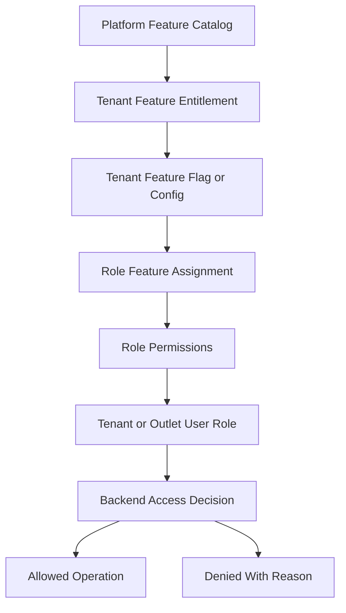
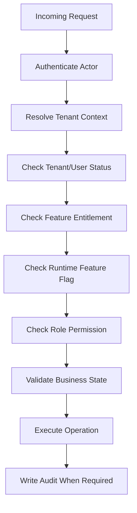

# Security Architecture

> This document defines architecture guidance for the Unified Commerce platform using the approved scope, database design, frontend architecture, and backend architecture only.

## Related Documents
- [[tenancy-architecture]]
- [[role-permission-capability-model]]
- [[backend-architecture]]
- [[offline-first-architecture]]

## Architecture Authority

| Area | Authority | Rule |
|---|---|---|
| Business scope | Scope document | Defines supported platform, POS, e-commerce, offline, reports, and admin capabilities. |
| Data model | Database design | Defines tenant ownership, entities, relationships, status fields, ledgers, and audit records. |
| Backend | Backend architecture | Defines Clean Architecture, service orchestration, repositories, validation, and transaction control. |
| Frontend | Frontend architecture | Defines bootstrap, layouts, feature modules, state, offline, peripherals, and shared UI kernels. |
| Access control | RBAC and feature model | Tenant features are configurable; backend remains the final authority. |

## Security Purpose

Security protects tenant data, financial workflows, stock accuracy, payment references, offline transactions, and operational auditability.
The backend is the final authority for all sensitive decisions.

## Security Control Matrix

| Control | Required behavior |
|---|---|
| Authentication | Actor identity must be verified before protected operations. |
| Tenant isolation | Tenant-owned data must be filtered and validated by tenant context. |
| RBAC | Permissions must be checked through tenant-configured roles. |
| Feature access | Entitlement and runtime feature flags must be checked. |
| Outlet access | Outlet-scoped actions require valid outlet role/context. |
| Input validation | Requests must be validated before workflow execution. |
| Status transition | Invalid order, payment, return, or delivery transitions are blocked. |
| Idempotency | Duplicate payment, order, sale, and sync requests are controlled. |
| Audit | Sensitive actions are recorded with actor, tenant, entity, and change details. |

## Tenant-Configurable Access Rule

All non-platform features must support tenant/customer-level configuration.
Platform-admin-only features remain controlled by platform users and platform policy.
Tenant operational features must be enabled, assigned, and permission-checked before use.
Access must not be hardcoded by fixed job titles such as cashier, manager, or tenant admin.
A role name is only a label; the actual authority comes from assigned permissions and feature access.

| Layer | Responsibility |
|---|---|
| Platform feature entitlement | Decides whether a tenant can use a platform capability. |
| Tenant feature flag | Decides whether the entitled capability is active for tenant, outlet, or user scope. |
| Role permission | Decides whether a role can perform a specific action. |
| User role assignment | Decides whether a user receives tenant-level or outlet-level authority. |
| Backend enforcement | Performs final validation for every sensitive operation. |
| Frontend adaptation | Shows, hides, disables, or explains actions based on effective access. |



## Security Decision Flow



## Sensitive Actions Requiring Audit

| Area | Examples |
|---|---|
| Tenant configuration | Feature entitlement, feature flag, tenant setting, theme change. |
| Staff/RBAC | User creation, role assignment, permission change. |
| POS | Sale void, price override, completed sale cancellation. |
| Payments | Refund approval, payment correction, gateway reference update. |
| Inventory | Stock adjustment, transfer approval, stocktake posting. |
| Receipt | Reprint, duplicate receipt issue, failed print record. |
| Offline sync | Conflict creation, conflict resolution, rejected sync item. |

## API Contract Example

```http
GET /api/v1/security/audit-logs HTTP/1.1
Authorization: Bearer <access-token>
X-Tenant-Id: <tenant-id>
X-Outlet-Id: <outlet-id-when-required>
```

```json
{
  "tenantId": "tenant-uuid",
  "outletId": "outlet-uuid",
  "featureKey": "pos.sales",
  "permissionCode": "pos.sale.create",
  "allowed": true,
  "reason": "feature_entitled_role_permission_granted"
}
```

## Data Protection Rules

- Store password hashes only, never plain passwords.
- Store OTP code hashes only, never plain OTP values.
- Store payment provider secrets using secret references, not plain JSON.
- Do not store card data unless a certified payment scope explicitly supports it.
- Protect offline browser/device data as far as the client platform allows.
- Avoid leaking tenant existence or customer data through error messages.

## Backend Security Pseudocode

```csharp
await auth.RequireAuthenticatedActor();
await tenantPolicy.RequireTenantAccess(actor, tenantId);
await featurePolicy.RequireTenantFeature(tenantId, featureKey);
await permissionPolicy.Require(actor, tenantId, outletId, permissionCode);
await businessValidator.ValidateAsync(request);
await audit.WriteIfSensitiveAsync(actor, action, entityId);
```

## Standard Validation Sequence

1. Resolve authenticated actor and actor type.
2. Resolve tenant context from authenticated claims or trusted request context.
3. Verify tenant status is active for operational actions.
4. Verify outlet context where the action is outlet-scoped.
5. Verify platform feature entitlement for the tenant.
6. Verify runtime feature flag for tenant, outlet, or user scope.
7. Verify user role assignment at tenant or outlet scope.
8. Verify required permission code for the action.
9. Validate input, status transition, ownership, and idempotency.
10. Write audit records for sensitive or configuration-changing operations.

## Security Anti-Patterns

- Role-name checks such as `if role == Cashier`.
- Client-side tenant IDs as the only tenant boundary.
- Skipping permission checks because the UI hides a button.
- Updating audit logs through normal user workflows.
- Accepting offline stock movements without dedupe and conflict checks.
- Allowing receipt reprint without permission and print log.

- Implementation consideration 1: keep tenant, outlet, feature, role, permission, and audit behavior explicit in this area.
- Implementation consideration 2: keep tenant, outlet, feature, role, permission, and audit behavior explicit in this area.
- Implementation consideration 3: keep tenant, outlet, feature, role, permission, and audit behavior explicit in this area.
- Implementation consideration 4: keep tenant, outlet, feature, role, permission, and audit behavior explicit in this area.
- Implementation consideration 5: keep tenant, outlet, feature, role, permission, and audit behavior explicit in this area.
- Implementation consideration 6: keep tenant, outlet, feature, role, permission, and audit behavior explicit in this area.
- Implementation consideration 7: keep tenant, outlet, feature, role, permission, and audit behavior explicit in this area.
- Implementation consideration 8: keep tenant, outlet, feature, role, permission, and audit behavior explicit in this area.
- Implementation consideration 9: keep tenant, outlet, feature, role, permission, and audit behavior explicit in this area.
- Implementation consideration 10: keep tenant, outlet, feature, role, permission, and audit behavior explicit in this area.
- Implementation consideration 11: keep tenant, outlet, feature, role, permission, and audit behavior explicit in this area.
- Implementation consideration 12: keep tenant, outlet, feature, role, permission, and audit behavior explicit in this area.
- Implementation consideration 13: keep tenant, outlet, feature, role, permission, and audit behavior explicit in this area.
- Implementation consideration 14: keep tenant, outlet, feature, role, permission, and audit behavior explicit in this area.
