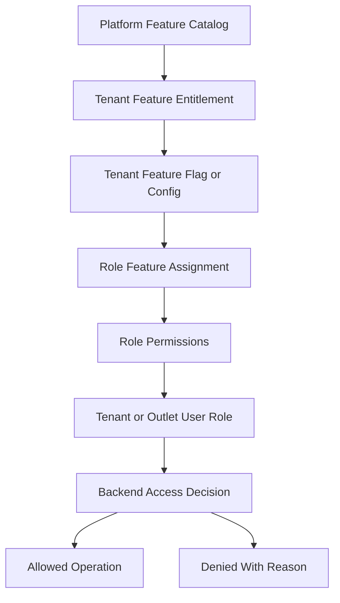
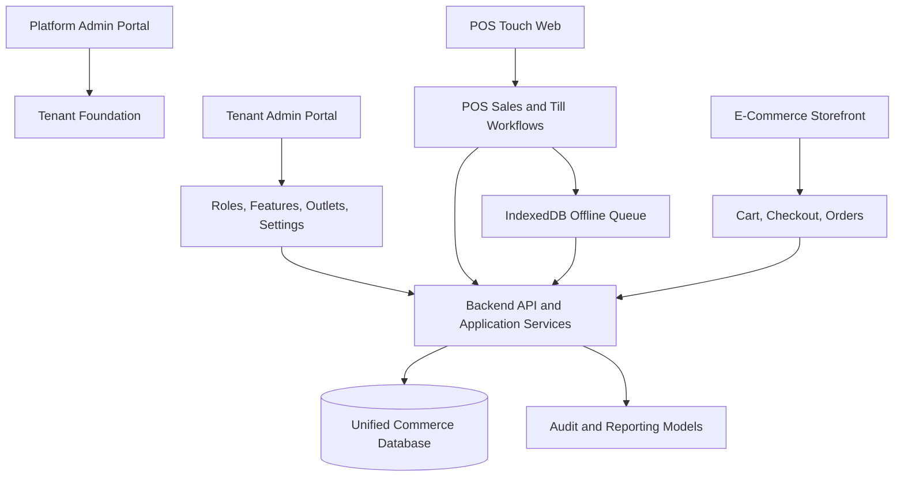

# System Overview Architecture

> This document defines architecture guidance for the Unified Commerce platform using the approved scope, database design, frontend architecture, and backend architecture only.

## Related Documents
- [[architecture-principles]]
- [[tenancy-architecture]]
- [[role-permission-capability-model]]
- [[backend-architecture]]
- [[frontend-architecture]]
- [[offline-first-architecture]]

## Architecture Authority

| Area | Authority | Rule |
|---|---|---|
| Business scope | Scope document | Defines supported platform, POS, e-commerce, offline, reports, and admin capabilities. |
| Data model | Database design | Defines tenant ownership, entities, relationships, status fields, ledgers, and audit records. |
| Backend | Backend architecture | Defines Clean Architecture, service orchestration, repositories, validation, and transaction control. |
| Frontend | Frontend architecture | Defines bootstrap, layouts, feature modules, state, offline, peripherals, and shared UI kernels. |
| Access control | RBAC and feature model | Tenant features are configurable; backend remains the final authority. |

## System Description

The platform is a multi-tenant Unified Commerce SaaS system combining POS, e-commerce, inventory, payments, returns, offline sync, reporting, and administration.
Each tenant is an independent business customer with its own outlets, users, roles, stock, customers, orders, sales, payments, reports, settings, and themes.
The system supports POS-only, e-commerce-only, and hybrid operating modes.

## Primary Actor Groups

| Actor group | Scope | Typical responsibility |
|---|---|---|
| Platform admin | Platform-level | Tenant onboarding, entitlements, platform users, global feature catalog. |
| Tenant admin | Tenant-level | Outlets, staff, roles, feature configuration, settings, business rules. |
| Outlet manager | Outlet-level | Till sessions, stock operations, approvals, reports, staff activity. |
| Cashier | Outlet/till-level | POS sales, payments, receipts, returns where permitted. |
| Customer | Tenant online channel | Browse, cart, checkout, orders, addresses, wishlists, reviews. |

## Tenant-Configurable Access Rule

All non-platform features must support tenant/customer-level configuration.
Platform-admin-only features remain controlled by platform users and platform policy.
Tenant operational features must be enabled, assigned, and permission-checked before use.
Access must not be hardcoded by fixed job titles such as cashier, manager, or tenant admin.
A role name is only a label; the actual authority comes from assigned permissions and feature access.

| Layer | Responsibility |
|---|---|
| Platform feature entitlement | Decides whether a tenant can use a platform capability. |
| Tenant feature flag | Decides whether the entitled capability is active for tenant, outlet, or user scope. |
| Role permission | Decides whether a role can perform a specific action. |
| User role assignment | Decides whether a user receives tenant-level or outlet-level authority. |
| Backend enforcement | Performs final validation for every sensitive operation. |
| Frontend adaptation | Shows, hides, disables, or explains actions based on effective access. |



## High-Level Platform Context



## Major System Capabilities

| Capability | System behavior | Source tables/examples |
|---|---|---|
| Tenant foundation | Business account, outlets, document sequences. | tenants, outlets, outlet_addresses, document_sequences |
| Access control | Tenant roles, permissions, features, flags. | roles, permissions, role_permissions, tenant_feature_entitlements |
| Catalog | Shared POS/e-commerce products and variants. | products, product_variants, categories, brands, price_lists |
| Inventory | Outlet stock, reservations, movement ledger. | inventory_balances, stock_movements, stock_reservations |
| POS | Till sessions, sales, cash movements. | tills, pos_devices, till_sessions, sales, sale_lines |
| Commerce | Customers, carts, orders, fulfillment. | customers, carts, orders, deliveries |
| Payments | Payments, transactions, allocations, refunds. | payments, payment_transactions, refunds |
| Offline | Sync batches, items, queues, conflicts. | offline_sync_batches, offline_sync_items, offline_sync_conflicts |

## API Contract Example

```http
GET /api/v1/tenant/features/effective-access HTTP/1.1
Authorization: Bearer <access-token>
X-Tenant-Id: <tenant-id>
X-Outlet-Id: <outlet-id-when-required>
```

```json
{
  "tenantId": "tenant-uuid",
  "outletId": "outlet-uuid",
  "featureKey": "pos.sales",
  "permissionCode": "pos.sale.create",
  "allowed": true,
  "reason": "feature_entitled_role_permission_granted"
}
```

## System Boundary Rules

- Platform users are not tenant staff users.
- Tenant data must not be shared across tenants.
- Outlet data must not be mixed across outlets unless tenant-level reports intentionally aggregate it.
- POS device outlet context determines stock deduction and till context.
- E-commerce orders use stock reservation before fulfillment.
- Payments and refunds must use traceable allocations.
- Inventory changes must create ledger movements.
- Offline transactions must be accepted, rejected, or marked as conflict by the server.

## Implementation Notes

- The frontend may preview totals, but backend services recalculate final totals.
- Read models support reporting but are not financial source of truth.
- Customer records are tenant-scoped, not global shared identities.
- Loyalty, reviews, wishlist, and OTP are supported by the database and must follow tenant ownership.

## Standard Validation Sequence

1. Resolve authenticated actor and actor type.
2. Resolve tenant context from authenticated claims or trusted request context.
3. Verify tenant status is active for operational actions.
4. Verify outlet context where the action is outlet-scoped.
5. Verify platform feature entitlement for the tenant.
6. Verify runtime feature flag for tenant, outlet, or user scope.
7. Verify user role assignment at tenant or outlet scope.
8. Verify required permission code for the action.
9. Validate input, status transition, ownership, and idempotency.
10. Write audit records for sensitive or configuration-changing operations.

- Implementation consideration 1: keep tenant, outlet, feature, role, permission, and audit behavior explicit in this area.
- Implementation consideration 2: keep tenant, outlet, feature, role, permission, and audit behavior explicit in this area.
- Implementation consideration 3: keep tenant, outlet, feature, role, permission, and audit behavior explicit in this area.
- Implementation consideration 4: keep tenant, outlet, feature, role, permission, and audit behavior explicit in this area.
- Implementation consideration 5: keep tenant, outlet, feature, role, permission, and audit behavior explicit in this area.
- Implementation consideration 6: keep tenant, outlet, feature, role, permission, and audit behavior explicit in this area.
- Implementation consideration 7: keep tenant, outlet, feature, role, permission, and audit behavior explicit in this area.
- Implementation consideration 8: keep tenant, outlet, feature, role, permission, and audit behavior explicit in this area.
- Implementation consideration 9: keep tenant, outlet, feature, role, permission, and audit behavior explicit in this area.
- Implementation consideration 10: keep tenant, outlet, feature, role, permission, and audit behavior explicit in this area.
- Implementation consideration 11: keep tenant, outlet, feature, role, permission, and audit behavior explicit in this area.
- Implementation consideration 12: keep tenant, outlet, feature, role, permission, and audit behavior explicit in this area.
- Implementation consideration 13: keep tenant, outlet, feature, role, permission, and audit behavior explicit in this area.
- Implementation consideration 14: keep tenant, outlet, feature, role, permission, and audit behavior explicit in this area.
- Implementation consideration 15: keep tenant, outlet, feature, role, permission, and audit behavior explicit in this area.
- Implementation consideration 16: keep tenant, outlet, feature, role, permission, and audit behavior explicit in this area.
- Implementation consideration 17: keep tenant, outlet, feature, role, permission, and audit behavior explicit in this area.
- Implementation consideration 18: keep tenant, outlet, feature, role, permission, and audit behavior explicit in this area.
- Implementation consideration 19: keep tenant, outlet, feature, role, permission, and audit behavior explicit in this area.
- Implementation consideration 20: keep tenant, outlet, feature, role, permission, and audit behavior explicit in this area.
- Implementation consideration 21: keep tenant, outlet, feature, role, permission, and audit behavior explicit in this area.
