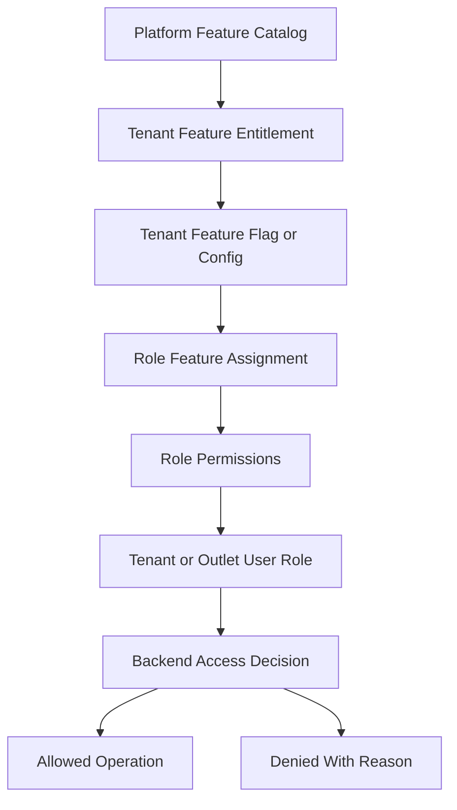
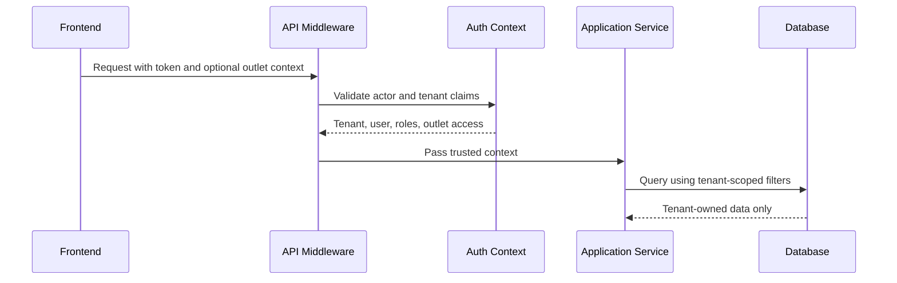

# Tenancy Architecture

> This document defines architecture guidance for the Unified Commerce platform using the approved scope, database design, frontend architecture, and backend architecture only.

## Related Documents
- [[role-permission-capability-model]]
- [[security-architecture]]
- [[backend-architecture]]
- [[../03-data/tenant-data-rules]]

## Architecture Authority

| Area | Authority | Rule |
|---|---|---|
| Business scope | Scope document | Defines supported platform, POS, e-commerce, offline, reports, and admin capabilities. |
| Data model | Database design | Defines tenant ownership, entities, relationships, status fields, ledgers, and audit records. |
| Backend | Backend architecture | Defines Clean Architecture, service orchestration, repositories, validation, and transaction control. |
| Frontend | Frontend architecture | Defines bootstrap, layouts, feature modules, state, offline, peripherals, and shared UI kernels. |
| Access control | RBAC and feature model | Tenant features are configurable; backend remains the final authority. |

## Tenancy Model

The platform uses tenant-scoped business data with platform-level administration separated from tenant staff operations.
The tenant is the root customer business account.
Outlets are physical or logical business locations under a tenant.
Users, roles, products, stock, customers, sales, orders, reports, and settings must stay inside tenant boundaries.

## Tenant-Owned Data Examples

| Area | Tenant-owned records | Isolation rule |
|---|---|---|
| Staff | users, roles, role_permissions | Must include tenant context and tenant-owned role assignment. |
| Outlets | outlets, outlet_addresses | Outlet code unique only inside tenant. |
| Catalog | products, product_variants, categories | SKU, barcode, slug unique inside tenant. |
| Inventory | inventory_balances, stock_movements | Stock belongs to tenant, outlet, and variant. |
| POS | tills, pos_devices, till_sessions, sales | Device and till must match outlet context. |
| Customers | customers, customer_addresses | Same email may exist in different tenants. |
| Commerce | carts, orders, deliveries | Order data belongs to one tenant only. |

## Tenant-Configurable Access Rule

All non-platform features must support tenant/customer-level configuration.
Platform-admin-only features remain controlled by platform users and platform policy.
Tenant operational features must be enabled, assigned, and permission-checked before use.
Access must not be hardcoded by fixed job titles such as cashier, manager, or tenant admin.
A role name is only a label; the actual authority comes from assigned permissions and feature access.

| Layer | Responsibility |
|---|---|
| Platform feature entitlement | Decides whether a tenant can use a platform capability. |
| Tenant feature flag | Decides whether the entitled capability is active for tenant, outlet, or user scope. |
| Role permission | Decides whether a role can perform a specific action. |
| User role assignment | Decides whether a user receives tenant-level or outlet-level authority. |
| Backend enforcement | Performs final validation for every sensitive operation. |
| Frontend adaptation | Shows, hides, disables, or explains actions based on effective access. |



## Tenant Context Resolution



## Tenant Configuration Levels

| Level | Use case | Example |
|---|---|---|
| Platform entitlement | What tenant is allowed to use | Enable POS billing or e-commerce. |
| Tenant setting | Business-wide configuration | Default currency, tax behavior, return policy. |
| Outlet setting | Store-specific behavior | Till session required, receipt printer, cash variance approval. |
| Channel setting | POS/e-commerce behavior | Online out-of-stock display, POS offline rules. |
| User/role access | Who can perform action | Refund approve, stock adjust, receipt reprint. |

## API Contract Example

```http
GET /api/v1/tenants/{tenantId}/effective-configuration HTTP/1.1
Authorization: Bearer <access-token>
X-Tenant-Id: <tenant-id>
X-Outlet-Id: <outlet-id-when-required>
```

```json
{
  "tenantId": "tenant-uuid",
  "outletId": "outlet-uuid",
  "featureKey": "pos.sales",
  "permissionCode": "pos.sale.create",
  "allowed": true,
  "reason": "feature_entitled_role_permission_granted"
}
```

## Standard Validation Sequence

1. Resolve authenticated actor and actor type.
2. Resolve tenant context from authenticated claims or trusted request context.
3. Verify tenant status is active for operational actions.
4. Verify outlet context where the action is outlet-scoped.
5. Verify platform feature entitlement for the tenant.
6. Verify runtime feature flag for tenant, outlet, or user scope.
7. Verify user role assignment at tenant or outlet scope.
8. Verify required permission code for the action.
9. Validate input, status transition, ownership, and idempotency.
10. Write audit records for sensitive or configuration-changing operations.

## Implementation Rules

- Platform users are stored separately from tenant users.
- Platform admin flags must not be stored in tenant users.
- Tenant status must be checked before sales, orders, sync acceptance, and operational writes.
- Suspended tenants cannot process new sales/orders unless explicit platform policy allows it.
- Outlet IDs must always be verified as belonging to the same tenant.
- Parent-child rows must enforce same-tenant ownership in services and persistence.

## Common Tenancy Bugs to Block

| Bug | Prevention |
|---|---|
| User accesses another tenant's order | Tenant-scoped query and actor tenant check. |
| Device deducts wrong outlet stock | Device-outlet-till validation before POS session. |
| Customer identity merges across tenants | Tenant-scoped customer uniqueness only. |
| Role assigned across tenants | Validate role_id belongs to tenant_id. |
| Offline sync accepted for wrong device | Validate batch tenant, outlet, and device match. |

- Implementation consideration 1: keep tenant, outlet, feature, role, permission, and audit behavior explicit in this area.
- Implementation consideration 2: keep tenant, outlet, feature, role, permission, and audit behavior explicit in this area.
- Implementation consideration 3: keep tenant, outlet, feature, role, permission, and audit behavior explicit in this area.
- Implementation consideration 4: keep tenant, outlet, feature, role, permission, and audit behavior explicit in this area.
- Implementation consideration 5: keep tenant, outlet, feature, role, permission, and audit behavior explicit in this area.
- Implementation consideration 6: keep tenant, outlet, feature, role, permission, and audit behavior explicit in this area.
- Implementation consideration 7: keep tenant, outlet, feature, role, permission, and audit behavior explicit in this area.
- Implementation consideration 8: keep tenant, outlet, feature, role, permission, and audit behavior explicit in this area.
- Implementation consideration 9: keep tenant, outlet, feature, role, permission, and audit behavior explicit in this area.
- Implementation consideration 10: keep tenant, outlet, feature, role, permission, and audit behavior explicit in this area.
- Implementation consideration 11: keep tenant, outlet, feature, role, permission, and audit behavior explicit in this area.
- Implementation consideration 12: keep tenant, outlet, feature, role, permission, and audit behavior explicit in this area.
- Implementation consideration 13: keep tenant, outlet, feature, role, permission, and audit behavior explicit in this area.
- Implementation consideration 14: keep tenant, outlet, feature, role, permission, and audit behavior explicit in this area.
- Implementation consideration 15: keep tenant, outlet, feature, role, permission, and audit behavior explicit in this area.
- Implementation consideration 16: keep tenant, outlet, feature, role, permission, and audit behavior explicit in this area.
- Implementation consideration 17: keep tenant, outlet, feature, role, permission, and audit behavior explicit in this area.
- Implementation consideration 18: keep tenant, outlet, feature, role, permission, and audit behavior explicit in this area.
- Implementation consideration 19: keep tenant, outlet, feature, role, permission, and audit behavior explicit in this area.
- Implementation consideration 20: keep tenant, outlet, feature, role, permission, and audit behavior explicit in this area.
- Implementation consideration 21: keep tenant, outlet, feature, role, permission, and audit behavior explicit in this area.
