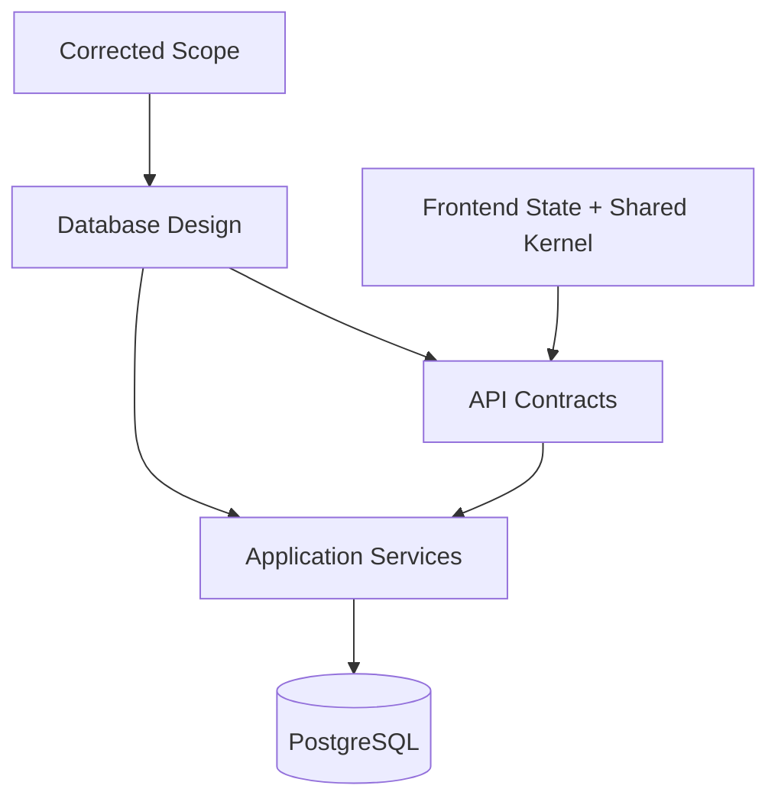

# 03 Data Folder Guide

## Purpose

This folder defines the data authority for the Unified Commerce platform. It explains how database tables, tenant ownership, primary keys, foreign keys, indexing, offline sync, and reporting read models must be interpreted by backend and frontend teams.

## Source of truth

| Source | Usage |
|---|---|
| Unified Commerce Database Design V4 | Table definitions, PK/FK, constraints, source-of-truth rules |
| Corrected Scope | Business modules and operational boundaries |
| Backend Architecture | Clean Architecture, service validation, repository persistence |
| Frontend Architecture | Client-side flows, state, shared kernel previews |

## Reading order

1. [[database-overview]]
2. [[schema-principles]]
3. [[tenant-consistency-rules]]
4. [[data-dictionary-index]]
5. [[entities/README]]
6. [[entity-relationship-map]]
7. [[indexing-strategy]]
8. [[offline-sync-data-model]]

## Non-negotiable data rules

| Rule | Meaning |
|---|---|
| Tenant ownership | Tenant business rows must be tenant-scoped or tenant-linked. |
| Configurable access | Non-platform features must depend on tenant feature entitlement, role, permission, and user right. |
| Backend authority | Backend validates tenant, feature, permission, status, pricing, stock, payment, and sync acceptance. |
| Immutable ledgers | Stock movements, loyalty transactions, payment transactions, audit logs, and sync audit logs must not be edited as normal mutable state. |
| Source of truth | Reporting summaries are read models, not financial source of truth. |

## Data responsibility map

## Folder contents

| File/folder | Responsibility |
|---|---|
| `entities/` | Module-wise table definitions with PK, FK, constraints, and notes |
| `data-dictionary-index.md` | Table inventory and module ownership index |
| `database-overview.md` | High-level schema map and source-of-truth rules |
| `schema-principles.md` | Normalization, ledger, tenant, and access principles |
| `tenant-consistency-rules.md` | Same-tenant FK and query safety rules |
| `indexing-strategy.md` | Unique, partial, lookup, and sync indexes |
| `offline-sync-data-model.md` | Offline sync table ownership and conflict model |
| `entity-relationship-map.md` | Cross-module relationship map |
| `naming-conventions.md` | Table, column, enum, and key naming rules |
| `required-schema-extensions.md` | Controlled extension guidance; not a request to add random tables |
