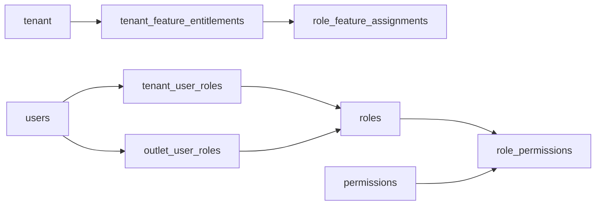

# Database Overview

## Purpose

The database design is a normalized production schema for a multi-tenant Unified E-POS + E-Commerce SaaS platform. It covers tenant foundation, RBAC, configuration, catalog, inventory, POS, e-commerce, fulfillment, payments, discounts, returns, receipts, audit, offline sync, and reporting read models.

## Schema scale

| Area | Tables |
|---|---:|
| Platform and Tenant Foundation | 5 |
| Identity, RBAC and Feature Access | 9 |
| Tenant Runtime Configuration | 3 |
| Catalog, Tax and Pricing | 22 |
| Inventory and Stock Control | 13 |
| POS Devices, Sessions and Sales | 8 |
| Customer, Cart and E-Commerce Orders | 21 |
| Fulfillment, Pickup and Delivery | 6 |
| Payments, Refunds and Receipts | 8 |
| Discounts, Coupons and Approvals | 7 |
| Returns and Exchanges | 8 |
| Receipts, Audit and Offline Sync | 10 |
| Reporting Read Models | 4 |

## Source-of-truth model

| Business area | Source of truth |
|---|---|
| Stock | `stock_movements` plus maintained `inventory_balances` projection |
| Payments | `payments`, allocations, and `payment_transactions` for provider trace |
| Sales | `sales` and `sale_lines` |
| Orders | `orders`, `order_items`, addresses, and status history |
| Refunds | `refunds` plus return/exchange allocation tables |
| Audit | `audit_logs` for business actions; `offline_sync_audit_logs` for sync diagnostics |
| Reports | Daily summary tables only as read models |

## Tenant access model

## Implementation rule

A client request is never trusted because it contains an id. Backend services must verify the authenticated tenant context, feature entitlement, runtime feature flag, role permission, and same-tenant ownership of every referenced entity.

## Related documents

- [[schema-principles]]
- [[tenant-consistency-rules]]
- [[entities/README]]
