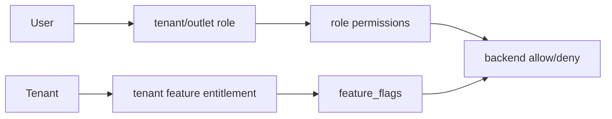

# Entities Folder Index

## Purpose

The files in this folder define module-wise database entities using the approved table structure. Each entity section includes purpose, ownership, access behavior, full column table, primary key summary, and foreign key summary.

## Files

| File | Module area | Table count |
|---|---|---:|
| [[platform-tenant-entities]] | Platform Tenant Entities | 5 |
| [[identity-access-entities]] | Identity Access Entities | 9 |
| [[configuration-entities]] | Configuration Entities | 3 |
| [[catalog-entities]] | Catalog Entities | 17 |
| [[pricing-tax-entities]] | Pricing Tax Entities | 5 |
| [[inventory-entities]] | Inventory Entities | 13 |
| [[pos-device-sales-entities]] | Pos Device Sales Entities | 8 |
| [[customer-ecommerce-entities]] | Customer Ecommerce Entities | 21 |
| [[fulfillment-entities]] | Fulfillment Entities | 6 |
| [[payments-entities]] | Payments Entities | 8 |
| [[discounts-coupons-entities]] | Discounts Coupons Entities | 7 |
| [[returns-exchanges-entities]] | Returns Exchanges Entities | 8 |
| [[receipts-audit-offline-entities]] | Receipts Audit Offline Entities | 10 |
| [[reporting-entities]] | Reporting Entities | 4 |
| [[data-import-ai-entities]] | Data Import Ai Entities | 0 |

## Developer usage

1. Open the relevant module entity file.
2. Use the column table as the schema reference.
3. Mirror uniqueness and status rules in service validation.
4. Validate tenant consistency before writing.
5. Apply configurable RBAC and feature access for every tenant-level operation.

## Access validation pattern

## Related documents

- [[../data-dictionary-index]]
- [[../database-overview]]
- [[../tenant-consistency-rules]]