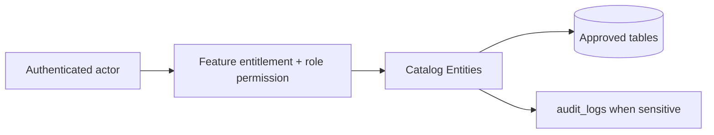

# Catalog Entities

## Purpose

This document is a module-wise entity reference generated from the approved database design. It uses table-level column definitions so developers can see primary keys, foreign keys, constraints, and implementation notes without depending on old Markdown content.

## Control rule

| Concern | Required behavior |
|---|---|
| Tenant access | Every tenant-level feature must be configurable by tenant role, user right, permission, and feature assignment. |
| Backend authority | API/application services must validate tenant, feature entitlement, runtime flag, role permission, and same-tenant foreign-key ownership. |
| Frontend behavior | UI may hide unavailable actions, but backend rejection is mandatory for unauthorized writes. |
| Platform exception | Platform-admin-only catalog and tenant-control features remain platform controlled. |

## Entity index

| Entity | Purpose | PK | FK count |
|---|---|---:|---:|
| `brands` | Optional tenant-owned brand master. | 1 | 1 |
| `suppliers` | Tenant supplier master for stock receiving. | 1 | 1 |
| `supplier_addresses` | Supplier address records. | 1 | 2 |
| `categories` | Hierarchical tenant product categories. | 1 | 2 |
| `return_policies` | Tenant return/exchange policy rules assigned to products. | 1 | 1 |
| `products` | Product master shared by POS and E-Commerce. | 1 | 5 |
| `product_variants` | Sellable SKU/barcode units under products. | 1 | 2 |
| `product_attributes` | Tenant-defined product attributes. | 1 | 1 |
| `attribute_values` | Allowed values for selectable attributes. | 1 | 2 |
| `attribute_templates` | Platform-level reusable attribute definitions that can be copied into tenant-owned product attributes. | 1 | 0 |
| `attribute_template_values` | Default selectable values under a platform attribute template. | 1 | 1 |
| `attribute_presets` | Platform-level attribute bundles for business/category setup acceleration. | 1 | 0 |
| `attribute_preset_items` | Maps platform attribute templates into a preset. | 1 | 2 |
| `category_attributes` | Maps categories to relevant product attributes. | 1 | 3 |
| `variant_attribute_values` | Selected attribute values per variant. | 1 | 4 |
| `product_suppliers` | Supplier mapping for products or specific variants. | 1 | 4 |
| `product_images` | Product and optional variant images. | 1 | 3 |

## Table definitions

### `brands`

| Property | Detail |
|---|---|
| Database module | 4. Catalog, Tax and Pricing |
| Purpose | Optional tenant-owned brand master. |
| Ownership | Tenant-owned or tenant-linked; tenant consistency must be enforced through tenant_id or parent ownership. |
| Access control | Tenant-configurable access; operation requires enabled tenant feature plus role permission/user right. |
| Table rules | UNIQUE (tenant_id, name). UNIQUE (tenant_id, code) WHERE code IS NOT NULL. |

| Column | Type | Key / Constraint | Reference / Note |
|---|---|---|---|
| `id` | `uuid` | PK | Primary key. |
| `tenant_id` | `uuid` | NOT NULL FK | References tenants(id). |
| `name` | `varchar(150)` | NOT NULL | Brand name. |
| `code` | `varchar(80)` | NULL | Optional brand code. |
| `status` | `varchar(30)` | NOT NULL CHECK | active, inactive. |
| `created_at` | `timestamptz` | NOT NULL | Creation time. |
| `updated_at` | `timestamptz` | NOT NULL | Last update time. |

| Key summary | Columns |
|---|---|
| Primary key | `id` |
| Foreign keys | `tenant_id` |

### `suppliers`

| Property | Detail |
|---|---|
| Database module | 4. Catalog, Tax and Pricing |
| Purpose | Tenant supplier master for stock receiving. |
| Ownership | Tenant-owned or tenant-linked; tenant consistency must be enforced through tenant_id or parent ownership. |
| Access control | Tenant-configurable access; operation requires enabled tenant feature plus role permission/user right. |
| Table rules | UNIQUE (tenant_id, name) recommended if duplicate supplier names are not allowed. |

| Column | Type | Key / Constraint | Reference / Note |
|---|---|---|---|
| `id` | `uuid` | PK | Primary key. |
| `tenant_id` | `uuid` | NOT NULL FK | References tenants(id). |
| `name` | `varchar(200)` | NOT NULL | Supplier name. |
| `contact_name` | `varchar(150)` | NULL | Contact person. |
| `email` | `varchar(150)` | NULL | Email. |
| `phone` | `varchar(40)` | NULL | Phone. |
| `status` | `varchar(30)` | NOT NULL CHECK | active, inactive, blocked. |
| `created_at` | `timestamptz` | NOT NULL | Creation time. |
| `updated_at` | `timestamptz` | NOT NULL | Last update time. |

| Key summary | Columns |
|---|---|
| Primary key | `id` |
| Foreign keys | `tenant_id` |

### `supplier_addresses`

| Property | Detail |
|---|---|
| Database module | 4. Catalog, Tax and Pricing |
| Purpose | Supplier address records. |
| Ownership | Tenant-owned or tenant-linked; tenant consistency must be enforced through tenant_id or parent ownership. |
| Access control | Tenant-configurable access; operation requires enabled tenant feature plus role permission/user right. |
| Table rules | At most one primary address per supplier. supplier_id must belong to tenant_id. |

| Column | Type | Key / Constraint | Reference / Note |
|---|---|---|---|
| `id` | `uuid` | PK | Primary key. |
| `tenant_id` | `uuid` | NOT NULL FK | References tenants(id). |
| `supplier_id` | `uuid` | NOT NULL FK | References suppliers(id). |
| `line1` | `varchar(250)` | NOT NULL | Address line 1. |
| `line2` | `varchar(250)` | NULL | Address line 2. |
| `city` | `varchar(120)` | NOT NULL | City. |
| `state` | `varchar(120)` | NULL | Province/state. |
| `postal_code` | `varchar(30)` | NULL | Postal code. |
| `country_code` | `char(2)` | NOT NULL | ISO country code. |
| `is_primary` | `boolean` | NOT NULL | Primary address flag. |

| Key summary | Columns |
|---|---|
| Primary key | `id` |
| Foreign keys | `tenant_id`, `supplier_id` |

### `categories`

| Property | Detail |
|---|---|
| Database module | 4. Catalog, Tax and Pricing |
| Purpose | Hierarchical tenant product categories. |
| Ownership | Tenant-owned or tenant-linked; tenant consistency must be enforced through tenant_id or parent ownership. |
| Access control | Tenant-configurable access; operation requires enabled tenant feature plus role permission/user right. |
| Table rules | UNIQUE (tenant_id, slug). parent_id must belong to same tenant. |

| Column | Type | Key / Constraint | Reference / Note |
|---|---|---|---|
| `id` | `uuid` | PK | Primary key. |
| `tenant_id` | `uuid` | NOT NULL FK | References tenants(id). |
| `parent_id` | `uuid` | NULL FK | References categories(id). |
| `name` | `varchar(150)` | NOT NULL | Category name. |
| `slug` | `varchar(180)` | NOT NULL | URL/display slug. |
| `sort_order` | `int` | NOT NULL | Sort order. |
| `is_active` | `boolean` | NOT NULL | Active flag. |
| `created_at` | `timestamptz` | NOT NULL | Creation time. |
| `updated_at` | `timestamptz` | NOT NULL | Last update time. |

| Key summary | Columns |
|---|---|
| Primary key | `id` |
| Foreign keys | `tenant_id`, `parent_id` |

### `return_policies`

| Property | Detail |
|---|---|
| Database module | 4. Catalog, Tax and Pricing |
| Purpose | Tenant return/exchange policy rules assigned to products. |
| Ownership | Tenant-owned or tenant-linked; tenant consistency must be enforced through tenant_id or parent ownership. |
| Access control | Tenant-configurable access; operation requires enabled tenant feature plus role permission/user right. |
| Table rules | UNIQUE (tenant_id, code). This replaces a weak enum-only return policy design. |

| Column | Type | Key / Constraint | Reference / Note |
|---|---|---|---|
| `id` | `uuid` | PK | Primary key. |
| `tenant_id` | `uuid` | NOT NULL FK | References tenants(id). |
| `code` | `varchar(80)` | NOT NULL | Policy code. |
| `name` | `varchar(150)` | NOT NULL | Policy name. |
| `policy_type` | `varchar(30)` | NOT NULL CHECK | returnable, non_returnable, exchange_only, final_sale. |
| `return_window_days` | `int` | NULL | Allowed return window. |
| `exchange_window_days` | `int` | NULL | Allowed exchange window. |
| `requires_receipt` | `boolean` | NOT NULL | Whether receipt/order reference is required. |
| `allow_damaged_return` | `boolean` | NOT NULL | Whether damaged returns are allowed. |
| `requires_manager_override` | `boolean` | NOT NULL | Override requirement. |
| `is_active` | `boolean` | NOT NULL | Active flag. |
| `created_at` | `timestamptz` | NOT NULL | Creation time. |
| `updated_at` | `timestamptz` | NOT NULL | Last update time. |

| Key summary | Columns |
|---|---|
| Primary key | `id` |
| Foreign keys | `tenant_id` |

### `products`

| Property | Detail |
|---|---|
| Database module | 4. Catalog, Tax and Pricing |
| Purpose | Product master shared by POS and E-Commerce. |
| Ownership | Tenant-owned or tenant-linked; tenant consistency must be enforced through tenant_id or parent ownership. |
| Access control | Tenant-configurable access; operation requires enabled tenant feature plus role permission/user right. |
| Table rules | UNIQUE (tenant_id, slug). Do not store stock quantity on products. |

| Column | Type | Key / Constraint | Reference / Note |
|---|---|---|---|
| `id` | `uuid` | PK | Primary key. |
| `tenant_id` | `uuid` | NOT NULL FK | References tenants(id). |
| `category_id` | `uuid` | NULL FK | References categories(id). |
| `brand_id` | `uuid` | NULL FK | References brands(id). |
| `tax_class_id` | `uuid` | NULL FK | References tax_classes(id). |
| `return_policy_id` | `uuid` | NOT NULL FK | References return_policies(id). |
| `product_type` | `varchar(30)` | NOT NULL CHECK | simple, variant_parent, service. |
| `name` | `varchar(250)` | NOT NULL | Product name. |
| `slug` | `varchar(250)` | NOT NULL | Tenant-unique slug. |
| `short_description` | `varchar(500)` | NULL | Short description. |
| `long_description` | `text` | NULL | Long description. |
| `status` | `varchar(30)` | NOT NULL CHECK | draft, active, archived. |
| `is_sellable_pos` | `boolean` | NOT NULL | POS sellable flag. |
| `is_sellable_online` | `boolean` | NOT NULL | Online sellable flag. |
| `track_inventory` | `boolean` | NOT NULL | Inventory tracking flag. |
| `created_at` | `timestamptz` | NOT NULL | Creation time. |
| `updated_at` | `timestamptz` | NOT NULL | Last update time. |

| Key summary | Columns |
|---|---|
| Primary key | `id` |
| Foreign keys | `tenant_id`, `category_id`, `brand_id`, `tax_class_id`, `return_policy_id` |

### `product_variants`

| Property | Detail |
|---|---|
| Database module | 4. Catalog, Tax and Pricing |
| Purpose | Sellable SKU/barcode units under products. |
| Ownership | Tenant-owned or tenant-linked; tenant consistency must be enforced through tenant_id or parent ownership. |
| Access control | Tenant-configurable access; operation requires enabled tenant feature plus role permission/user right. |
| Table rules | UNIQUE (tenant_id, sku). UNIQUE (tenant_id, barcode) WHERE barcode IS NOT NULL. UNIQUE (product_id, variant_signature) WHERE variant_signature IS NOT NULL. Do not store stock quantity here. |

| Column | Type | Key / Constraint | Reference / Note |
|---|---|---|---|
| `id` | `uuid` | PK | Primary key. |
| `tenant_id` | `uuid` | NOT NULL FK | References tenants(id). |
| `product_id` | `uuid` | NOT NULL FK | References products(id). |
| `sku` | `varchar(100)` | NOT NULL | Tenant-unique SKU. |
| `barcode` | `varchar(120)` | NULL | Tenant-unique barcode. |
| `name` | `varchar(250)` | NOT NULL | Variant display name. |
| `weight` | `numeric(10,3)` | NULL | Weight. |
| `purchase_limit_per_order` | `int` | NULL | Max units per order. |
| `purchase_limit_per_customer` | `int` | NULL | Max units per customer. |
| `variant_signature` | `varchar(500)` | NULL | Canonical attribute signature. |
| `status` | `varchar(30)` | NOT NULL CHECK | active, inactive, archived. |
| `created_at` | `timestamptz` | NOT NULL | Creation time. |
| `updated_at` | `timestamptz` | NOT NULL | Last update time. |

| Key summary | Columns |
|---|---|
| Primary key | `id` |
| Foreign keys | `tenant_id`, `product_id` |

### `product_attributes`

| Property | Detail |
|---|---|
| Database module | 4. Catalog, Tax and Pricing |
| Purpose | Tenant-defined product attributes. |
| Ownership | Tenant-owned or tenant-linked; tenant consistency must be enforced through tenant_id or parent ownership. |
| Access control | Tenant-configurable access; operation requires enabled tenant feature plus role permission/user right. |
| Table rules | UNIQUE (tenant_id, code). Platform attribute templates are optional source templates only; tenant-owned final attributes are stored in product_attributes. |

| Column | Type | Key / Constraint | Reference / Note |
|---|---|---|---|
| `id` | `uuid` | PK | Primary key. |
| `tenant_id` | `uuid` | NOT NULL FK | References tenants(id). |
| `code` | `varchar(100)` | NOT NULL | Attribute code. |
| `name` | `varchar(150)` | NOT NULL | Attribute name. |
| `data_type` | `varchar(30)` | NOT NULL CHECK | text, number, boolean, select. |
| `is_variant_defining` | `boolean` | NOT NULL | Whether attribute defines variants. |
| `status` | `varchar(30)` | NOT NULL CHECK | active, inactive. |
| `created_at` | `timestamptz` | NOT NULL | Creation time. |

| Key summary | Columns |
|---|---|
| Primary key | `id` |
| Foreign keys | `tenant_id` |

### `attribute_values`

| Property | Detail |
|---|---|
| Database module | 4. Catalog, Tax and Pricing |
| Purpose | Allowed values for selectable attributes. |
| Ownership | Tenant-owned or tenant-linked; tenant consistency must be enforced through tenant_id or parent ownership. |
| Access control | Tenant-configurable access; operation requires enabled tenant feature plus role permission/user right. |
| Table rules | UNIQUE (tenant_id, attribute_id, value_code). attribute_id must belong to same tenant. |

| Column | Type | Key / Constraint | Reference / Note |
|---|---|---|---|
| `id` | `uuid` | PK | Primary key. |
| `tenant_id` | `uuid` | NOT NULL FK | References tenants(id). |
| `attribute_id` | `uuid` | NOT NULL FK | References product_attributes(id). |
| `value_code` | `varchar(100)` | NOT NULL | Internal value code. |
| `value_text` | `varchar(150)` | NOT NULL | Display value. |
| `sort_order` | `int` | NOT NULL | Sort order. |
| `is_active` | `boolean` | NOT NULL | Active flag. |

| Key summary | Columns |
|---|---|
| Primary key | `id` |
| Foreign keys | `tenant_id`, `attribute_id` |

### `attribute_templates`

| Property | Detail |
|---|---|
| Database module | 4. Catalog, Tax and Pricing |
| Purpose | Platform-level reusable attribute definitions that can be copied into tenant-owned product attributes. |
| Ownership | Platform-owned catalog/reference; tenant_id is intentionally absent where shown. |
| Access control | Platform-admin controlled where platform-owned; tenant admins cannot directly mutate platform catalog records. |
| Table rules | No tenant_id because templates are platform-owned. Tenant-created attributes remain in product_attributes. |

| Column | Type | Key / Constraint | Reference / Note |
|---|---|---|---|
| `id` | `uuid` | PK | Primary key. |
| `code` | `varchar(80)` | NOT NULL UNIQUE | Template attribute code. |
| `name` | `varchar(150)` | NOT NULL | Display name. |
| `data_type` | `varchar(30)` | NOT NULL CHECK | text, number, boolean, select. |
| `is_variant_defining` | `boolean` | NOT NULL | Whether this template can define variants. |
| `status` | `varchar(30)` | NOT NULL CHECK | active, inactive. |
| `created_at` | `timestamptz` | NOT NULL | Creation time. |
| `updated_at` | `timestamptz` | NOT NULL | Last update time. |

| Key summary | Columns |
|---|---|
| Primary key | `id` |
| Foreign keys | None |

### `attribute_template_values`

| Property | Detail |
|---|---|
| Database module | 4. Catalog, Tax and Pricing |
| Purpose | Default selectable values under a platform attribute template. |
| Ownership | Platform-owned catalog/reference; tenant_id is intentionally absent where shown. |
| Access control | Platform-admin controlled where platform-owned; tenant admins cannot directly mutate platform catalog records. |
| Table rules | UNIQUE (attribute_template_id, value_code). |

| Column | Type | Key / Constraint | Reference / Note |
|---|---|---|---|
| `id` | `uuid` | PK | Primary key. |
| `attribute_template_id` | `uuid` | NOT NULL FK | References attribute_templates(id). |
| `value_code` | `varchar(80)` | NOT NULL | Template value code. |
| `value_text` | `varchar(150)` | NOT NULL | Display value. |
| `sort_order` | `int` | NOT NULL | Display order. |
| `is_active` | `boolean` | NOT NULL | Active flag. |

| Key summary | Columns |
|---|---|
| Primary key | `id` |
| Foreign keys | `attribute_template_id` |

### `attribute_presets`

| Property | Detail |
|---|---|
| Database module | 4. Catalog, Tax and Pricing |
| Purpose | Platform-level attribute bundles for business/category setup acceleration. |
| Ownership | Platform-owned catalog/reference; tenant_id is intentionally absent where shown. |
| Access control | Platform-admin controlled where platform-owned; tenant admins cannot directly mutate platform catalog records. |
| Table rules | Presets are optional accelerators and do not replace tenant-owned attributes. |

| Column | Type | Key / Constraint | Reference / Note |
|---|---|---|---|
| `id` | `uuid` | PK | Primary key. |
| `code` | `varchar(80)` | NOT NULL UNIQUE | Preset code. |
| `name` | `varchar(150)` | NOT NULL | Preset name. |
| `business_type` | `varchar(80)` | NULL | Example: fashion, electronics, grocery, general. |
| `description` | `text` | NULL | Preset explanation. |
| `status` | `varchar(30)` | NOT NULL CHECK | active, inactive. |
| `created_at` | `timestamptz` | NOT NULL | Creation time. |
| `updated_at` | `timestamptz` | NOT NULL | Last update time. |

| Key summary | Columns |
|---|---|
| Primary key | `id` |
| Foreign keys | None |

### `attribute_preset_items`

| Property | Detail |
|---|---|
| Database module | 4. Catalog, Tax and Pricing |
| Purpose | Maps platform attribute templates into a preset. |
| Ownership | Platform-owned catalog/reference; tenant_id is intentionally absent where shown. |
| Access control | Platform-admin controlled where platform-owned; tenant admins cannot directly mutate platform catalog records. |
| Table rules | UNIQUE (attribute_preset_id, attribute_template_id). |

| Column | Type | Key / Constraint | Reference / Note |
|---|---|---|---|
| `id` | `uuid` | PK | Primary key. |
| `attribute_preset_id` | `uuid` | NOT NULL FK | References attribute_presets(id). |
| `attribute_template_id` | `uuid` | NOT NULL FK | References attribute_templates(id). |
| `is_required` | `boolean` | NOT NULL | Whether attribute is required when preset is used. |
| `sort_order` | `int` | NOT NULL | Display order. |

| Key summary | Columns |
|---|---|
| Primary key | `id` |
| Foreign keys | `attribute_preset_id`, `attribute_template_id` |

### `category_attributes`

| Property | Detail |
|---|---|
| Database module | 4. Catalog, Tax and Pricing |
| Purpose | Maps categories to relevant product attributes. |
| Ownership | Tenant-owned or tenant-linked; tenant consistency must be enforced through tenant_id or parent ownership. |
| Access control | Tenant-configurable access; operation requires enabled tenant feature plus role permission/user right. |
| Table rules | UNIQUE (tenant_id, category_id, attribute_id). |

| Column | Type | Key / Constraint | Reference / Note |
|---|---|---|---|
| `id` | `uuid` | PK | Primary key. |
| `tenant_id` | `uuid` | NOT NULL FK | References tenants(id). |
| `category_id` | `uuid` | NOT NULL FK | References categories(id). |
| `attribute_id` | `uuid` | NOT NULL FK | References product_attributes(id). |
| `is_required` | `boolean` | NOT NULL | Required for category. |
| `sort_order` | `int` | NOT NULL | Sort order. |
| `is_active` | `boolean` | NOT NULL | Active flag. |

| Key summary | Columns |
|---|---|
| Primary key | `id` |
| Foreign keys | `tenant_id`, `category_id`, `attribute_id` |

### `variant_attribute_values`

| Property | Detail |
|---|---|
| Database module | 4. Catalog, Tax and Pricing |
| Purpose | Selected attribute values per variant. |
| Ownership | Tenant-owned or tenant-linked; tenant consistency must be enforced through tenant_id or parent ownership. |
| Access control | Tenant-configurable access; operation requires enabled tenant feature plus role permission/user right. |
| Table rules | UNIQUE (tenant_id, variant_id, attribute_id). attribute_value_id must belong to attribute_id. |

| Column | Type | Key / Constraint | Reference / Note |
|---|---|---|---|
| `id` | `uuid` | PK | Primary key. |
| `tenant_id` | `uuid` | NOT NULL FK | References tenants(id). |
| `variant_id` | `uuid` | NOT NULL FK | References product_variants(id). |
| `attribute_id` | `uuid` | NOT NULL FK | References product_attributes(id). |
| `attribute_value_id` | `uuid` | NOT NULL FK | References attribute_values(id). |

| Key summary | Columns |
|---|---|
| Primary key | `id` |
| Foreign keys | `tenant_id`, `variant_id`, `attribute_id`, `attribute_value_id` |

### `product_suppliers`

| Property | Detail |
|---|---|
| Database module | 4. Catalog, Tax and Pricing |
| Purpose | Supplier mapping for products or specific variants. |
| Ownership | Tenant-owned or tenant-linked; tenant consistency must be enforced through tenant_id or parent ownership. |
| Access control | Tenant-configurable access; operation requires enabled tenant feature plus role permission/user right. |
| Table rules | UNIQUE (tenant_id, product_id, supplier_id, variant_id) with null-safe handling. At most one primary supplier per product/variant. |

| Column | Type | Key / Constraint | Reference / Note |
|---|---|---|---|
| `id` | `uuid` | PK | Primary key. |
| `tenant_id` | `uuid` | NOT NULL FK | References tenants(id). |
| `product_id` | `uuid` | NOT NULL FK | References products(id). |
| `variant_id` | `uuid` | NULL FK | References product_variants(id). |
| `supplier_id` | `uuid` | NOT NULL FK | References suppliers(id). |
| `supplier_sku` | `varchar(120)` | NULL | Supplier-side SKU. |
| `purchase_price` | `numeric(12,2)` | NULL | Default purchase price. |
| `lead_time_days` | `int` | NULL | Lead time. |
| `is_primary` | `boolean` | NOT NULL | Primary supplier flag. |
| `status` | `varchar(30)` | NOT NULL CHECK | active, inactive. |

| Key summary | Columns |
|---|---|
| Primary key | `id` |
| Foreign keys | `tenant_id`, `product_id`, `variant_id`, `supplier_id` |

### `product_images`

| Property | Detail |
|---|---|
| Database module | 4. Catalog, Tax and Pricing |
| Purpose | Product and optional variant images. |
| Ownership | Tenant-owned or tenant-linked; tenant consistency must be enforced through tenant_id or parent ownership. |
| Access control | Tenant-configurable access; operation requires enabled tenant feature plus role permission/user right. |
| Table rules | At most one primary product-level image and one primary variant-level image. |

| Column | Type | Key / Constraint | Reference / Note |
|---|---|---|---|
| `id` | `uuid` | PK | Primary key. |
| `tenant_id` | `uuid` | NOT NULL FK | References tenants(id). |
| `product_id` | `uuid` | NOT NULL FK | References products(id). |
| `variant_id` | `uuid` | NULL FK | References product_variants(id). |
| `storage_key` | `varchar(500)` | NOT NULL | Object storage key. |
| `alt_text` | `varchar(250)` | NULL | Alt text. |
| `sort_order` | `int` | NOT NULL | Sort order. |
| `is_primary` | `boolean` | NOT NULL | Primary image flag. |
| `created_at` | `timestamptz` | NOT NULL | Creation time. |

| Key summary | Columns |
|---|---|
| Primary key | `id` |
| Foreign keys | `tenant_id`, `product_id`, `variant_id` |

## Module data flow

## Implementation notes

- Service validation must mirror database uniqueness and status constraints before persistence.
- Repository queries must include tenant filters for tenant-owned records.
- Foreign-key values submitted by clients must be checked for same-tenant ownership.
- Permission codes should be module/action specific, for example `module.entity.action`.
- Mutation endpoints should be idempotent where duplicate client requests or offline sync can occur.

## Related documents

- [[../data-dictionary-index]]
- [[../database-overview]]
- [[../schema-principles]]
- [[../tenant-consistency-rules]]