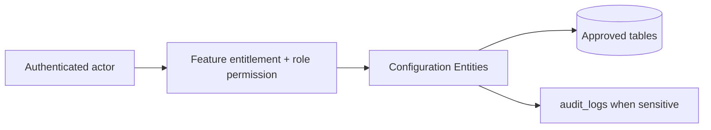

# Configuration Entities

## Purpose

This document is a module-wise entity reference generated from the approved database design. It uses table-level column definitions so developers can see primary keys, foreign keys, constraints, and implementation notes without depending on old Markdown content.

## Control rule

| Concern | Required behavior |
|---|---|
| Tenant access | Every tenant-level feature must be configurable by tenant role, user right, permission, and feature assignment. |
| Backend authority | API/application services must validate tenant, feature entitlement, runtime flag, role permission, and same-tenant foreign-key ownership. |
| Frontend behavior | UI may hide unavailable actions, but backend rejection is mandatory for unauthorized writes. |
| Platform exception | Platform-admin-only catalog and tenant-control features remain platform controlled. |

## Entity index

| Entity | Purpose | PK | FK count |
|---|---|---:|---:|
| `feature_flags` | Tenant-side runtime feature configuration by scope. | 1 | 4 |
| `tenant_settings` | Generic setting store for tenant/outlet/channel settings. | 1 | 2 |
| `ui_themes` | Tenant UI theme tokens. | 1 | 1 |

## Table definitions

### `feature_flags`

| Property | Detail |
|---|---|
| Database module | 3. Tenant Runtime Configuration |
| Purpose | Tenant-side runtime feature configuration by scope. |
| Ownership | Tenant-owned or tenant-linked; tenant consistency must be enforced through tenant_id or parent ownership. |
| Access control | Tenant-configurable access; operation requires enabled tenant feature plus role permission/user right. |
| Table rules | Exactly one target based on scope. Feature must be entitled to tenant. |

| Column | Type | Key / Constraint | Reference / Note |
|---|---|---|---|
| `id` | `uuid` | PK | Primary key. |
| `tenant_id` | `uuid` | NOT NULL FK | References tenants(id). |
| `feature_id` | `uuid` | NOT NULL FK | References platform_features(id). |
| `enabled` | `boolean` | NOT NULL | Runtime enabled flag. |
| `scope` | `varchar(20)` | NOT NULL CHECK | tenant, outlet, user. |
| `outlet_id` | `uuid` | NULL FK | References outlets(id) when scope=outlet. |
| `user_id` | `uuid` | NULL FK | References users(id) when scope=user. |
| `config` | `jsonb` | NULL | Runtime configuration. |
| `created_at` | `timestamptz` | NOT NULL | Creation time. |
| `updated_at` | `timestamptz` | NOT NULL | Last update time. |

| Key summary | Columns |
|---|---|
| Primary key | `id` |
| Foreign keys | `tenant_id`, `feature_id`, `outlet_id`, `user_id` |

### `tenant_settings`

| Property | Detail |
|---|---|
| Database module | 3. Tenant Runtime Configuration |
| Purpose | Generic setting store for tenant/outlet/channel settings. |
| Ownership | Tenant-owned or tenant-linked; tenant consistency must be enforced through tenant_id or parent ownership. |
| Access control | Tenant-configurable access; operation requires enabled tenant feature plus role permission/user right. |
| Table rules | Use partial unique indexes per scope. Settings are not a replacement for relational transaction data. |

| Column | Type | Key / Constraint | Reference / Note |
|---|---|---|---|
| `id` | `uuid` | PK | Primary key. |
| `tenant_id` | `uuid` | NOT NULL FK | References tenants(id). |
| `setting_key` | `varchar(120)` | NOT NULL | Setting key. |
| `setting_value` | `jsonb` | NOT NULL | Setting payload. |
| `scope` | `varchar(20)` | NOT NULL CHECK | tenant, outlet, channel. |
| `outlet_id` | `uuid` | NULL FK | Required when scope=outlet. |
| `channel` | `varchar(20)` | NULL CHECK | pos, ecommerce; required when scope=channel. |
| `created_at` | `timestamptz` | NOT NULL | Creation time. |
| `updated_at` | `timestamptz` | NOT NULL | Last update time. |

| Key summary | Columns |
|---|---|
| Primary key | `id` |
| Foreign keys | `tenant_id`, `outlet_id` |

### `ui_themes`

| Property | Detail |
|---|---|
| Database module | 3. Tenant Runtime Configuration |
| Purpose | Tenant UI theme tokens. |
| Ownership | Tenant-owned or tenant-linked; tenant consistency must be enforced through tenant_id or parent ownership. |
| Access control | Tenant-configurable access; operation requires enabled tenant feature plus role permission/user right. |
| Table rules | UNIQUE (tenant_id, name). At most one default theme per tenant. |

| Column | Type | Key / Constraint | Reference / Note |
|---|---|---|---|
| `id` | `uuid` | PK | Primary key. |
| `tenant_id` | `uuid` | NOT NULL FK | References tenants(id). |
| `name` | `varchar(150)` | NOT NULL | Theme name. |
| `theme_tokens` | `jsonb` | NOT NULL | Validated tokens for colors, spacing, typography. |
| `is_default` | `boolean` | NOT NULL | Default theme flag. |
| `created_at` | `timestamptz` | NOT NULL | Creation time. |
| `updated_at` | `timestamptz` | NOT NULL | Last update time. |

| Key summary | Columns |
|---|---|
| Primary key | `id` |
| Foreign keys | `tenant_id` |

## Module data flow

## Implementation notes

- Service validation must mirror database uniqueness and status constraints before persistence.
- Repository queries must include tenant filters for tenant-owned records.
- Foreign-key values submitted by clients must be checked for same-tenant ownership.
- Permission codes should be module/action specific, for example `module.entity.action`.
- Mutation endpoints should be idempotent where duplicate client requests or offline sync can occur.

## Related documents

- [[../data-dictionary-index]]
- [[../database-overview]]
- [[../schema-principles]]
- [[../tenant-consistency-rules]]