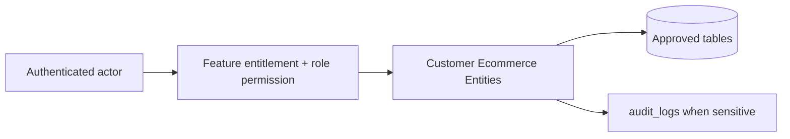

# Customer Ecommerce Entities

## Purpose

This document is a module-wise entity reference generated from the approved database design. It uses table-level column definitions so developers can see primary keys, foreign keys, constraints, and implementation notes without depending on old Markdown content.

## Control rule

| Concern | Required behavior |
|---|---|
| Tenant access | Every tenant-level feature must be configurable by tenant role, user right, permission, and feature assignment. |
| Backend authority | API/application services must validate tenant, feature entitlement, runtime flag, role permission, and same-tenant foreign-key ownership. |
| Frontend behavior | UI may hide unavailable actions, but backend rejection is mandatory for unauthorized writes. |
| Platform exception | Platform-admin-only catalog and tenant-control features remain platform controlled. |

## Entity index

| Entity | Purpose | PK | FK count |
|---|---|---:|---:|
| `customers` | Tenant-scoped customer profile shared by POS and online channel. | 1 | 1 |
| `customer_auth_accounts` | Customer account wrapper for online login. | 1 | 2 |
| `customer_auth_identities` | Login identities for customer auth account. | 1 | 2 |
| `otp_channels` | Reference values for OTP delivery channels. | 1 | 0 |
| `otp_purposes` | Reference values for OTP purpose. | 1 | 0 |
| `otp_verifications` | OTP issuance, attempt and verification history for tenant users or customer accounts. | 1 | 5 |
| `customer_addresses` | Reusable customer addresses. | 1 | 2 |
| `wishlists` | Customer wishlist header for e-commerce saved items. | 1 | 2 |
| `wishlist_items` | Variant items saved under a customer wishlist. | 1 | 3 |
| `product_reviews` | Moderated customer product reviews linked to a product and optional order. | 1 | 5 |
| `loyalty_programs` | Tenant-owned loyalty program configuration. | 1 | 1 |
| `membership_tiers` | Tier definitions inside a loyalty program. | 1 | 2 |
| `customer_memberships` | Customer membership record and current points projection. | 1 | 4 |
| `loyalty_transactions` | Immutable loyalty points ledger. | 1 | 7 |
| `carts` | Shopping cart header. | 1 | 2 |
| `cart_items` | Cart line items. | 1 | 3 |
| `orders` | E-Commerce order header. | 1 | 5 |
| `order_items` | Order line items. | 1 | 4 |
| `order_addresses` | Immutable order address snapshots. | 1 | 2 |
| `order_status_transitions` | Allowed status transitions for order/payment/fulfillment workflows. | 1 | 1 |
| `order_status_history` | Status change history for order/payment/fulfillment statuses. | 1 | 3 |

## Table definitions

### `customers`

| Property | Detail |
|---|---|
| Database module | 7. Customer, Cart and E-Commerce Orders |
| Purpose | Tenant-scoped customer profile shared by POS and online channel. |
| Ownership | Tenant-owned or tenant-linked; tenant consistency must be enforced through tenant_id or parent ownership. |
| Access control | Tenant-configurable access; operation requires enabled tenant feature plus role permission/user right. |
| Table rules | UNIQUE (tenant_id, normalized_email) WHERE normalized_email IS NOT NULL. UNIQUE (tenant_id, normalized_phone) WHERE normalized_phone IS NOT NULL. Guest checkout creates a tenant-scoped guest customer row. |

| Column | Type | Key / Constraint | Reference / Note |
|---|---|---|---|
| `id` | `uuid` | PK | Primary key. |
| `tenant_id` | `uuid` | NOT NULL FK | References tenants(id). |
| `email` | `citext` | NULL | Customer email. |
| `normalized_email` | `citext` | NULL | Normalized email. |
| `phone` | `varchar(40)` | NULL | Customer phone. |
| `normalized_phone` | `varchar(40)` | NULL | Normalized phone. |
| `full_name` | `varchar(200)` | NULL | Full name. |
| `first_name` | `varchar(100)` | NULL | First name. |
| `last_name` | `varchar(100)` | NULL | Last name. |
| `status` | `varchar(30)` | NOT NULL CHECK | active, inactive, blocked, guest. |
| `source` | `varchar(30)` | NOT NULL CHECK | pos, ecommerce, guest, import, api. |
| `created_at` | `timestamptz` | NOT NULL | Creation time. |
| `updated_at` | `timestamptz` | NOT NULL | Last update time. |

| Key summary | Columns |
|---|---|
| Primary key | `id` |
| Foreign keys | `tenant_id` |

### `customer_auth_accounts`

| Property | Detail |
|---|---|
| Database module | 7. Customer, Cart and E-Commerce Orders |
| Purpose | Customer account wrapper for online login. |
| Ownership | Tenant-owned or tenant-linked; tenant consistency must be enforced through tenant_id or parent ownership. |
| Access control | Tenant-configurable access; operation requires enabled tenant feature plus role permission/user right. |
| Table rules | UNIQUE (tenant_id, customer_id). Guest customers do not require auth accounts. |

| Column | Type | Key / Constraint | Reference / Note |
|---|---|---|---|
| `id` | `uuid` | PK | Primary key. |
| `tenant_id` | `uuid` | NOT NULL FK | References tenants(id). |
| `customer_id` | `uuid` | NOT NULL FK | References customers(id). |
| `status` | `varchar(30)` | NOT NULL CHECK | active, inactive, blocked. |
| `last_login_at` | `timestamptz` | NULL | Last login time. |
| `created_at` | `timestamptz` | NOT NULL | Creation time. |

| Key summary | Columns |
|---|---|
| Primary key | `id` |
| Foreign keys | `tenant_id`, `customer_id` |

### `customer_auth_identities`

| Property | Detail |
|---|---|
| Database module | 7. Customer, Cart and E-Commerce Orders |
| Purpose | Login identities for customer auth account. |
| Ownership | Tenant-owned or tenant-linked; tenant consistency must be enforced through tenant_id or parent ownership. |
| Access control | Tenant-configurable access; operation requires enabled tenant feature plus role permission/user right. |
| Table rules | UNIQUE (tenant_id, provider, provider_subject) WHERE provider_subject IS NOT NULL. UNIQUE (tenant_id, provider, username) WHERE username IS NOT NULL. UNIQUE (tenant_id, account_id, provider). |

| Column | Type | Key / Constraint | Reference / Note |
|---|---|---|---|
| `id` | `uuid` | PK | Primary key. |
| `tenant_id` | `uuid` | NOT NULL FK | References tenants(id). |
| `account_id` | `uuid` | NOT NULL FK | References customer_auth_accounts(id). |
| `provider` | `varchar(30)` | NOT NULL CHECK | local, google, apple. |
| `provider_subject` | `varchar(255)` | NULL | External subject. |
| `username` | `citext` | NULL | Local login username/email. |
| `password_hash` | `varchar(255)` | NULL | Password hash for local provider. |
| `is_email_verified` | `boolean` | NOT NULL | Email verification flag. |
| `is_phone_verified` | `boolean` | NOT NULL | Phone verification flag. |
| `created_at` | `timestamptz` | NOT NULL | Creation time. |

| Key summary | Columns |
|---|---|
| Primary key | `id` |
| Foreign keys | `tenant_id`, `account_id` |

### `otp_channels`

| Property | Detail |
|---|---|
| Database module | 7. Customer, Cart and E-Commerce Orders |
| Purpose | Reference values for OTP delivery channels. |
| Ownership | Platform-owned catalog/reference; tenant_id is intentionally absent where shown. |
| Access control | Tenant-configurable access; operation requires enabled tenant feature plus role permission/user right. |
| Table rules | Seeded reference table. |

| Column | Type | Key / Constraint | Reference / Note |
|---|---|---|---|
| `id` | `smallint` | PK | Primary key. |
| `code` | `varchar(40)` | NOT NULL UNIQUE | email, sms, whatsapp. |
| `name` | `varchar(80)` | NOT NULL | Display label. |

| Key summary | Columns |
|---|---|
| Primary key | `id` |
| Foreign keys | None |

### `otp_purposes`

| Property | Detail |
|---|---|
| Database module | 7. Customer, Cart and E-Commerce Orders |
| Purpose | Reference values for OTP purpose. |
| Ownership | Platform-owned catalog/reference; tenant_id is intentionally absent where shown. |
| Access control | Tenant-configurable access; operation requires enabled tenant feature plus role permission/user right. |
| Table rules | Seeded reference table. |

| Column | Type | Key / Constraint | Reference / Note |
|---|---|---|---|
| `id` | `smallint` | PK | Primary key. |
| `code` | `varchar(60)` | NOT NULL UNIQUE | login, signup, reset_password, verify_phone, verify_email, mfa. |
| `name` | `varchar(100)` | NOT NULL | Display label. |

| Key summary | Columns |
|---|---|
| Primary key | `id` |
| Foreign keys | None |

### `otp_verifications`

| Property | Detail |
|---|---|
| Database module | 7. Customer, Cart and E-Commerce Orders |
| Purpose | OTP issuance, attempt and verification history for tenant users or customer accounts. |
| Ownership | Tenant-owned or tenant-linked; tenant consistency must be enforced through tenant_id or parent ownership. |
| Access control | Tenant-configurable access; operation requires enabled tenant feature plus role permission/user right. |
| Table rules | CHECK exactly one of user_id/customer_auth_account_id is populated. Store only hashed OTP values. Apply rate limiting, resend limits, temporary blocking and retention cleanup for old OTP rows. |

| Column | Type | Key / Constraint | Reference / Note |
|---|---|---|---|
| `id` | `uuid` | PK | Primary key. |
| `tenant_id` | `uuid` | NOT NULL FK | References tenants(id). |
| `user_id` | `uuid` | NULL FK | References users(id) for staff/admin OTP. |
| `customer_auth_account_id` | `uuid` | NULL FK | References customer_auth_accounts(id) for customer OTP. |
| `otp_channel_id` | `smallint` | NOT NULL FK | References otp_channels(id). |
| `otp_purpose_id` | `smallint` | NOT NULL FK | References otp_purposes(id). |
| `destination` | `varchar(200)` | NOT NULL | Email or phone destination. |
| `otp_code_hash` | `varchar(255)` | NOT NULL | Hashed OTP only; never store plain OTP. |
| `expires_at` | `timestamptz` | NOT NULL | OTP expiry time. |
| `verified_at` | `timestamptz` | NULL | Verification time. |
| `attempt_count` | `int` | NOT NULL DEFAULT 0 | Attempt counter. |
| `resend_count` | `int` | NOT NULL DEFAULT 0 | OTP resend counter. |
| `last_attempt_at` | `timestamptz` | NULL | Last verification attempt time. |
| `blocked_until` | `timestamptz` | NULL | Temporary block time after abuse threshold. |
| `ip` | `inet` | NULL | Request IP for abuse monitoring. |
| `user_agent` | `text` | NULL | Request user agent. |
| `status` | `varchar(30)` | NOT NULL CHECK | pending, verified, expired, blocked. |
| `created_at` | `timestamptz` | NOT NULL | Creation time. |
| `updated_at` | `timestamptz` | NOT NULL | Last update time. |

| Key summary | Columns |
|---|---|
| Primary key | `id` |
| Foreign keys | `tenant_id`, `user_id`, `customer_auth_account_id`, `otp_channel_id`, `otp_purpose_id` |

### `customer_addresses`

| Property | Detail |
|---|---|
| Database module | 7. Customer, Cart and E-Commerce Orders |
| Purpose | Reusable customer addresses. |
| Ownership | Tenant-owned or tenant-linked; tenant consistency must be enforced through tenant_id or parent ownership. |
| Access control | Tenant-configurable access; operation requires enabled tenant feature plus role permission/user right. |
| Table rules | At most one default address per customer/address_type. |

| Column | Type | Key / Constraint | Reference / Note |
|---|---|---|---|
| `id` | `uuid` | PK | Primary key. |
| `tenant_id` | `uuid` | NOT NULL FK | References tenants(id). |
| `customer_id` | `uuid` | NOT NULL FK | References customers(id). |
| `address_type` | `varchar(30)` | NOT NULL CHECK | billing, shipping, other. |
| `line1` | `varchar(250)` | NOT NULL | Address line 1. |
| `line2` | `varchar(250)` | NULL | Address line 2. |
| `city` | `varchar(120)` | NOT NULL | City. |
| `state` | `varchar(120)` | NULL | Province/state. |
| `postal_code` | `varchar(30)` | NULL | Postal code. |
| `country_code` | `char(2)` | NOT NULL | ISO country code. |
| `is_default` | `boolean` | NOT NULL | Default flag. |
| `created_at` | `timestamptz` | NOT NULL | Creation time. |

| Key summary | Columns |
|---|---|
| Primary key | `id` |
| Foreign keys | `tenant_id`, `customer_id` |

### `wishlists`

| Property | Detail |
|---|---|
| Database module | 7. Customer, Cart and E-Commerce Orders |
| Purpose | Customer wishlist header for e-commerce saved items. |
| Ownership | Tenant-owned or tenant-linked; tenant consistency must be enforced through tenant_id or parent ownership. |
| Access control | Tenant-configurable access; operation requires enabled tenant feature plus role permission/user right. |
| Table rules | UNIQUE (tenant_id, customer_id, name). At most one default wishlist per customer. |

| Column | Type | Key / Constraint | Reference / Note |
|---|---|---|---|
| `id` | `uuid` | PK | Primary key. |
| `tenant_id` | `uuid` | NOT NULL FK | References tenants(id). |
| `customer_id` | `uuid` | NOT NULL FK | References customers(id). |
| `name` | `varchar(120)` | NOT NULL | Wishlist name. |
| `is_default` | `boolean` | NOT NULL | Default wishlist flag. |
| `status` | `varchar(30)` | NOT NULL CHECK | active, archived. |
| `created_at` | `timestamptz` | NOT NULL | Creation time. |
| `updated_at` | `timestamptz` | NOT NULL | Last update time. |

| Key summary | Columns |
|---|---|
| Primary key | `id` |
| Foreign keys | `tenant_id`, `customer_id` |

### `wishlist_items`

| Property | Detail |
|---|---|
| Database module | 7. Customer, Cart and E-Commerce Orders |
| Purpose | Variant items saved under a customer wishlist. |
| Ownership | Tenant-owned or tenant-linked; tenant consistency must be enforced through tenant_id or parent ownership. |
| Access control | Tenant-configurable access; operation requires enabled tenant feature plus role permission/user right. |
| Table rules | UNIQUE (tenant_id, wishlist_id, variant_id). wishlist_id and variant_id must belong to tenant_id. |

| Column | Type | Key / Constraint | Reference / Note |
|---|---|---|---|
| `id` | `uuid` | PK | Primary key. |
| `tenant_id` | `uuid` | NOT NULL FK | References tenants(id). |
| `wishlist_id` | `uuid` | NOT NULL FK | References wishlists(id). |
| `variant_id` | `uuid` | NOT NULL FK | References product_variants(id). |
| `added_at` | `timestamptz` | NOT NULL | Added time. |

| Key summary | Columns |
|---|---|
| Primary key | `id` |
| Foreign keys | `tenant_id`, `wishlist_id`, `variant_id` |

### `product_reviews`

| Property | Detail |
|---|---|
| Database module | 7. Customer, Cart and E-Commerce Orders |
| Purpose | Moderated customer product reviews linked to a product and optional order. |
| Ownership | Tenant-owned or tenant-linked; tenant consistency must be enforced through tenant_id or parent ownership. |
| Access control | Tenant-configurable access; operation requires enabled tenant feature plus role permission/user right. |
| Table rules | UNIQUE (tenant_id, customer_id, product_id, order_id) WHERE order_id IS NOT NULL. UNIQUE (tenant_id, customer_id, product_id) WHERE order_id IS NULL. Reviews require moderation before public display; purchase-verified review should include order_id when available. |

| Column | Type | Key / Constraint | Reference / Note |
|---|---|---|---|
| `id` | `uuid` | PK | Primary key. |
| `tenant_id` | `uuid` | NOT NULL FK | References tenants(id). |
| `customer_id` | `uuid` | NOT NULL FK | References customers(id). |
| `product_id` | `uuid` | NOT NULL FK | References products(id). |
| `order_id` | `uuid` | NULL FK | References orders(id) when review is purchase-verified. |
| `rating` | `int` | NOT NULL CHECK | 1 to 5. |
| `title` | `varchar(200)` | NULL | Review title. |
| `body` | `text` | NULL | Review body. |
| `status` | `varchar(30)` | NOT NULL CHECK | pending, approved, rejected, hidden. |
| `approved_by` | `uuid` | NULL FK | References users(id). |
| `approved_at` | `timestamptz` | NULL | Moderation time. |
| `created_at` | `timestamptz` | NOT NULL | Creation time. |
| `updated_at` | `timestamptz` | NOT NULL | Last update time. |

| Key summary | Columns |
|---|---|
| Primary key | `id` |
| Foreign keys | `tenant_id`, `customer_id`, `product_id`, `order_id`, `approved_by` |

### `loyalty_programs`

| Property | Detail |
|---|---|
| Database module | 7. Customer, Cart and E-Commerce Orders |
| Purpose | Tenant-owned loyalty program configuration. |
| Ownership | Tenant-owned or tenant-linked; tenant consistency must be enforced through tenant_id or parent ownership. |
| Access control | Tenant-configurable access; operation requires enabled tenant feature plus role permission/user right. |
| Table rules | UNIQUE (tenant_id, code). JSON rules are allowed for flexibility, but financial point changes must be stored in loyalty_transactions. |

| Column | Type | Key / Constraint | Reference / Note |
|---|---|---|---|
| `id` | `uuid` | PK | Primary key. |
| `tenant_id` | `uuid` | NOT NULL FK | References tenants(id). |
| `code` | `varchar(80)` | NOT NULL | Program code. |
| `name` | `varchar(150)` | NOT NULL | Program name. |
| `earn_rule` | `jsonb` | NOT NULL | Points earn configuration. |
| `redeem_rule` | `jsonb` | NOT NULL | Redemption configuration. |
| `status` | `varchar(30)` | NOT NULL CHECK | draft, active, inactive, archived. |
| `starts_at` | `timestamptz` | NULL | Program start time. |
| `ends_at` | `timestamptz` | NULL | Program end time. |
| `created_at` | `timestamptz` | NOT NULL | Creation time. |
| `updated_at` | `timestamptz` | NOT NULL | Last update time. |

| Key summary | Columns |
|---|---|
| Primary key | `id` |
| Foreign keys | `tenant_id` |

### `membership_tiers`

| Property | Detail |
|---|---|
| Database module | 7. Customer, Cart and E-Commerce Orders |
| Purpose | Tier definitions inside a loyalty program. |
| Ownership | Tenant-owned or tenant-linked; tenant consistency must be enforced through tenant_id or parent ownership. |
| Access control | Tenant-configurable access; operation requires enabled tenant feature plus role permission/user right. |
| Table rules | UNIQUE (tenant_id, loyalty_program_id, code). |

| Column | Type | Key / Constraint | Reference / Note |
|---|---|---|---|
| `id` | `uuid` | PK | Primary key. |
| `tenant_id` | `uuid` | NOT NULL FK | References tenants(id). |
| `loyalty_program_id` | `uuid` | NOT NULL FK | References loyalty_programs(id). |
| `code` | `varchar(80)` | NOT NULL | Tier code. |
| `name` | `varchar(150)` | NOT NULL | Tier name. |
| `min_points` | `numeric(14,2)` | NOT NULL DEFAULT 0 | Minimum points/lifetime points for tier. |
| `points_multiplier` | `numeric(10,2)` | NOT NULL DEFAULT 1 | Earn multiplier. |
| `sort_order` | `int` | NOT NULL | Display/evaluation order. |
| `status` | `varchar(30)` | NOT NULL CHECK | active, inactive. |
| `created_at` | `timestamptz` | NOT NULL | Creation time. |
| `updated_at` | `timestamptz` | NOT NULL | Last update time. |

| Key summary | Columns |
|---|---|
| Primary key | `id` |
| Foreign keys | `tenant_id`, `loyalty_program_id` |

### `customer_memberships`

| Property | Detail |
|---|---|
| Database module | 7. Customer, Cart and E-Commerce Orders |
| Purpose | Customer membership record and current points projection. |
| Ownership | Tenant-owned or tenant-linked; tenant consistency must be enforced through tenant_id or parent ownership. |
| Access control | Tenant-configurable access; operation requires enabled tenant feature plus role permission/user right. |
| Table rules | UNIQUE (tenant_id, membership_no). UNIQUE (tenant_id, customer_id, loyalty_program_id). points_balance must be updated only from loyalty_transactions. |

| Column | Type | Key / Constraint | Reference / Note |
|---|---|---|---|
| `id` | `uuid` | PK | Primary key. |
| `tenant_id` | `uuid` | NOT NULL FK | References tenants(id). |
| `customer_id` | `uuid` | NOT NULL FK | References customers(id). |
| `loyalty_program_id` | `uuid` | NOT NULL FK | References loyalty_programs(id). |
| `membership_no` | `varchar(80)` | NOT NULL | Membership number. |
| `tier_id` | `uuid` | NULL FK | References membership_tiers(id). |
| `points_balance` | `numeric(14,2)` | NOT NULL DEFAULT 0 | Current available points. |
| `lifetime_points` | `numeric(14,2)` | NOT NULL DEFAULT 0 | Lifetime earned points. |
| `join_date` | `date` | NOT NULL | Join date. |
| `expiry_date` | `date` | NULL | Optional expiry. |
| `status` | `varchar(30)` | NOT NULL CHECK | active, expired, suspended, closed. |
| `created_at` | `timestamptz` | NOT NULL | Creation time. |
| `updated_at` | `timestamptz` | NOT NULL | Last update time. |

| Key summary | Columns |
|---|---|
| Primary key | `id` |
| Foreign keys | `tenant_id`, `customer_id`, `loyalty_program_id`, `tier_id` |

### `loyalty_transactions`

| Property | Detail |
|---|---|
| Database module | 7. Customer, Cart and E-Commerce Orders |
| Purpose | Immutable loyalty points ledger. |
| Ownership | Tenant-owned or tenant-linked; tenant consistency must be enforced through tenant_id or parent ownership. |
| Access control | Tenant-configurable access; operation requires enabled tenant feature plus role permission/user right. |
| Table rules | Ledger rows are immutable. CHECK that only one of source_sale_id, source_order_id, source_return_id is populated where applicable. Reverse transactions must point to reversed_transaction_id instead of editing original rows. |

| Column | Type | Key / Constraint | Reference / Note |
|---|---|---|---|
| `id` | `uuid` | PK | Primary key. |
| `tenant_id` | `uuid` | NOT NULL FK | References tenants(id). |
| `customer_membership_id` | `uuid` | NOT NULL FK | References customer_memberships(id). |
| `source_sale_id` | `uuid` | NULL FK | References sales(id). |
| `source_order_id` | `uuid` | NULL FK | References orders(id). |
| `source_return_id` | `uuid` | NULL FK | References returns(id). |
| `transaction_type` | `varchar(30)` | NOT NULL CHECK | earn, redeem, adjust, expire, reverse. |
| `points_delta` | `numeric(14,2)` | NOT NULL | Positive or negative point movement. |
| `monetary_value` | `numeric(12,2)` | NULL | Money value represented by redeemed points, if any. |
| `expires_at` | `timestamptz` | NULL | Expiry date for earned points where applicable. |
| `reversed_transaction_id` | `uuid` | NULL FK | References loyalty_transactions(id) when reversing a prior transaction. |
| `reason` | `text` | NULL | Reason or note. |
| `created_by` | `uuid` | NULL FK | References users(id). |
| `created_at` | `timestamptz` | NOT NULL | Creation time. |

| Key summary | Columns |
|---|---|
| Primary key | `id` |
| Foreign keys | `tenant_id`, `customer_membership_id`, `source_sale_id`, `source_order_id`, `source_return_id`, `reversed_transaction_id`, `created_by` |

### `carts`

| Property | Detail |
|---|---|
| Database module | 7. Customer, Cart and E-Commerce Orders |
| Purpose | Shopping cart header. |
| Ownership | Tenant-owned or tenant-linked; tenant consistency must be enforced through tenant_id or parent ownership. |
| Access control | Tenant-configurable access; operation requires enabled tenant feature plus role permission/user right. |
| Table rules | CHECK customer_id IS NOT NULL OR guest_token IS NOT NULL. Expired carts cannot convert to orders. |

| Column | Type | Key / Constraint | Reference / Note |
|---|---|---|---|
| `id` | `uuid` | PK | Primary key. |
| `tenant_id` | `uuid` | NOT NULL FK | References tenants(id). |
| `customer_id` | `uuid` | NULL FK | References customers(id). |
| `guest_token` | `varchar(120)` | NULL | Required when customer_id is null. |
| `channel` | `varchar(20)` | NOT NULL CHECK | web, mobile, kiosk. |
| `status` | `varchar(30)` | NOT NULL CHECK | active, converted, abandoned, expired. |
| `currency` | `char(3)` | NOT NULL | Currency. |
| `subtotal` | `numeric(12,2)` | NOT NULL | Subtotal. |
| `discount_total` | `numeric(12,2)` | NOT NULL | Discount total. |
| `tax_total` | `numeric(12,2)` | NOT NULL | Tax total. |
| `grand_total` | `numeric(12,2)` | NOT NULL | Grand total. |
| `expires_at` | `timestamptz` | NULL | Cart expiry time. |
| `created_at` | `timestamptz` | NOT NULL | Creation time. |
| `updated_at` | `timestamptz` | NOT NULL | Last update time. |

| Key summary | Columns |
|---|---|
| Primary key | `id` |
| Foreign keys | `tenant_id`, `customer_id` |

### `cart_items`

| Property | Detail |
|---|---|
| Database module | 7. Customer, Cart and E-Commerce Orders |
| Purpose | Cart line items. |
| Ownership | Tenant-owned or tenant-linked; tenant consistency must be enforced through tenant_id or parent ownership. |
| Access control | Tenant-configurable access; operation requires enabled tenant feature plus role permission/user right. |
| Table rules | UNIQUE (tenant_id, cart_id, variant_id). |

| Column | Type | Key / Constraint | Reference / Note |
|---|---|---|---|
| `id` | `uuid` | PK | Primary key. |
| `tenant_id` | `uuid` | NOT NULL FK | References tenants(id). |
| `cart_id` | `uuid` | NOT NULL FK | References carts(id). |
| `variant_id` | `uuid` | NOT NULL FK | References product_variants(id). |
| `qty` | `numeric(14,3)` | NOT NULL CHECK | > 0. |
| `unit_price` | `numeric(12,2)` | NOT NULL | Unit price. |
| `discount_total` | `numeric(12,2)` | NOT NULL | Line discount. |
| `tax_total` | `numeric(12,2)` | NOT NULL | Line tax. |
| `line_total` | `numeric(12,2)` | NOT NULL | Line total. |
| `pricing_snapshot` | `jsonb` | NOT NULL | Frozen pricing context. |

| Key summary | Columns |
|---|---|
| Primary key | `id` |
| Foreign keys | `tenant_id`, `cart_id`, `variant_id` |

### `orders`

| Property | Detail |
|---|---|
| Database module | 7. Customer, Cart and E-Commerce Orders |
| Purpose | E-Commerce order header. |
| Ownership | Tenant-owned or tenant-linked; tenant consistency must be enforced through tenant_id or parent ownership. |
| Access control | Tenant-configurable access; operation requires enabled tenant feature plus role permission/user right. |
| Table rules | UNIQUE (tenant_id, order_number). Keep order_status high-level; do not duplicate delivery/pickup states in order_status. |

| Column | Type | Key / Constraint | Reference / Note |
|---|---|---|---|
| `id` | `uuid` | PK | Primary key. |
| `tenant_id` | `uuid` | NOT NULL FK | References tenants(id). |
| `order_number` | `varchar(80)` | NOT NULL | Business order number. |
| `source_cart_id` | `uuid` | NULL FK | References carts(id). |
| `customer_id` | `uuid` | NOT NULL FK | References customers(id); guest checkout creates guest customer. |
| `fulfillment_outlet_id` | `uuid` | NULL FK | References outlets(id). |
| `business_date` | `date` | NOT NULL | Operational date. |
| `order_status` | `varchar(30)` | NOT NULL CHECK | draft, pending_payment, confirmed, processing, completed, cancelled, partially_refunded, refunded. |
| `payment_status` | `varchar(30)` | NOT NULL CHECK | pending, authorized, captured, failed, cancelled, voided, partially_refunded, refunded, expired. |
| `fulfillment_status` | `varchar(30)` | NOT NULL CHECK | unfulfilled, reserved, picking, ready_for_pickup, out_for_delivery, delivered, collected, failed, cancelled. |
| `currency` | `char(3)` | NOT NULL | Currency. |
| `subtotal` | `numeric(12,2)` | NOT NULL | Subtotal. |
| `discount_total` | `numeric(12,2)` | NOT NULL | Discount. |
| `tax_total` | `numeric(12,2)` | NOT NULL | Tax. |
| `shipping_total` | `numeric(12,2)` | NOT NULL | Shipping. |
| `grand_total` | `numeric(12,2)` | NOT NULL | Grand total. |
| `placed_at` | `timestamptz` | NULL | Placement time. |
| `cancelled_by` | `uuid` | NULL FK | References users(id). |
| `cancelled_at` | `timestamptz` | NULL | Cancellation time. |
| `cancel_reason` | `text` | NULL | Cancellation reason. |
| `created_at` | `timestamptz` | NOT NULL | Creation time. |
| `updated_at` | `timestamptz` | NOT NULL | Last update time. |

| Key summary | Columns |
|---|---|
| Primary key | `id` |
| Foreign keys | `tenant_id`, `source_cart_id`, `customer_id`, `fulfillment_outlet_id`, `cancelled_by` |

### `order_items`

| Property | Detail |
|---|---|
| Database module | 7. Customer, Cart and E-Commerce Orders |
| Purpose | Order line items. |
| Ownership | Tenant-owned or tenant-linked; tenant consistency must be enforced through tenant_id or parent ownership. |
| Access control | Tenant-configurable access; operation requires enabled tenant feature plus role permission/user right. |
| Table rules | UNIQUE (tenant_id, order_id, line_no). |

| Column | Type | Key / Constraint | Reference / Note |
|---|---|---|---|
| `id` | `uuid` | PK | Primary key. |
| `tenant_id` | `uuid` | NOT NULL FK | References tenants(id). |
| `order_id` | `uuid` | NOT NULL FK | References orders(id). |
| `variant_id` | `uuid` | NOT NULL FK | References product_variants(id). |
| `line_no` | `int` | NOT NULL | Line number. |
| `description` | `varchar(250)` | NOT NULL | Frozen item text. |
| `qty` | `numeric(14,3)` | NOT NULL CHECK | > 0. |
| `reserved_qty` | `numeric(14,3)` | NOT NULL DEFAULT 0 | Reserved quantity. |
| `fulfilled_qty` | `numeric(14,3)` | NOT NULL DEFAULT 0 | Fulfilled quantity. |
| `returned_qty` | `numeric(14,3)` | NOT NULL DEFAULT 0 | Returned quantity. |
| `unit_price` | `numeric(12,2)` | NOT NULL | Unit price. |
| `discount_total` | `numeric(12,2)` | NOT NULL | Line discount. |
| `tax_total` | `numeric(12,2)` | NOT NULL | Line tax. |
| `line_total` | `numeric(12,2)` | NOT NULL | Line total. |
| `tax_rate_id` | `uuid` | NULL FK | References tax_rates(id). |
| `pricing_snapshot` | `jsonb` | NOT NULL | Frozen pricing context. |

| Key summary | Columns |
|---|---|
| Primary key | `id` |
| Foreign keys | `tenant_id`, `order_id`, `variant_id`, `tax_rate_id` |

### `order_addresses`

| Property | Detail |
|---|---|
| Database module | 7. Customer, Cart and E-Commerce Orders |
| Purpose | Immutable order address snapshots. |
| Ownership | Tenant-owned or tenant-linked; tenant consistency must be enforced through tenant_id or parent ownership. |
| Access control | Tenant-configurable access; operation requires enabled tenant feature plus role permission/user right. |
| Table rules | UNIQUE (tenant_id, order_id, address_type). Snapshot must not change after order placement except controlled correction audit. |

| Column | Type | Key / Constraint | Reference / Note |
|---|---|---|---|
| `id` | `uuid` | PK | Primary key. |
| `tenant_id` | `uuid` | NOT NULL FK | References tenants(id). |
| `order_id` | `uuid` | NOT NULL FK | References orders(id). |
| `address_type` | `varchar(30)` | NOT NULL CHECK | billing, shipping. |
| `full_name` | `varchar(200)` | NULL | Recipient/billing name. |
| `phone` | `varchar(40)` | NULL | Phone. |
| `line1` | `varchar(250)` | NOT NULL | Address line 1. |
| `line2` | `varchar(250)` | NULL | Address line 2. |
| `city` | `varchar(120)` | NOT NULL | City. |
| `state` | `varchar(120)` | NULL | Province/state. |
| `postal_code` | `varchar(30)` | NULL | Postal code. |
| `country_code` | `char(2)` | NOT NULL | Country code. |

| Key summary | Columns |
|---|---|
| Primary key | `id` |
| Foreign keys | `tenant_id`, `order_id` |

### `order_status_transitions`

| Property | Detail |
|---|---|
| Database module | 7. Customer, Cart and E-Commerce Orders |
| Purpose | Allowed status transitions for order/payment/fulfillment workflows. |
| Ownership | Platform-owned catalog/reference; tenant_id is intentionally absent where shown. |
| Access control | Tenant-configurable access; operation requires enabled tenant feature plus role permission/user right. |
| Table rules | UNIQUE (status_type, from_status, to_status). Prevent invalid status changes such as delivered back to processing. |

| Column | Type | Key / Constraint | Reference / Note |
|---|---|---|---|
| `id` | `uuid` | PK | Primary key. |
| `status_type` | `varchar(30)` | NOT NULL CHECK | order, payment, fulfillment. |
| `from_status` | `varchar(40)` | NOT NULL | Previous status. |
| `to_status` | `varchar(40)` | NOT NULL | Next status. |
| `requires_permission_code` | `varchar(120)` | NULL FK | References permissions(code) where needed. |
| `is_active` | `boolean` | NOT NULL | Active flag. |

| Key summary | Columns |
|---|---|
| Primary key | `id` |
| Foreign keys | `requires_permission_code` |

### `order_status_history`

| Property | Detail |
|---|---|
| Database module | 7. Customer, Cart and E-Commerce Orders |
| Purpose | Status change history for order/payment/fulfillment statuses. |
| Ownership | Tenant-owned or tenant-linked; tenant consistency must be enforced through tenant_id or parent ownership. |
| Access control | Tenant-configurable access; operation requires enabled tenant feature plus role permission/user right. |
| Table rules | status_type fixes ambiguity between order_status, payment_status and fulfillment_status. |

| Column | Type | Key / Constraint | Reference / Note |
|---|---|---|---|
| `id` | `uuid` | PK | Primary key. |
| `tenant_id` | `uuid` | NOT NULL FK | References tenants(id). |
| `order_id` | `uuid` | NOT NULL FK | References orders(id). |
| `status_type` | `varchar(30)` | NOT NULL CHECK | order, payment, fulfillment. |
| `from_status` | `varchar(40)` | NULL | Previous status. |
| `to_status` | `varchar(40)` | NOT NULL | New status. |
| `changed_by` | `uuid` | NULL FK | References users(id). |
| `changed_at` | `timestamptz` | NOT NULL | Change time. |
| `reason` | `text` | NULL | Reason/note. |

| Key summary | Columns |
|---|---|
| Primary key | `id` |
| Foreign keys | `tenant_id`, `order_id`, `changed_by` |

## Module data flow

## Implementation notes

- Service validation must mirror database uniqueness and status constraints before persistence.
- Repository queries must include tenant filters for tenant-owned records.
- Foreign-key values submitted by clients must be checked for same-tenant ownership.
- Permission codes should be module/action specific, for example `module.entity.action`.
- Mutation endpoints should be idempotent where duplicate client requests or offline sync can occur.

## Related documents

- [[../data-dictionary-index]]
- [[../database-overview]]
- [[../schema-principles]]
- [[../tenant-consistency-rules]]