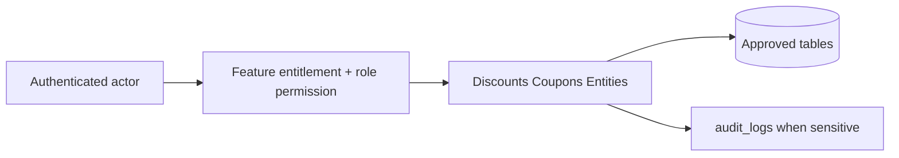

# Discounts Coupons Entities

## Purpose

This document is a module-wise entity reference generated from the approved database design. It uses table-level column definitions so developers can see primary keys, foreign keys, constraints, and implementation notes without depending on old Markdown content.

## Control rule

| Concern | Required behavior |
|---|---|
| Tenant access | Every tenant-level feature must be configurable by tenant role, user right, permission, and feature assignment. |
| Backend authority | API/application services must validate tenant, feature entitlement, runtime flag, role permission, and same-tenant foreign-key ownership. |
| Frontend behavior | UI may hide unavailable actions, but backend rejection is mandatory for unauthorized writes. |
| Platform exception | Platform-admin-only catalog and tenant-control features remain platform controlled. |

## Entity index

| Entity | Purpose | PK | FK count |
|---|---|---:|---:|
| `discount_types` | Discount calculation type reference. | 1 | 0 |
| `discount_scopes` | Discount scope reference. | 1 | 0 |
| `discount_policies` | Tenant discount approval and stacking rules. | 1 | 2 |
| `discount_requests` | Approval workflow requests raised by cashier/operator. | 1 | 9 |
| `coupons` | Tenant coupon master. | 1 | 2 |
| `discount_applications` | Actual discount applied to sale/order. | 1 | 11 |
| `coupon_redemptions` | Actual coupon use against sale/order. | 1 | 5 |

## Table definitions

### `discount_types`

| Property | Detail |
|---|---|
| Database module | 10. Discounts, Coupons and Approvals |
| Purpose | Discount calculation type reference. |
| Ownership | Platform-owned catalog/reference; tenant_id is intentionally absent where shown. |
| Access control | Tenant-configurable access; operation requires enabled tenant feature plus role permission/user right. |
| Table rules | Platform reference table. |

| Column | Type | Key / Constraint | Reference / Note |
|---|---|---|---|
| `id` | `smallint` | PK | Primary key. |
| `code` | `varchar(40)` | NOT NULL UNIQUE | percentage, fixed_amount, price_override. |
| `name` | `varchar(150)` | NOT NULL | Display label. |

| Key summary | Columns |
|---|---|
| Primary key | `id` |
| Foreign keys | None |

### `discount_scopes`

| Property | Detail |
|---|---|
| Database module | 10. Discounts, Coupons and Approvals |
| Purpose | Discount scope reference. |
| Ownership | Platform-owned catalog/reference; tenant_id is intentionally absent where shown. |
| Access control | Tenant-configurable access; operation requires enabled tenant feature plus role permission/user right. |
| Table rules | Platform reference table. |

| Column | Type | Key / Constraint | Reference / Note |
|---|---|---|---|
| `id` | `smallint` | PK | Primary key. |
| `code` | `varchar(40)` | NOT NULL UNIQUE | line, sale, order. |
| `name` | `varchar(150)` | NOT NULL | Display label. |

| Key summary | Columns |
|---|---|
| Primary key | `id` |
| Foreign keys | None |

### `discount_policies`

| Property | Detail |
|---|---|
| Database module | 10. Discounts, Coupons and Approvals |
| Purpose | Tenant discount approval and stacking rules. |
| Ownership | Tenant-owned or tenant-linked; tenant consistency must be enforced through tenant_id or parent ownership. |
| Access control | Tenant-configurable access; operation requires enabled tenant feature plus role permission/user right. |
| Table rules | Use partial unique indexes for tenant-level and outlet-level policies. |

| Column | Type | Key / Constraint | Reference / Note |
|---|---|---|---|
| `id` | `uuid` | PK | Primary key. |
| `tenant_id` | `uuid` | NOT NULL FK | References tenants(id). |
| `outlet_id` | `uuid` | NULL FK | Optional outlet override. |
| `channel` | `varchar(20)` | NOT NULL CHECK | pos, ecommerce, both. |
| `max_cashier_discount_percent` | `numeric(7,4)` | NULL | Cashier max percent. |
| `max_cashier_discount_amount` | `numeric(12,2)` | NULL | Cashier max amount. |
| `approval_required_above_amount` | `numeric(12,2)` | NULL | Approval threshold amount. |
| `approval_required_above_percent` | `numeric(7,4)` | NULL | Approval threshold percent. |
| `allow_coupon_stacking` | `boolean` | NOT NULL | Can coupon stack with manual discount. |
| `is_active` | `boolean` | NOT NULL | Active flag. |
| `created_at` | `timestamptz` | NOT NULL | Creation time. |
| `updated_at` | `timestamptz` | NOT NULL | Last update time. |

| Key summary | Columns |
|---|---|
| Primary key | `id` |
| Foreign keys | `tenant_id`, `outlet_id` |

### `discount_requests`

| Property | Detail |
|---|---|
| Database module | 10. Discounts, Coupons and Approvals |
| Purpose | Approval workflow requests raised by cashier/operator. |
| Ownership | Tenant-owned or tenant-linked; tenant consistency must be enforced through tenant_id or parent ownership. |
| Access control | Tenant-configurable access; operation requires enabled tenant feature plus role permission/user right. |
| Table rules | Use explicit sale/order FKs instead of polymorphic source_id. Exactly one document reference must match source_domain. |

| Column | Type | Key / Constraint | Reference / Note |
|---|---|---|---|
| `id` | `uuid` | PK | Primary key. |
| `tenant_id` | `uuid` | NOT NULL FK | References tenants(id). |
| `source_domain` | `varchar(20)` | NOT NULL CHECK | sale, order. |
| `sale_id` | `uuid` | NULL FK | References sales(id). |
| `order_id` | `uuid` | NULL FK | References orders(id). |
| `sale_line_id` | `uuid` | NULL FK | References sale_lines(id). |
| `order_item_id` | `uuid` | NULL FK | References order_items(id). |
| `discount_type_id` | `smallint` | NOT NULL FK | References discount_types(id). |
| `discount_scope_id` | `smallint` | NOT NULL FK | References discount_scopes(id). |
| `requested_value` | `numeric(12,2)` | NOT NULL | Requested percentage/amount. |
| `reason` | `text` | NULL | Reason. |
| `requested_by` | `uuid` | NOT NULL FK | References users(id). |
| `approved_by` | `uuid` | NULL FK | References users(id). |
| `status` | `varchar(30)` | NOT NULL CHECK | pending, approved, rejected, expired. |
| `created_at` | `timestamptz` | NOT NULL | Creation time. |
| `resolved_at` | `timestamptz` | NULL | Resolution time. |

| Key summary | Columns |
|---|---|
| Primary key | `id` |
| Foreign keys | `tenant_id`, `sale_id`, `order_id`, `sale_line_id`, `order_item_id`, `discount_type_id`, `discount_scope_id`, `requested_by`, `approved_by` |

### `coupons`

| Property | Detail |
|---|---|
| Database module | 10. Discounts, Coupons and Approvals |
| Purpose | Tenant coupon master. |
| Ownership | Tenant-owned or tenant-linked; tenant consistency must be enforced through tenant_id or parent ownership. |
| Access control | Tenant-configurable access; operation requires enabled tenant feature plus role permission/user right. |
| Table rules | UNIQUE (tenant_id, code). Keep key searchable rules as columns; use JSON only for advanced rules. |

| Column | Type | Key / Constraint | Reference / Note |
|---|---|---|---|
| `id` | `uuid` | PK | Primary key. |
| `tenant_id` | `uuid` | NOT NULL FK | References tenants(id). |
| `code` | `varchar(80)` | NOT NULL | Coupon code. |
| `name` | `varchar(150)` | NOT NULL | Coupon name. |
| `discount_type_id` | `smallint` | NOT NULL FK | References discount_types(id). |
| `value` | `numeric(12,2)` | NOT NULL | Coupon value. |
| `min_order_amount` | `numeric(12,2)` | NULL | Minimum basket/order amount. |
| `max_discount_amount` | `numeric(12,2)` | NULL | Maximum discount cap. |
| `allowed_channel` | `varchar(20)` | NOT NULL CHECK | pos, ecommerce, both. |
| `rule_payload` | `jsonb` | NULL | Advanced eligibility rules. |
| `max_uses` | `int` | NULL | Total max uses. |
| `max_uses_per_customer` | `int` | NULL | Per-customer limit. |
| `used_count` | `int` | NOT NULL DEFAULT 0 | Running used count. |
| `status` | `varchar(30)` | NOT NULL CHECK | draft, active, inactive, expired. |
| `starts_at` | `timestamptz` | NULL | Start time. |
| `ends_at` | `timestamptz` | NULL | End time. |
| `created_at` | `timestamptz` | NOT NULL | Creation time. |
| `updated_at` | `timestamptz` | NOT NULL | Last update time. |

| Key summary | Columns |
|---|---|
| Primary key | `id` |
| Foreign keys | `tenant_id`, `discount_type_id` |

### `discount_applications`

| Property | Detail |
|---|---|
| Database module | 10. Discounts, Coupons and Approvals |
| Purpose | Actual discount applied to sale/order. |
| Ownership | Tenant-owned or tenant-linked; tenant consistency must be enforced through tenant_id or parent ownership. |
| Access control | Tenant-configurable access; operation requires enabled tenant feature plus role permission/user right. |
| Table rules | Exactly one sale/order document must be referenced. Refund calculations must allocate original discounts. |

| Column | Type | Key / Constraint | Reference / Note |
|---|---|---|---|
| `id` | `uuid` | PK | Primary key. |
| `tenant_id` | `uuid` | NOT NULL FK | References tenants(id). |
| `source_domain` | `varchar(20)` | NOT NULL CHECK | sale, order. |
| `sale_id` | `uuid` | NULL FK | References sales(id). |
| `order_id` | `uuid` | NULL FK | References orders(id). |
| `sale_line_id` | `uuid` | NULL FK | References sale_lines(id). |
| `order_item_id` | `uuid` | NULL FK | References order_items(id). |
| `discount_request_id` | `uuid` | NULL FK | References discount_requests(id). |
| `coupon_id` | `uuid` | NULL FK | References coupons(id). |
| `discount_type_id` | `smallint` | NOT NULL FK | References discount_types(id). |
| `discount_scope_id` | `smallint` | NOT NULL FK | References discount_scopes(id). |
| `name` | `varchar(150)` | NOT NULL | Display name. |
| `reason` | `text` | NULL | Reason/note. |
| `value` | `numeric(12,2)` | NOT NULL | Configured value. |
| `amount_applied` | `numeric(12,2)` | NOT NULL | Computed amount. |
| `created_by` | `uuid` | NULL FK | References users(id). |
| `approved_by` | `uuid` | NULL FK | References users(id). |
| `created_at` | `timestamptz` | NOT NULL | Creation time. |

| Key summary | Columns |
|---|---|
| Primary key | `id` |
| Foreign keys | `tenant_id`, `sale_id`, `order_id`, `sale_line_id`, `order_item_id`, `discount_request_id`, `coupon_id`, `discount_type_id`, `discount_scope_id`, `created_by`, `approved_by` |

### `coupon_redemptions`

| Property | Detail |
|---|---|
| Database module | 10. Discounts, Coupons and Approvals |
| Purpose | Actual coupon use against sale/order. |
| Ownership | Tenant-owned or tenant-linked; tenant consistency must be enforced through tenant_id or parent ownership. |
| Access control | Tenant-configurable access; operation requires enabled tenant feature plus role permission/user right. |
| Table rules | Enforce max_uses and max_uses_per_customer in service transaction with row lock on coupon. |

| Column | Type | Key / Constraint | Reference / Note |
|---|---|---|---|
| `id` | `uuid` | PK | Primary key. |
| `tenant_id` | `uuid` | NOT NULL FK | References tenants(id). |
| `coupon_id` | `uuid` | NOT NULL FK | References coupons(id). |
| `customer_id` | `uuid` | NULL FK | References customers(id). |
| `source_domain` | `varchar(20)` | NOT NULL CHECK | sale, order. |
| `sale_id` | `uuid` | NULL FK | References sales(id). |
| `order_id` | `uuid` | NULL FK | References orders(id). |
| `redeemed_at` | `timestamptz` | NOT NULL | Redemption time. |

| Key summary | Columns |
|---|---|
| Primary key | `id` |
| Foreign keys | `tenant_id`, `coupon_id`, `customer_id`, `sale_id`, `order_id` |

## Module data flow

## Implementation notes

- Service validation must mirror database uniqueness and status constraints before persistence.
- Repository queries must include tenant filters for tenant-owned records.
- Foreign-key values submitted by clients must be checked for same-tenant ownership.
- Permission codes should be module/action specific, for example `module.entity.action`.
- Mutation endpoints should be idempotent where duplicate client requests or offline sync can occur.

## Related documents

- [[../data-dictionary-index]]
- [[../database-overview]]
- [[../schema-principles]]
- [[../tenant-consistency-rules]]