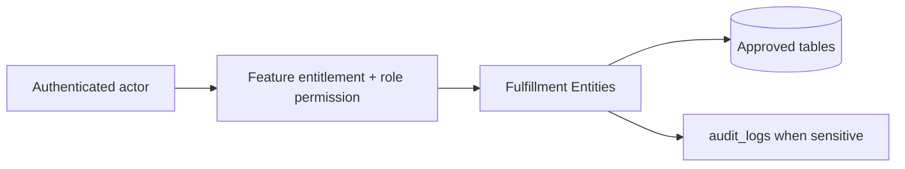

# Fulfillment Entities

## Purpose

This document is a module-wise entity reference generated from the approved database design. It uses table-level column definitions so developers can see primary keys, foreign keys, constraints, and implementation notes without depending on old Markdown content.

## Control rule

| Concern | Required behavior |
|---|---|
| Tenant access | Every tenant-level feature must be configurable by tenant role, user right, permission, and feature assignment. |
| Backend authority | API/application services must validate tenant, feature entitlement, runtime flag, role permission, and same-tenant foreign-key ownership. |
| Frontend behavior | UI may hide unavailable actions, but backend rejection is mandatory for unauthorized writes. |
| Platform exception | Platform-admin-only catalog and tenant-control features remain platform controlled. |

## Entity index

| Entity | Purpose | PK | FK count |
|---|---|---:|---:|
| `delivery_methods` | Tenant delivery/pickup methods. | 1 | 1 |
| `delivery_zones` | Tenant delivery zones. | 1 | 1 |
| `delivery_zone_rates` | Delivery fee rules per zone/method. | 1 | 3 |
| `deliveries` | Delivery or pickup fulfillment header. | 1 | 4 |
| `delivery_items` | Line-level fulfilled quantities. | 1 | 4 |
| `delivery_tracking` | Delivery tracking event timeline. | 1 | 2 |

## Table definitions

### `delivery_methods`

| Property | Detail |
|---|---|
| Database module | 8. Fulfillment, Pickup and Delivery |
| Purpose | Tenant delivery/pickup methods. |
| Ownership | Tenant-owned or tenant-linked; tenant consistency must be enforced through tenant_id or parent ownership. |
| Access control | Tenant-configurable access; operation requires enabled tenant feature plus role permission/user right. |
| Table rules | UNIQUE (tenant_id, code). Use pickup instead of vague takeaway wording. |

| Column | Type | Key / Constraint | Reference / Note |
|---|---|---|---|
| `id` | `uuid` | PK | Primary key. |
| `tenant_id` | `uuid` | NOT NULL FK | References tenants(id). |
| `code` | `varchar(80)` | NOT NULL | Method code. |
| `name` | `varchar(150)` | NOT NULL | Display name. |
| `method_type` | `varchar(30)` | NOT NULL CHECK | delivery, pickup. |
| `is_active` | `boolean` | NOT NULL | Active flag. |
| `created_at` | `timestamptz` | NOT NULL | Creation time. |
| `updated_at` | `timestamptz` | NOT NULL | Last update time. |

| Key summary | Columns |
|---|---|
| Primary key | `id` |
| Foreign keys | `tenant_id` |

### `delivery_zones`

| Property | Detail |
|---|---|
| Database module | 8. Fulfillment, Pickup and Delivery |
| Purpose | Tenant delivery zones. |
| Ownership | Tenant-owned or tenant-linked; tenant consistency must be enforced through tenant_id or parent ownership. |
| Access control | Tenant-configurable access; operation requires enabled tenant feature plus role permission/user right. |
| Table rules | UNIQUE (tenant_id, code). Zone matching rules may be implemented in service layer. |

| Column | Type | Key / Constraint | Reference / Note |
|---|---|---|---|
| `id` | `uuid` | PK | Primary key. |
| `tenant_id` | `uuid` | NOT NULL FK | References tenants(id). |
| `code` | `varchar(80)` | NOT NULL | Zone code. |
| `name` | `varchar(150)` | NOT NULL | Zone name. |
| `country_code` | `char(2)` | NULL | Country. |
| `city` | `varchar(120)` | NULL | City. |
| `postal_pattern` | `varchar(120)` | NULL | Postal pattern or rule. |
| `is_active` | `boolean` | NOT NULL | Active flag. |
| `created_at` | `timestamptz` | NOT NULL | Creation time. |
| `updated_at` | `timestamptz` | NOT NULL | Last update time. |

| Key summary | Columns |
|---|---|
| Primary key | `id` |
| Foreign keys | `tenant_id` |

### `delivery_zone_rates`

| Property | Detail |
|---|---|
| Database module | 8. Fulfillment, Pickup and Delivery |
| Purpose | Delivery fee rules per zone/method. |
| Ownership | Tenant-owned or tenant-linked; tenant consistency must be enforced through tenant_id or parent ownership. |
| Access control | Tenant-configurable access; operation requires enabled tenant feature plus role permission/user right. |
| Table rules | UNIQUE (tenant_id, delivery_zone_id, delivery_method_id, currency). |

| Column | Type | Key / Constraint | Reference / Note |
|---|---|---|---|
| `id` | `uuid` | PK | Primary key. |
| `tenant_id` | `uuid` | NOT NULL FK | References tenants(id). |
| `delivery_zone_id` | `uuid` | NOT NULL FK | References delivery_zones(id). |
| `delivery_method_id` | `uuid` | NOT NULL FK | References delivery_methods(id). |
| `currency` | `char(3)` | NOT NULL | Currency. |
| `base_fee` | `numeric(12,2)` | NOT NULL CHECK | >= 0. |
| `free_above_amount` | `numeric(12,2)` | NULL | Free delivery threshold. |
| `is_active` | `boolean` | NOT NULL | Active flag. |
| `created_at` | `timestamptz` | NOT NULL | Creation time. |
| `updated_at` | `timestamptz` | NOT NULL | Last update time. |

| Key summary | Columns |
|---|---|
| Primary key | `id` |
| Foreign keys | `tenant_id`, `delivery_zone_id`, `delivery_method_id` |

### `deliveries`

| Property | Detail |
|---|---|
| Database module | 8. Fulfillment, Pickup and Delivery |
| Purpose | Delivery or pickup fulfillment header. |
| Ownership | Tenant-owned or tenant-linked; tenant consistency must be enforced through tenant_id or parent ownership. |
| Access control | Tenant-configurable access; operation requires enabled tenant feature plus role permission/user right. |
| Table rules | UNIQUE (tenant_id, delivery_number). Pickup uses collected, not delivered. |

| Column | Type | Key / Constraint | Reference / Note |
|---|---|---|---|
| `id` | `uuid` | PK | Primary key. |
| `tenant_id` | `uuid` | NOT NULL FK | References tenants(id). |
| `order_id` | `uuid` | NOT NULL FK | References orders(id). |
| `delivery_number` | `varchar(80)` | NOT NULL | Business delivery/pickup number. |
| `delivery_method_id` | `uuid` | NOT NULL FK | References delivery_methods(id). |
| `outlet_id` | `uuid` | NULL FK | Pickup/fulfillment outlet. |
| `carrier_code` | `varchar(80)` | NULL | Courier code. |
| `tracking_no` | `varchar(120)` | NULL | Tracking number. |
| `status` | `varchar(40)` | NOT NULL CHECK | pending, packed, ready_for_pickup, shipped, out_for_delivery, delivered, collected, failed, returned, cancelled. |
| `shipped_at` | `timestamptz` | NULL | Shipping time. |
| `delivered_at` | `timestamptz` | NULL | Delivery time. |
| `collected_at` | `timestamptz` | NULL | Pickup collection time. |
| `created_at` | `timestamptz` | NOT NULL | Creation time. |

| Key summary | Columns |
|---|---|
| Primary key | `id` |
| Foreign keys | `tenant_id`, `order_id`, `delivery_method_id`, `outlet_id` |

### `delivery_items`

| Property | Detail |
|---|---|
| Database module | 8. Fulfillment, Pickup and Delivery |
| Purpose | Line-level fulfilled quantities. |
| Ownership | Tenant-owned or tenant-linked; tenant consistency must be enforced through tenant_id or parent ownership. |
| Access control | Tenant-configurable access; operation requires enabled tenant feature plus role permission/user right. |
| Table rules | UNIQUE (tenant_id, delivery_id, order_item_id). |

| Column | Type | Key / Constraint | Reference / Note |
|---|---|---|---|
| `id` | `uuid` | PK | Primary key. |
| `tenant_id` | `uuid` | NOT NULL FK | References tenants(id). |
| `delivery_id` | `uuid` | NOT NULL FK | References deliveries(id). |
| `order_item_id` | `uuid` | NOT NULL FK | References order_items(id). |
| `variant_id` | `uuid` | NOT NULL FK | References product_variants(id). |
| `qty` | `numeric(14,3)` | NOT NULL CHECK | > 0. |

| Key summary | Columns |
|---|---|
| Primary key | `id` |
| Foreign keys | `tenant_id`, `delivery_id`, `order_item_id`, `variant_id` |

### `delivery_tracking`

| Property | Detail |
|---|---|
| Database module | 8. Fulfillment, Pickup and Delivery |
| Purpose | Delivery tracking event timeline. |
| Ownership | Tenant-owned or tenant-linked; tenant consistency must be enforced through tenant_id or parent ownership. |
| Access control | Tenant-configurable access; operation requires enabled tenant feature plus role permission/user right. |
| Table rules | Technical courier integration is optional; manual tracking events are supported. |

| Column | Type | Key / Constraint | Reference / Note |
|---|---|---|---|
| `id` | `uuid` | PK | Primary key. |
| `tenant_id` | `uuid` | NOT NULL FK | References tenants(id). |
| `delivery_id` | `uuid` | NOT NULL FK | References deliveries(id). |
| `status` | `varchar(60)` | NOT NULL | Tracking status. |
| `location_text` | `varchar(250)` | NULL | Location text. |
| `event_time` | `timestamptz` | NOT NULL | Event time. |
| `payload` | `jsonb` | NULL | Provider payload. |

| Key summary | Columns |
|---|---|
| Primary key | `id` |
| Foreign keys | `tenant_id`, `delivery_id` |

## Module data flow

## Implementation notes

- Service validation must mirror database uniqueness and status constraints before persistence.
- Repository queries must include tenant filters for tenant-owned records.
- Foreign-key values submitted by clients must be checked for same-tenant ownership.
- Permission codes should be module/action specific, for example `module.entity.action`.
- Mutation endpoints should be idempotent where duplicate client requests or offline sync can occur.

## Related documents

- [[../data-dictionary-index]]
- [[../database-overview]]
- [[../schema-principles]]
- [[../tenant-consistency-rules]]