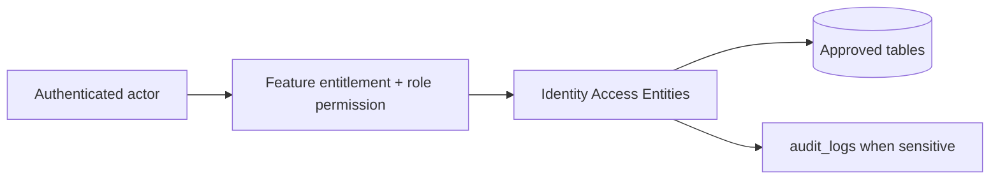

# Identity Access Entities

## Purpose

This document is a module-wise entity reference generated from the approved database design. It uses table-level column definitions so developers can see primary keys, foreign keys, constraints, and implementation notes without depending on old Markdown content.

## Control rule

| Concern | Required behavior |
|---|---|
| Tenant access | Every tenant-level feature must be configurable by tenant role, user right, permission, and feature assignment. |
| Backend authority | API/application services must validate tenant, feature entitlement, runtime flag, role permission, and same-tenant foreign-key ownership. |
| Frontend behavior | UI may hide unavailable actions, but backend rejection is mandatory for unauthorized writes. |
| Platform exception | Platform-admin-only catalog and tenant-control features remain platform controlled. |

## Entity index

| Entity | Purpose | PK | FK count |
|---|---|---:|---:|
| `users` | Tenant-bound staff and tenant administrators. | 1 | 1 |
| `roles` | Tenant-owned role definitions. | 1 | 1 |
| `permissions` | Platform-owned permission catalog. | 1 | 0 |
| `role_permissions` | Maps tenant roles to platform permissions. | 1 | 3 |
| `tenant_user_roles` | Tenant-scope role assignment. | 1 | 4 |
| `outlet_user_roles` | Outlet-scope role assignment. | 1 | 4 |
| `platform_features` | Platform-level feature catalog. | 1 | 0 |
| `tenant_feature_entitlements` | Platform admin enables platform features for a tenant. | 1 | 3 |
| `role_feature_assignments` | Assigns tenant-enabled features to roles. | 1 | 4 |

## Table definitions

### `users`

| Property | Detail |
|---|---|
| Database module | 2. Identity, RBAC and Feature Access |
| Purpose | Tenant-bound staff and tenant administrators. |
| Ownership | Tenant-owned or tenant-linked; tenant consistency must be enforced through tenant_id or parent ownership. |
| Access control | Tenant-configurable access; operation requires enabled tenant feature plus role permission/user right. |
| Table rules | UNIQUE (tenant_id, normalized_email) WHERE normalized_email IS NOT NULL. UNIQUE (tenant_id, normalized_phone) WHERE normalized_phone IS NOT NULL. |

| Column | Type | Key / Constraint | Reference / Note |
|---|---|---|---|
| `id` | `uuid` | PK | Primary key. |
| `tenant_id` | `uuid` | NOT NULL FK | References tenants(id). |
| `email` | `citext` | NULL | Original email. |
| `normalized_email` | `citext` | NULL | Lowercase normalized email. |
| `phone` | `varchar(40)` | NULL | Original phone. |
| `normalized_phone` | `varchar(40)` | NULL | Normalized phone. |
| `password_hash` | `varchar(255)` | NULL | Required only for password login. |
| `full_name` | `varchar(200)` | NOT NULL | User display name. |
| `status` | `varchar(30)` | NOT NULL CHECK | active, inactive, suspended. |
| `last_login_at` | `timestamptz` | NULL | Last successful login. |
| `created_at` | `timestamptz` | NOT NULL | Creation time. |
| `updated_at` | `timestamptz` | NOT NULL | Last update time. |

| Key summary | Columns |
|---|---|
| Primary key | `id` |
| Foreign keys | `tenant_id` |

### `roles`

| Property | Detail |
|---|---|
| Database module | 2. Identity, RBAC and Feature Access |
| Purpose | Tenant-owned role definitions. |
| Ownership | Tenant-owned or tenant-linked; tenant consistency must be enforced through tenant_id or parent ownership. |
| Access control | Tenant-configurable access; operation requires enabled tenant feature plus role permission/user right. |
| Table rules | UNIQUE (tenant_id, code). |

| Column | Type | Key / Constraint | Reference / Note |
|---|---|---|---|
| `id` | `uuid` | PK | Primary key. |
| `tenant_id` | `uuid` | NOT NULL FK | References tenants(id). |
| `code` | `varchar(80)` | NOT NULL | Role code. |
| `name` | `varchar(150)` | NOT NULL | Role label. |
| `scope` | `varchar(20)` | NOT NULL CHECK | tenant or outlet. |
| `is_system` | `boolean` | NOT NULL | System-seeded role flag. |
| `created_at` | `timestamptz` | NOT NULL | Creation time. |
| `updated_at` | `timestamptz` | NOT NULL | Last update time. |

| Key summary | Columns |
|---|---|
| Primary key | `id` |
| Foreign keys | `tenant_id` |

### `permissions`

| Property | Detail |
|---|---|
| Database module | 2. Identity, RBAC and Feature Access |
| Purpose | Platform-owned permission catalog. |
| Ownership | Platform-owned catalog/reference; tenant_id is intentionally absent where shown. |
| Access control | Platform-admin controlled where platform-owned; tenant admins cannot directly mutate platform catalog records. |
| Table rules | No tenant_id because permissions are platform catalog values. |

| Column | Type | Key / Constraint | Reference / Note |
|---|---|---|---|
| `id` | `uuid` | PK | Primary key. |
| `code` | `varchar(120)` | NOT NULL UNIQUE | Permission code such as pos.sale.create. |
| `name` | `varchar(150)` | NOT NULL | Permission label. |
| `module` | `varchar(80)` | NOT NULL | Owning module. |
| `description` | `text` | NULL | Human-readable explanation. |
| `is_system` | `boolean` | NOT NULL | System-managed flag. |
| `created_at` | `timestamptz` | NOT NULL | Creation time. |

| Key summary | Columns |
|---|---|
| Primary key | `id` |
| Foreign keys | None |

### `role_permissions`

| Property | Detail |
|---|---|
| Database module | 2. Identity, RBAC and Feature Access |
| Purpose | Maps tenant roles to platform permissions. |
| Ownership | Tenant-owned or tenant-linked; tenant consistency must be enforced through tenant_id or parent ownership. |
| Access control | Tenant-configurable access; operation requires enabled tenant feature plus role permission/user right. |
| Table rules | UNIQUE (tenant_id, role_id, permission_id). role_id must belong to tenant_id. |

| Column | Type | Key / Constraint | Reference / Note |
|---|---|---|---|
| `id` | `uuid` | PK | Primary key. |
| `tenant_id` | `uuid` | NOT NULL FK | References tenants(id). |
| `role_id` | `uuid` | NOT NULL FK | References roles(id). |
| `permission_id` | `uuid` | NOT NULL FK | References permissions(id). |
| `created_at` | `timestamptz` | NOT NULL | Creation time. |

| Key summary | Columns |
|---|---|
| Primary key | `id` |
| Foreign keys | `tenant_id`, `role_id`, `permission_id` |

### `tenant_user_roles`

| Property | Detail |
|---|---|
| Database module | 2. Identity, RBAC and Feature Access |
| Purpose | Tenant-scope role assignment. |
| Ownership | Tenant-owned or tenant-linked; tenant consistency must be enforced through tenant_id or parent ownership. |
| Access control | Tenant-configurable access; operation requires enabled tenant feature plus role permission/user right. |
| Table rules | UNIQUE (tenant_id, user_id, role_id). role.scope must be tenant. |

| Column | Type | Key / Constraint | Reference / Note |
|---|---|---|---|
| `id` | `uuid` | PK | Primary key. |
| `tenant_id` | `uuid` | NOT NULL FK | References tenants(id). |
| `user_id` | `uuid` | NOT NULL FK | References users(id). |
| `role_id` | `uuid` | NOT NULL FK | References roles(id). |
| `assigned_by` | `uuid` | NULL FK | References users(id). |
| `assigned_at` | `timestamptz` | NOT NULL | Assignment time. |

| Key summary | Columns |
|---|---|
| Primary key | `id` |
| Foreign keys | `tenant_id`, `user_id`, `role_id`, `assigned_by` |

### `outlet_user_roles`

| Property | Detail |
|---|---|
| Database module | 2. Identity, RBAC and Feature Access |
| Purpose | Outlet-scope role assignment. |
| Ownership | Tenant-owned or tenant-linked; tenant consistency must be enforced through tenant_id or parent ownership. |
| Access control | Tenant-configurable access; operation requires enabled tenant feature plus role permission/user right. |
| Table rules | UNIQUE (tenant_id, outlet_id, user_id, role_id) WHERE relieved_at IS NULL. role.scope must be outlet. |

| Column | Type | Key / Constraint | Reference / Note |
|---|---|---|---|
| `id` | `uuid` | PK | Primary key. |
| `tenant_id` | `uuid` | NOT NULL FK | References tenants(id). |
| `outlet_id` | `uuid` | NOT NULL FK | References outlets(id). |
| `user_id` | `uuid` | NOT NULL FK | References users(id). |
| `role_id` | `uuid` | NOT NULL FK | References roles(id). |
| `employee_code` | `varchar(80)` | NULL | Optional outlet employee code. |
| `assigned_at` | `timestamptz` | NOT NULL | Assignment start. |
| `relieved_at` | `timestamptz` | NULL | Assignment end. |
| `is_primary_outlet` | `boolean` | NOT NULL | Primary outlet flag. |

| Key summary | Columns |
|---|---|
| Primary key | `id` |
| Foreign keys | `tenant_id`, `outlet_id`, `user_id`, `role_id` |

### `platform_features`

| Property | Detail |
|---|---|
| Database module | 2. Identity, RBAC and Feature Access |
| Purpose | Platform-level feature catalog. |
| Ownership | Platform-owned catalog/reference; tenant_id is intentionally absent where shown. |
| Access control | Platform-admin controlled where platform-owned; tenant admins cannot directly mutate platform catalog records. |
| Table rules | Platform-owned. Do not duplicate feature names as free-text runtime flags. |

| Column | Type | Key / Constraint | Reference / Note |
|---|---|---|---|
| `id` | `uuid` | PK | Primary key. |
| `feature_key` | `varchar(120)` | NOT NULL UNIQUE | Feature key such as pos.billing. |
| `name` | `varchar(150)` | NOT NULL | Feature name. |
| `module` | `varchar(80)` | NOT NULL | Module name. |
| `description` | `text` | NULL | Feature explanation. |
| `is_core` | `boolean` | NOT NULL | Core feature flag. |
| `status` | `varchar(30)` | NOT NULL CHECK | active, inactive. |
| `created_at` | `timestamptz` | NOT NULL | Creation time. |

| Key summary | Columns |
|---|---|
| Primary key | `id` |
| Foreign keys | None |

### `tenant_feature_entitlements`

| Property | Detail |
|---|---|
| Database module | 2. Identity, RBAC and Feature Access |
| Purpose | Platform admin enables platform features for a tenant. |
| Ownership | Tenant-owned or tenant-linked; tenant consistency must be enforced through tenant_id or parent ownership. |
| Access control | Tenant-configurable access; operation requires enabled tenant feature plus role permission/user right. |
| Table rules | UNIQUE (tenant_id, feature_id). |

| Column | Type | Key / Constraint | Reference / Note |
|---|---|---|---|
| `id` | `uuid` | PK | Primary key. |
| `tenant_id` | `uuid` | NOT NULL FK | References tenants(id). |
| `feature_id` | `uuid` | NOT NULL FK | References platform_features(id). |
| `enabled` | `boolean` | NOT NULL | Entitlement state. |
| `enabled_by_platform_user_id` | `uuid` | NULL FK | References platform_users(id). |
| `enabled_at` | `timestamptz` | NOT NULL | Change time. |
| `config` | `jsonb` | NULL | Non-secret entitlement config. |

| Key summary | Columns |
|---|---|
| Primary key | `id` |
| Foreign keys | `tenant_id`, `feature_id`, `enabled_by_platform_user_id` |

### `role_feature_assignments`

| Property | Detail |
|---|---|
| Database module | 2. Identity, RBAC and Feature Access |
| Purpose | Assigns tenant-enabled features to roles. |
| Ownership | Tenant-owned or tenant-linked; tenant consistency must be enforced through tenant_id or parent ownership. |
| Access control | Tenant-configurable access; operation requires enabled tenant feature plus role permission/user right. |
| Table rules | UNIQUE (tenant_id, role_id, feature_id). Feature must be enabled in tenant_feature_entitlements. |

| Column | Type | Key / Constraint | Reference / Note |
|---|---|---|---|
| `id` | `uuid` | PK | Primary key. |
| `tenant_id` | `uuid` | NOT NULL FK | References tenants(id). |
| `role_id` | `uuid` | NOT NULL FK | References roles(id). |
| `feature_id` | `uuid` | NOT NULL FK | References platform_features(id). |
| `allowed` | `boolean` | NOT NULL | Role access flag. |
| `assigned_by` | `uuid` | NULL FK | References users(id). |
| `assigned_at` | `timestamptz` | NOT NULL | Assignment time. |

| Key summary | Columns |
|---|---|
| Primary key | `id` |
| Foreign keys | `tenant_id`, `role_id`, `feature_id`, `assigned_by` |

## Module data flow

## Implementation notes

- Service validation must mirror database uniqueness and status constraints before persistence.
- Repository queries must include tenant filters for tenant-owned records.
- Foreign-key values submitted by clients must be checked for same-tenant ownership.
- Permission codes should be module/action specific, for example `module.entity.action`.
- Mutation endpoints should be idempotent where duplicate client requests or offline sync can occur.

## Related documents

- [[../data-dictionary-index]]
- [[../database-overview]]
- [[../schema-principles]]
- [[../tenant-consistency-rules]]