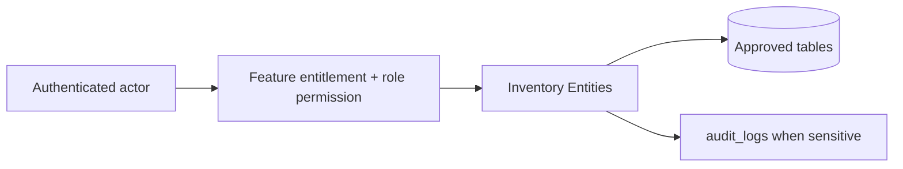

# Inventory Entities

## Purpose

This document is a module-wise entity reference generated from the approved database design. It uses table-level column definitions so developers can see primary keys, foreign keys, constraints, and implementation notes without depending on old Markdown content.

## Control rule

| Concern | Required behavior |
|---|---|
| Tenant access | Every tenant-level feature must be configurable by tenant role, user right, permission, and feature assignment. |
| Backend authority | API/application services must validate tenant, feature entitlement, runtime flag, role permission, and same-tenant foreign-key ownership. |
| Frontend behavior | UI may hide unavailable actions, but backend rejection is mandatory for unauthorized writes. |
| Platform exception | Platform-admin-only catalog and tenant-control features remain platform controlled. |

## Entity index

| Entity | Purpose | PK | FK count |
|---|---|---:|---:|
| `inventory_balances` | Current stock projection by outlet and variant. | 1 | 3 |
| `inventory_channel_allocations` | Optional allocation of outlet stock between POS and E-Commerce channels. | 1 | 5 |
| `stock_movement_types` | Reference movement types. Quantity is always positive; type determines direction. | 1 | 0 |
| `stock_movements` | Immutable inventory ledger. | 1 | 16 |
| `stock_reservations` | E-Commerce reservation rows before fulfillment. | 1 | 5 |
| `purchase_receipts` | Supplier stock receiving document. | 1 | 4 |
| `purchase_receipt_lines` | Received stock lines. | 1 | 3 |
| `stock_adjustments` | Manual inventory adjustment document. | 1 | 4 |
| `stock_adjustment_lines` | Manual adjustment line items. | 1 | 3 |
| `stock_transfers` | Stock transfer header between outlets. | 1 | 5 |
| `stock_transfer_lines` | Lines under a stock transfer. | 1 | 3 |
| `stocktakes` | Stock count session header. | 1 | 3 |
| `stocktake_lines` | Count results by variant. | 1 | 3 |

## Table definitions

### `inventory_balances`

| Property | Detail |
|---|---|
| Database module | 5. Inventory and Stock Control |
| Purpose | Current stock projection by outlet and variant. |
| Ownership | Tenant-owned or tenant-linked; tenant consistency must be enforced through tenant_id or parent ownership. |
| Access control | Tenant-configurable access; operation requires enabled tenant feature plus role permission/user right. |
| Table rules | UNIQUE (tenant_id, outlet_id, variant_id). available_qty should be generated or strictly service-maintained. |

| Column | Type | Key / Constraint | Reference / Note |
|---|---|---|---|
| `id` | `uuid` | PK | Primary key. |
| `tenant_id` | `uuid` | NOT NULL FK | References tenants(id). |
| `outlet_id` | `uuid` | NOT NULL FK | References outlets(id). |
| `variant_id` | `uuid` | NOT NULL FK | References product_variants(id). |
| `on_hand_qty` | `numeric(14,3)` | NOT NULL DEFAULT 0 | Physical stock. |
| `reserved_qty` | `numeric(14,3)` | NOT NULL DEFAULT 0 | Reserved stock. |
| `available_qty` | `numeric(14,3)` | GENERATED | on_hand_qty - reserved_qty. |
| `reorder_level` | `numeric(14,3)` | NULL | Reorder threshold. |
| `updated_at` | `timestamptz` | NOT NULL | Last update time. |

| Key summary | Columns |
|---|---|
| Primary key | `id` |
| Foreign keys | `tenant_id`, `outlet_id`, `variant_id` |

### `inventory_channel_allocations`

| Property | Detail |
|---|---|
| Database module | 5. Inventory and Stock Control |
| Purpose | Optional allocation of outlet stock between POS and E-Commerce channels. |
| Ownership | Tenant-owned or tenant-linked; tenant consistency must be enforced through tenant_id or parent ownership. |
| Access control | Tenant-configurable access; operation requires enabled tenant feature plus role permission/user right. |
| Table rules | UNIQUE (tenant_id, outlet_id, variant_id, channel). Sum of active allocated_qty must not exceed on_hand_qty; enforce by service/trigger. |

| Column | Type | Key / Constraint | Reference / Note |
|---|---|---|---|
| `id` | `uuid` | PK | Primary key. |
| `tenant_id` | `uuid` | NOT NULL FK | References tenants(id). |
| `outlet_id` | `uuid` | NOT NULL FK | References outlets(id). |
| `variant_id` | `uuid` | NOT NULL FK | References product_variants(id). |
| `channel` | `varchar(20)` | NOT NULL CHECK | pos, ecommerce. |
| `allocated_qty` | `numeric(14,3)` | NOT NULL CHECK | >= 0. |
| `is_active` | `boolean` | NOT NULL | Active flag. |
| `created_by` | `uuid` | NULL FK | References users(id). |
| `updated_by` | `uuid` | NULL FK | References users(id). |
| `created_at` | `timestamptz` | NOT NULL | Creation time. |
| `updated_at` | `timestamptz` | NOT NULL | Last update time. |

| Key summary | Columns |
|---|---|
| Primary key | `id` |
| Foreign keys | `tenant_id`, `outlet_id`, `variant_id`, `created_by`, `updated_by` |

### `stock_movement_types`

| Property | Detail |
|---|---|
| Database module | 5. Inventory and Stock Control |
| Purpose | Reference movement types. Quantity is always positive; type determines direction. |
| Ownership | Platform-owned catalog/reference; tenant_id is intentionally absent where shown. |
| Access control | Tenant-configurable access; operation requires enabled tenant feature plus role permission/user right. |
| Table rules | Do not store negative quantities in stock_movements. |

| Column | Type | Key / Constraint | Reference / Note |
|---|---|---|---|
| `id` | `smallint` | PK | Primary key. |
| `code` | `varchar(60)` | NOT NULL UNIQUE | opening_balance, purchase_receipt, sale_out, return_in, exchange_out, exchange_in, reservation_hold, reservation_release, adjustment_in, adjustment_out, damage_out, transfer_out, transfer_in, stocktake_gain, stocktake_loss. |
| `direction` | `varchar(20)` | NOT NULL CHECK | in, out, reserve, release, neutral. |
| `name` | `varchar(150)` | NOT NULL | Display label. |

| Key summary | Columns |
|---|---|
| Primary key | `id` |
| Foreign keys | None |

### `stock_movements`

| Property | Detail |
|---|---|
| Database module | 5. Inventory and Stock Control |
| Purpose | Immutable inventory ledger. |
| Ownership | Tenant-owned or tenant-linked; tenant consistency must be enforced through tenant_id or parent ownership. |
| Access control | Tenant-configurable access; operation requires enabled tenant feature plus role permission/user right. |
| Table rules | UNIQUE (tenant_id, source_device_id, client_movement_id) WHERE client_movement_id IS NOT NULL. Enforce movement_type to required reference rule. Required stock movement reference rules: |

| Column | Type | Key / Constraint | Reference / Note |
|---|---|---|---|
| `id` | `uuid` | PK | Primary key. |
| `tenant_id` | `uuid` | NOT NULL FK | References tenants(id). |
| `outlet_id` | `uuid` | NOT NULL FK | References outlets(id). |
| `variant_id` | `uuid` | NOT NULL FK | References product_variants(id). |
| `movement_type_id` | `smallint` | NOT NULL FK | References stock_movement_types(id). |
| `quantity` | `numeric(14,3)` | NOT NULL CHECK | > 0. |
| `sale_id` | `uuid` | NULL FK | References sales(id). |
| `order_id` | `uuid` | NULL FK | References orders(id). |
| `return_id` | `uuid` | NULL FK | References returns(id). |
| `exchange_id` | `uuid` | NULL FK | References exchanges(id). |
| `purchase_receipt_id` | `uuid` | NULL FK | References purchase_receipts(id). |
| `stock_transfer_id` | `uuid` | NULL FK | References stock_transfers(id). |
| `stock_adjustment_id` | `uuid` | NULL FK | References stock_adjustments(id). |
| `stocktake_id` | `uuid` | NULL FK | References stocktakes(id). |
| `reservation_id` | `uuid` | NULL FK | References stock_reservations(id). |
| `source_channel` | `varchar(20)` | NOT NULL CHECK | pos, ecommerce, backoffice. |
| `source_device_id` | `uuid` | NULL FK | References pos_devices(id). |
| `client_movement_id` | `varchar(120)` | NULL | Client movement id for offline dedupe. |
| `sync_batch_id` | `uuid` | NULL FK | References offline_sync_batches(id). |
| `offline_occurred_at` | `timestamptz` | NULL | Offline client time. |
| `occurred_at` | `timestamptz` | NOT NULL | Server ledger time. |
| `created_by` | `uuid` | NULL FK | References users(id). |
| `metadata` | `jsonb` | NULL | Non-critical metadata. |

| Key summary | Columns |
|---|---|
| Primary key | `id` |
| Foreign keys | `tenant_id`, `outlet_id`, `variant_id`, `movement_type_id`, `sale_id`, `order_id`, `return_id`, `exchange_id`, `purchase_receipt_id`, `stock_transfer_id`, `stock_adjustment_id`, `stocktake_id`, `reservation_id`, `source_device_id`, `sync_batch_id`, `created_by` |

### `stock_reservations`

| Property | Detail |
|---|---|
| Database module | 5. Inventory and Stock Control |
| Purpose | E-Commerce reservation rows before fulfillment. |
| Ownership | Tenant-owned or tenant-linked; tenant consistency must be enforced through tenant_id or parent ownership. |
| Access control | Tenant-configurable access; operation requires enabled tenant feature plus role permission/user right. |
| Table rules | Active reservations increase reserved_qty and reduce available_qty. |

| Column | Type | Key / Constraint | Reference / Note |
|---|---|---|---|
| `id` | `uuid` | PK | Primary key. |
| `tenant_id` | `uuid` | NOT NULL FK | References tenants(id). |
| `outlet_id` | `uuid` | NOT NULL FK | References outlets(id). |
| `variant_id` | `uuid` | NOT NULL FK | References product_variants(id). |
| `order_id` | `uuid` | NOT NULL FK | References orders(id). |
| `order_item_id` | `uuid` | NOT NULL FK | References order_items(id). |
| `reserved_qty` | `numeric(14,3)` | NOT NULL CHECK | > 0. |
| `status` | `varchar(30)` | NOT NULL CHECK | active, released, committed, expired. |
| `expires_at` | `timestamptz` | NULL | Expiry time. |
| `created_at` | `timestamptz` | NOT NULL | Creation time. |
| `updated_at` | `timestamptz` | NOT NULL | Last update time. |

| Key summary | Columns |
|---|---|
| Primary key | `id` |
| Foreign keys | `tenant_id`, `outlet_id`, `variant_id`, `order_id`, `order_item_id` |

### `purchase_receipts`

| Property | Detail |
|---|---|
| Database module | 5. Inventory and Stock Control |
| Purpose | Supplier stock receiving document. |
| Ownership | Tenant-owned or tenant-linked; tenant consistency must be enforced through tenant_id or parent ownership. |
| Access control | Tenant-configurable access; operation requires enabled tenant feature plus role permission/user right. |
| Table rules | UNIQUE (tenant_id, receipt_number). Posted receipt creates purchase_receipt stock movements. |

| Column | Type | Key / Constraint | Reference / Note |
|---|---|---|---|
| `id` | `uuid` | PK | Primary key. |
| `tenant_id` | `uuid` | NOT NULL FK | References tenants(id). |
| `supplier_id` | `uuid` | NULL FK | References suppliers(id). |
| `outlet_id` | `uuid` | NOT NULL FK | Receiving outlet. |
| `receipt_number` | `varchar(80)` | NOT NULL | Business receiving number. |
| `supplier_invoice_no` | `varchar(120)` | NULL | Supplier invoice/reference. |
| `status` | `varchar(30)` | NOT NULL CHECK | draft, posted, cancelled. |
| `received_by` | `uuid` | NULL FK | References users(id). |
| `received_at` | `timestamptz` | NULL | Receiving time. |
| `created_at` | `timestamptz` | NOT NULL | Creation time. |
| `updated_at` | `timestamptz` | NOT NULL | Last update time. |

| Key summary | Columns |
|---|---|
| Primary key | `id` |
| Foreign keys | `tenant_id`, `supplier_id`, `outlet_id`, `received_by` |

### `purchase_receipt_lines`

| Property | Detail |
|---|---|
| Database module | 5. Inventory and Stock Control |
| Purpose | Received stock lines. |
| Ownership | Tenant-owned or tenant-linked; tenant consistency must be enforced through tenant_id or parent ownership. |
| Access control | Tenant-configurable access; operation requires enabled tenant feature plus role permission/user right. |
| Table rules | UNIQUE (tenant_id, purchase_receipt_id, line_no). |

| Column | Type | Key / Constraint | Reference / Note |
|---|---|---|---|
| `id` | `uuid` | PK | Primary key. |
| `tenant_id` | `uuid` | NOT NULL FK | References tenants(id). |
| `purchase_receipt_id` | `uuid` | NOT NULL FK | References purchase_receipts(id). |
| `variant_id` | `uuid` | NOT NULL FK | References product_variants(id). |
| `line_no` | `int` | NOT NULL | Line number. |
| `qty` | `numeric(14,3)` | NOT NULL CHECK | > 0. |
| `unit_cost` | `numeric(12,2)` | NULL CHECK | >= 0 when present. |
| `line_total` | `numeric(12,2)` | NULL | qty * unit_cost if cost tracked. |

| Key summary | Columns |
|---|---|
| Primary key | `id` |
| Foreign keys | `tenant_id`, `purchase_receipt_id`, `variant_id` |

### `stock_adjustments`

| Property | Detail |
|---|---|
| Database module | 5. Inventory and Stock Control |
| Purpose | Manual inventory adjustment document. |
| Ownership | Tenant-owned or tenant-linked; tenant consistency must be enforced through tenant_id or parent ownership. |
| Access control | Tenant-configurable access; operation requires enabled tenant feature plus role permission/user right. |
| Table rules | UNIQUE (tenant_id, adjustment_number). Posted adjustment creates adjustment_in/out stock movements. |

| Column | Type | Key / Constraint | Reference / Note |
|---|---|---|---|
| `id` | `uuid` | PK | Primary key. |
| `tenant_id` | `uuid` | NOT NULL FK | References tenants(id). |
| `outlet_id` | `uuid` | NOT NULL FK | References outlets(id). |
| `adjustment_number` | `varchar(80)` | NOT NULL | Business adjustment number. |
| `status` | `varchar(30)` | NOT NULL CHECK | draft, approved, posted, rejected, cancelled. |
| `reason` | `text` | NOT NULL | Business reason. |
| `created_by` | `uuid` | NOT NULL FK | References users(id). |
| `approved_by` | `uuid` | NULL FK | References users(id). |
| `posted_at` | `timestamptz` | NULL | Posted time. |
| `created_at` | `timestamptz` | NOT NULL | Creation time. |
| `updated_at` | `timestamptz` | NOT NULL | Last update time. |

| Key summary | Columns |
|---|---|
| Primary key | `id` |
| Foreign keys | `tenant_id`, `outlet_id`, `created_by`, `approved_by` |

### `stock_adjustment_lines`

| Property | Detail |
|---|---|
| Database module | 5. Inventory and Stock Control |
| Purpose | Manual adjustment line items. |
| Ownership | Tenant-owned or tenant-linked; tenant consistency must be enforced through tenant_id or parent ownership. |
| Access control | Tenant-configurable access; operation requires enabled tenant feature plus role permission/user right. |
| Table rules | UNIQUE (tenant_id, stock_adjustment_id, line_no). |

| Column | Type | Key / Constraint | Reference / Note |
|---|---|---|---|
| `id` | `uuid` | PK | Primary key. |
| `tenant_id` | `uuid` | NOT NULL FK | References tenants(id). |
| `stock_adjustment_id` | `uuid` | NOT NULL FK | References stock_adjustments(id). |
| `variant_id` | `uuid` | NOT NULL FK | References product_variants(id). |
| `line_no` | `int` | NOT NULL | Line number. |
| `adjustment_type` | `varchar(20)` | NOT NULL CHECK | increase, decrease. |
| `qty` | `numeric(14,3)` | NOT NULL CHECK | > 0. |
| `reason` | `text` | NULL | Line-level reason. |

| Key summary | Columns |
|---|---|
| Primary key | `id` |
| Foreign keys | `tenant_id`, `stock_adjustment_id`, `variant_id` |

### `stock_transfers`

| Property | Detail |
|---|---|
| Database module | 5. Inventory and Stock Control |
| Purpose | Stock transfer header between outlets. |
| Ownership | Tenant-owned or tenant-linked; tenant consistency must be enforced through tenant_id or parent ownership. |
| Access control | Tenant-configurable access; operation requires enabled tenant feature plus role permission/user right. |
| Table rules | UNIQUE (tenant_id, transfer_number). from_outlet_id and to_outlet_id must differ. |

| Column | Type | Key / Constraint | Reference / Note |
|---|---|---|---|
| `id` | `uuid` | PK | Primary key. |
| `tenant_id` | `uuid` | NOT NULL FK | References tenants(id). |
| `transfer_number` | `varchar(80)` | NOT NULL | Business transfer number. |
| `from_outlet_id` | `uuid` | NOT NULL FK | Source outlet. |
| `to_outlet_id` | `uuid` | NOT NULL FK | Destination outlet. |
| `status` | `varchar(30)` | NOT NULL CHECK | draft, approved, in_transit, received, cancelled. |
| `requested_by` | `uuid` | NOT NULL FK | References users(id). |
| `approved_by` | `uuid` | NULL FK | References users(id). |
| `created_at` | `timestamptz` | NOT NULL | Creation time. |
| `updated_at` | `timestamptz` | NOT NULL | Last update time. |

| Key summary | Columns |
|---|---|
| Primary key | `id` |
| Foreign keys | `tenant_id`, `from_outlet_id`, `to_outlet_id`, `requested_by`, `approved_by` |

### `stock_transfer_lines`

| Property | Detail |
|---|---|
| Database module | 5. Inventory and Stock Control |
| Purpose | Lines under a stock transfer. |
| Ownership | Tenant-owned or tenant-linked; tenant consistency must be enforced through tenant_id or parent ownership. |
| Access control | Tenant-configurable access; operation requires enabled tenant feature plus role permission/user right. |
| Table rules | UNIQUE (tenant_id, transfer_id, line_no). |

| Column | Type | Key / Constraint | Reference / Note |
|---|---|---|---|
| `id` | `uuid` | PK | Primary key. |
| `tenant_id` | `uuid` | NOT NULL FK | References tenants(id). |
| `transfer_id` | `uuid` | NOT NULL FK | References stock_transfers(id). |
| `variant_id` | `uuid` | NOT NULL FK | References product_variants(id). |
| `line_no` | `int` | NOT NULL | Line number. |
| `requested_qty` | `numeric(14,3)` | NOT NULL CHECK | >= 0. |
| `shipped_qty` | `numeric(14,3)` | NOT NULL CHECK | >= 0. |
| `received_qty` | `numeric(14,3)` | NOT NULL CHECK | >= 0. |

| Key summary | Columns |
|---|---|
| Primary key | `id` |
| Foreign keys | `tenant_id`, `transfer_id`, `variant_id` |

### `stocktakes`

| Property | Detail |
|---|---|
| Database module | 5. Inventory and Stock Control |
| Purpose | Stock count session header. |
| Ownership | Tenant-owned or tenant-linked; tenant consistency must be enforced through tenant_id or parent ownership. |
| Access control | Tenant-configurable access; operation requires enabled tenant feature plus role permission/user right. |
| Table rules | UNIQUE (tenant_id, stocktake_number). |

| Column | Type | Key / Constraint | Reference / Note |
|---|---|---|---|
| `id` | `uuid` | PK | Primary key. |
| `tenant_id` | `uuid` | NOT NULL FK | References tenants(id). |
| `outlet_id` | `uuid` | NOT NULL FK | References outlets(id). |
| `stocktake_number` | `varchar(80)` | NOT NULL | Business stocktake number. |
| `status` | `varchar(30)` | NOT NULL CHECK | draft, counting, posted, cancelled. |
| `counted_at` | `timestamptz` | NULL | Count time. |
| `posted_at` | `timestamptz` | NULL | Post time. |
| `created_by` | `uuid` | NOT NULL FK | References users(id). |
| `created_at` | `timestamptz` | NOT NULL | Creation time. |

| Key summary | Columns |
|---|---|
| Primary key | `id` |
| Foreign keys | `tenant_id`, `outlet_id`, `created_by` |

### `stocktake_lines`

| Property | Detail |
|---|---|
| Database module | 5. Inventory and Stock Control |
| Purpose | Count results by variant. |
| Ownership | Tenant-owned or tenant-linked; tenant consistency must be enforced through tenant_id or parent ownership. |
| Access control | Tenant-configurable access; operation requires enabled tenant feature plus role permission/user right. |
| Table rules | UNIQUE (tenant_id, stocktake_id, variant_id). Posted stocktake creates stocktake_gain/loss movements. |

| Column | Type | Key / Constraint | Reference / Note |
|---|---|---|---|
| `id` | `uuid` | PK | Primary key. |
| `tenant_id` | `uuid` | NOT NULL FK | References tenants(id). |
| `stocktake_id` | `uuid` | NOT NULL FK | References stocktakes(id). |
| `variant_id` | `uuid` | NOT NULL FK | References product_variants(id). |
| `expected_qty` | `numeric(14,3)` | NOT NULL | System quantity. |
| `counted_qty` | `numeric(14,3)` | NOT NULL | Physical count. |
| `delta_qty` | `numeric(14,3)` | NOT NULL | counted_qty - expected_qty. |

| Key summary | Columns |
|---|---|
| Primary key | `id` |
| Foreign keys | `tenant_id`, `stocktake_id`, `variant_id` |

## Module data flow

## Implementation notes

- Service validation must mirror database uniqueness and status constraints before persistence.
- Repository queries must include tenant filters for tenant-owned records.
- Foreign-key values submitted by clients must be checked for same-tenant ownership.
- Permission codes should be module/action specific, for example `module.entity.action`.
- Mutation endpoints should be idempotent where duplicate client requests or offline sync can occur.

## Related documents

- [[../data-dictionary-index]]
- [[../database-overview]]
- [[../schema-principles]]
- [[../tenant-consistency-rules]]