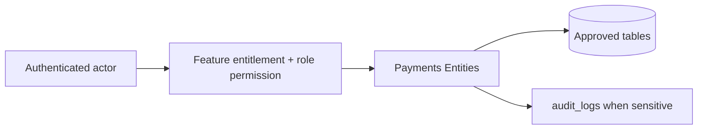

# Payments Entities

## Purpose

This document is a module-wise entity reference generated from the approved database design. It uses table-level column definitions so developers can see primary keys, foreign keys, constraints, and implementation notes without depending on old Markdown content.

## Control rule

| Concern | Required behavior |
|---|---|
| Tenant access | Every tenant-level feature must be configurable by tenant role, user right, permission, and feature assignment. |
| Backend authority | API/application services must validate tenant, feature entitlement, runtime flag, role permission, and same-tenant foreign-key ownership. |
| Frontend behavior | UI may hide unavailable actions, but backend rejection is mandatory for unauthorized writes. |
| Platform exception | Platform-admin-only catalog and tenant-control features remain platform controlled. |

## Entity index

| Entity | Purpose | PK | FK count |
|---|---|---:|---:|
| `payment_method_types` | Global payment method reference values. | 1 | 0 |
| `tenant_payment_methods` | Tenant-enabled payment methods and non-secret method config. | 1 | 3 |
| `payment_provider_configs` | Provider configuration with secret references. | 1 | 1 |
| `payments` | Unified payment and payout record. | 1 | 7 |
| `payment_transactions` | Gateway/provider event log per payment. | 1 | 2 |
| `sale_payment_allocations` | Allocates payments to POS sales. | 1 | 3 |
| `order_payment_allocations` | Allocates payments to E-Commerce orders. | 1 | 3 |
| `refunds` | Business refund header linked to original captured payment and optional outbound payment. | 1 | 5 |

## Table definitions

### `payment_method_types`

| Property | Detail |
|---|---|
| Database module | 9. Payments, Refunds and Receipts |
| Purpose | Global payment method reference values. |
| Ownership | Platform-owned catalog/reference; tenant_id is intentionally absent where shown. |
| Access control | Tenant-configurable access; operation requires enabled tenant feature plus role permission/user right. |
| Table rules | Platform-owned reference values. |

| Column | Type | Key / Constraint | Reference / Note |
|---|---|---|---|
| `id` | `smallint` | PK | Primary key. |
| `code` | `varchar(40)` | NOT NULL UNIQUE | cash, card, qr, wallet, bank_transfer, gift_card. |
| `name` | `varchar(150)` | NOT NULL | Display label. |

| Key summary | Columns |
|---|---|
| Primary key | `id` |
| Foreign keys | None |

### `tenant_payment_methods`

| Property | Detail |
|---|---|
| Database module | 9. Payments, Refunds and Receipts |
| Purpose | Tenant-enabled payment methods and non-secret method config. |
| Ownership | Tenant-owned or tenant-linked; tenant consistency must be enforced through tenant_id or parent ownership. |
| Access control | Tenant-configurable access; operation requires enabled tenant feature plus role permission/user right. |
| Table rules | UNIQUE (tenant_id, payment_method_type_id, provider_code). payment_provider_config_id must belong to same tenant when populated. |

| Column | Type | Key / Constraint | Reference / Note |
|---|---|---|---|
| `id` | `uuid` | PK | Primary key. |
| `tenant_id` | `uuid` | NOT NULL FK | References tenants(id). |
| `payment_method_type_id` | `smallint` | NOT NULL FK | References payment_method_types(id). |
| `payment_provider_config_id` | `uuid` | NULL FK | References payment_provider_configs(id); required for gateway-backed methods. |
| `provider_code` | `varchar(80)` | NULL | Gateway/provider code. |
| `enabled` | `boolean` | NOT NULL | Enabled flag. |
| `config` | `jsonb` | NULL | Non-secret config. |
| `created_at` | `timestamptz` | NOT NULL | Creation time. |
| `updated_at` | `timestamptz` | NOT NULL | Last update time. |

| Key summary | Columns |
|---|---|
| Primary key | `id` |
| Foreign keys | `tenant_id`, `payment_method_type_id`, `payment_provider_config_id` |

### `payment_provider_configs`

| Property | Detail |
|---|---|
| Database module | 9. Payments, Refunds and Receipts |
| Purpose | Provider configuration with secret references. |
| Ownership | Tenant-owned or tenant-linked; tenant consistency must be enforced through tenant_id or parent ownership. |
| Access control | Tenant-configurable access; operation requires enabled tenant feature plus role permission/user right. |
| Table rules | UNIQUE (tenant_id, provider_code, environment). Never store card data or gateway private keys in plain JSON. |

| Column | Type | Key / Constraint | Reference / Note |
|---|---|---|---|
| `id` | `uuid` | PK | Primary key. |
| `tenant_id` | `uuid` | NOT NULL FK | References tenants(id). |
| `provider_code` | `varchar(80)` | NOT NULL | Provider code. |
| `environment` | `varchar(30)` | NOT NULL CHECK | test, live. |
| `config` | `jsonb` | NULL | Non-secret config only. |
| `secret_ref` | `varchar(255)` | NULL | Reference to vault/secret manager; do not store secrets directly. |
| `status` | `varchar(30)` | NOT NULL CHECK | active, inactive. |
| `created_at` | `timestamptz` | NOT NULL | Creation time. |
| `updated_at` | `timestamptz` | NOT NULL | Last update time. |

| Key summary | Columns |
|---|---|
| Primary key | `id` |
| Foreign keys | `tenant_id` |

### `payments`

| Property | Detail |
|---|---|
| Database module | 9. Payments, Refunds and Receipts |
| Purpose | Unified payment and payout record. |
| Ownership | Tenant-owned or tenant-linked; tenant consistency must be enforced through tenant_id or parent ownership. |
| Access control | Tenant-configurable access; operation requires enabled tenant feature plus role permission/user right. |
| Table rules | UNIQUE (tenant_id, idempotency_key) WHERE idempotency_key IS NOT NULL. UNIQUE (tenant_id, source_device_id, client_payment_id) WHERE client_payment_id IS NOT NULL. |

| Column | Type | Key / Constraint | Reference / Note |
|---|---|---|---|
| `id` | `uuid` | PK | Primary key. |
| `tenant_id` | `uuid` | NOT NULL FK | References tenants(id). |
| `customer_id` | `uuid` | NULL FK | References customers(id). |
| `outlet_id` | `uuid` | NULL FK | POS reconciliation outlet. |
| `till_session_id` | `uuid` | NULL FK | POS session if applicable. |
| `tenant_payment_method_id` | `uuid` | NULL FK | References tenant_payment_methods(id). |
| `source_device_id` | `uuid` | NULL FK | References pos_devices(id). |
| `client_payment_id` | `varchar(120)` | NULL | Offline client payment id. |
| `client_transaction_id` | `varchar(120)` | NULL | Offline transaction group id. |
| `offline_created_at` | `timestamptz` | NULL | Offline payment time. |
| `synced_at` | `timestamptz` | NULL | Sync time. |
| `sync_batch_id` | `uuid` | NULL FK | References offline_sync_batches(id). |
| `payment_direction` | `varchar(20)` | NOT NULL CHECK | inbound, outbound. |
| `payment_purpose` | `varchar(40)` | NOT NULL CHECK | sale, order, refund, exchange_difference. |
| `payment_status` | `varchar(30)` | NOT NULL CHECK | pending, authorized, captured, failed, cancelled, voided, partially_refunded, refunded, expired. |
| `method_type` | `varchar(40)` | NOT NULL | Frozen payment method code. |
| `provider_code` | `varchar(80)` | NULL | Frozen provider code. |
| `currency` | `char(3)` | NOT NULL | Currency. |
| `amount` | `numeric(12,2)` | NOT NULL CHECK | > 0. |
| `captured_amount` | `numeric(12,2)` | NOT NULL CHECK | >= 0 and <= amount. |
| `reference_no` | `varchar(150)` | NULL | External reference. |
| `idempotency_key` | `varchar(160)` | NULL | Tenant-scoped idempotency guard. |
| `created_at` | `timestamptz` | NOT NULL | Creation time. |
| `completed_at` | `timestamptz` | NULL | Completion time. |

| Key summary | Columns |
|---|---|
| Primary key | `id` |
| Foreign keys | `tenant_id`, `customer_id`, `outlet_id`, `till_session_id`, `tenant_payment_method_id`, `source_device_id`, `sync_batch_id` |

### `payment_transactions`

| Property | Detail |
|---|---|
| Database module | 9. Payments, Refunds and Receipts |
| Purpose | Gateway/provider event log per payment. |
| Ownership | Tenant-owned or tenant-linked; tenant consistency must be enforced through tenant_id or parent ownership. |
| Access control | Tenant-configurable access; operation requires enabled tenant feature plus role permission/user right. |
| Table rules | Use for integration trace only; business totals come from payments/allocations. |

| Column | Type | Key / Constraint | Reference / Note |
|---|---|---|---|
| `id` | `uuid` | PK | Primary key. |
| `tenant_id` | `uuid` | NOT NULL FK | References tenants(id). |
| `payment_id` | `uuid` | NOT NULL FK | References payments(id). |
| `event_type` | `varchar(40)` | NOT NULL CHECK | auth, capture, void, refund, webhook, failure. |
| `provider_transaction_id` | `varchar(160)` | NULL | Provider transaction id. |
| `amount` | `numeric(12,2)` | NOT NULL CHECK | >= 0. |
| `payment_status` | `varchar(30)` | NOT NULL | Resulting payment status. |
| `raw_payload` | `jsonb` | NULL | Provider payload. |
| `created_at` | `timestamptz` | NOT NULL | Creation time. |

| Key summary | Columns |
|---|---|
| Primary key | `id` |
| Foreign keys | `tenant_id`, `payment_id` |

### `sale_payment_allocations`

| Property | Detail |
|---|---|
| Database module | 9. Payments, Refunds and Receipts |
| Purpose | Allocates payments to POS sales. |
| Ownership | Tenant-owned or tenant-linked; tenant consistency must be enforced through tenant_id or parent ownership. |
| Access control | Tenant-configurable access; operation requires enabled tenant feature plus role permission/user right. |
| Table rules | UNIQUE (tenant_id, sale_id, payment_id). Only inbound sale-purpose payments can be allocated. |

| Column | Type | Key / Constraint | Reference / Note |
|---|---|---|---|
| `id` | `uuid` | PK | Primary key. |
| `tenant_id` | `uuid` | NOT NULL FK | References tenants(id). |
| `sale_id` | `uuid` | NOT NULL FK | References sales(id). |
| `payment_id` | `uuid` | NOT NULL FK | References payments(id). |
| `amount` | `numeric(12,2)` | NOT NULL CHECK | > 0. |
| `created_at` | `timestamptz` | NOT NULL | Creation time. |

| Key summary | Columns |
|---|---|
| Primary key | `id` |
| Foreign keys | `tenant_id`, `sale_id`, `payment_id` |

### `order_payment_allocations`

| Property | Detail |
|---|---|
| Database module | 9. Payments, Refunds and Receipts |
| Purpose | Allocates payments to E-Commerce orders. |
| Ownership | Tenant-owned or tenant-linked; tenant consistency must be enforced through tenant_id or parent ownership. |
| Access control | Tenant-configurable access; operation requires enabled tenant feature plus role permission/user right. |
| Table rules | UNIQUE (tenant_id, order_id, payment_id). Allocated totals must not exceed captured_amount. |

| Column | Type | Key / Constraint | Reference / Note |
|---|---|---|---|
| `id` | `uuid` | PK | Primary key. |
| `tenant_id` | `uuid` | NOT NULL FK | References tenants(id). |
| `order_id` | `uuid` | NOT NULL FK | References orders(id). |
| `payment_id` | `uuid` | NOT NULL FK | References payments(id). |
| `amount` | `numeric(12,2)` | NOT NULL CHECK | > 0. |
| `created_at` | `timestamptz` | NOT NULL | Creation time. |

| Key summary | Columns |
|---|---|
| Primary key | `id` |
| Foreign keys | `tenant_id`, `order_id`, `payment_id` |

### `refunds`

| Property | Detail |
|---|---|
| Database module | 9. Payments, Refunds and Receipts |
| Purpose | Business refund header linked to original captured payment and optional outbound payment. |
| Ownership | Tenant-owned or tenant-linked; tenant consistency must be enforced through tenant_id or parent ownership. |
| Access control | Tenant-configurable access; operation requires enabled tenant feature plus role permission/user right. |
| Table rules | Total refunds against original_payment_id must not exceed original captured_amount. refund_payment_id must reference an outbound payment with purpose refund. |

| Column | Type | Key / Constraint | Reference / Note |
|---|---|---|---|
| `id` | `uuid` | PK | Primary key. |
| `tenant_id` | `uuid` | NOT NULL FK | References tenants(id). |
| `original_payment_id` | `uuid` | NOT NULL FK | References payments(id). |
| `refund_payment_id` | `uuid` | NULL FK | References payments(id); outbound refund row. |
| `reason` | `text` | NULL | Refund reason. |
| `refund_status` | `varchar(30)` | NOT NULL CHECK | pending, approved, paid, failed, cancelled. |
| `amount` | `numeric(12,2)` | NOT NULL CHECK | > 0. |
| `created_by` | `uuid` | NULL FK | References users(id). |
| `approved_by` | `uuid` | NULL FK | References users(id). |
| `approved_at` | `timestamptz` | NULL | Approval timestamp. |
| `created_at` | `timestamptz` | NOT NULL | Creation time. |
| `completed_at` | `timestamptz` | NULL | Completion time. |
| `updated_at` | `timestamptz` | NOT NULL | Last update time. |

| Key summary | Columns |
|---|---|
| Primary key | `id` |
| Foreign keys | `tenant_id`, `original_payment_id`, `refund_payment_id`, `created_by`, `approved_by` |

## Module data flow

## Implementation notes

- Service validation must mirror database uniqueness and status constraints before persistence.
- Repository queries must include tenant filters for tenant-owned records.
- Foreign-key values submitted by clients must be checked for same-tenant ownership.
- Permission codes should be module/action specific, for example `module.entity.action`.
- Mutation endpoints should be idempotent where duplicate client requests or offline sync can occur.

## Related documents

- [[../data-dictionary-index]]
- [[../database-overview]]
- [[../schema-principles]]
- [[../tenant-consistency-rules]]