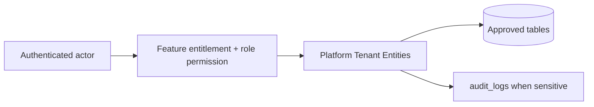

# Platform Tenant Entities

## Purpose

This document is a module-wise entity reference generated from the approved database design. It uses table-level column definitions so developers can see primary keys, foreign keys, constraints, and implementation notes without depending on old Markdown content.

## Control rule

| Concern | Required behavior |
|---|---|
| Tenant access | Every tenant-level feature must be configurable by tenant role, user right, permission, and feature assignment. |
| Backend authority | API/application services must validate tenant, feature entitlement, runtime flag, role permission, and same-tenant foreign-key ownership. |
| Frontend behavior | UI may hide unavailable actions, but backend rejection is mandatory for unauthorized writes. |
| Platform exception | Platform-admin-only catalog and tenant-control features remain platform controlled. |

## Entity index

| Entity | Purpose | PK | FK count |
|---|---|---:|---:|
| `platform_users` | Platform-side administrators who create tenants, manage entitlements and perform platform support. | 1 | 0 |
| `tenants` | Root business account for each customer tenant. | 1 | 0 |
| `outlets` | Physical or logical stock/sales location under a tenant. | 1 | 1 |
| `outlet_addresses` | Single operational address per outlet. | 1 | 2 |
| `document_sequences` | Tenant/outlet-aware business document number generator. | 1 | 2 |

## Table definitions

### `platform_users`

| Property | Detail |
|---|---|
| Database module | 1. Platform and Tenant Foundation |
| Purpose | Platform-side administrators who create tenants, manage entitlements and perform platform support. |
| Ownership | Platform-owned catalog/reference; tenant_id is intentionally absent where shown. |
| Access control | Platform-admin controlled where platform-owned; tenant admins cannot directly mutate platform catalog records. |
| Table rules | Platform users are not tenant staff. Do not store platform admin flags in tenant users. |

| Column | Type | Key / Constraint | Reference / Note |
|---|---|---|---|
| `id` | `uuid` | PK | Primary key. |
| `email` | `citext` | NOT NULL UNIQUE | Platform login email. |
| `password_hash` | `varchar(255)` | NOT NULL | Password hash only; never store plain password. |
| `full_name` | `varchar(200)` | NOT NULL | Display name. |
| `phone` | `varchar(40)` | NULL | Optional phone. |
| `status` | `varchar(30)` | NOT NULL CHECK | active, inactive, suspended. |
| `last_login_at` | `timestamptz` | NULL | Last successful login. |
| `created_at` | `timestamptz` | NOT NULL | Creation time. |
| `updated_at` | `timestamptz` | NOT NULL | Last update time. |

| Key summary | Columns |
|---|---|
| Primary key | `id` |
| Foreign keys | None |

### `tenants`

| Property | Detail |
|---|---|
| Database module | 1. Platform and Tenant Foundation |
| Purpose | Root business account for each customer tenant. |
| Ownership | Tenant-owned or tenant-linked; tenant consistency must be enforced through tenant_id or parent ownership. |
| Access control | Platform-admin controlled where platform-owned; tenant admins cannot directly mutate platform catalog records. |
| Table rules | Suspended tenants cannot create new sales/orders unless platform policy explicitly allows it. |

| Column | Type | Key / Constraint | Reference / Note |
|---|---|---|---|
| `id` | `uuid` | PK | Primary key. |
| `code` | `varchar(60)` | NOT NULL UNIQUE | Human-readable tenant code. |
| `name` | `varchar(200)` | NOT NULL | Tenant business name. |
| `status` | `varchar(30)` | NOT NULL CHECK | active, suspended, inactive. |
| `base_currency` | `char(3)` | NOT NULL | ISO currency. |
| `default_timezone` | `varchar(100)` | NOT NULL | IANA timezone. |
| `default_locale` | `varchar(20)` | NOT NULL | Locale. |
| `operating_mode` | `varchar(30)` | NOT NULL CHECK | pos_only, ecommerce_only, hybrid. |
| `created_at` | `timestamptz` | NOT NULL | Creation time. |
| `updated_at` | `timestamptz` | NOT NULL | Last update time. |

| Key summary | Columns |
|---|---|
| Primary key | `id` |
| Foreign keys | None |

### `outlets`

| Property | Detail |
|---|---|
| Database module | 1. Platform and Tenant Foundation |
| Purpose | Physical or logical stock/sales location under a tenant. |
| Ownership | Tenant-owned or tenant-linked; tenant consistency must be enforced through tenant_id or parent ownership. |
| Access control | Tenant-configurable access; operation requires enabled tenant feature plus role permission/user right. |
| Table rules | UNIQUE (tenant_id, code). Outlet rows must never be shared across tenants. |

| Column | Type | Key / Constraint | Reference / Note |
|---|---|---|---|
| `id` | `uuid` | PK | Primary key. |
| `tenant_id` | `uuid` | NOT NULL FK | References tenants(id). |
| `code` | `varchar(60)` | NOT NULL | Unique outlet code inside tenant. |
| `name` | `varchar(200)` | NOT NULL | Outlet name. |
| `outlet_type` | `varchar(40)` | NOT NULL CHECK | store, warehouse, dark_store, fulfillment_center. |
| `timezone` | `varchar(100)` | NOT NULL | Outlet timezone. |
| `status` | `varchar(30)` | NOT NULL CHECK | active, inactive. |
| `created_at` | `timestamptz` | NOT NULL | Creation time. |
| `updated_at` | `timestamptz` | NOT NULL | Last update time. |

| Key summary | Columns |
|---|---|
| Primary key | `id` |
| Foreign keys | `tenant_id` |

### `outlet_addresses`

| Property | Detail |
|---|---|
| Database module | 1. Platform and Tenant Foundation |
| Purpose | Single operational address per outlet. |
| Ownership | Tenant-owned or tenant-linked; tenant consistency must be enforced through tenant_id or parent ownership. |
| Access control | Tenant-configurable access; operation requires enabled tenant feature plus role permission/user right. |
| Table rules | UNIQUE (tenant_id, outlet_id). outlet_id must belong to same tenant_id. |

| Column | Type | Key / Constraint | Reference / Note |
|---|---|---|---|
| `id` | `uuid` | PK | Primary key. |
| `tenant_id` | `uuid` | NOT NULL FK | References tenants(id). |
| `outlet_id` | `uuid` | NOT NULL FK | References outlets(id). |
| `line1` | `varchar(250)` | NOT NULL | Address line 1. |
| `line2` | `varchar(250)` | NULL | Address line 2. |
| `city` | `varchar(120)` | NOT NULL | City. |
| `state` | `varchar(120)` | NULL | Province/state. |
| `postal_code` | `varchar(30)` | NULL | Postal/ZIP code. |
| `country_code` | `char(2)` | NOT NULL | ISO country code. |
| `created_at` | `timestamptz` | NOT NULL | Creation time. |

| Key summary | Columns |
|---|---|
| Primary key | `id` |
| Foreign keys | `tenant_id`, `outlet_id` |

### `document_sequences`

| Property | Detail |
|---|---|
| Database module | 1. Platform and Tenant Foundation |
| Purpose | Tenant/outlet-aware business document number generator. |
| Ownership | Tenant-owned or tenant-linked; tenant consistency must be enforced through tenant_id or parent ownership. |
| Access control | Tenant-configurable access; operation requires enabled tenant feature plus role permission/user right. |
| Table rules | Use row-level locking when allocating numbers. Include delivery document type. Use partial unique indexes for outlet_id null/non-null. |

| Column | Type | Key / Constraint | Reference / Note |
|---|---|---|---|
| `id` | `uuid` | PK | Primary key. |
| `tenant_id` | `uuid` | NOT NULL FK | References tenants(id). |
| `outlet_id` | `uuid` | NULL FK | References outlets(id); null means tenant-level sequence. |
| `document_type` | `varchar(40)` | NOT NULL CHECK | sale, order, return, exchange, receipt, transfer, purchase_receipt, stock_adjustment, delivery. |
| `prefix` | `varchar(40)` | NOT NULL | Prefix used for generated document number. |
| `current_value` | `bigint` | NOT NULL | Last allocated number. |
| `reset_policy` | `varchar(20)` | NOT NULL CHECK | none, daily, monthly, yearly. |
| `last_reset_at` | `timestamptz` | NULL | Last reset timestamp. |
| `created_at` | `timestamptz` | NOT NULL | Sequence configuration creation time. |
| `updated_at` | `timestamptz` | NOT NULL | Last update time. |

| Key summary | Columns |
|---|---|
| Primary key | `id` |
| Foreign keys | `tenant_id`, `outlet_id` |

## Module data flow

## Implementation notes

- Service validation must mirror database uniqueness and status constraints before persistence.
- Repository queries must include tenant filters for tenant-owned records.
- Foreign-key values submitted by clients must be checked for same-tenant ownership.
- Permission codes should be module/action specific, for example `module.entity.action`.
- Mutation endpoints should be idempotent where duplicate client requests or offline sync can occur.

## Related documents

- [[../data-dictionary-index]]
- [[../database-overview]]
- [[../schema-principles]]
- [[../tenant-consistency-rules]]