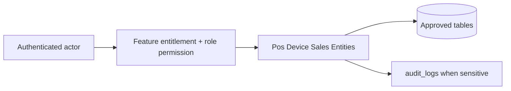

# Pos Device Sales Entities

## Purpose

This document is a module-wise entity reference generated from the approved database design. It uses table-level column definitions so developers can see primary keys, foreign keys, constraints, and implementation notes without depending on old Markdown content.

## Control rule

| Concern | Required behavior |
|---|---|
| Tenant access | Every tenant-level feature must be configurable by tenant role, user right, permission, and feature assignment. |
| Backend authority | API/application services must validate tenant, feature entitlement, runtime flag, role permission, and same-tenant foreign-key ownership. |
| Frontend behavior | UI may hide unavailable actions, but backend rejection is mandatory for unauthorized writes. |
| Platform exception | Platform-admin-only catalog and tenant-control features remain platform controlled. |

## Entity index

| Entity | Purpose | PK | FK count |
|---|---|---:|---:|
| `tills` | Cash register / till master. | 1 | 2 |
| `pos_devices` | Registered POS terminal/browser/device for online/offline POS. | 1 | 3 |
| `till_sessions` | Open/close session per till. | 1 | 8 |
| `cash_movement_types` | Reference values for non-sale cash movement. | 1 | 0 |
| `cash_movements` | Non-sale cash movement within a till session. | 1 | 7 |
| `cash_count_denominations` | Denomination-level cash count for till close. | 1 | 2 |
| `sales` | POS sale header. | 1 | 8 |
| `sale_lines` | POS sale line items. | 1 | 4 |

## Table definitions

### `tills`

| Property | Detail |
|---|---|
| Database module | 6. POS Devices, Sessions and Sales |
| Purpose | Cash register / till master. |
| Ownership | Tenant-owned or tenant-linked; tenant consistency must be enforced through tenant_id or parent ownership. |
| Access control | Tenant-configurable access; operation requires enabled tenant feature plus role permission/user right. |
| Table rules | UNIQUE (tenant_id, outlet_id, code). |

| Column | Type | Key / Constraint | Reference / Note |
|---|---|---|---|
| `id` | `uuid` | PK | Primary key. |
| `tenant_id` | `uuid` | NOT NULL FK | References tenants(id). |
| `outlet_id` | `uuid` | NOT NULL FK | References outlets(id). |
| `code` | `varchar(60)` | NOT NULL | Till code. |
| `name` | `varchar(150)` | NOT NULL | Till name. |
| `status` | `varchar(30)` | NOT NULL CHECK | active, inactive, maintenance. |
| `created_at` | `timestamptz` | NOT NULL | Creation time. |
| `updated_at` | `timestamptz` | NOT NULL | Last update time. |

| Key summary | Columns |
|---|---|
| Primary key | `id` |
| Foreign keys | `tenant_id`, `outlet_id` |

### `pos_devices`

| Property | Detail |
|---|---|
| Database module | 6. POS Devices, Sessions and Sales |
| Purpose | Registered POS terminal/browser/device for online/offline POS. |
| Ownership | Tenant-owned or tenant-linked; tenant consistency must be enforced through tenant_id or parent ownership. |
| Access control | Tenant-configurable access; operation requires enabled tenant feature plus role permission/user right. |
| Table rules | UNIQUE (tenant_id, device_code). UNIQUE (tenant_id, device_fingerprint). Device outlet must match till outlet. |

| Column | Type | Key / Constraint | Reference / Note |
|---|---|---|---|
| `id` | `uuid` | PK | Primary key. |
| `tenant_id` | `uuid` | NOT NULL FK | References tenants(id). |
| `outlet_id` | `uuid` | NOT NULL FK | References outlets(id). |
| `till_id` | `uuid` | NOT NULL FK | References tills(id). |
| `device_code` | `varchar(80)` | NOT NULL | Human-readable device code. |
| `device_name` | `varchar(150)` | NOT NULL | Device name. |
| `device_fingerprint` | `varchar(255)` | NOT NULL | Device/browser fingerprint. |
| `app_version` | `varchar(50)` | NULL | POS app version. |
| `last_seen_at` | `timestamptz` | NULL | Last online/sync time. |
| `status` | `varchar(30)` | NOT NULL CHECK | active, inactive, blocked. |
| `created_at` | `timestamptz` | NOT NULL | Creation time. |
| `updated_at` | `timestamptz` | NOT NULL | Last update time. |

| Key summary | Columns |
|---|---|
| Primary key | `id` |
| Foreign keys | `tenant_id`, `outlet_id`, `till_id` |

### `till_sessions`

| Property | Detail |
|---|---|
| Database module | 6. POS Devices, Sessions and Sales |
| Purpose | Open/close session per till. |
| Ownership | Tenant-owned or tenant-linked; tenant consistency must be enforced through tenant_id or parent ownership. |
| Access control | Tenant-configurable access; operation requires enabled tenant feature plus role permission/user right. |
| Table rules | UNIQUE (tenant_id, till_id) WHERE status = open. Cashier cannot open two active sessions for same till. |

| Column | Type | Key / Constraint | Reference / Note |
|---|---|---|---|
| `id` | `uuid` | PK | Primary key. |
| `tenant_id` | `uuid` | NOT NULL FK | References tenants(id). |
| `outlet_id` | `uuid` | NOT NULL FK | References outlets(id). |
| `till_id` | `uuid` | NOT NULL FK | References tills(id). |
| `business_date` | `date` | NOT NULL | Operational date. |
| `opened_by` | `uuid` | NOT NULL FK | References users(id). |
| `closed_by` | `uuid` | NULL FK | References users(id). |
| `opened_device_id` | `uuid` | NULL FK | References pos_devices(id). |
| `closed_device_id` | `uuid` | NULL FK | References pos_devices(id). |
| `opening_float` | `numeric(12,2)` | NOT NULL CHECK | >= 0. |
| `expected_cash` | `numeric(12,2)` | NULL | System expected cash. |
| `counted_cash` | `numeric(12,2)` | NULL | Counted cash. |
| `variance` | `numeric(12,2)` | NULL | Cash variance. |
| `variance_approved_by` | `uuid` | NULL FK | References users(id). |
| `variance_approved_at` | `timestamptz` | NULL | Variance approval time. |
| `status` | `varchar(20)` | NOT NULL CHECK | open, closed. |
| `opened_at` | `timestamptz` | NOT NULL | Open time. |
| `closed_at` | `timestamptz` | NULL | Close time. |
| `close_note` | `text` | NULL | Close note. |

| Key summary | Columns |
|---|---|
| Primary key | `id` |
| Foreign keys | `tenant_id`, `outlet_id`, `till_id`, `opened_by`, `closed_by`, `opened_device_id`, `closed_device_id`, `variance_approved_by` |

### `cash_movement_types`

| Property | Detail |
|---|---|
| Database module | 6. POS Devices, Sessions and Sales |
| Purpose | Reference values for non-sale cash movement. |
| Ownership | Platform-owned catalog/reference; tenant_id is intentionally absent where shown. |
| Access control | Tenant-configurable access; operation requires enabled tenant feature plus role permission/user right. |
| Table rules | Cash sale/refund payment rows are not stored here; this table is for non-sale cash movements. |

| Column | Type | Key / Constraint | Reference / Note |
|---|---|---|---|
| `id` | `smallint` | PK | Primary key. |
| `code` | `varchar(50)` | NOT NULL UNIQUE | cash_in, cash_out, safe_drop, float_add, paid_out. |
| `name` | `varchar(150)` | NOT NULL | Display label. |
| `direction` | `varchar(20)` | NOT NULL CHECK | in, out. |

| Key summary | Columns |
|---|---|
| Primary key | `id` |
| Foreign keys | None |

### `cash_movements`

| Property | Detail |
|---|---|
| Database module | 6. POS Devices, Sessions and Sales |
| Purpose | Non-sale cash movement within a till session. |
| Ownership | Tenant-owned or tenant-linked; tenant consistency must be enforced through tenant_id or parent ownership. |
| Access control | Tenant-configurable access; operation requires enabled tenant feature plus role permission/user right. |
| Table rules | UNIQUE (tenant_id, source_device_id, client_cash_movement_id) WHERE client_cash_movement_id IS NOT NULL. |

| Column | Type | Key / Constraint | Reference / Note |
|---|---|---|---|
| `id` | `uuid` | PK | Primary key. |
| `tenant_id` | `uuid` | NOT NULL FK | References tenants(id). |
| `till_session_id` | `uuid` | NOT NULL FK | References till_sessions(id). |
| `cash_movement_type_id` | `smallint` | NOT NULL FK | References cash_movement_types(id). |
| `amount` | `numeric(12,2)` | NOT NULL CHECK | > 0. |
| `reason` | `text` | NOT NULL | Business reason. |
| `status` | `varchar(30)` | NOT NULL CHECK | pending, approved, rejected, posted. |
| `performed_by` | `uuid` | NOT NULL FK | References users(id). |
| `approved_by` | `uuid` | NULL FK | References users(id). |
| `approved_at` | `timestamptz` | NULL | Approval time. |
| `source_device_id` | `uuid` | NULL FK | References pos_devices(id). |
| `client_cash_movement_id` | `varchar(120)` | NULL | Offline dedupe id. |
| `offline_created_at` | `timestamptz` | NULL | Offline creation time. |
| `synced_at` | `timestamptz` | NULL | Sync time. |
| `sync_batch_id` | `uuid` | NULL FK | References offline_sync_batches(id). |
| `created_at` | `timestamptz` | NOT NULL | Creation time. |
| `updated_at` | `timestamptz` | NOT NULL | Last update time. |

| Key summary | Columns |
|---|---|
| Primary key | `id` |
| Foreign keys | `tenant_id`, `till_session_id`, `cash_movement_type_id`, `performed_by`, `approved_by`, `source_device_id`, `sync_batch_id` |

### `cash_count_denominations`

| Property | Detail |
|---|---|
| Database module | 6. POS Devices, Sessions and Sales |
| Purpose | Denomination-level cash count for till close. |
| Ownership | Tenant-owned or tenant-linked; tenant consistency must be enforced through tenant_id or parent ownership. |
| Access control | Tenant-configurable access; operation requires enabled tenant feature plus role permission/user right. |
| Table rules | UNIQUE (tenant_id, till_session_id, denomination). |

| Column | Type | Key / Constraint | Reference / Note |
|---|---|---|---|
| `id` | `uuid` | PK | Primary key. |
| `tenant_id` | `uuid` | NOT NULL FK | References tenants(id). |
| `till_session_id` | `uuid` | NOT NULL FK | References till_sessions(id). |
| `denomination` | `numeric(12,2)` | NOT NULL CHECK | > 0. |
| `quantity` | `int` | NOT NULL CHECK | >= 0. |
| `amount` | `numeric(12,2)` | NOT NULL CHECK | >= 0. |
| `created_at` | `timestamptz` | NOT NULL | Creation time. |

| Key summary | Columns |
|---|---|
| Primary key | `id` |
| Foreign keys | `tenant_id`, `till_session_id` |

### `sales`

| Property | Detail |
|---|---|
| Database module | 6. POS Devices, Sessions and Sales |
| Purpose | POS sale header. |
| Ownership | Tenant-owned or tenant-linked; tenant consistency must be enforced through tenant_id or parent ownership. |
| Access control | Tenant-configurable access; operation requires enabled tenant feature plus role permission/user right. |
| Table rules | UNIQUE (tenant_id, sale_number). UNIQUE (tenant_id, source_device_id, client_transaction_id) WHERE client_transaction_id IS NOT NULL. |

| Column | Type | Key / Constraint | Reference / Note |
|---|---|---|---|
| `id` | `uuid` | PK | Primary key. |
| `tenant_id` | `uuid` | NOT NULL FK | References tenants(id). |
| `outlet_id` | `uuid` | NOT NULL FK | References outlets(id). |
| `till_session_id` | `uuid` | NOT NULL FK | References till_sessions(id). |
| `sale_number` | `varchar(80)` | NOT NULL | Business sale number. |
| `business_date` | `date` | NOT NULL | Operational date. |
| `customer_id` | `uuid` | NULL FK | References customers(id). |
| `status` | `varchar(30)` | NOT NULL CHECK | draft, held, completed, voided, cancelled. |
| `currency` | `char(3)` | NOT NULL | Currency. |
| `subtotal` | `numeric(12,2)` | NOT NULL | Subtotal. |
| `discount_total` | `numeric(12,2)` | NOT NULL | Discount total. |
| `tax_total` | `numeric(12,2)` | NOT NULL | Tax total. |
| `grand_total` | `numeric(12,2)` | NOT NULL | Final total. |
| `paid_total` | `numeric(12,2)` | NOT NULL | Paid total. |
| `change_total` | `numeric(12,2)` | NOT NULL | Change. |
| `source_device_id` | `uuid` | NULL FK | References pos_devices(id). |
| `client_transaction_id` | `varchar(120)` | NULL | Offline transaction id. |
| `offline_created_at` | `timestamptz` | NULL | Client offline time. |
| `synced_at` | `timestamptz` | NULL | Sync time. |
| `sync_batch_id` | `uuid` | NULL FK | References offline_sync_batches(id). |
| `sync_status` | `varchar(30)` | NULL CHECK | online, pending_sync, synced, conflict. |
| `completed_by` | `uuid` | NULL FK | References users(id). |
| `completed_at` | `timestamptz` | NULL | Completion time. |
| `voided_by` | `uuid` | NULL FK | References users(id). |
| `voided_at` | `timestamptz` | NULL | Void time. |
| `void_reason` | `text` | NULL | Void reason. |
| `created_at` | `timestamptz` | NOT NULL | Creation time. |
| `updated_at` | `timestamptz` | NOT NULL | Last update time. |

| Key summary | Columns |
|---|---|
| Primary key | `id` |
| Foreign keys | `tenant_id`, `outlet_id`, `till_session_id`, `customer_id`, `source_device_id`, `sync_batch_id`, `completed_by`, `voided_by` |

### `sale_lines`

| Property | Detail |
|---|---|
| Database module | 6. POS Devices, Sessions and Sales |
| Purpose | POS sale line items. |
| Ownership | Tenant-owned or tenant-linked; tenant consistency must be enforced through tenant_id or parent ownership. |
| Access control | Tenant-configurable access; operation requires enabled tenant feature plus role permission/user right. |
| Table rules | UNIQUE (tenant_id, sale_id, line_no). sale_id and variant_id must belong to same tenant. |

| Column | Type | Key / Constraint | Reference / Note |
|---|---|---|---|
| `id` | `uuid` | PK | Primary key. |
| `tenant_id` | `uuid` | NOT NULL FK | References tenants(id). |
| `sale_id` | `uuid` | NOT NULL FK | References sales(id). |
| `variant_id` | `uuid` | NOT NULL FK | References product_variants(id). |
| `line_no` | `int` | NOT NULL | Line number. |
| `description` | `varchar(250)` | NOT NULL | Frozen item text. |
| `qty` | `numeric(14,3)` | NOT NULL CHECK | > 0. |
| `returned_qty` | `numeric(14,3)` | NOT NULL DEFAULT 0 | Quantity already returned. |
| `unit_price` | `numeric(12,2)` | NOT NULL CHECK | >= 0. |
| `discount_total` | `numeric(12,2)` | NOT NULL | Line discount. |
| `tax_total` | `numeric(12,2)` | NOT NULL | Line tax. |
| `line_total` | `numeric(12,2)` | NOT NULL | Line total. |
| `tax_rate_id` | `uuid` | NULL FK | References tax_rates(id). |
| `pricing_snapshot` | `jsonb` | NOT NULL | Frozen pricing/tax context. |

| Key summary | Columns |
|---|---|
| Primary key | `id` |
| Foreign keys | `tenant_id`, `sale_id`, `variant_id`, `tax_rate_id` |

## Module data flow

## Implementation notes

- Service validation must mirror database uniqueness and status constraints before persistence.
- Repository queries must include tenant filters for tenant-owned records.
- Foreign-key values submitted by clients must be checked for same-tenant ownership.
- Permission codes should be module/action specific, for example `module.entity.action`.
- Mutation endpoints should be idempotent where duplicate client requests or offline sync can occur.

## Related documents

- [[../data-dictionary-index]]
- [[../database-overview]]
- [[../schema-principles]]
- [[../tenant-consistency-rules]]