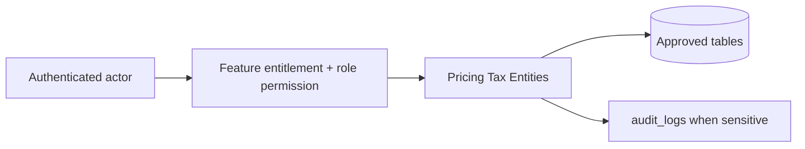

# Pricing Tax Entities

## Purpose

This document is a module-wise entity reference generated from the approved database design. It uses table-level column definitions so developers can see primary keys, foreign keys, constraints, and implementation notes without depending on old Markdown content.

## Control rule

| Concern | Required behavior |
|---|---|
| Tenant access | Every tenant-level feature must be configurable by tenant role, user right, permission, and feature assignment. |
| Backend authority | API/application services must validate tenant, feature entitlement, runtime flag, role permission, and same-tenant foreign-key ownership. |
| Frontend behavior | UI may hide unavailable actions, but backend rejection is mandatory for unauthorized writes. |
| Platform exception | Platform-admin-only catalog and tenant-control features remain platform controlled. |

## Entity index

| Entity | Purpose | PK | FK count |
|---|---|---:|---:|
| `tax_classes` | Tenant tax classification assigned to products. | 1 | 1 |
| `tax_rates` | Effective tax/VAT/GST/sales tax rates. | 1 | 1 |
| `tax_class_rates` | Maps tax classes to effective rates. | 1 | 3 |
| `price_lists` | Named channel price lists. | 1 | 1 |
| `price_list_items` | Variant prices inside a price list. | 1 | 4 |

## Table definitions

### `tax_classes`

| Property | Detail |
|---|---|
| Database module | 4. Catalog, Tax and Pricing |
| Purpose | Tenant tax classification assigned to products. |
| Ownership | Tenant-owned or tenant-linked; tenant consistency must be enforced through tenant_id or parent ownership. |
| Access control | Tenant-configurable access; operation requires enabled tenant feature plus role permission/user right. |
| Table rules | UNIQUE (tenant_id, code). |

| Column | Type | Key / Constraint | Reference / Note |
|---|---|---|---|
| `id` | `uuid` | PK | Primary key. |
| `tenant_id` | `uuid` | NOT NULL FK | References tenants(id). |
| `code` | `varchar(80)` | NOT NULL | Tax class code. |
| `name` | `varchar(150)` | NOT NULL | Tax class name. |
| `applies_to` | `varchar(30)` | NOT NULL CHECK | goods, services, shipping, mixed. |
| `is_active` | `boolean` | NOT NULL | Active flag. |
| `created_at` | `timestamptz` | NOT NULL | Creation time. |
| `updated_at` | `timestamptz` | NOT NULL | Last update time. |

| Key summary | Columns |
|---|---|
| Primary key | `id` |
| Foreign keys | `tenant_id` |

### `tax_rates`

| Property | Detail |
|---|---|
| Database module | 4. Catalog, Tax and Pricing |
| Purpose | Effective tax/VAT/GST/sales tax rates. |
| Ownership | Tenant-owned or tenant-linked; tenant consistency must be enforced through tenant_id or parent ownership. |
| Access control | Tenant-configurable access; operation requires enabled tenant feature plus role permission/user right. |
| Table rules | UNIQUE (tenant_id, code, starts_at). |

| Column | Type | Key / Constraint | Reference / Note |
|---|---|---|---|
| `id` | `uuid` | PK | Primary key. |
| `tenant_id` | `uuid` | NOT NULL FK | References tenants(id). |
| `code` | `varchar(80)` | NOT NULL | Tax rate code. |
| `name` | `varchar(150)` | NOT NULL | Tax rate name. |
| `rate` | `numeric(7,4)` | NOT NULL | Percentage rate, e.g. 15.0000. |
| `tax_type` | `varchar(30)` | NOT NULL CHECK | vat, gst, sales_tax. |
| `country_code` | `char(2)` | NOT NULL | ISO country. |
| `starts_at` | `timestamptz` | NOT NULL | Effective start. |
| `ends_at` | `timestamptz` | NULL | Effective end. |
| `is_active` | `boolean` | NOT NULL | Active flag. |

| Key summary | Columns |
|---|---|
| Primary key | `id` |
| Foreign keys | `tenant_id` |

### `tax_class_rates`

| Property | Detail |
|---|---|
| Database module | 4. Catalog, Tax and Pricing |
| Purpose | Maps tax classes to effective rates. |
| Ownership | Tenant-owned or tenant-linked; tenant consistency must be enforced through tenant_id or parent ownership. |
| Access control | Tenant-configurable access; operation requires enabled tenant feature plus role permission/user right. |
| Table rules | Prevents missing tax_class to tax_rate relationship. No overlapping active periods per tax_class_id. |

| Column | Type | Key / Constraint | Reference / Note |
|---|---|---|---|
| `id` | `uuid` | PK | Primary key. |
| `tenant_id` | `uuid` | NOT NULL FK | References tenants(id). |
| `tax_class_id` | `uuid` | NOT NULL FK | References tax_classes(id). |
| `tax_rate_id` | `uuid` | NOT NULL FK | References tax_rates(id). |
| `starts_at` | `timestamptz` | NOT NULL | Effective start. |
| `ends_at` | `timestamptz` | NULL | Effective end. |
| `is_active` | `boolean` | NOT NULL | Active flag. |

| Key summary | Columns |
|---|---|
| Primary key | `id` |
| Foreign keys | `tenant_id`, `tax_class_id`, `tax_rate_id` |

### `price_lists`

| Property | Detail |
|---|---|
| Database module | 4. Catalog, Tax and Pricing |
| Purpose | Named channel price lists. |
| Ownership | Tenant-owned or tenant-linked; tenant consistency must be enforced through tenant_id or parent ownership. |
| Access control | Tenant-configurable access; operation requires enabled tenant feature plus role permission/user right. |
| Table rules | UNIQUE (tenant_id, name). If multiple active price lists match the same tenant, channel, currency and date, highest priority wins. Active price lists with the same tenant, channel, currency, priority and overlapping effective period must be blocked or resolved by a deterministic service rule. |

| Column | Type | Key / Constraint | Reference / Note |
|---|---|---|---|
| `id` | `uuid` | PK | Primary key. |
| `tenant_id` | `uuid` | NOT NULL FK | References tenants(id). |
| `name` | `varchar(150)` | NOT NULL | Price list name. |
| `channel` | `varchar(20)` | NOT NULL CHECK | pos, ecommerce, both. |
| `currency` | `char(3)` | NOT NULL | Currency. |
| `starts_at` | `timestamptz` | NULL | Effective start. |
| `ends_at` | `timestamptz` | NULL | Effective end. |
| `priority` | `int` | NOT NULL | Evaluation priority. |
| `is_active` | `boolean` | NOT NULL | Active flag. |
| `created_at` | `timestamptz` | NOT NULL | Creation time. |
| `updated_at` | `timestamptz` | NOT NULL | Last update time. |

| Key summary | Columns |
|---|---|
| Primary key | `id` |
| Foreign keys | `tenant_id` |

### `price_list_items`

| Property | Detail |
|---|---|
| Database module | 4. Catalog, Tax and Pricing |
| Purpose | Variant prices inside a price list. |
| Ownership | Tenant-owned or tenant-linked; tenant consistency must be enforced through tenant_id or parent ownership. |
| Access control | Tenant-configurable access; operation requires enabled tenant feature plus role permission/user right. |
| Table rules | Use partial unique indexes for outlet_id null/non-null. price_list_id and variant_id must belong to tenant_id. |

| Column | Type | Key / Constraint | Reference / Note |
|---|---|---|---|
| `id` | `uuid` | PK | Primary key. |
| `tenant_id` | `uuid` | NOT NULL FK | References tenants(id). |
| `price_list_id` | `uuid` | NOT NULL FK | References price_lists(id). |
| `variant_id` | `uuid` | NOT NULL FK | References product_variants(id). |
| `outlet_id` | `uuid` | NULL FK | References outlets(id) for outlet override. |
| `list_price` | `numeric(12,2)` | NOT NULL CHECK | >= 0. |
| `sale_price` | `numeric(12,2)` | NULL CHECK | >= 0 when present. |
| `created_at` | `timestamptz` | NOT NULL | Creation time. |
| `updated_at` | `timestamptz` | NOT NULL | Last update time. |

| Key summary | Columns |
|---|---|
| Primary key | `id` |
| Foreign keys | `tenant_id`, `price_list_id`, `variant_id`, `outlet_id` |

## Module data flow

## Implementation notes

- Service validation must mirror database uniqueness and status constraints before persistence.
- Repository queries must include tenant filters for tenant-owned records.
- Foreign-key values submitted by clients must be checked for same-tenant ownership.
- Permission codes should be module/action specific, for example `module.entity.action`.
- Mutation endpoints should be idempotent where duplicate client requests or offline sync can occur.

## Related documents

- [[../data-dictionary-index]]
- [[../database-overview]]
- [[../schema-principles]]
- [[../tenant-consistency-rules]]