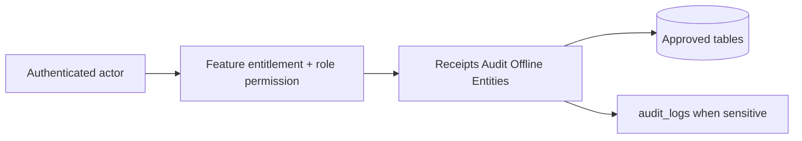

# Receipts Audit Offline Entities

## Purpose

This document is a module-wise entity reference generated from the approved database design. It uses table-level column definitions so developers can see primary keys, foreign keys, constraints, and implementation notes without depending on old Markdown content.

## Control rule

| Concern | Required behavior |
|---|---|
| Tenant access | Every tenant-level feature must be configurable by tenant role, user right, permission, and feature assignment. |
| Backend authority | API/application services must validate tenant, feature entitlement, runtime flag, role permission, and same-tenant foreign-key ownership. |
| Frontend behavior | UI may hide unavailable actions, but backend rejection is mandatory for unauthorized writes. |
| Platform exception | Platform-admin-only catalog and tenant-control features remain platform controlled. |

## Entity index

| Entity | Purpose | PK | FK count |
|---|---|---:|---:|
| `receipt_templates` | Tenant/outlet-specific receipt/invoice templates. | 1 | 2 |
| `receipts` | Stored receipt/invoice output with frozen payload and barcode. | 1 | 11 |
| `receipt_print_logs` | Print/reprint/email/download history. | 1 | 6 |
| `audit_logs` | Immutable business audit trail for platform and tenant actions. | 1 | 4 |
| `offline_sync_batches` | One reconnect/sync attempt from a POS device. | 1 | 3 |
| `offline_sync_items` | Generic sync item queue for offline-created records. | 1 | 3 |
| `offline_sale_sync_queue` | Typed offline sale staging queue kept for integration clarity; linked one-to-one with offline_sync_items. | 1 | 3 |
| `offline_payment_sync_queue` | Typed offline payment staging queue kept for integration clarity; linked one-to-one with offline_sync_items. | 1 | 3 |
| `offline_sync_conflicts` | Conflict record when offline sync cannot be accepted cleanly. | 1 | 4 |
| `offline_sync_audit_logs` | Technical audit trail for sync lifecycle events. | 1 | 4 |

## Table definitions

### `receipt_templates`

| Property | Detail |
|---|---|
| Database module | 12. Receipts, Audit and Offline Sync |
| Purpose | Tenant/outlet-specific receipt/invoice templates. |
| Ownership | Tenant-owned or tenant-linked; tenant consistency must be enforced through tenant_id or parent ownership. |
| Access control | Tenant-configurable access; operation requires enabled tenant feature plus role permission/user right. |
| Table rules | One default active template per tenant/outlet/document_type/format_type. |

| Column | Type | Key / Constraint | Reference / Note |
|---|---|---|---|
| `id` | `uuid` | PK | Primary key. |
| `tenant_id` | `uuid` | NOT NULL FK | References tenants(id). |
| `outlet_id` | `uuid` | NULL FK | Optional outlet-specific template. |
| `name` | `varchar(150)` | NOT NULL | Template name. |
| `document_type` | `varchar(30)` | NOT NULL CHECK | sale, order, return, exchange. |
| `format_type` | `varchar(30)` | NOT NULL CHECK | thermal, pdf, email, a4. |
| `paper_width` | `varchar(20)` | NOT NULL CHECK | 58mm, 80mm, a4. |
| `template_payload` | `jsonb` | NOT NULL | Layout/render config. |
| `barcode_enabled` | `boolean` | NOT NULL | Barcode/QR enabled. |
| `barcode_type` | `varchar(20)` | NULL CHECK | code128, qr, ean13. |
| `is_default` | `boolean` | NOT NULL | Default flag. |
| `is_active` | `boolean` | NOT NULL | Active flag. |
| `created_at` | `timestamptz` | NOT NULL | Creation time. |
| `updated_at` | `timestamptz` | NOT NULL | Last update time. |

| Key summary | Columns |
|---|---|
| Primary key | `id` |
| Foreign keys | `tenant_id`, `outlet_id` |

### `receipts`

| Property | Detail |
|---|---|
| Database module | 12. Receipts, Audit and Offline Sync |
| Purpose | Stored receipt/invoice output with frozen payload and barcode. |
| Ownership | Tenant-owned or tenant-linked; tenant consistency must be enforced through tenant_id or parent ownership. |
| Access control | Tenant-configurable access; operation requires enabled tenant feature plus role permission/user right. |
| Table rules | UNIQUE (tenant_id, receipt_number). UNIQUE (tenant_id, barcode_value) WHERE barcode_value IS NOT NULL. CHECK exactly one sale/order/return/exchange FK is set. |

| Column | Type | Key / Constraint | Reference / Note |
|---|---|---|---|
| `id` | `uuid` | PK | Primary key. |
| `tenant_id` | `uuid` | NOT NULL FK | References tenants(id). |
| `outlet_id` | `uuid` | NULL FK | Generating outlet. |
| `customer_id` | `uuid` | NULL FK | References customers(id). |
| `template_id` | `uuid` | NULL FK | References receipt_templates(id). |
| `document_type` | `varchar(30)` | NOT NULL CHECK | sale, order, return, exchange. |
| `sale_id` | `uuid` | NULL FK | References sales(id). |
| `order_id` | `uuid` | NULL FK | References orders(id). |
| `return_id` | `uuid` | NULL FK | References returns(id). |
| `exchange_id` | `uuid` | NULL FK | References exchanges(id). |
| `receipt_number` | `varchar(80)` | NOT NULL | Business receipt number. |
| `barcode_value` | `varchar(160)` | NULL | Scannable lookup value. |
| `barcode_type` | `varchar(20)` | NULL | code128, qr, ean13. |
| `format_type` | `varchar(30)` | NOT NULL CHECK | thermal, pdf, email, a4. |
| `print_status` | `varchar(30)` | NOT NULL CHECK | generated, printed, failed, reprinted. |
| `source_device_id` | `uuid` | NULL FK | References pos_devices(id). |
| `client_receipt_id` | `varchar(120)` | NULL | Offline receipt id. |
| `offline_generated_at` | `timestamptz` | NULL | Offline generation time. |
| `sync_batch_id` | `uuid` | NULL FK | References offline_sync_batches(id). |
| `synced_at` | `timestamptz` | NULL | Sync time. |
| `issued_at` | `timestamptz` | NOT NULL | Issue time. |
| `printed_at` | `timestamptz` | NULL | First print time. |
| `printed_by` | `uuid` | NULL FK | References users(id). |
| `reprint_count` | `int` | NOT NULL DEFAULT 0 | Reprint count. |
| `payload` | `jsonb` | NOT NULL | Frozen rendered payload. |

| Key summary | Columns |
|---|---|
| Primary key | `id` |
| Foreign keys | `tenant_id`, `outlet_id`, `customer_id`, `template_id`, `sale_id`, `order_id`, `return_id`, `exchange_id`, `source_device_id`, `sync_batch_id`, `printed_by` |

### `receipt_print_logs`

| Property | Detail |
|---|---|
| Database module | 12. Receipts, Audit and Offline Sync |
| Purpose | Print/reprint/email/download history. |
| Ownership | Tenant-owned or tenant-linked; tenant consistency must be enforced through tenant_id or parent ownership. |
| Access control | Tenant-configurable access; operation requires enabled tenant feature plus role permission/user right. |
| Table rules | Reprint must be permission-controlled in service layer and audited. |

| Column | Type | Key / Constraint | Reference / Note |
|---|---|---|---|
| `id` | `uuid` | PK | Primary key. |
| `tenant_id` | `uuid` | NOT NULL FK | References tenants(id). |
| `receipt_id` | `uuid` | NOT NULL FK | References receipts(id). |
| `outlet_id` | `uuid` | NULL FK | References outlets(id). |
| `till_id` | `uuid` | NULL FK | References tills(id). |
| `device_id` | `uuid` | NULL FK | References pos_devices(id). |
| `printed_by` | `uuid` | NULL FK | References users(id). |
| `print_action` | `varchar(30)` | NOT NULL CHECK | print, reprint, email, download. |
| `status` | `varchar(30)` | NOT NULL CHECK | success, failed. |
| `error_message` | `text` | NULL | Failure reason. |
| `printed_at` | `timestamptz` | NOT NULL | Action time. |

| Key summary | Columns |
|---|---|
| Primary key | `id` |
| Foreign keys | `tenant_id`, `receipt_id`, `outlet_id`, `till_id`, `device_id`, `printed_by` |

### `audit_logs`

| Property | Detail |
|---|---|
| Database module | 12. Receipts, Audit and Offline Sync |
| Purpose | Immutable business audit trail for platform and tenant actions. |
| Ownership | Mixed platform/tenant audit; tenant_id nullable only for platform-level actions. |
| Access control | Tenant-configurable access; operation requires enabled tenant feature plus role permission/user right. |
| Table rules | Tenant_id required for tenant business actions. Platform actions may have tenant_id null. Audit logs must not be updated by normal application users. |

| Column | Type | Key / Constraint | Reference / Note |
|---|---|---|---|
| `id` | `bigserial` | PK | Primary key. |
| `tenant_id` | `uuid` | NULL FK | References tenants(id); null allowed for platform-level actions. |
| `actor_platform_user_id` | `uuid` | NULL FK | References platform_users(id). |
| `actor_user_id` | `uuid` | NULL FK | References users(id). |
| `actor_device_id` | `uuid` | NULL FK | References pos_devices(id). |
| `actor_type` | `varchar(30)` | NOT NULL CHECK | platform_user, tenant_user, system, device, api. |
| `entity_type` | `varchar(100)` | NOT NULL | Entity/table name. |
| `entity_id` | `uuid` | NULL | Affected entity id. |
| `action` | `varchar(100)` | NOT NULL | Action performed. |
| `old_values` | `jsonb` | NULL | Before snapshot. |
| `new_values` | `jsonb` | NULL | After snapshot. |
| `ip` | `inet` | NULL | Source IP. |
| `user_agent` | `text` | NULL | User agent. |
| `created_at` | `timestamptz` | NOT NULL | Creation time. |

| Key summary | Columns |
|---|---|
| Primary key | `id` |
| Foreign keys | `tenant_id`, `actor_platform_user_id`, `actor_user_id`, `actor_device_id` |

### `offline_sync_batches`

| Property | Detail |
|---|---|
| Database module | 12. Receipts, Audit and Offline Sync |
| Purpose | One reconnect/sync attempt from a POS device. |
| Ownership | Tenant-owned or tenant-linked; tenant consistency must be enforced through tenant_id or parent ownership. |
| Access control | Tenant-configurable access; operation requires enabled tenant feature plus role permission/user right. |
| Table rules | Device, outlet and tenant must match. |

| Column | Type | Key / Constraint | Reference / Note |
|---|---|---|---|
| `id` | `uuid` | PK | Primary key. |
| `tenant_id` | `uuid` | NOT NULL FK | References tenants(id). |
| `outlet_id` | `uuid` | NOT NULL FK | References outlets(id). |
| `device_id` | `uuid` | NOT NULL FK | References pos_devices(id). |
| `sync_started_at` | `timestamptz` | NOT NULL | Start time. |
| `sync_completed_at` | `timestamptz` | NULL | Completion time. |
| `status` | `varchar(30)` | NOT NULL CHECK | pending, processing, completed, failed, partially_failed. |
| `total_items` | `int` | NOT NULL DEFAULT 0 | Total received items. |
| `success_count` | `int` | NOT NULL DEFAULT 0 | Accepted count. |
| `failed_count` | `int` | NOT NULL DEFAULT 0 | Failed count. |
| `error_message` | `text` | NULL | Batch error. |

| Key summary | Columns |
|---|---|
| Primary key | `id` |
| Foreign keys | `tenant_id`, `outlet_id`, `device_id` |

### `offline_sync_items`

| Property | Detail |
|---|---|
| Database module | 12. Receipts, Audit and Offline Sync |
| Purpose | Generic sync item queue for offline-created records. |
| Ownership | Tenant-owned or tenant-linked; tenant consistency must be enforced through tenant_id or parent ownership. |
| Access control | Tenant-configurable access; operation requires enabled tenant feature plus role permission/user right. |
| Table rules | UNIQUE (tenant_id, device_id, entity_type, client_entity_id). INDEX (tenant_id, device_id, client_transaction_id). One transaction can contain multiple payments or stock movements, so client_transaction_id must not be unique per entity_type. |

| Column | Type | Key / Constraint | Reference / Note |
|---|---|---|---|
| `id` | `uuid` | PK | Primary key. |
| `tenant_id` | `uuid` | NOT NULL FK | References tenants(id). |
| `sync_batch_id` | `uuid` | NOT NULL FK | References offline_sync_batches(id). |
| `device_id` | `uuid` | NOT NULL FK | References pos_devices(id). |
| `client_entity_id` | `varchar(120)` | NOT NULL | Local IndexedDB entity id. |
| `client_transaction_id` | `varchar(120)` | NOT NULL | Offline transaction group id. |
| `entity_type` | `varchar(40)` | NOT NULL CHECK | sale, payment, receipt, stock_movement, cash_movement, return, exchange. |
| `payload` | `jsonb` | NOT NULL | Client payload. |
| `sync_status` | `varchar(30)` | NOT NULL CHECK | pending, accepted, rejected, conflict. |
| `server_entity_id` | `uuid` | NULL | Created server record id. |
| `error_code` | `varchar(80)` | NULL | Failure code. |
| `error_message` | `text` | NULL | Failure message. |
| `created_at` | `timestamptz` | NOT NULL | Received time. |
| `processed_at` | `timestamptz` | NULL | Processed time. |

| Key summary | Columns |
|---|---|
| Primary key | `id` |
| Foreign keys | `tenant_id`, `sync_batch_id`, `device_id` |

### `offline_sale_sync_queue`

| Property | Detail |
|---|---|
| Database module | 12. Receipts, Audit and Offline Sync |
| Purpose | Typed offline sale staging queue kept for integration clarity; linked one-to-one with offline_sync_items. |
| Ownership | Tenant-owned or tenant-linked; tenant consistency must be enforced through tenant_id or parent ownership. |
| Access control | Tenant-configurable access; operation requires enabled tenant feature plus role permission/user right. |
| Table rules | UNIQUE (tenant_id, device_id, client_sale_id). This table is not source of truth; accepted sales are stored in sales/sale_lines/payments/stock_movements. |

| Column | Type | Key / Constraint | Reference / Note |
|---|---|---|---|
| `id` | `uuid` | PK | Primary key. |
| `tenant_id` | `uuid` | NOT NULL FK | References tenants(id). |
| `sync_item_id` | `uuid` | NOT NULL FK UNIQUE | References offline_sync_items(id). |
| `device_id` | `uuid` | NOT NULL FK | References pos_devices(id). |
| `client_transaction_id` | `varchar(120)` | NOT NULL | Offline transaction group id. |
| `client_sale_id` | `varchar(120)` | NOT NULL | Local sale id from device. |
| `sale_payload` | `jsonb` | NOT NULL | Typed sale payload from device. |
| `queue_status` | `varchar(30)` | NOT NULL CHECK | pending, processed, rejected, conflict. |
| `received_at` | `timestamptz` | NOT NULL | Received time. |
| `processed_at` | `timestamptz` | NULL | Processed time. |

| Key summary | Columns |
|---|---|
| Primary key | `id` |
| Foreign keys | `tenant_id`, `sync_item_id`, `device_id` |

### `offline_payment_sync_queue`

| Property | Detail |
|---|---|
| Database module | 12. Receipts, Audit and Offline Sync |
| Purpose | Typed offline payment staging queue kept for integration clarity; linked one-to-one with offline_sync_items. |
| Ownership | Tenant-owned or tenant-linked; tenant consistency must be enforced through tenant_id or parent ownership. |
| Access control | Tenant-configurable access; operation requires enabled tenant feature plus role permission/user right. |
| Table rules | UNIQUE (tenant_id, device_id, client_payment_id). This table is not source of truth; accepted payments are stored in payments and allocation tables. |

| Column | Type | Key / Constraint | Reference / Note |
|---|---|---|---|
| `id` | `uuid` | PK | Primary key. |
| `tenant_id` | `uuid` | NOT NULL FK | References tenants(id). |
| `sync_item_id` | `uuid` | NOT NULL FK UNIQUE | References offline_sync_items(id). |
| `device_id` | `uuid` | NOT NULL FK | References pos_devices(id). |
| `client_transaction_id` | `varchar(120)` | NOT NULL | Offline transaction group id. |
| `client_payment_id` | `varchar(120)` | NOT NULL | Local payment id from device. |
| `payment_payload` | `jsonb` | NOT NULL | Typed payment payload from device. |
| `queue_status` | `varchar(30)` | NOT NULL CHECK | pending, processed, rejected, conflict. |
| `received_at` | `timestamptz` | NOT NULL | Received time. |
| `processed_at` | `timestamptz` | NULL | Processed time. |

| Key summary | Columns |
|---|---|
| Primary key | `id` |
| Foreign keys | `tenant_id`, `sync_item_id`, `device_id` |

### `offline_sync_conflicts`

| Property | Detail |
|---|---|
| Database module | 12. Receipts, Audit and Offline Sync |
| Purpose | Conflict record when offline sync cannot be accepted cleanly. |
| Ownership | Tenant-owned or tenant-linked; tenant consistency must be enforced through tenant_id or parent ownership. |
| Access control | Tenant-configurable access; operation requires enabled tenant feature plus role permission/user right. |
| Table rules | Conflicts must be resolved explicitly; never silently corrupt stock or payment records. |

| Column | Type | Key / Constraint | Reference / Note |
|---|---|---|---|
| `id` | `uuid` | PK | Primary key. |
| `tenant_id` | `uuid` | NOT NULL FK | References tenants(id). |
| `sync_item_id` | `uuid` | NOT NULL FK | References offline_sync_items(id). |
| `device_id` | `uuid` | NOT NULL FK | References pos_devices(id). |
| `conflict_type` | `varchar(40)` | NOT NULL CHECK | duplicate, stock_mismatch, price_changed, closed_session, validation_failed. |
| `client_payload` | `jsonb` | NOT NULL | Client state. |
| `server_payload` | `jsonb` | NULL | Matching server state. |
| `resolution_status` | `varchar(30)` | NOT NULL CHECK | pending, resolved, ignored. |
| `resolved_by` | `uuid` | NULL FK | References users(id). |
| `resolved_at` | `timestamptz` | NULL | Resolution time. |
| `created_at` | `timestamptz` | NOT NULL | Creation time. |

| Key summary | Columns |
|---|---|
| Primary key | `id` |
| Foreign keys | `tenant_id`, `sync_item_id`, `device_id`, `resolved_by` |

### `offline_sync_audit_logs`

| Property | Detail |
|---|---|
| Database module | 12. Receipts, Audit and Offline Sync |
| Purpose | Technical audit trail for sync lifecycle events. |
| Ownership | Tenant-owned or tenant-linked; tenant consistency must be enforced through tenant_id or parent ownership. |
| Access control | Tenant-configurable access; operation requires enabled tenant feature plus role permission/user right. |
| Table rules | Business actions still go to audit_logs; this table is for sync diagnostics only. |

| Column | Type | Key / Constraint | Reference / Note |
|---|---|---|---|
| `id` | `bigserial` | PK | Primary key. |
| `tenant_id` | `uuid` | NOT NULL FK | References tenants(id). |
| `sync_batch_id` | `uuid` | NULL FK | References offline_sync_batches(id). |
| `sync_item_id` | `uuid` | NULL FK | References offline_sync_items(id). |
| `device_id` | `uuid` | NULL FK | References pos_devices(id). |
| `event_type` | `varchar(50)` | NOT NULL CHECK | batch_started, item_accepted, item_rejected, conflict_created, retry, batch_completed. |
| `message` | `text` | NULL | Diagnostic message. |
| `payload` | `jsonb` | NULL | Technical payload. |
| `created_at` | `timestamptz` | NOT NULL | Creation time. |

| Key summary | Columns |
|---|---|
| Primary key | `id` |
| Foreign keys | `tenant_id`, `sync_batch_id`, `sync_item_id`, `device_id` |

## Module data flow

## Implementation notes

- Service validation must mirror database uniqueness and status constraints before persistence.
- Repository queries must include tenant filters for tenant-owned records.
- Foreign-key values submitted by clients must be checked for same-tenant ownership.
- Permission codes should be module/action specific, for example `module.entity.action`.
- Mutation endpoints should be idempotent where duplicate client requests or offline sync can occur.

## Related documents

- [[../data-dictionary-index]]
- [[../database-overview]]
- [[../schema-principles]]
- [[../tenant-consistency-rules]]