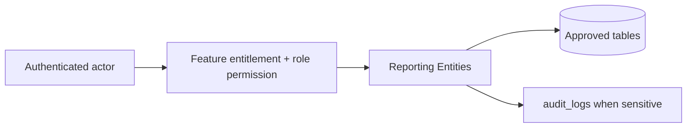

# Reporting Entities

## Purpose

This document is a module-wise entity reference generated from the approved database design. It uses table-level column definitions so developers can see primary keys, foreign keys, constraints, and implementation notes without depending on old Markdown content.

## Control rule

| Concern | Required behavior |
|---|---|
| Tenant access | Every tenant-level feature must be configurable by tenant role, user right, permission, and feature assignment. |
| Backend authority | API/application services must validate tenant, feature entitlement, runtime flag, role permission, and same-tenant foreign-key ownership. |
| Frontend behavior | UI may hide unavailable actions, but backend rejection is mandatory for unauthorized writes. |
| Platform exception | Platform-admin-only catalog and tenant-control features remain platform controlled. |

## Entity index

| Entity | Purpose | PK | FK count |
|---|---|---:|---:|
| `daily_sales_summaries` | Daily sales dashboard summary by tenant/outlet/channel. | 1 | 2 |
| `daily_payment_summaries` | Daily payment totals by method. | 1 | 3 |
| `daily_inventory_summaries` | Daily inventory movement summary. | 1 | 3 |
| `daily_discount_return_summaries` | Daily discount, return and exchange summary. | 1 | 2 |

## Table definitions

### `daily_sales_summaries`

| Property | Detail |
|---|---|
| Database module | 13. Reporting Read Models |
| Purpose | Daily sales dashboard summary by tenant/outlet/channel. |
| Ownership | Tenant-owned or tenant-linked; tenant consistency must be enforced through tenant_id or parent ownership. |
| Access control | Tenant-configurable access; operation requires enabled tenant feature plus role permission/user right. |
| Table rules | UNIQUE (tenant_id, scope_type, scope_key, channel, business_date). Read model only; not financial source of truth. |

| Column | Type | Key / Constraint | Reference / Note |
|---|---|---|---|
| `id` | `uuid` | PK | Primary key. |
| `tenant_id` | `uuid` | NOT NULL FK | References tenants(id). |
| `scope_type` | `varchar(20)` | NOT NULL CHECK | tenant, outlet. |
| `scope_key` | `varchar(80)` | NOT NULL | TENANT or outlet id string; avoids nullable unique issue. |
| `outlet_id` | `uuid` | NULL FK | References outlets(id) when scope_type=outlet. |
| `channel` | `varchar(20)` | NOT NULL CHECK | pos, ecommerce, all. |
| `business_date` | `date` | NOT NULL | Business date. |
| `gross_sales` | `numeric(12,2)` | NOT NULL | Gross sales. |
| `discount_total` | `numeric(12,2)` | NOT NULL | Discount total. |
| `tax_total` | `numeric(12,2)` | NOT NULL | Tax total. |
| `net_sales` | `numeric(12,2)` | NOT NULL | Net sales. |
| `return_total` | `numeric(12,2)` | NOT NULL | Return total. |
| `transaction_count` | `int` | NOT NULL | Transaction count. |
| `created_at` | `timestamptz` | NOT NULL | Creation time. |
| `updated_at` | `timestamptz` | NOT NULL | Last update time. |

| Key summary | Columns |
|---|---|
| Primary key | `id` |
| Foreign keys | `tenant_id`, `outlet_id` |

### `daily_payment_summaries`

| Property | Detail |
|---|---|
| Database module | 13. Reporting Read Models |
| Purpose | Daily payment totals by method. |
| Ownership | Tenant-owned or tenant-linked; tenant consistency must be enforced through tenant_id or parent ownership. |
| Access control | Tenant-configurable access; operation requires enabled tenant feature plus role permission/user right. |
| Table rules | UNIQUE (tenant_id, scope_type, scope_key, business_date, payment_method_type_id). |

| Column | Type | Key / Constraint | Reference / Note |
|---|---|---|---|
| `id` | `uuid` | PK | Primary key. |
| `tenant_id` | `uuid` | NOT NULL FK | References tenants(id). |
| `scope_type` | `varchar(20)` | NOT NULL CHECK | tenant, outlet. |
| `scope_key` | `varchar(80)` | NOT NULL | TENANT or outlet id string. |
| `outlet_id` | `uuid` | NULL FK | References outlets(id). |
| `business_date` | `date` | NOT NULL | Business date. |
| `payment_method_type_id` | `smallint` | NOT NULL FK | References payment_method_types(id). |
| `payment_count` | `int` | NOT NULL | Payment count. |
| `total_amount` | `numeric(12,2)` | NOT NULL | Total amount. |
| `created_at` | `timestamptz` | NOT NULL | Creation time. |
| `updated_at` | `timestamptz` | NOT NULL | Last update time. |

| Key summary | Columns |
|---|---|
| Primary key | `id` |
| Foreign keys | `tenant_id`, `outlet_id`, `payment_method_type_id` |

### `daily_inventory_summaries`

| Property | Detail |
|---|---|
| Database module | 13. Reporting Read Models |
| Purpose | Daily inventory movement summary. |
| Ownership | Tenant-owned or tenant-linked; tenant consistency must be enforced through tenant_id or parent ownership. |
| Access control | Tenant-configurable access; operation requires enabled tenant feature plus role permission/user right. |
| Table rules | UNIQUE (tenant_id, outlet_id, variant_id, business_date). |

| Column | Type | Key / Constraint | Reference / Note |
|---|---|---|---|
| `id` | `uuid` | PK | Primary key. |
| `tenant_id` | `uuid` | NOT NULL FK | References tenants(id). |
| `outlet_id` | `uuid` | NOT NULL FK | References outlets(id). |
| `variant_id` | `uuid` | NOT NULL FK | References product_variants(id). |
| `business_date` | `date` | NOT NULL | Business date. |
| `opening_qty` | `numeric(14,3)` | NOT NULL | Opening quantity. |
| `in_qty` | `numeric(14,3)` | NOT NULL | Incoming quantity. |
| `out_qty` | `numeric(14,3)` | NOT NULL | Outgoing quantity. |
| `closing_qty` | `numeric(14,3)` | NOT NULL | Closing quantity. |
| `created_at` | `timestamptz` | NOT NULL | Creation time. |
| `updated_at` | `timestamptz` | NOT NULL | Last update time. |

| Key summary | Columns |
|---|---|
| Primary key | `id` |
| Foreign keys | `tenant_id`, `outlet_id`, `variant_id` |

### `daily_discount_return_summaries`

| Property | Detail |
|---|---|
| Database module | 13. Reporting Read Models |
| Purpose | Daily discount, return and exchange summary. |
| Ownership | Tenant-owned or tenant-linked; tenant consistency must be enforced through tenant_id or parent ownership. |
| Access control | Tenant-configurable access; operation requires enabled tenant feature plus role permission/user right. |
| Table rules | UNIQUE (tenant_id, scope_type, scope_key, channel, business_date). |

| Column | Type | Key / Constraint | Reference / Note |
|---|---|---|---|
| `id` | `uuid` | PK | Primary key. |
| `tenant_id` | `uuid` | NOT NULL FK | References tenants(id). |
| `scope_type` | `varchar(20)` | NOT NULL CHECK | tenant, outlet. |
| `scope_key` | `varchar(80)` | NOT NULL | TENANT or outlet id string. |
| `outlet_id` | `uuid` | NULL FK | References outlets(id). |
| `channel` | `varchar(20)` | NOT NULL CHECK | pos, ecommerce, all. |
| `business_date` | `date` | NOT NULL | Business date. |
| `discount_count` | `int` | NOT NULL | Discount count. |
| `discount_total` | `numeric(12,2)` | NOT NULL | Discount amount. |
| `return_count` | `int` | NOT NULL | Return count. |
| `return_total` | `numeric(12,2)` | NOT NULL | Return amount. |
| `exchange_count` | `int` | NOT NULL | Exchange count. |
| `exchange_difference_total` | `numeric(12,2)` | NOT NULL | Exchange difference total. |
| `created_at` | `timestamptz` | NOT NULL | Creation time. |
| `updated_at` | `timestamptz` | NOT NULL | Last update time. |

| Key summary | Columns |
|---|---|
| Primary key | `id` |
| Foreign keys | `tenant_id`, `outlet_id` |

## Module data flow

## Implementation notes

- Service validation must mirror database uniqueness and status constraints before persistence.
- Repository queries must include tenant filters for tenant-owned records.
- Foreign-key values submitted by clients must be checked for same-tenant ownership.
- Permission codes should be module/action specific, for example `module.entity.action`.
- Mutation endpoints should be idempotent where duplicate client requests or offline sync can occur.

## Related documents

- [[../data-dictionary-index]]
- [[../database-overview]]
- [[../schema-principles]]
- [[../tenant-consistency-rules]]