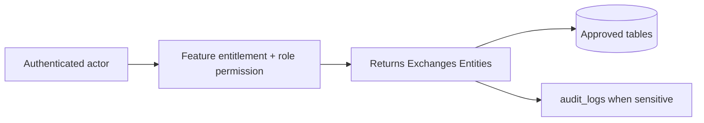

# Returns Exchanges Entities

## Purpose

This document is a module-wise entity reference generated from the approved database design. It uses table-level column definitions so developers can see primary keys, foreign keys, constraints, and implementation notes without depending on old Markdown content.

## Control rule

| Concern | Required behavior |
|---|---|
| Tenant access | Every tenant-level feature must be configurable by tenant role, user right, permission, and feature assignment. |
| Backend authority | API/application services must validate tenant, feature entitlement, runtime flag, role permission, and same-tenant foreign-key ownership. |
| Frontend behavior | UI may hide unavailable actions, but backend rejection is mandatory for unauthorized writes. |
| Platform exception | Platform-admin-only catalog and tenant-control features remain platform controlled. |

## Entity index

| Entity | Purpose | PK | FK count |
|---|---|---:|---:|
| `return_reason_codes` | Tenant-owned return reasons. | 1 | 1 |
| `returns` | Return header for POS sale or E-Commerce order. | 1 | 9 |
| `return_lines` | Returned line items. | 1 | 5 |
| `return_refund_allocations` | Allocates refunds to return documents. | 1 | 3 |
| `exchanges` | Exchange header created from a return. | 1 | 5 |
| `exchange_lines` | New items issued in exchange. | 1 | 3 |
| `exchange_payment_allocations` | Additional collection payment for exchange difference. | 1 | 3 |
| `exchange_refund_allocations` | Refund allocation for exchange difference. | 1 | 3 |

## Table definitions

### `return_reason_codes`

| Property | Detail |
|---|---|
| Database module | 11. Returns and Exchanges |
| Purpose | Tenant-owned return reasons. |
| Ownership | Tenant-owned or tenant-linked; tenant consistency must be enforced through tenant_id or parent ownership. |
| Access control | Tenant-configurable access; operation requires enabled tenant feature plus role permission/user right. |
| Table rules | UNIQUE (tenant_id, code). |

| Column | Type | Key / Constraint | Reference / Note |
|---|---|---|---|
| `id` | `uuid` | PK | Primary key. |
| `tenant_id` | `uuid` | NOT NULL FK | References tenants(id). |
| `code` | `varchar(80)` | NOT NULL | Reason code. |
| `name` | `varchar(150)` | NOT NULL | Reason label. |
| `is_active` | `boolean` | NOT NULL | Active flag. |

| Key summary | Columns |
|---|---|
| Primary key | `id` |
| Foreign keys | `tenant_id` |

### `returns`

| Property | Detail |
|---|---|
| Database module | 11. Returns and Exchanges |
| Purpose | Return header for POS sale or E-Commerce order. |
| Ownership | Tenant-owned or tenant-linked; tenant consistency must be enforced through tenant_id or parent ownership. |
| Access control | Tenant-configurable access; operation requires enabled tenant feature plus role permission/user right. |
| Table rules | UNIQUE (tenant_id, return_number). CHECK exactly one of source_sale_id/source_order_id is not null. |

| Column | Type | Key / Constraint | Reference / Note |
|---|---|---|---|
| `id` | `uuid` | PK | Primary key. |
| `tenant_id` | `uuid` | NOT NULL FK | References tenants(id). |
| `return_number` | `varchar(80)` | NOT NULL | Business return number. |
| `customer_id` | `uuid` | NULL FK | References customers(id). |
| `source_sale_id` | `uuid` | NULL FK | References sales(id). |
| `source_order_id` | `uuid` | NULL FK | References orders(id). |
| `original_outlet_id` | `uuid` | NULL FK | Original sale/fulfillment outlet. |
| `return_outlet_id` | `uuid` | NULL FK | Processing outlet. |
| `status` | `varchar(30)` | NOT NULL CHECK | initiated, approved, received, partially_refunded, refunded, completed, rejected, cancelled. |
| `reason_code_id` | `uuid` | NULL FK | References return_reason_codes(id). |
| `refund_total` | `numeric(12,2)` | NOT NULL | Total refund amount. |
| `created_by` | `uuid` | NULL FK | References users(id). |
| `approved_by` | `uuid` | NULL FK | References users(id). |
| `approved_at` | `timestamptz` | NULL | Approval time. |
| `received_at` | `timestamptz` | NULL | Receipt time. |
| `refunded_at` | `timestamptz` | NULL | Refund time. |
| `created_at` | `timestamptz` | NOT NULL | Creation time. |
| `updated_at` | `timestamptz` | NOT NULL | Last update time. |

| Key summary | Columns |
|---|---|
| Primary key | `id` |
| Foreign keys | `tenant_id`, `customer_id`, `source_sale_id`, `source_order_id`, `original_outlet_id`, `return_outlet_id`, `reason_code_id`, `created_by`, `approved_by` |

### `return_lines`

| Property | Detail |
|---|---|
| Database module | 11. Returns and Exchanges |
| Purpose | Returned line items. |
| Ownership | Tenant-owned or tenant-linked; tenant consistency must be enforced through tenant_id or parent ownership. |
| Access control | Tenant-configurable access; operation requires enabled tenant feature plus role permission/user right. |
| Table rules | UNIQUE (tenant_id, return_id, line_no). CHECK exactly one source line is not null. |

| Column | Type | Key / Constraint | Reference / Note |
|---|---|---|---|
| `id` | `uuid` | PK | Primary key. |
| `tenant_id` | `uuid` | NOT NULL FK | References tenants(id). |
| `return_id` | `uuid` | NOT NULL FK | References returns(id). |
| `line_no` | `int` | NOT NULL | Line number. |
| `source_sale_line_id` | `uuid` | NULL FK | References sale_lines(id). |
| `source_order_item_id` | `uuid` | NULL FK | References order_items(id). |
| `variant_id` | `uuid` | NOT NULL FK | References product_variants(id). |
| `qty` | `numeric(14,3)` | NOT NULL CHECK | > 0. |
| `received_qty` | `numeric(14,3)` | NOT NULL DEFAULT 0 | Physically received qty. |
| `condition_status` | `varchar(30)` | NOT NULL CHECK | sellable, damaged, opened, expired. |
| `unit_refund` | `numeric(12,2)` | NOT NULL | Unit refund. |
| `tax_refund` | `numeric(12,2)` | NOT NULL | Tax refund. |
| `line_refund_total` | `numeric(12,2)` | NOT NULL | Line refund total. |
| `restock_action` | `varchar(30)` | NOT NULL CHECK | restock, quarantine, discard. |

| Key summary | Columns |
|---|---|
| Primary key | `id` |
| Foreign keys | `tenant_id`, `return_id`, `source_sale_line_id`, `source_order_item_id`, `variant_id` |

### `return_refund_allocations`

| Property | Detail |
|---|---|
| Database module | 11. Returns and Exchanges |
| Purpose | Allocates refunds to return documents. |
| Ownership | Tenant-owned or tenant-linked; tenant consistency must be enforced through tenant_id or parent ownership. |
| Access control | Tenant-configurable access; operation requires enabled tenant feature plus role permission/user right. |
| Table rules | UNIQUE (tenant_id, return_id, refund_id). |

| Column | Type | Key / Constraint | Reference / Note |
|---|---|---|---|
| `id` | `uuid` | PK | Primary key. |
| `tenant_id` | `uuid` | NOT NULL FK | References tenants(id). |
| `return_id` | `uuid` | NOT NULL FK | References returns(id). |
| `refund_id` | `uuid` | NOT NULL FK | References refunds(id). |
| `amount` | `numeric(12,2)` | NOT NULL CHECK | > 0. |

| Key summary | Columns |
|---|---|
| Primary key | `id` |
| Foreign keys | `tenant_id`, `return_id`, `refund_id` |

### `exchanges`

| Property | Detail |
|---|---|
| Database module | 11. Returns and Exchanges |
| Purpose | Exchange header created from a return. |
| Ownership | Tenant-owned or tenant-linked; tenant consistency must be enforced through tenant_id or parent ownership. |
| Access control | Tenant-configurable access; operation requires enabled tenant feature plus role permission/user right. |
| Table rules | UNIQUE (tenant_id, exchange_number). UNIQUE (tenant_id, source_return_id) for one exchange per return in core design. |

| Column | Type | Key / Constraint | Reference / Note |
|---|---|---|---|
| `id` | `uuid` | PK | Primary key. |
| `tenant_id` | `uuid` | NOT NULL FK | References tenants(id). |
| `exchange_number` | `varchar(80)` | NOT NULL | Business exchange number. |
| `source_return_id` | `uuid` | NOT NULL FK | References returns(id). |
| `original_outlet_id` | `uuid` | NULL FK | Original outlet. |
| `exchange_outlet_id` | `uuid` | NULL FK | Processing outlet. |
| `status` | `varchar(30)` | NOT NULL CHECK | draft, completed, cancelled. |
| `old_value_total` | `numeric(12,2)` | NOT NULL | Returned value. |
| `new_value_total` | `numeric(12,2)` | NOT NULL | New item value. |
| `difference_total` | `numeric(12,2)` | NOT NULL | Net difference. |
| `difference_direction` | `varchar(20)` | NOT NULL CHECK | collect, refund, none. |
| `created_by` | `uuid` | NULL FK | References users(id). |
| `created_at` | `timestamptz` | NOT NULL | Creation time. |
| `completed_at` | `timestamptz` | NULL | Completion time. |
| `updated_at` | `timestamptz` | NOT NULL | Last update time. |

| Key summary | Columns |
|---|---|
| Primary key | `id` |
| Foreign keys | `tenant_id`, `source_return_id`, `original_outlet_id`, `exchange_outlet_id`, `created_by` |

### `exchange_lines`

| Property | Detail |
|---|---|
| Database module | 11. Returns and Exchanges |
| Purpose | New items issued in exchange. |
| Ownership | Tenant-owned or tenant-linked; tenant consistency must be enforced through tenant_id or parent ownership. |
| Access control | Tenant-configurable access; operation requires enabled tenant feature plus role permission/user right. |
| Table rules | UNIQUE (tenant_id, exchange_id, line_no). |

| Column | Type | Key / Constraint | Reference / Note |
|---|---|---|---|
| `id` | `uuid` | PK | Primary key. |
| `tenant_id` | `uuid` | NOT NULL FK | References tenants(id). |
| `exchange_id` | `uuid` | NOT NULL FK | References exchanges(id). |
| `variant_id` | `uuid` | NOT NULL FK | References product_variants(id). |
| `line_no` | `int` | NOT NULL | Line number. |
| `qty` | `numeric(14,3)` | NOT NULL CHECK | > 0. |
| `unit_price` | `numeric(12,2)` | NOT NULL | Unit price. |
| `tax_total` | `numeric(12,2)` | NOT NULL | Tax. |
| `line_total` | `numeric(12,2)` | NOT NULL | Line total. |
| `pricing_snapshot` | `jsonb` | NOT NULL | Frozen pricing/tax snapshot. |

| Key summary | Columns |
|---|---|
| Primary key | `id` |
| Foreign keys | `tenant_id`, `exchange_id`, `variant_id` |

### `exchange_payment_allocations`

| Property | Detail |
|---|---|
| Database module | 11. Returns and Exchanges |
| Purpose | Additional collection payment for exchange difference. |
| Ownership | Tenant-owned or tenant-linked; tenant consistency must be enforced through tenant_id or parent ownership. |
| Access control | Tenant-configurable access; operation requires enabled tenant feature plus role permission/user right. |
| Table rules | Only inbound exchange_difference payments are allowed. |

| Column | Type | Key / Constraint | Reference / Note |
|---|---|---|---|
| `id` | `uuid` | PK | Primary key. |
| `tenant_id` | `uuid` | NOT NULL FK | References tenants(id). |
| `exchange_id` | `uuid` | NOT NULL FK | References exchanges(id). |
| `payment_id` | `uuid` | NOT NULL FK | References payments(id). |
| `amount` | `numeric(12,2)` | NOT NULL CHECK | > 0. |

| Key summary | Columns |
|---|---|
| Primary key | `id` |
| Foreign keys | `tenant_id`, `exchange_id`, `payment_id` |

### `exchange_refund_allocations`

| Property | Detail |
|---|---|
| Database module | 11. Returns and Exchanges |
| Purpose | Refund allocation for exchange difference. |
| Ownership | Tenant-owned or tenant-linked; tenant consistency must be enforced through tenant_id or parent ownership. |
| Access control | Tenant-configurable access; operation requires enabled tenant feature plus role permission/user right. |
| Table rules | Only refund records related to exchange difference are allowed. |

| Column | Type | Key / Constraint | Reference / Note |
|---|---|---|---|
| `id` | `uuid` | PK | Primary key. |
| `tenant_id` | `uuid` | NOT NULL FK | References tenants(id). |
| `exchange_id` | `uuid` | NOT NULL FK | References exchanges(id). |
| `refund_id` | `uuid` | NOT NULL FK | References refunds(id). |
| `amount` | `numeric(12,2)` | NOT NULL CHECK | > 0. |

| Key summary | Columns |
|---|---|
| Primary key | `id` |
| Foreign keys | `tenant_id`, `exchange_id`, `refund_id` |

## Module data flow

## Implementation notes

- Service validation must mirror database uniqueness and status constraints before persistence.
- Repository queries must include tenant filters for tenant-owned records.
- Foreign-key values submitted by clients must be checked for same-tenant ownership.
- Permission codes should be module/action specific, for example `module.entity.action`.
- Mutation endpoints should be idempotent where duplicate client requests or offline sync can occur.

## Related documents

- [[../data-dictionary-index]]
- [[../database-overview]]
- [[../schema-principles]]
- [[../tenant-consistency-rules]]