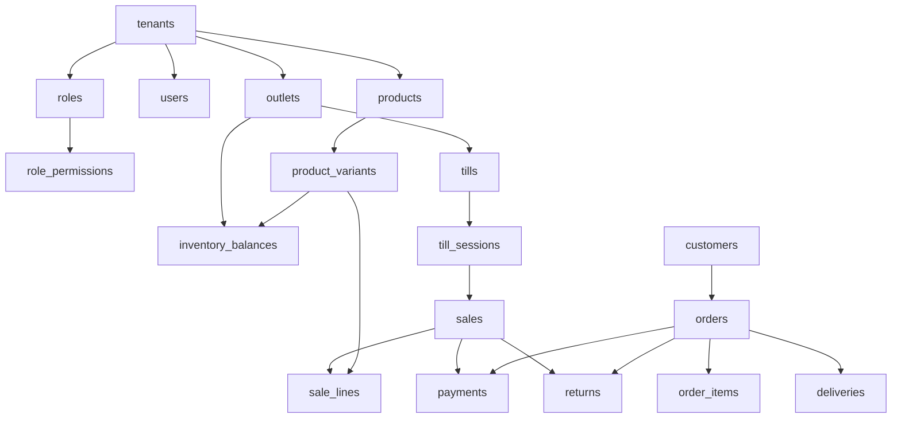

# Entity Relationship Map

## Purpose

This document gives the high-level relationship path between major data areas. Full column-level PK/FK details are maintained in [[entities/README]].

## Core relationship diagram

## Interpretation rules

| Relationship | Rule |
|---|---|
| Tenant to child | Child must never cross tenant boundaries. |
| Product to variant | Variants are sellable SKU/barcode units. |
| Stock to variant/outlet | Stock is stored by outlet and variant, not on product. |
| Sale/order to payments | Payments are allocated through allocation tables. |
| Return/exchange | Must reference original sale/order or return according to table rules. |

## Related documents

- [[data-dictionary-index]]
- [[entities/catalog-entities]]
- [[entities/pos-device-sales-entities]]
