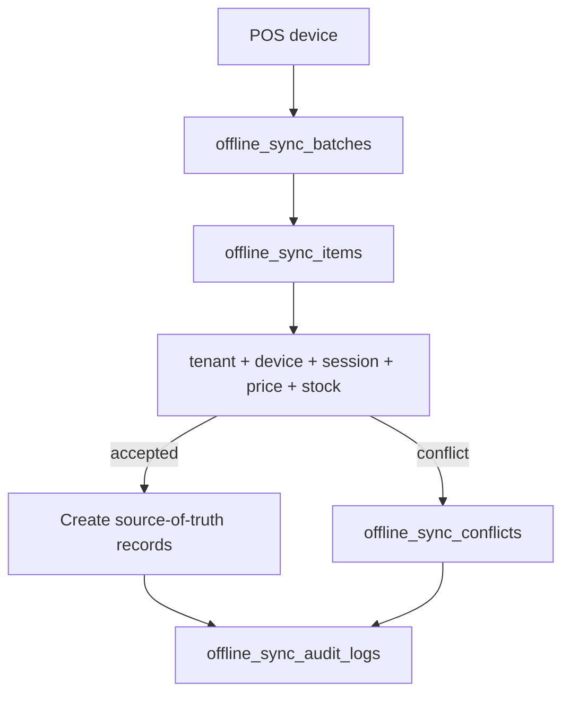

# Offline Sync Data Model

## Purpose

Offline POS allows billing during connectivity loss, but the server remains the final authority when queued transactions sync.

## Approved sync tables

| Table | Role |
|---|---|
| `offline_sync_batches` | One reconnect/sync attempt from a POS device. |
| `offline_sync_items` | Generic queue item for offline-created records. |
| `offline_sale_sync_queue` | Typed sale staging linked one-to-one with sync item. |
| `offline_payment_sync_queue` | Typed payment staging linked one-to-one with sync item. |
| `offline_sync_conflicts` | Explicit conflict record. |
| `offline_sync_audit_logs` | Technical sync lifecycle audit. |

## Sync acceptance flow

## Conflict rules

| Conflict | Required behavior |
|---|---|
| Duplicate | Reject or map to existing server entity through idempotency. |
| Stock mismatch | Create conflict; do not silently corrupt inventory. |
| Closed session | Reject or require manager-controlled resolution. |
| Price changed | Follow documented offline pricing policy. |
| Validation failed | Store rejected status and error message. |

## Related documents

- [[entities/receipts-audit-offline-entities]]
- [[tenant-consistency-rules]]
