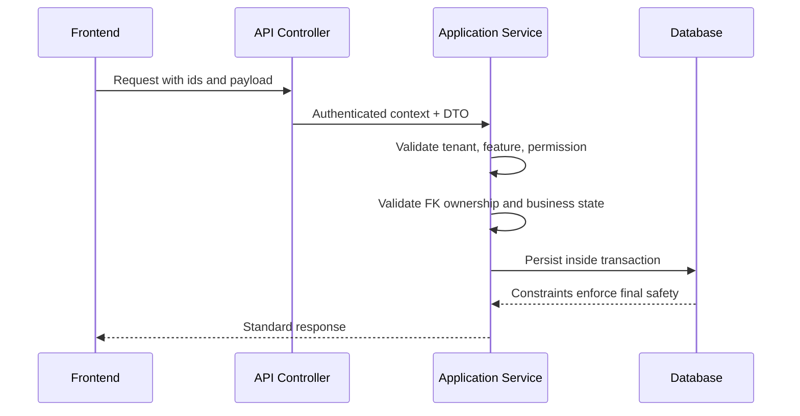

# Schema Principles

## Purpose

This document defines the rules developers must follow when implementing the approved database design.

## Core principles

| Principle | Required behavior |
|---|---|
| Tenant isolation | Tenant-owned data must be filtered by authenticated tenant context. |
| Configurable access | Tenant-level features must not use fixed access assumptions. |
| Normalized writes | Transactional source-of-truth data must stay normalized. |
| Ledgers over overwrites | Stock, loyalty, gateway events, and audit history use append-style records. |
| Read models are projections | Reporting summaries are rebuildable summaries, not source ledgers. |
| Same-tenant references | FK values must belong to the same tenant unless they reference platform catalog data. |

## Write validation sequence

## Do not create

| Wrong pattern | Reason |
|---|---|
| Generic cache tables | Not in approved schema and can conflict with source-of-truth rules. |
| Hardcoded cashier/manager rights | Tenant-specific RBAC and feature assignment are required. |
| Stock quantity on products | Stock belongs to outlet/variant inventory tables. |
| Plain secrets in JSON config | Payment secrets must use secret references. |

## Related documents

- [[database-overview]]
- [[tenant-consistency-rules]]
- [[indexing-strategy]]
