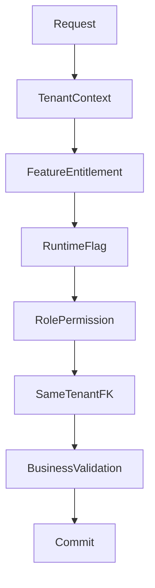

# Tenant Consistency Rules

## Purpose

Tenant consistency prevents cross-customer data leakage and wrong operational results.

## Required checks

| Check | Example |
|---|---|
| Parent ownership | `outlet_id` must belong to the authenticated `tenant_id`. |
| Role ownership | `role_id` in role assignments must belong to the same tenant. |
| Product ownership | `variant_id` used in sale/order lines must belong to the same tenant. |
| Payment ownership | Payment allocations must match sale/order tenant. |
| Offline device ownership | `device_id`, outlet, and tenant must match the sync batch. |

## Backend policy example

```csharp
if (entity.TenantId != context.TenantId)
    throw new ForbiddenException("Cross-tenant reference is not allowed.");
```

## Access validation chain



## Notes

- Frontend route guards improve UX but do not replace backend checks.
- Tenant ids from request body must not override authenticated context.
- Platform-admin actions may operate across tenants only through platform-admin APIs.

## Related documents

- [[schema-principles]]
- [[entities/identity-access-entities]]
