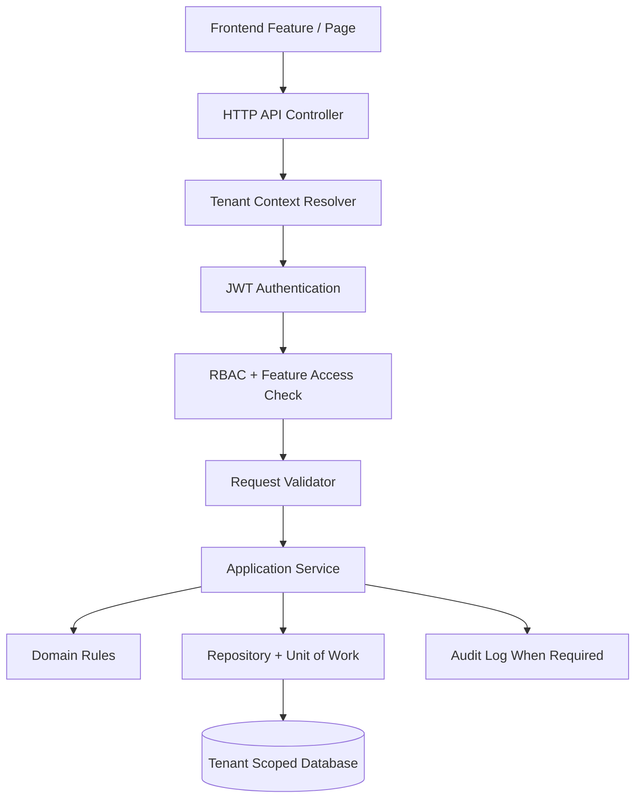

# 04 API Documentation

## Purpose
This folder defines the API contract rules for the Unified Commerce multi-tenant SaaS platform.
It is written for backend developers, frontend developers, testers, AI IDE tools, and technical reviewers.
API design must align with the approved scope, database schema, frontend architecture, and backend Clean Architecture.
No endpoint may bypass tenant isolation, configurable RBAC, feature entitlement, or audit expectations.

## Source Priority
| Priority | Source | Usage |
|---:|---|---|
| 1 | Scope document | Business modules, actors, workflows, and boundaries |
| 2 | Database design | Entity ownership, relationships, constraints, and source-of-truth tables |
| 3 | Backend architecture | Controller, service, repository, validator, and transaction placement |
| 4 | Frontend architecture | Route guards, pages, feature modules, state, and API consumers |
| 5 | This API folder | Contract implementation rules derived from the approved documents |

## Folder Reading Order
1. [[api-overview]]
2. [[tenant-context-api-rules]]
3. [[auth-and-authorization]]
4. [[request-response-standard]]
5. [[error-contract]]
6. [[endpoint-design]]
7. [[feature-access-api-rules]]
8. [[idempotency-rules]]
9. [[concurrency-rules]]
10. [[device-session-api-rules]]
11. [[offline-sync-api-rules]]
12. [[module-endpoint-map]]

## Core API Principles
- APIs are tenant-aware unless they are explicitly platform-admin APIs.
- Tenant data must never be selected, updated, or deleted without tenant context.
- Backend is the final authority for permission, feature access, stock, pricing, tax, payment, sync, and audit.
- Frontend route guards improve UX but are not security boundaries.
- Every non-platform feature must be controlled by tenant configuration, role permissions, and user rights.
- API contracts must be stable, predictable, and version-ready.
- Sensitive changes must be traceable through audit behavior.

## API Boundary Diagram


## API Document Responsibilities
| File | Main Responsibility |
|---|---|
| [[api-overview]] | API architecture, route groups, ownership, and common behavior |
| [[auth-and-authorization]] | JWT, login flows, claims, roles, permissions, and authorization checks |
| [[tenant-context-api-rules]] | How tenant context is resolved and validated |
| [[feature-access-api-rules]] | Tenant entitlements, feature flags, role-feature assignments, and permissions |
| [[request-response-standard]] | Standard request, response, pagination, sorting, and filter contracts |
| [[error-contract]] | Standard API error structure and status code usage |
| [[endpoint-design]] | Naming, versioning, REST boundaries, and route conventions |
| [[module-endpoint-map]] | Module-wise endpoint planning map |
| [[idempotency-rules]] | Duplicate-safe writes for payments, orders, sales, sync, and devices |
| [[concurrency-rules]] | Race-condition handling and locking rules |
| [[device-session-api-rules]] | POS device, till, session, and cashier API rules |
| [[offline-sync-api-rules]] | Offline sync, queues, conflicts, and replay handling |

## Platform API vs Tenant API
| API Type | Example | Tenant Context | Feature Configurable | Access Owner |
|---|---|---|---|---|
| Platform Admin | Create tenant | Optional / selected target tenant | No, platform-owned | Platform RBAC |
| Tenant Admin | Create outlet | Required | Yes | Tenant RBAC |
| Outlet Staff | Create sale | Required + outlet | Yes | Tenant/outlet RBAC |
| Customer | Place order | Required by storefront tenant | Yes | Customer rules + tenant feature config |
| Device Sync | Sync offline sale | Required + outlet + device | Yes | Device + user + tenant policy |

## Minimum API Checklist
- Resolve authenticated actor from JWT.
- Resolve tenant context safely.
- Validate target outlet/device belongs to the same tenant.
- Check tenant status before operational writes.
- Check platform feature entitlement for feature-gated actions.
- Check runtime feature flag when configured.
- Check role permission and role-feature assignment.
- Validate request body and route parameters.
- Execute business workflow through application service.
- Use transaction boundaries for multi-table writes.
- Return standard success or error response.
- Write audit logs for sensitive actions.

## API Versioning Policy
- Initial API routes should be designed as `/api/v1/...`.
- Breaking changes require a new version path.
- Internal DTO changes should not break public API contracts.
- Do not expose database table shape directly as API response shape.
- Keep command endpoints explicit for business actions such as approve, post, close, void, sync, and resolve.

## Example Standard Route Groups
```http
POST /api/v1/platform/tenants
GET  /api/v1/tenants/{tenantId}/outlets
POST /api/v1/catalog/products
POST /api/v1/pos/sales
POST /api/v1/payments
POST /api/v1/offline/sync-batches
```

## Implementation Alignment
- API controllers live under `POS.API/Modules/<Module>/Controllers`.
- Request and response models live under the matching API module folder.
- Business orchestration belongs in `POS.Application/Modules/<Module>`.
- Pure business invariants belong in `POS.Domain/Modules/<Module>` where appropriate.
- Database access belongs in `POS.Infrastructure/Repositories` through interfaces.
- Cross-module transactions must use Unit of Work.

## What Not To Do
- Do not hardcode cashier, manager, or tenant admin privileges.
- Do not trust tenant id from request body when JWT or route context already defines it.
- Do not allow frontend-calculated totals to be final authority.
- Do not expose secrets, provider keys, payment credentials, password hashes, or OTP codes.
- Do not create generic undocumented routes that bypass module rules.
- Do not silently ignore offline conflicts.

## Documentation Output Rule
Every module API document created later must reference this folder and must include route table, permission rules, tenant behavior, validation rules, error cases, and data ownership notes.
## Related Documents
- [[README]]
- [[api-overview]]
- [[tenant-context-api-rules]]
- [[auth-and-authorization]]
- [[feature-access-api-rules]]
- [[request-response-standard]]
- [[error-contract]]
- API review checkpoint 32: confirm tenant, permission, validation, transaction, audit, and response behavior before implementation.
- API review checkpoint 33: confirm tenant, permission, validation, transaction, audit, and response behavior before implementation.
- API review checkpoint 34: confirm tenant, permission, validation, transaction, audit, and response behavior before implementation.
- API review checkpoint 35: confirm tenant, permission, validation, transaction, audit, and response behavior before implementation.
- API review checkpoint 36: confirm tenant, permission, validation, transaction, audit, and response behavior before implementation.
- API review checkpoint 37: confirm tenant, permission, validation, transaction, audit, and response behavior before implementation.
- API review checkpoint 38: confirm tenant, permission, validation, transaction, audit, and response behavior before implementation.
- API review checkpoint 39: confirm tenant, permission, validation, transaction, audit, and response behavior before implementation.
- API review checkpoint 40: confirm tenant, permission, validation, transaction, audit, and response behavior before implementation.
- API review checkpoint 41: confirm tenant, permission, validation, transaction, audit, and response behavior before implementation.
- API review checkpoint 42: confirm tenant, permission, validation, transaction, audit, and response behavior before implementation.
- API review checkpoint 43: confirm tenant, permission, validation, transaction, audit, and response behavior before implementation.
- API review checkpoint 44: confirm tenant, permission, validation, transaction, audit, and response behavior before implementation.
- API review checkpoint 45: confirm tenant, permission, validation, transaction, audit, and response behavior before implementation.
- API review checkpoint 46: confirm tenant, permission, validation, transaction, audit, and response behavior before implementation.
- API review checkpoint 47: confirm tenant, permission, validation, transaction, audit, and response behavior before implementation.
- API review checkpoint 48: confirm tenant, permission, validation, transaction, audit, and response behavior before implementation.
- API review checkpoint 49: confirm tenant, permission, validation, transaction, audit, and response behavior before implementation.
