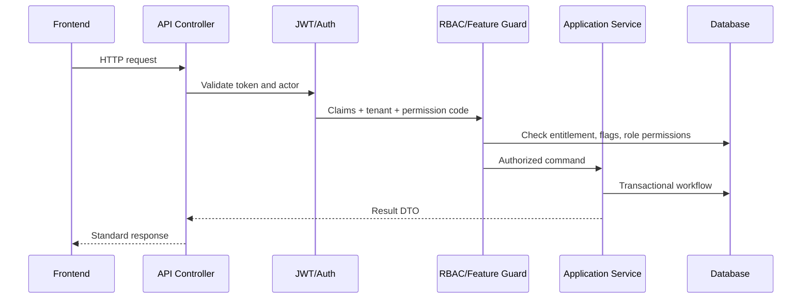

# API Overview

## Purpose
Define the overall API model for the Unified Commerce platform and how API boundaries map to frontend, backend, database, tenant isolation, and configurable feature access.

## API Architecture Position
| Layer | Responsibility | Example |
|---|---|---|
| Frontend | Calls APIs, displays UX state, never final authority | POSPage calls sales API |
| API | HTTP contract, auth filter, tenant resolver, DTO mapping | ProductsController |
| Application | Use-case orchestration, validation sequence, transactions | ProductService |
| Domain | Business invariants and value rules | Order status transition rule |
| Infrastructure | EF Core persistence, repositories, external gateways | PaymentRepository |

## Route Family Model
| Family | Path Pattern | Owner | Notes |
|---|---|---|---|
| Platform | `/api/v1/platform/*` | Platform admin | Tenant setup and platform feature catalog |
| Tenant Admin | `/api/v1/admin/*` | Tenant admin roles | Tenant configuration and management |
| POS | `/api/v1/pos/*` | Outlet staff | Till, session, sales, cash, receipts |
| Commerce | `/api/v1/commerce/*` | Customer and ecommerce operators | Storefront, cart, checkout, orders |
| Backoffice | `/api/v1/backoffice/*` | Tenant staff | Catalog, inventory, reports, fulfillment |
| Sync | `/api/v1/offline/*` | POS device + staff | Offline batches, sync items, conflicts |

## Tenant Feature Rule
All tenant-level route families must support tenant-specific configuration.
Access must be evaluated through tenant feature entitlement, runtime feature flag, role-feature assignment, and permission mapping.
Hardcoded role behavior is not acceptable.
Example: `cashier` may or may not have refund permission depending on the tenant configuration.

## End-to-End Request Flow

## API Ownership Rules
- Controllers must remain thin.
- Controllers must not contain business rules.
- Application services coordinate use cases.
- Validators check request shape and basic business input.
- Domain services protect reusable business invariants.
- Repositories must apply tenant filters.
- Unit of Work controls multi-table consistency.

## Related Documents
- [[endpoint-design]]
- [[request-response-standard]]
- [[auth-and-authorization]]
- [[feature-access-api-rules]]
- [[module-endpoint-map]]

## Implementation Checklist
- Confirm whether the endpoint is platform-level or tenant-level.
- Resolve authenticated actor from JWT claims before business logic.
- Resolve tenant context from route/header/subdomain according to the approved rule.
- Reject requests where target records do not belong to the resolved tenant.
- Validate platform feature entitlement when the action is feature-gated.
- Validate runtime feature flag when a tenant/outlet/user override exists.
- Validate role permissions and role-feature assignments.
- Validate request DTO with module-specific validators.
- Use application service orchestration for business workflows.
- Use repository and Unit of Work for transactional writes.
- Recalculate sensitive totals server-side.
- Record audit logs for sensitive actions and configuration changes.
- Return standard response envelope and standard error contract.
- Add tests for allowed, denied, invalid, duplicate, and cross-tenant cases.
- Confirm whether the endpoint is platform-level or tenant-level.
- Resolve authenticated actor from JWT claims before business logic.
- Resolve tenant context from route/header/subdomain according to the approved rule.
- Reject requests where target records do not belong to the resolved tenant.
- Validate platform feature entitlement when the action is feature-gated.
- Validate runtime feature flag when a tenant/outlet/user override exists.
- Validate role permissions and role-feature assignments.
- Validate request DTO with module-specific validators.
- Use application service orchestration for business workflows.
- Use repository and Unit of Work for transactional writes.
- Recalculate sensitive totals server-side.
- Record audit logs for sensitive actions and configuration changes.
- Return standard response envelope and standard error contract.
- Add tests for allowed, denied, invalid, duplicate, and cross-tenant cases.
- Confirm whether the endpoint is platform-level or tenant-level.
- Resolve authenticated actor from JWT claims before business logic.
- Resolve tenant context from route/header/subdomain according to the approved rule.
- Reject requests where target records do not belong to the resolved tenant.
- Validate platform feature entitlement when the action is feature-gated.
- Validate runtime feature flag when a tenant/outlet/user override exists.
- Validate role permissions and role-feature assignments.
- Validate request DTO with module-specific validators.
- Use application service orchestration for business workflows.
- Use repository and Unit of Work for transactional writes.
- Recalculate sensitive totals server-side.
- Record audit logs for sensitive actions and configuration changes.
- Return standard response envelope and standard error contract.
- Add tests for allowed, denied, invalid, duplicate, and cross-tenant cases.
- Confirm whether the endpoint is platform-level or tenant-level.
- Resolve authenticated actor from JWT claims before business logic.
- Resolve tenant context from route/header/subdomain according to the approved rule.
- Reject requests where target records do not belong to the resolved tenant.
- Validate platform feature entitlement when the action is feature-gated.
- Validate runtime feature flag when a tenant/outlet/user override exists.
- Validate role permissions and role-feature assignments.
- Validate request DTO with module-specific validators.
- Use application service orchestration for business workflows.
- Use repository and Unit of Work for transactional writes.
- Recalculate sensitive totals server-side.
- Record audit logs for sensitive actions and configuration changes.
- Return standard response envelope and standard error contract.
- Add tests for allowed, denied, invalid, duplicate, and cross-tenant cases.
- Confirm whether the endpoint is platform-level or tenant-level.
- Resolve authenticated actor from JWT claims before business logic.
- Resolve tenant context from route/header/subdomain according to the approved rule.
- Reject requests where target records do not belong to the resolved tenant.
- Validate platform feature entitlement when the action is feature-gated.
- Validate runtime feature flag when a tenant/outlet/user override exists.
- Validate role permissions and role-feature assignments.
- Validate request DTO with module-specific validators.
- Use application service orchestration for business workflows.
- Use repository and Unit of Work for transactional writes.
- Recalculate sensitive totals server-side.
- Record audit logs for sensitive actions and configuration changes.
- Return standard response envelope and standard error contract.
- Add tests for allowed, denied, invalid, duplicate, and cross-tenant cases.
- Confirm whether the endpoint is platform-level or tenant-level.
- Resolve authenticated actor from JWT claims before business logic.
- Resolve tenant context from route/header/subdomain according to the approved rule.
- Reject requests where target records do not belong to the resolved tenant.
- Validate platform feature entitlement when the action is feature-gated.
- Validate runtime feature flag when a tenant/outlet/user override exists.
- Validate role permissions and role-feature assignments.
- Validate request DTO with module-specific validators.
- Use application service orchestration for business workflows.
- Use repository and Unit of Work for transactional writes.
- Recalculate sensitive totals server-side.
- Record audit logs for sensitive actions and configuration changes.
- Return standard response envelope and standard error contract.
- Add tests for allowed, denied, invalid, duplicate, and cross-tenant cases.
