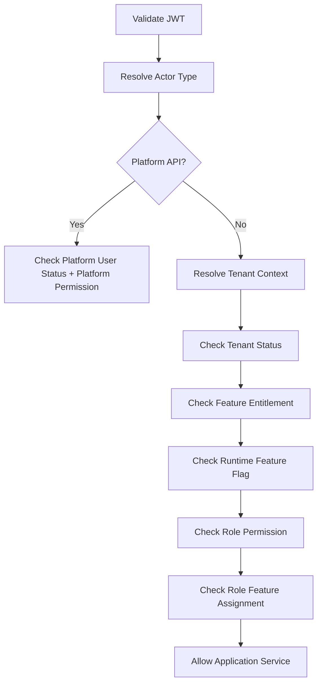

# Authentication and Authorization

## Purpose
Define JWT authentication, actor identity, and configurable authorization behavior for platform users, tenant staff, outlet users, customers, and POS devices.

## Authentication Model
The system uses JWT-based authentication for platform users, tenant staff, outlet staff, customer accounts, and device-related authenticated sessions.
JWT proves identity; it does not by itself grant feature access.
Authorization must be evaluated after tenant context and feature configuration are resolved.

## JWT Claim Requirements
| Claim | Required For | Purpose |
|---|---|---|
| `sub` | All authenticated users | Actor identifier |
| `actor_type` | All | `platform_user`, `tenant_user`, `customer`, `device` |
| `tenant_id` | Tenant staff/customer/device | Tenant boundary |
| `user_id` | Tenant staff | Maps to `users.id` |
| `platform_user_id` | Platform admin | Maps to `platform_users.id` |
| `customer_id` | Customer auth | Maps to `customers.id` |
| `outlet_ids` | Outlet staff | Allowed outlet context list |
| `device_id` | POS device | Registered POS device identity |
| `session_id` | Optional | Auth/session trace |
| `jti` | All | Token replay and audit correlation |

## JWT Security Rules
- Access tokens must be short-lived.
- Refresh tokens must be stored securely and revocable.
- Password hashes must never be returned through APIs.
- OTP codes must be stored as hashes only and never returned.
- JWT must be signed with strong asymmetric or protected symmetric keys.
- Token validation must check issuer, audience, expiry, signature, and revoked token policy.
- Sensitive APIs must require fresh authorization when business risk is high.

## Authorization Evaluation Order


## Permission Code Examples
| Action | Permission Code Example | Notes |
|---|---|---|
| Create product | `catalog.product.create` | Tenant configurable |
| Update price | `catalog.price.update` | Should be separated from product edit |
| Complete POS sale | `pos.sale.complete` | Requires till/session context |
| Void sale | `pos.sale.void` | Sensitive, audited |
| Approve discount | `discount.approve` | Manager-like permission but not hardcoded |
| Create refund | `payment.refund.create` | Must follow refund rules |
| Resolve sync conflict | `offline.conflict.resolve` | Sensitive operational action |

## Example Auth Header
```http
Authorization: Bearer <jwt-access-token>
X-Tenant-Id: 4fd7d0d0-7c16-4e2e-8f38-tenant
X-Outlet-Id: 708c37c9-63c3-4ab8-outlet
```

## Example Backend Authorization Guard
```csharp
public async Task EnsurePermissionAsync(ApiActor actor, Guid tenantId, string permissionCode)
{
    await _tenantAccessValidator.EnsureTenantIsActiveAsync(tenantId);
    await _featureAccessValidator.EnsurePermissionAllowedAsync(
        actor.UserId, tenantId, permissionCode);
}
```

## Platform vs Tenant Access
Platform administrators manage tenants and platform feature catalogs.
Tenant staff use tenant-owned roles, role permissions, outlet assignments, role-feature assignments, and feature flags.
A platform user must not be treated as a tenant staff user unless an explicit support impersonation policy exists.

## Related Documents
- [[tenant-context-api-rules]]
- [[feature-access-api-rules]]
- [[error-contract]]
- [[device-session-api-rules]]

## Implementation Checklist
- Confirm whether the endpoint is platform-level or tenant-level.
- Resolve authenticated actor from JWT claims before business logic.
- Resolve tenant context from route/header/subdomain according to the approved rule.
- Reject requests where target records do not belong to the resolved tenant.
- Validate platform feature entitlement when the action is feature-gated.
- Validate runtime feature flag when a tenant/outlet/user override exists.
- Validate role permissions and role-feature assignments.
- Validate request DTO with module-specific validators.
- Use application service orchestration for business workflows.
- Use repository and Unit of Work for transactional writes.
- Recalculate sensitive totals server-side.
- Record audit logs for sensitive actions and configuration changes.
- Return standard response envelope and standard error contract.
- Add tests for allowed, denied, invalid, duplicate, and cross-tenant cases.
