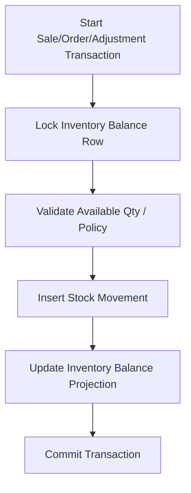

# Concurrency Rules

## Purpose
Define API-level and service-level rules for handling concurrent writes, race conditions, locking, stale updates, and transactional integrity.

## Purpose
Concurrency rules protect financial records, stock, payment allocation, till sessions, order statuses, coupon usage, and offline sync from race conditions.

## High-Risk Concurrency Areas
| Area | Risk | Required Control |
|---|---|---|
| Document sequences | Duplicate numbers | Row-level lock |
| Inventory balances | Oversell / wrong available qty | Transaction + lock or atomic update |
| Coupon redemption | Exceed max usage | Row lock on coupon |
| Till session | Two open sessions for same till | Unique constraint + transaction |
| Payment allocation | Over-allocation | Transaction + aggregate validation |
| Refunds | Refund above captured amount | Transaction + lock original payment |
| Stock transfers | Double receive | Status transition lock |
| Offline sync | Duplicate replay | Unique client ids + conflict records |

## Optimistic Concurrency
Use `updated_at`, row version, or equivalent concurrency token for editable master data.
If a user edits stale data, return `409 CONCURRENCY_CONFLICT`.
Examples: products, price lists, settings, themes, roles, feature flags.

## Pessimistic / Transaction Locking
Use row-level locking or serializable transaction behavior for financial and stock-critical operations.
Examples: document sequence allocation, stock balance update, coupon usage, refund total validation, open till session.

## Stock Update Flow

## Status Transition Concurrency
Status changes must be validated against the current database state inside the transaction.
Do not trust a status value loaded before a long-running approval screen.
Invalid transitions return `422 INVALID_STATUS_TRANSITION` or `409 CONCURRENCY_CONFLICT` depending on cause.

## API Behavior
| Condition | Response |
|---|---|
| Stale update on editable config | `409 CONCURRENCY_CONFLICT` |
| Business state no longer valid | `422 VALIDATION_FAILED` |
| Duplicate open till session | `409 CONFLICT` |
| Stock no longer available | `409 STOCK_CONFLICT` |
| Offline sale accepted with variance | `202 Accepted` with conflict summary where applicable |

## Related Documents
- [[idempotency-rules]]
- [[offline-sync-api-rules]]
- [[error-contract]]
- [[device-session-api-rules]]

## Implementation Checklist
- Confirm whether the endpoint is platform-level or tenant-level.
- Resolve authenticated actor from JWT claims before business logic.
- Resolve tenant context from route/header/subdomain according to the approved rule.
- Reject requests where target records do not belong to the resolved tenant.
- Validate platform feature entitlement when the action is feature-gated.
- Validate runtime feature flag when a tenant/outlet/user override exists.
- Validate role permissions and role-feature assignments.
- Validate request DTO with module-specific validators.
- Use application service orchestration for business workflows.
- Use repository and Unit of Work for transactional writes.
- Recalculate sensitive totals server-side.
- Record audit logs for sensitive actions and configuration changes.
- Return standard response envelope and standard error contract.
- Add tests for allowed, denied, invalid, duplicate, and cross-tenant cases.
