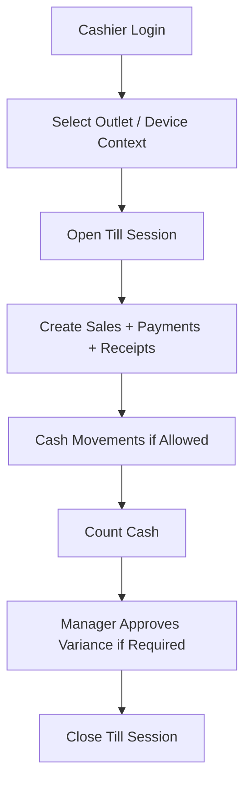

# Device Session API Rules

## Purpose
Define POS device, terminal, till, outlet, cashier session, and cash drawer API rules for reliable retail counter operation.

## Purpose
POS APIs must operate under a valid tenant, outlet, registered POS device, till, and till session context.
This ensures sales, payments, stock movements, receipts, and cash reports are attached to the correct operational location.

## Required Tables
| Table | API Meaning |
|---|---|
| `outlets` | Operational sales/stock location |
| `tills` | Cash register / till master |
| `pos_devices` | Registered POS terminal/browser/device |
| `till_sessions` | Open/close cashier session |
| `cash_movements` | Non-sale cash in/out activity |
| `cash_count_denominations` | Till close cash count details |

## Device Context Requirements
- Device must belong to the resolved tenant.
- Device must be assigned to the active outlet.
- Device must map to a till.
- Till outlet must match device outlet.
- Blocked devices cannot create sales or sync offline items.
- Device app version may be checked for compatibility.

## Till Session Rules
| Rule | API Impact |
|---|---|
| One open session per till | Opening duplicate session returns `409` |
| Cashier must open session when session control is enabled | POS sale API rejects without session |
| Closed session cannot receive new sales | Return `423 SESSION_CLOSED` |
| Session close requires counted cash when configured | Return `422` if missing |
| Variance approval requires configurable permission | Check `cash.variance.approve` |

## POS Session Flow


## API Examples
```http
POST /api/v1/pos/till-sessions/open
POST /api/v1/pos/sales
POST /api/v1/pos/cash-movements
POST /api/v1/pos/till-sessions/{sessionId}/close
```

## Example Open Session Request
```json
{
  "tillId": "uuid",
  "outletId": "uuid",
  "openingFloat": 5000.00,
  "businessDate": "2026-05-10"
}
```

## Permission Examples
| Action | Permission | Feature |
|---|---|---|
| Open till | `pos.till_session.open` | `pos.till_sessions` |
| Close till | `pos.till_session.close` | `pos.till_sessions` |
| Cash in/out | `pos.cash_movement.create` | `pos.cash_management` |
| Approve variance | `pos.cash_variance.approve` | `pos.cash_management` |

## Related Documents
- [[auth-and-authorization]]
- [[tenant-context-api-rules]]
- [[feature-access-api-rules]]
- [[offline-sync-api-rules]]

## Implementation Checklist
- Confirm whether the endpoint is platform-level or tenant-level.
- Resolve authenticated actor from JWT claims before business logic.
- Resolve tenant context from route/header/subdomain according to the approved rule.
- Reject requests where target records do not belong to the resolved tenant.
- Validate platform feature entitlement when the action is feature-gated.
- Validate runtime feature flag when a tenant/outlet/user override exists.
- Validate role permissions and role-feature assignments.
- Validate request DTO with module-specific validators.
- Use application service orchestration for business workflows.
- Use repository and Unit of Work for transactional writes.
- Recalculate sensitive totals server-side.
- Record audit logs for sensitive actions and configuration changes.
- Return standard response envelope and standard error contract.
- Add tests for allowed, denied, invalid, duplicate, and cross-tenant cases.
- Confirm whether the endpoint is platform-level or tenant-level.
- Resolve authenticated actor from JWT claims before business logic.
- Resolve tenant context from route/header/subdomain according to the approved rule.
- Reject requests where target records do not belong to the resolved tenant.
- Validate platform feature entitlement when the action is feature-gated.
- Validate runtime feature flag when a tenant/outlet/user override exists.
- Validate role permissions and role-feature assignments.
- Validate request DTO with module-specific validators.
- Use application service orchestration for business workflows.
- Use repository and Unit of Work for transactional writes.
- Recalculate sensitive totals server-side.
- Record audit logs for sensitive actions and configuration changes.
- Return standard response envelope and standard error contract.
- Add tests for allowed, denied, invalid, duplicate, and cross-tenant cases.
- Confirm whether the endpoint is platform-level or tenant-level.
- Resolve authenticated actor from JWT claims before business logic.
- Resolve tenant context from route/header/subdomain according to the approved rule.
- Reject requests where target records do not belong to the resolved tenant.
- Validate platform feature entitlement when the action is feature-gated.
- Validate runtime feature flag when a tenant/outlet/user override exists.
- Validate role permissions and role-feature assignments.
- Validate request DTO with module-specific validators.
- Use application service orchestration for business workflows.
- Use repository and Unit of Work for transactional writes.
- Recalculate sensitive totals server-side.
- Record audit logs for sensitive actions and configuration changes.
- Return standard response envelope and standard error contract.
- Add tests for allowed, denied, invalid, duplicate, and cross-tenant cases.
- Confirm whether the endpoint is platform-level or tenant-level.
- Resolve authenticated actor from JWT claims before business logic.
- Resolve tenant context from route/header/subdomain according to the approved rule.
- Reject requests where target records do not belong to the resolved tenant.
- Validate platform feature entitlement when the action is feature-gated.
- Validate runtime feature flag when a tenant/outlet/user override exists.
- Validate role permissions and role-feature assignments.
- Validate request DTO with module-specific validators.
- Use application service orchestration for business workflows.
- Use repository and Unit of Work for transactional writes.
- Recalculate sensitive totals server-side.
- Record audit logs for sensitive actions and configuration changes.
- Return standard response envelope and standard error contract.
- Add tests for allowed, denied, invalid, duplicate, and cross-tenant cases.
- Confirm whether the endpoint is platform-level or tenant-level.
- Resolve authenticated actor from JWT claims before business logic.
- Resolve tenant context from route/header/subdomain according to the approved rule.
- Reject requests where target records do not belong to the resolved tenant.
- Validate platform feature entitlement when the action is feature-gated.
- Validate runtime feature flag when a tenant/outlet/user override exists.
- Validate role permissions and role-feature assignments.
- Validate request DTO with module-specific validators.
- Use application service orchestration for business workflows.
- Use repository and Unit of Work for transactional writes.
- Recalculate sensitive totals server-side.
- Record audit logs for sensitive actions and configuration changes.
- Return standard response envelope and standard error contract.
