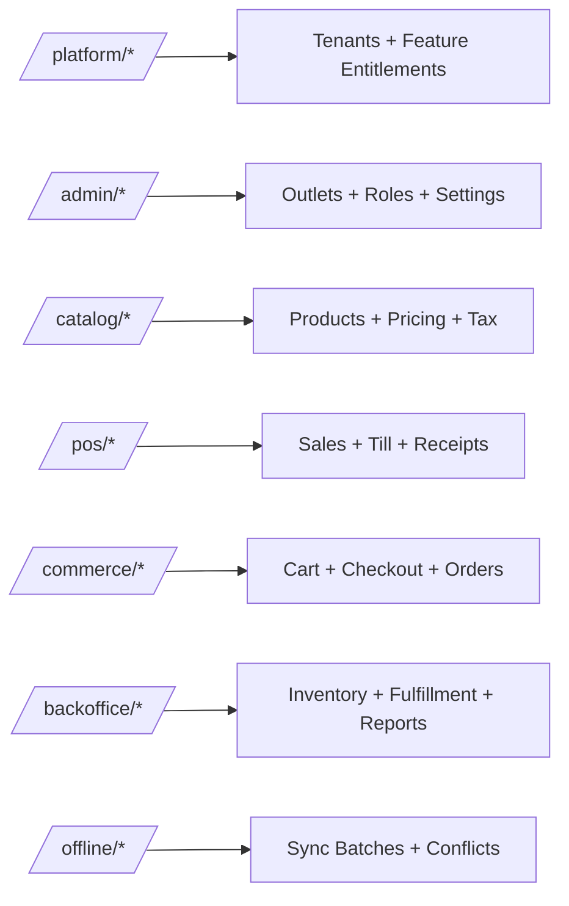

# Endpoint Design

## Purpose
Define route naming, route families, REST boundaries, command endpoint rules, and controller ownership for the Unified Commerce API.

## Route Design Principles
- Use nouns for resources and explicit command subroutes for business actions.
- Use `/api/v1` for versioning from the beginning.
- Do not expose database table names blindly when business language is clearer.
- Do not combine unrelated workflows into one generic endpoint.
- Keep platform, tenant admin, POS, commerce, backoffice, and offline sync route families clear.

## Route Examples
| Action | Route | Notes |
|---|---|---|
| Create tenant | `POST /api/v1/platform/tenants` | Platform admin only |
| Enable tenant feature | `PUT /api/v1/platform/tenants/{tenantId}/features/{featureId}` | Platform entitlement |
| Create outlet | `POST /api/v1/admin/outlets` | Tenant-level configurable permission |
| Create product | `POST /api/v1/catalog/products` | Catalog permission + feature |
| Open till | `POST /api/v1/pos/till-sessions/open` | Requires outlet/device context |
| Complete sale | `POST /api/v1/pos/sales` | Transactional workflow |
| Start sync batch | `POST /api/v1/offline/sync-batches` | Device + user context |

## REST vs Command Endpoints
| Type | Pattern | Example |
|---|---|---|
| CRUD | `/resource` | `POST /catalog/products` |
| Detail | `/resource/{id}` | `GET /catalog/products/{id}` |
| Command | `/resource/{id}/action` | `POST /returns/{id}/approve` |
| Workflow | `/workflow/action` | `POST /pos/till-sessions/open` |
| Bulk | `/resource/bulk-action` | `POST /catalog/products/bulk-import` |

## Naming Rules
- Use kebab-case for path segments.
- Use camelCase for JSON fields.
- Use stable business names: `outlets`, `till-sessions`, `stock-movements`, `payment-methods`.
- Use `id` for UUIDs in response objects, but meaningful route names for parent resources.
- Avoid vague paths like `/manage`, `/process`, `/do`, or `/data`.

## Endpoint Ownership Diagram

## Controller Placement
- `POS.API/Modules/Products/Controllers/ProductsController.cs` owns product endpoints.
- `POS.API/Modules/Payments/Controllers/PaymentsController.cs` owns payment capture and status APIs.
- `POS.API/Modules/Offline/Controllers/OfflineSyncController.cs` owns sync batch APIs.
- Controllers call application interfaces only.
- Controllers do not directly call EF Core DbContext.

## Related Documents
- [[api-overview]]
- [[module-endpoint-map]]
- [[request-response-standard]]
- [[device-session-api-rules]]

## Implementation Checklist
- Confirm whether the endpoint is platform-level or tenant-level.
- Resolve authenticated actor from JWT claims before business logic.
- Resolve tenant context from route/header/subdomain according to the approved rule.
- Reject requests where target records do not belong to the resolved tenant.
- Validate platform feature entitlement when the action is feature-gated.
- Validate runtime feature flag when a tenant/outlet/user override exists.
- Validate role permissions and role-feature assignments.
- Validate request DTO with module-specific validators.
- Use application service orchestration for business workflows.
- Use repository and Unit of Work for transactional writes.
- Recalculate sensitive totals server-side.
- Record audit logs for sensitive actions and configuration changes.
- Return standard response envelope and standard error contract.
- Add tests for allowed, denied, invalid, duplicate, and cross-tenant cases.
- Confirm whether the endpoint is platform-level or tenant-level.
- Resolve authenticated actor from JWT claims before business logic.
- Resolve tenant context from route/header/subdomain according to the approved rule.
- Reject requests where target records do not belong to the resolved tenant.
- Validate platform feature entitlement when the action is feature-gated.
- Validate runtime feature flag when a tenant/outlet/user override exists.
- Validate role permissions and role-feature assignments.
- Validate request DTO with module-specific validators.
- Use application service orchestration for business workflows.
- Use repository and Unit of Work for transactional writes.
- Recalculate sensitive totals server-side.
- Record audit logs for sensitive actions and configuration changes.
- Return standard response envelope and standard error contract.
- Add tests for allowed, denied, invalid, duplicate, and cross-tenant cases.
- Confirm whether the endpoint is platform-level or tenant-level.
- Resolve authenticated actor from JWT claims before business logic.
- Resolve tenant context from route/header/subdomain according to the approved rule.
- Reject requests where target records do not belong to the resolved tenant.
- Validate platform feature entitlement when the action is feature-gated.
- Validate runtime feature flag when a tenant/outlet/user override exists.
- Validate role permissions and role-feature assignments.
- Validate request DTO with module-specific validators.
- Use application service orchestration for business workflows.
- Use repository and Unit of Work for transactional writes.
- Recalculate sensitive totals server-side.
- Record audit logs for sensitive actions and configuration changes.
- Return standard response envelope and standard error contract.
- Add tests for allowed, denied, invalid, duplicate, and cross-tenant cases.
- Confirm whether the endpoint is platform-level or tenant-level.
- Resolve authenticated actor from JWT claims before business logic.
- Resolve tenant context from route/header/subdomain according to the approved rule.
- Reject requests where target records do not belong to the resolved tenant.
- Validate platform feature entitlement when the action is feature-gated.
- Validate runtime feature flag when a tenant/outlet/user override exists.
- Validate role permissions and role-feature assignments.
- Validate request DTO with module-specific validators.
- Use application service orchestration for business workflows.
- Use repository and Unit of Work for transactional writes.
- Recalculate sensitive totals server-side.
- Record audit logs for sensitive actions and configuration changes.
- Return standard response envelope and standard error contract.
- Add tests for allowed, denied, invalid, duplicate, and cross-tenant cases.
- Confirm whether the endpoint is platform-level or tenant-level.
- Resolve authenticated actor from JWT claims before business logic.
- Resolve tenant context from route/header/subdomain according to the approved rule.
- Reject requests where target records do not belong to the resolved tenant.
- Validate platform feature entitlement when the action is feature-gated.
- Validate runtime feature flag when a tenant/outlet/user override exists.
- Validate role permissions and role-feature assignments.
- Validate request DTO with module-specific validators.
- Use application service orchestration for business workflows.
- Use repository and Unit of Work for transactional writes.
- Recalculate sensitive totals server-side.
- Record audit logs for sensitive actions and configuration changes.
- Return standard response envelope and standard error contract.
- Add tests for allowed, denied, invalid, duplicate, and cross-tenant cases.
- Confirm whether the endpoint is platform-level or tenant-level.
- Resolve authenticated actor from JWT claims before business logic.
- Resolve tenant context from route/header/subdomain according to the approved rule.
- Reject requests where target records do not belong to the resolved tenant.
- Validate platform feature entitlement when the action is feature-gated.
- Validate runtime feature flag when a tenant/outlet/user override exists.
- Validate role permissions and role-feature assignments.
- Validate request DTO with module-specific validators.
- Use application service orchestration for business workflows.
- Use repository and Unit of Work for transactional writes.
- Recalculate sensitive totals server-side.
- Record audit logs for sensitive actions and configuration changes.
- Return standard response envelope and standard error contract.
- Add tests for allowed, denied, invalid, duplicate, and cross-tenant cases.
- Confirm whether the endpoint is platform-level or tenant-level.
