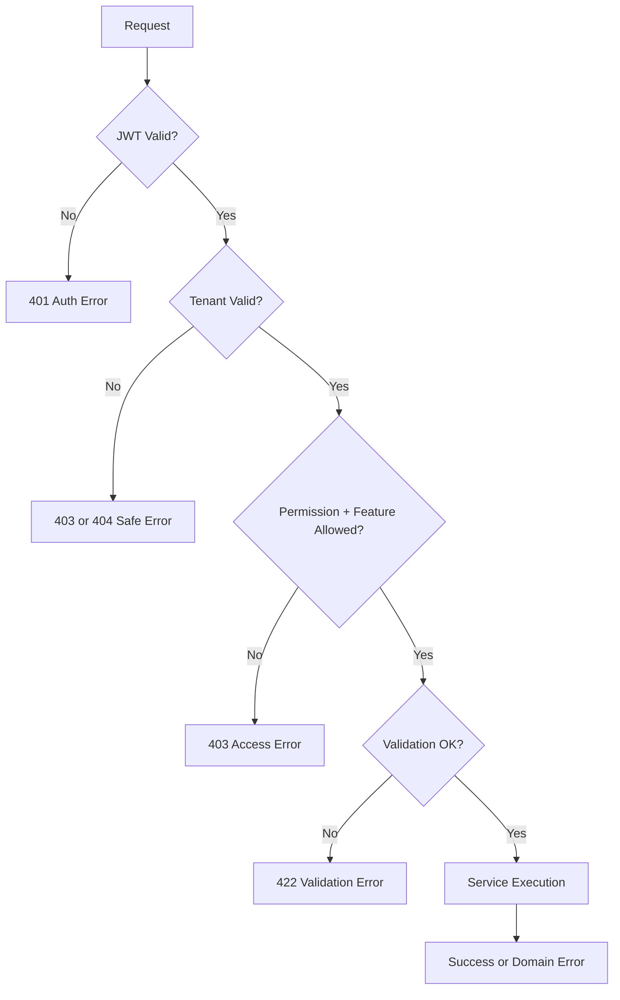

# Error Contract

## Purpose
Define a consistent error model for validation, authentication, authorization, tenant isolation, business rule failures, concurrency conflicts, and offline sync conflicts.

## Error Contract Goals
Errors must be predictable, safe, actionable, and testable.
The API must not leak cross-tenant data, secrets, stack traces, password hashes, OTP values, payment secrets, or raw provider credentials.

## Standard Error Shape
```json
{
  "success": false,
  "error": {
    "code": "FEATURE_NOT_ENABLED",
    "message": "The requested feature is not enabled for this tenant.",
    "details": [
      { "field": "featureKey", "message": "pos.refund is disabled." }
    ]
  },
  "meta": {
    "requestId": "req_123",
    "timestamp": "2026-05-10T10:00:00Z"
  }
}
```

## HTTP Status Usage
| Status | Meaning | Example |
|---:|---|---|
| 400 | Bad request format | Malformed JSON |
| 401 | Unauthenticated | Missing/expired JWT |
| 403 | Authenticated but not allowed | Missing permission or feature access |
| 404 | Resource not found | Product not found in tenant |
| 409 | Conflict | Duplicate idempotency key or optimistic concurrency failure |
| 422 | Valid JSON but business validation failed | Invalid status transition |
| 423 | Locked | Till session closed or record locked |
| 429 | Rate limited | OTP resend abuse |
| 500 | Unhandled server error | Unexpected failure |

## Standard Error Codes
| Code | Use Case |
|---|---|
| `AUTH_REQUIRED` | Missing token |
| `TOKEN_EXPIRED` | Expired JWT |
| `TENANT_CONTEXT_INVALID` | Missing or mismatched tenant |
| `TENANT_SUSPENDED` | Operational write blocked |
| `PERMISSION_DENIED` | Role/user lacks permission |
| `FEATURE_NOT_ENTITLED` | Platform feature not enabled for tenant |
| `FEATURE_FLAG_DISABLED` | Runtime flag disables action |
| `VALIDATION_FAILED` | DTO/business validation |
| `DUPLICATE_REQUEST` | Idempotency duplicate |
| `CONCURRENCY_CONFLICT` | Version/row conflict |
| `OFFLINE_SYNC_CONFLICT` | Offline payload cannot be accepted |

## Cross-Tenant Error Handling
For sensitive record lookup, prefer safe `404 Not Found` when revealing existence would leak another tenant's data.
For authenticated feature denial, use `403 Forbidden` with a safe feature/permission code.
Do not include another tenant id, record owner, or private record details in error response.

## Validation Error Example
```json
{
  "success": false,
  "error": {
    "code": "VALIDATION_FAILED",
    "message": "Product validation failed.",
    "details": [
      { "field": "variants[0].sku", "message": "SKU is required." },
      { "field": "returnPolicyId", "message": "Return policy is required." }
    ]
  }
}
```

## Error Flow Diagram


## Related Documents
- [[auth-and-authorization]]
- [[tenant-context-api-rules]]
- [[feature-access-api-rules]]
- [[request-response-standard]]

## Implementation Checklist
- Confirm whether the endpoint is platform-level or tenant-level.
- Resolve authenticated actor from JWT claims before business logic.
- Resolve tenant context from route/header/subdomain according to the approved rule.
- Reject requests where target records do not belong to the resolved tenant.
- Validate platform feature entitlement when the action is feature-gated.
- Validate runtime feature flag when a tenant/outlet/user override exists.
- Validate role permissions and role-feature assignments.
- Validate request DTO with module-specific validators.
- Use application service orchestration for business workflows.
- Use repository and Unit of Work for transactional writes.
- Recalculate sensitive totals server-side.
- Record audit logs for sensitive actions and configuration changes.
- Return standard response envelope and standard error contract.
- Add tests for allowed, denied, invalid, duplicate, and cross-tenant cases.
- Confirm whether the endpoint is platform-level or tenant-level.
- Resolve authenticated actor from JWT claims before business logic.
- Resolve tenant context from route/header/subdomain according to the approved rule.
- Reject requests where target records do not belong to the resolved tenant.
- Validate platform feature entitlement when the action is feature-gated.
- Validate runtime feature flag when a tenant/outlet/user override exists.
- Validate role permissions and role-feature assignments.
- Validate request DTO with module-specific validators.
- Use application service orchestration for business workflows.
- Use repository and Unit of Work for transactional writes.
- Recalculate sensitive totals server-side.
- Record audit logs for sensitive actions and configuration changes.
- Return standard response envelope and standard error contract.
- Add tests for allowed, denied, invalid, duplicate, and cross-tenant cases.
- Confirm whether the endpoint is platform-level or tenant-level.
- Resolve authenticated actor from JWT claims before business logic.
- Resolve tenant context from route/header/subdomain according to the approved rule.
- Reject requests where target records do not belong to the resolved tenant.
- Validate platform feature entitlement when the action is feature-gated.
- Validate runtime feature flag when a tenant/outlet/user override exists.
- Validate role permissions and role-feature assignments.
- Validate request DTO with module-specific validators.
- Use application service orchestration for business workflows.
- Use repository and Unit of Work for transactional writes.
- Recalculate sensitive totals server-side.
- Record audit logs for sensitive actions and configuration changes.
- Return standard response envelope and standard error contract.
- Add tests for allowed, denied, invalid, duplicate, and cross-tenant cases.
- Confirm whether the endpoint is platform-level or tenant-level.
- Resolve authenticated actor from JWT claims before business logic.
- Resolve tenant context from route/header/subdomain according to the approved rule.
- Reject requests where target records do not belong to the resolved tenant.
- Validate platform feature entitlement when the action is feature-gated.
- Validate runtime feature flag when a tenant/outlet/user override exists.
- Validate role permissions and role-feature assignments.
- Validate request DTO with module-specific validators.
- Use application service orchestration for business workflows.
- Use repository and Unit of Work for transactional writes.
- Recalculate sensitive totals server-side.
