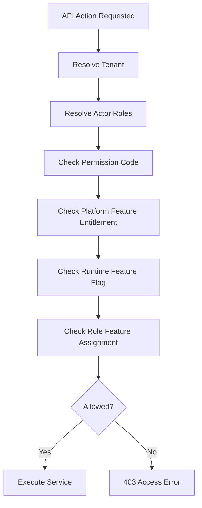

# Feature Access API Rules

## Purpose
Define how APIs enforce tenant-configurable feature access, permissions, user rights, role-feature assignment, and runtime feature flags.

## Core Requirement
Except platform-admin-only features, every tenant-level feature must support tenant-specific configuration by business requirement, role, user rights, and feature permission.
No API may assume fixed access based only on a role name such as cashier, manager, or admin.

## Access Data Sources
| Database Area | Purpose |
|---|---|
| `platform_features` | Platform-owned feature catalog |
| `tenant_feature_entitlements` | Platform enables features for tenants |
| `feature_flags` | Tenant/outlet/user runtime feature switches |
| `permissions` | Platform-owned permission catalog |
| `roles` | Tenant-owned role definitions |
| `role_permissions` | Maps tenant roles to permissions |
| `role_feature_assignments` | Maps enabled features to roles |
| `tenant_user_roles` | Tenant-scope role assignment |
| `outlet_user_roles` | Outlet-scope role assignment |

## API Access Evaluation


## Feature Access Example
A tenant may enable POS sales but disable exchanges for cashiers.
Another tenant may allow outlet managers to approve exchanges but only in assigned outlets.
The API must evaluate the current tenant configuration instead of hardcoding either behavior.

## Example Access Rule Table
| API Action | Permission | Feature Key | Scope Check | Audit |
|---|---|---|---|---|
| Create sale | `pos.sale.create` | `pos.sales` | outlet/session/device | yes |
| Void sale | `pos.sale.void` | `pos.sales` | outlet + status | yes |
| Create product | `catalog.product.create` | `catalog.products` | tenant | optional |
| Update stock | `inventory.adjustment.create` | `inventory.stock` | outlet | yes |
| Approve discount | `discount.approve` | `discount.approvals` | tenant/outlet | yes |
| Resolve conflict | `offline.conflict.resolve` | `offline.sync` | outlet/device | yes |

## API Error Behavior
- Missing permission: `403 PERMISSION_DENIED`.
- Feature not entitled to tenant: `403 FEATURE_NOT_ENTITLED`.
- Feature flag disabled: `403 FEATURE_FLAG_DISABLED`.
- Role not assigned to outlet: `403 OUTLET_ACCESS_DENIED`.
- Tenant suspended: `403 TENANT_SUSPENDED`.

## Backend Guard Example
```csharp
await _access.EnsureAllowedAsync(new AccessRequest
{
    TenantId = tenantId,
    UserId = actor.UserId,
    OutletId = outletId,
    PermissionCode = "pos.sale.void",
    FeatureKey = "pos.sales"
});
```

## Related Documents
- [[auth-and-authorization]]
- [[tenant-context-api-rules]]
- [[error-contract]]
- [[module-endpoint-map]]

## Implementation Checklist
- Confirm whether the endpoint is platform-level or tenant-level.
- Resolve authenticated actor from JWT claims before business logic.
- Resolve tenant context from route/header/subdomain according to the approved rule.
- Reject requests where target records do not belong to the resolved tenant.
- Validate platform feature entitlement when the action is feature-gated.
- Validate runtime feature flag when a tenant/outlet/user override exists.
- Validate role permissions and role-feature assignments.
- Validate request DTO with module-specific validators.
- Use application service orchestration for business workflows.
- Use repository and Unit of Work for transactional writes.
- Recalculate sensitive totals server-side.
- Record audit logs for sensitive actions and configuration changes.
- Return standard response envelope and standard error contract.
- Add tests for allowed, denied, invalid, duplicate, and cross-tenant cases.
- Confirm whether the endpoint is platform-level or tenant-level.
- Resolve authenticated actor from JWT claims before business logic.
- Resolve tenant context from route/header/subdomain according to the approved rule.
- Reject requests where target records do not belong to the resolved tenant.
- Validate platform feature entitlement when the action is feature-gated.
- Validate runtime feature flag when a tenant/outlet/user override exists.
- Validate role permissions and role-feature assignments.
- Validate request DTO with module-specific validators.
- Use application service orchestration for business workflows.
- Use repository and Unit of Work for transactional writes.
- Recalculate sensitive totals server-side.
- Record audit logs for sensitive actions and configuration changes.
- Return standard response envelope and standard error contract.
- Add tests for allowed, denied, invalid, duplicate, and cross-tenant cases.
- Confirm whether the endpoint is platform-level or tenant-level.
- Resolve authenticated actor from JWT claims before business logic.
- Resolve tenant context from route/header/subdomain according to the approved rule.
- Reject requests where target records do not belong to the resolved tenant.
- Validate platform feature entitlement when the action is feature-gated.
- Validate runtime feature flag when a tenant/outlet/user override exists.
- Validate role permissions and role-feature assignments.
- Validate request DTO with module-specific validators.
- Use application service orchestration for business workflows.
- Use repository and Unit of Work for transactional writes.
- Recalculate sensitive totals server-side.
- Record audit logs for sensitive actions and configuration changes.
- Return standard response envelope and standard error contract.
- Add tests for allowed, denied, invalid, duplicate, and cross-tenant cases.
- Confirm whether the endpoint is platform-level or tenant-level.
- Resolve authenticated actor from JWT claims before business logic.
- Resolve tenant context from route/header/subdomain according to the approved rule.
- Reject requests where target records do not belong to the resolved tenant.
- Validate platform feature entitlement when the action is feature-gated.
- Validate runtime feature flag when a tenant/outlet/user override exists.
- Validate role permissions and role-feature assignments.
- Validate request DTO with module-specific validators.
- Use application service orchestration for business workflows.
- Use repository and Unit of Work for transactional writes.
- Recalculate sensitive totals server-side.
- Record audit logs for sensitive actions and configuration changes.
- Return standard response envelope and standard error contract.
- Add tests for allowed, denied, invalid, duplicate, and cross-tenant cases.
- Confirm whether the endpoint is platform-level or tenant-level.
- Resolve authenticated actor from JWT claims before business logic.
- Resolve tenant context from route/header/subdomain according to the approved rule.
- Reject requests where target records do not belong to the resolved tenant.
- Validate platform feature entitlement when the action is feature-gated.
- Validate runtime feature flag when a tenant/outlet/user override exists.
- Validate role permissions and role-feature assignments.
- Validate request DTO with module-specific validators.
- Use application service orchestration for business workflows.
- Use repository and Unit of Work for transactional writes.
- Recalculate sensitive totals server-side.
- Record audit logs for sensitive actions and configuration changes.
- Return standard response envelope and standard error contract.
- Add tests for allowed, denied, invalid, duplicate, and cross-tenant cases.
- Confirm whether the endpoint is platform-level or tenant-level.
- Resolve authenticated actor from JWT claims before business logic.
- Resolve tenant context from route/header/subdomain according to the approved rule.
