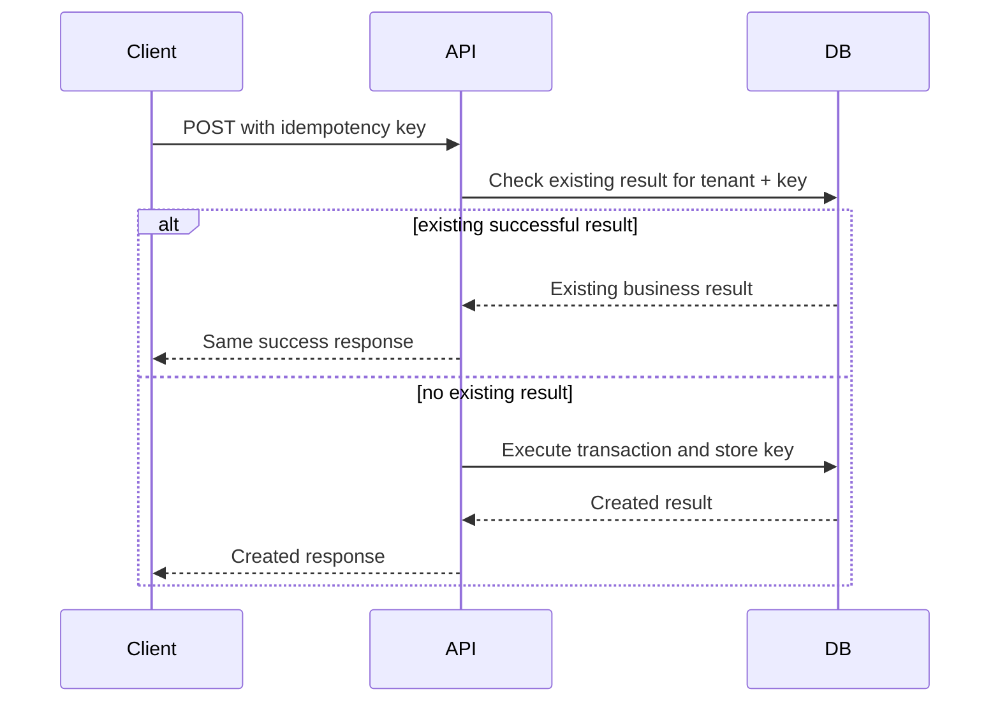

# Idempotency Rules

## Purpose
Define duplicate-safe API behavior for payment, sale, order, receipt, stock, and offline sync workflows.

## Purpose
Idempotency prevents duplicate business writes caused by retries, network failures, double-clicks, offline replay, gateway callbacks, and POS device resubmission.
It is mandatory for payment, sales, orders, refunds, offline sync, receipt generation, and stock-affecting workflows.

## Idempotency Sources
| Workflow | Key Source | Storage / Constraint |
|---|---|---|
| Payment | `idempotencyKey` or provider reference | `payments.idempotency_key` tenant unique |
| POS Sale | device transaction id | `sales.client_transaction_id` with tenant/device unique |
| Offline payment | local payment id | `payments.client_payment_id` with tenant/device unique |
| Stock movement | client movement id | `stock_movements.client_movement_id` with tenant/device unique |
| Receipt | client receipt id | `receipts.client_receipt_id` where offline |
| Sync item | client entity id | `offline_sync_items` tenant/device/entity unique |

## Header Convention
```http
Idempotency-Key: tenant-device-sale-20260510-0001
```

For offline POS, the local device id and client entity id must also be included in the sync payload.

## Idempotent Write Flow


## Duplicate Behavior
| Duplicate Scenario | Expected API Behavior |
|---|---|
| Same idempotency key, same payload | Return original success result |
| Same idempotency key, different payload | `409 DUPLICATE_REQUEST` |
| Same offline client sale id | Return existing accepted result or conflict status |
| Duplicate payment provider callback | Ignore duplicate business update, record provider event if needed |
| Duplicate receipt reprint command | Do not create duplicate sale/payment; log print action only |

## Implementation Notes
- Idempotency must be tenant-scoped.
- Use database unique constraints where available.
- Do not rely only on in-memory cache.
- Store enough response summary to return stable duplicate response when required.
- Use transaction boundaries around idempotency check and business write.

## Related Documents
- [[offline-sync-api-rules]]
- [[concurrency-rules]]
- [[request-response-standard]]
- [[error-contract]]

## Implementation Checklist
- Confirm whether the endpoint is platform-level or tenant-level.
- Resolve authenticated actor from JWT claims before business logic.
- Resolve tenant context from route/header/subdomain according to the approved rule.
- Reject requests where target records do not belong to the resolved tenant.
- Validate platform feature entitlement when the action is feature-gated.
- Validate runtime feature flag when a tenant/outlet/user override exists.
- Validate role permissions and role-feature assignments.
- Validate request DTO with module-specific validators.
- Use application service orchestration for business workflows.
- Use repository and Unit of Work for transactional writes.
- Recalculate sensitive totals server-side.
- Record audit logs for sensitive actions and configuration changes.
- Return standard response envelope and standard error contract.
- Add tests for allowed, denied, invalid, duplicate, and cross-tenant cases.
- Confirm whether the endpoint is platform-level or tenant-level.
- Resolve authenticated actor from JWT claims before business logic.
- Resolve tenant context from route/header/subdomain according to the approved rule.
- Reject requests where target records do not belong to the resolved tenant.
- Validate platform feature entitlement when the action is feature-gated.
- Validate runtime feature flag when a tenant/outlet/user override exists.
- Validate role permissions and role-feature assignments.
- Validate request DTO with module-specific validators.
- Use application service orchestration for business workflows.
- Use repository and Unit of Work for transactional writes.
- Recalculate sensitive totals server-side.
- Record audit logs for sensitive actions and configuration changes.
- Return standard response envelope and standard error contract.
- Add tests for allowed, denied, invalid, duplicate, and cross-tenant cases.
- Confirm whether the endpoint is platform-level or tenant-level.
- Resolve authenticated actor from JWT claims before business logic.
- Resolve tenant context from route/header/subdomain according to the approved rule.
- Reject requests where target records do not belong to the resolved tenant.
- Validate platform feature entitlement when the action is feature-gated.
- Validate runtime feature flag when a tenant/outlet/user override exists.
- Validate role permissions and role-feature assignments.
- Validate request DTO with module-specific validators.
- Use application service orchestration for business workflows.
- Use repository and Unit of Work for transactional writes.
- Recalculate sensitive totals server-side.
- Record audit logs for sensitive actions and configuration changes.
- Return standard response envelope and standard error contract.
- Add tests for allowed, denied, invalid, duplicate, and cross-tenant cases.
- Confirm whether the endpoint is platform-level or tenant-level.
- Resolve authenticated actor from JWT claims before business logic.
- Resolve tenant context from route/header/subdomain according to the approved rule.
- Reject requests where target records do not belong to the resolved tenant.
- Validate platform feature entitlement when the action is feature-gated.
- Validate runtime feature flag when a tenant/outlet/user override exists.
- Validate role permissions and role-feature assignments.
- Validate request DTO with module-specific validators.
- Use application service orchestration for business workflows.
- Use repository and Unit of Work for transactional writes.
- Recalculate sensitive totals server-side.
- Record audit logs for sensitive actions and configuration changes.
- Return standard response envelope and standard error contract.
- Add tests for allowed, denied, invalid, duplicate, and cross-tenant cases.
- Confirm whether the endpoint is platform-level or tenant-level.
- Resolve authenticated actor from JWT claims before business logic.
- Resolve tenant context from route/header/subdomain according to the approved rule.
- Reject requests where target records do not belong to the resolved tenant.
- Validate platform feature entitlement when the action is feature-gated.
- Validate runtime feature flag when a tenant/outlet/user override exists.
- Validate role permissions and role-feature assignments.
- Validate request DTO with module-specific validators.
- Use application service orchestration for business workflows.
- Use repository and Unit of Work for transactional writes.
- Recalculate sensitive totals server-side.
- Record audit logs for sensitive actions and configuration changes.
- Return standard response envelope and standard error contract.
- Add tests for allowed, denied, invalid, duplicate, and cross-tenant cases.
- Confirm whether the endpoint is platform-level or tenant-level.
- Resolve authenticated actor from JWT claims before business logic.
- Resolve tenant context from route/header/subdomain according to the approved rule.
- Reject requests where target records do not belong to the resolved tenant.
- Validate platform feature entitlement when the action is feature-gated.
- Validate runtime feature flag when a tenant/outlet/user override exists.
- Validate role permissions and role-feature assignments.
- Validate request DTO with module-specific validators.
- Use application service orchestration for business workflows.
- Use repository and Unit of Work for transactional writes.
- Recalculate sensitive totals server-side.
- Record audit logs for sensitive actions and configuration changes.
- Return standard response envelope and standard error contract.
