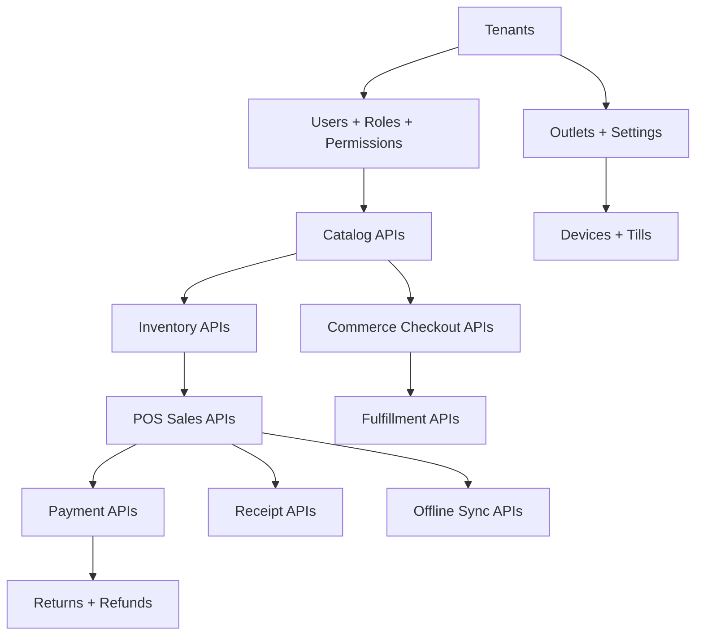

# Module Endpoint Map

## Purpose
Provide a module-wise API route map that aligns business scope, database modules, frontend modules, and backend Clean Architecture boundaries.

## Purpose
This file maps the major system modules to API route groups.
It is not a complete Swagger specification.
Each module-specific API spec must expand these routes into request/response contracts, validation rules, permissions, and error cases.

## Module Endpoint Map
| Module | Primary Route Group | Example Endpoints |
|---|---|---|
| Platform and Tenant | `/api/v1/platform` | tenants, feature catalog, entitlements |
| Identity/RBAC | `/api/v1/admin/access` | users, roles, permissions, role assignments |
| Tenant Configuration | `/api/v1/admin/config` | settings, feature flags, themes |
| Catalog | `/api/v1/catalog` | products, variants, categories, brands, suppliers |
| Tax and Pricing | `/api/v1/catalog/pricing` | tax classes, tax rates, price lists |
| Inventory | `/api/v1/backoffice/inventory` | balances, movements, transfers, stocktakes |
| POS Devices | `/api/v1/pos/devices` | devices, tills, session context |
| POS Sales | `/api/v1/pos` | sales, held sales, voids, receipts |
| Payments | `/api/v1/payments` | captures, allocations, refunds |
| Discounts | `/api/v1/discounts` | policies, coupons, requests, approvals |
| Returns/Exchanges | `/api/v1/returns`, `/api/v1/exchanges` | return docs, exchange docs, allocations |
| E-Commerce | `/api/v1/commerce` | storefront, cart, checkout, orders |
| Fulfillment | `/api/v1/backoffice/fulfillment` | deliveries, pickup, tracking |
| Customers | `/api/v1/customers` | profiles, addresses, auth accounts |
| Offline Sync | `/api/v1/offline` | batches, items, conflicts |
| Reports/Audit | `/api/v1/reports`, `/api/v1/audit` | summaries, audit logs |

## CRUD and Command Split
| Module | CRUD Example | Command Example |
|---|---|---|
| Products | `POST /catalog/products` | `POST /catalog/products/{id}/archive` |
| Stock Transfers | `POST /inventory/transfers` | `POST /inventory/transfers/{id}/approve` |
| Till Sessions | `GET /pos/till-sessions/{id}` | `POST /pos/till-sessions/open` |
| Sales | `GET /pos/sales/{id}` | `POST /pos/sales/{id}/void` |
| Orders | `GET /commerce/orders/{id}` | `POST /commerce/orders/{id}/cancel` |
| Returns | `POST /returns` | `POST /returns/{id}/approve` |
| Sync Conflicts | `GET /offline/conflicts` | `POST /offline/conflicts/{id}/resolve` |

## Dependency-Aware Endpoint Planning


## Required Access Documentation Per Endpoint
Every endpoint spec must declare:
- actor types allowed
- tenant context rule
- outlet/device/session requirement where applicable
- permission code
- feature key
- runtime feature flag behavior
- validation rules
- idempotency requirement
- audit requirement
- main database tables affected

## Example Endpoint Declaration
```yaml
route: POST /api/v1/pos/sales
actor: tenant_user
tenantContext: required
outletContext: required
deviceContext: required
permission: pos.sale.create
feature: pos.sales
idempotency: required
audit: required
tables: [sales, sale_lines, payments, sale_payment_allocations, stock_movements, receipts]
```

## Related Documents
- [[endpoint-design]]
- [[feature-access-api-rules]]
- [[idempotency-rules]]
- [[offline-sync-api-rules]]

## Implementation Checklist
- Confirm whether the endpoint is platform-level or tenant-level.
- Resolve authenticated actor from JWT claims before business logic.
- Resolve tenant context from route/header/subdomain according to the approved rule.
- Reject requests where target records do not belong to the resolved tenant.
- Validate platform feature entitlement when the action is feature-gated.
- Validate runtime feature flag when a tenant/outlet/user override exists.
- Validate role permissions and role-feature assignments.
- Validate request DTO with module-specific validators.
- Use application service orchestration for business workflows.
- Use repository and Unit of Work for transactional writes.
- Recalculate sensitive totals server-side.
- Record audit logs for sensitive actions and configuration changes.
- Return standard response envelope and standard error contract.
- Add tests for allowed, denied, invalid, duplicate, and cross-tenant cases.
- Confirm whether the endpoint is platform-level or tenant-level.
- Resolve authenticated actor from JWT claims before business logic.
- Resolve tenant context from route/header/subdomain according to the approved rule.
- Reject requests where target records do not belong to the resolved tenant.
- Validate platform feature entitlement when the action is feature-gated.
- Validate runtime feature flag when a tenant/outlet/user override exists.
- Validate role permissions and role-feature assignments.
- Validate request DTO with module-specific validators.
- Use application service orchestration for business workflows.
- Use repository and Unit of Work for transactional writes.
- Recalculate sensitive totals server-side.
- Record audit logs for sensitive actions and configuration changes.
- Return standard response envelope and standard error contract.
- Add tests for allowed, denied, invalid, duplicate, and cross-tenant cases.
- Confirm whether the endpoint is platform-level or tenant-level.
- Resolve authenticated actor from JWT claims before business logic.
- Resolve tenant context from route/header/subdomain according to the approved rule.
- Reject requests where target records do not belong to the resolved tenant.
- Validate platform feature entitlement when the action is feature-gated.
- Validate runtime feature flag when a tenant/outlet/user override exists.
- Validate role permissions and role-feature assignments.
- Validate request DTO with module-specific validators.
- Use application service orchestration for business workflows.
- Use repository and Unit of Work for transactional writes.
- Recalculate sensitive totals server-side.
- Record audit logs for sensitive actions and configuration changes.
- Return standard response envelope and standard error contract.
- Add tests for allowed, denied, invalid, duplicate, and cross-tenant cases.
- Confirm whether the endpoint is platform-level or tenant-level.
- Resolve authenticated actor from JWT claims before business logic.
- Resolve tenant context from route/header/subdomain according to the approved rule.
- Reject requests where target records do not belong to the resolved tenant.
- Validate platform feature entitlement when the action is feature-gated.
- Validate runtime feature flag when a tenant/outlet/user override exists.
- Validate role permissions and role-feature assignments.
- Validate request DTO with module-specific validators.
- Use application service orchestration for business workflows.
- Use repository and Unit of Work for transactional writes.
- Recalculate sensitive totals server-side.
- Record audit logs for sensitive actions and configuration changes.
- Return standard response envelope and standard error contract.
- Add tests for allowed, denied, invalid, duplicate, and cross-tenant cases.
- Confirm whether the endpoint is platform-level or tenant-level.
- Resolve authenticated actor from JWT claims before business logic.
