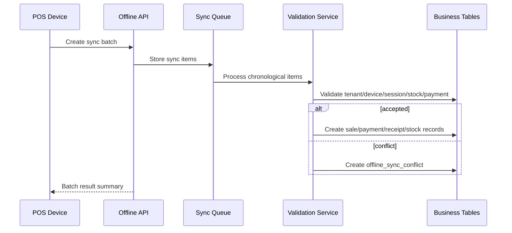

# Offline Sync API Rules

## Purpose
Define API rules for offline POS sync batches, sync items, duplicate prevention, validation, conflict creation, and conflict resolution.

## Purpose
Offline sync APIs accept locally stored POS transactions, payments, receipts, stock movements, returns, exchanges, and cash movements after connectivity returns.
The server must validate every offline item before accepting it as source-of-truth business data.

## Database Mapping
| Table | Purpose |
|---|---|
| `offline_sync_batches` | One reconnect/sync attempt from a device |
| `offline_sync_items` | Generic sync item queue |
| `offline_sale_sync_queue` | Typed sale staging extension |
| `offline_payment_sync_queue` | Typed payment staging extension |
| `offline_sync_conflicts` | Conflict records requiring explicit resolution |
| `offline_sync_audit_logs` | Technical sync lifecycle audit |

## Sync API Route Examples
```http
POST /api/v1/offline/sync-batches
POST /api/v1/offline/sync-batches/{batchId}/items
GET  /api/v1/offline/sync-batches/{batchId}
GET  /api/v1/offline/conflicts
POST /api/v1/offline/conflicts/{conflictId}/resolve
```

## Offline Payload Requirements
- tenant id must match authenticated/context tenant.
- device id must be registered and active.
- outlet id must match device outlet.
- each local entity must have stable client entity id.
- each transaction group must have client transaction id.
- payload must contain offline occurred timestamp.
- payload must include cached price/tax/discount snapshot used at time of sale.

## Sync Processing Flow


## Conflict Types
| Conflict | Meaning | Handling |
|---|---|---|
| `duplicate` | Client item already processed | Return existing result |
| `stock_mismatch` | Available stock changed | Create conflict, do not silently corrupt stock |
| `price_changed` | Server price differs | Apply tenant offline policy or conflict |
| `closed_session` | Till session no longer valid | Conflict/manual review |
| `validation_failed` | Payload violates business rule | Reject item with error |

## Security Rules
- Offline mode must never bypass backend authorization.
- Sync must re-check permissions and feature access where appropriate.
- Blocked devices cannot sync accepted business records.
- Raw client payload must be retained for conflict review but protected from unauthorized users.
- Conflict resolution requires configurable permission `offline.conflict.resolve`.

## Related Documents
- [[idempotency-rules]]
- [[concurrency-rules]]
- [[device-session-api-rules]]
- [[error-contract]]

## Implementation Checklist
- Confirm whether the endpoint is platform-level or tenant-level.
- Resolve authenticated actor from JWT claims before business logic.
- Resolve tenant context from route/header/subdomain according to the approved rule.
- Reject requests where target records do not belong to the resolved tenant.
- Validate platform feature entitlement when the action is feature-gated.
- Validate runtime feature flag when a tenant/outlet/user override exists.
- Validate role permissions and role-feature assignments.
- Validate request DTO with module-specific validators.
- Use application service orchestration for business workflows.
- Use repository and Unit of Work for transactional writes.
- Recalculate sensitive totals server-side.
- Record audit logs for sensitive actions and configuration changes.
- Return standard response envelope and standard error contract.
- Add tests for allowed, denied, invalid, duplicate, and cross-tenant cases.
- Confirm whether the endpoint is platform-level or tenant-level.
- Resolve authenticated actor from JWT claims before business logic.
- Resolve tenant context from route/header/subdomain according to the approved rule.
- Reject requests where target records do not belong to the resolved tenant.
- Validate platform feature entitlement when the action is feature-gated.
- Validate runtime feature flag when a tenant/outlet/user override exists.
- Validate role permissions and role-feature assignments.
- Validate request DTO with module-specific validators.
- Use application service orchestration for business workflows.
- Use repository and Unit of Work for transactional writes.
- Recalculate sensitive totals server-side.
- Record audit logs for sensitive actions and configuration changes.
- Return standard response envelope and standard error contract.
- Add tests for allowed, denied, invalid, duplicate, and cross-tenant cases.
- Confirm whether the endpoint is platform-level or tenant-level.
- Resolve authenticated actor from JWT claims before business logic.
- Resolve tenant context from route/header/subdomain according to the approved rule.
- Reject requests where target records do not belong to the resolved tenant.
- Validate platform feature entitlement when the action is feature-gated.
- Validate runtime feature flag when a tenant/outlet/user override exists.
- Validate role permissions and role-feature assignments.
- Validate request DTO with module-specific validators.
- Use application service orchestration for business workflows.
- Use repository and Unit of Work for transactional writes.
- Recalculate sensitive totals server-side.
- Record audit logs for sensitive actions and configuration changes.
- Return standard response envelope and standard error contract.
- Add tests for allowed, denied, invalid, duplicate, and cross-tenant cases.
- Confirm whether the endpoint is platform-level or tenant-level.
- Resolve authenticated actor from JWT claims before business logic.
- Resolve tenant context from route/header/subdomain according to the approved rule.
- Reject requests where target records do not belong to the resolved tenant.
- Validate platform feature entitlement when the action is feature-gated.
- Validate runtime feature flag when a tenant/outlet/user override exists.
- Validate role permissions and role-feature assignments.
- Validate request DTO with module-specific validators.
- Use application service orchestration for business workflows.
- Use repository and Unit of Work for transactional writes.
- Recalculate sensitive totals server-side.
- Record audit logs for sensitive actions and configuration changes.
- Return standard response envelope and standard error contract.
- Add tests for allowed, denied, invalid, duplicate, and cross-tenant cases.
- Confirm whether the endpoint is platform-level or tenant-level.
- Resolve authenticated actor from JWT claims before business logic.
- Resolve tenant context from route/header/subdomain according to the approved rule.
- Reject requests where target records do not belong to the resolved tenant.
- Validate platform feature entitlement when the action is feature-gated.
- Validate runtime feature flag when a tenant/outlet/user override exists.
- Validate role permissions and role-feature assignments.
- Validate request DTO with module-specific validators.
- Use application service orchestration for business workflows.
- Use repository and Unit of Work for transactional writes.
- Recalculate sensitive totals server-side.
- Record audit logs for sensitive actions and configuration changes.
- Return standard response envelope and standard error contract.
- Add tests for allowed, denied, invalid, duplicate, and cross-tenant cases.
