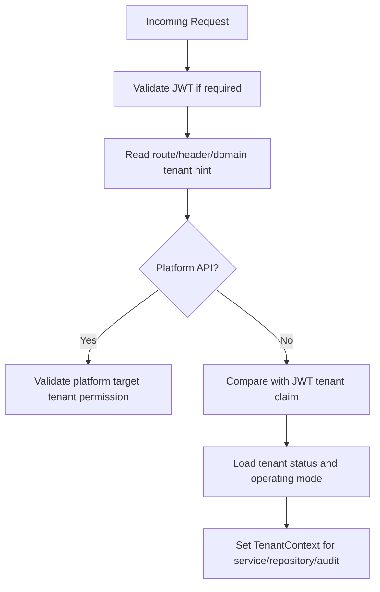

# Tenant Context API Rules

## Purpose
Define how APIs resolve, validate, and enforce tenant context across platform, tenant admin, POS, e-commerce, offline sync, and reporting routes.

## Tenant Context Definition
Tenant context is the resolved tenant boundary used for all tenant-owned records.
It protects data isolation and controls configurable behavior.
All tenant-level APIs must know which tenant is being accessed before loading business data.

## Accepted Tenant Context Sources
| Source | Usage | Trust Level |
|---|---|---|
| JWT `tenant_id` claim | Tenant staff/customer/device calls | High after token validation |
| Route segment | Admin APIs targeting tenant resources | Medium; must match actor rights |
| Header `X-Tenant-Id` | Transitional/internal development pattern | Medium; must be validated |
| Storefront domain/subdomain | E-commerce tenant resolution | Medium; map to tenant code/domain |
| Platform selected tenant id | Platform admin support operations | Requires platform permission |

## Tenant Context Rules
- Never trust tenant id from request body for ownership.
- Route/header tenant id must match JWT tenant claim unless platform operation allows target tenant selection.
- Every FK target record must belong to the same tenant.
- Tenant status must be checked before operational writes.
- Suspended tenants must not create sales/orders unless platform policy explicitly allows it.
- Tenant context must be available to repositories and audit logging.

## Tenant Resolution Flow


## API Examples
```http
GET /api/v1/admin/outlets
X-Tenant-Id: <tenant-id>
Authorization: Bearer <tenant-staff-jwt>
```

```http
POST /api/v1/platform/tenants/{tenantId}/features/{featureId}/enable
Authorization: Bearer <platform-admin-jwt>
```

## Cross-Tenant Rejection Cases
| Case | Expected Result |
|---|---|
| User token tenant A updates product from tenant B | `403 Forbidden` or `404 Not Found` depending leakage policy |
| Outlet id belongs to another tenant | `422 ValidationError` or `403 Forbidden` |
| Device registered under another outlet | `403 Forbidden` |
| Customer attempts order from wrong tenant storefront | `403 Forbidden` |
| Platform admin lacks target tenant support permission | `403 Forbidden` |

## Repository Requirement
Every tenant-owned repository query must include tenant filter.
Application service must pass tenant context explicitly or through a scoped context service.
Do not implement tenant filtering only at controller level because nested repository calls can bypass it.

## Related Documents
- [[auth-and-authorization]]
- [[feature-access-api-rules]]
- [[endpoint-design]]
- [[request-response-standard]]

## Implementation Checklist
- Confirm whether the endpoint is platform-level or tenant-level.
- Resolve authenticated actor from JWT claims before business logic.
- Resolve tenant context from route/header/subdomain according to the approved rule.
- Reject requests where target records do not belong to the resolved tenant.
- Validate platform feature entitlement when the action is feature-gated.
- Validate runtime feature flag when a tenant/outlet/user override exists.
- Validate role permissions and role-feature assignments.
- Validate request DTO with module-specific validators.
- Use application service orchestration for business workflows.
- Use repository and Unit of Work for transactional writes.
- Recalculate sensitive totals server-side.
- Record audit logs for sensitive actions and configuration changes.
- Return standard response envelope and standard error contract.
- Add tests for allowed, denied, invalid, duplicate, and cross-tenant cases.
- Confirm whether the endpoint is platform-level or tenant-level.
- Resolve authenticated actor from JWT claims before business logic.
- Resolve tenant context from route/header/subdomain according to the approved rule.
- Reject requests where target records do not belong to the resolved tenant.
- Validate platform feature entitlement when the action is feature-gated.
- Validate runtime feature flag when a tenant/outlet/user override exists.
- Validate role permissions and role-feature assignments.
- Validate request DTO with module-specific validators.
- Use application service orchestration for business workflows.
- Use repository and Unit of Work for transactional writes.
- Recalculate sensitive totals server-side.
- Record audit logs for sensitive actions and configuration changes.
- Return standard response envelope and standard error contract.
- Add tests for allowed, denied, invalid, duplicate, and cross-tenant cases.
- Confirm whether the endpoint is platform-level or tenant-level.
- Resolve authenticated actor from JWT claims before business logic.
- Resolve tenant context from route/header/subdomain according to the approved rule.
- Reject requests where target records do not belong to the resolved tenant.
- Validate platform feature entitlement when the action is feature-gated.
- Validate runtime feature flag when a tenant/outlet/user override exists.
- Validate role permissions and role-feature assignments.
- Validate request DTO with module-specific validators.
- Use application service orchestration for business workflows.
- Use repository and Unit of Work for transactional writes.
- Recalculate sensitive totals server-side.
- Record audit logs for sensitive actions and configuration changes.
- Return standard response envelope and standard error contract.
- Add tests for allowed, denied, invalid, duplicate, and cross-tenant cases.
- Confirm whether the endpoint is platform-level or tenant-level.
- Resolve authenticated actor from JWT claims before business logic.
- Resolve tenant context from route/header/subdomain according to the approved rule.
- Reject requests where target records do not belong to the resolved tenant.
- Validate platform feature entitlement when the action is feature-gated.
- Validate runtime feature flag when a tenant/outlet/user override exists.
- Validate role permissions and role-feature assignments.
- Validate request DTO with module-specific validators.
- Use application service orchestration for business workflows.
- Use repository and Unit of Work for transactional writes.
- Recalculate sensitive totals server-side.
- Record audit logs for sensitive actions and configuration changes.
- Return standard response envelope and standard error contract.
- Add tests for allowed, denied, invalid, duplicate, and cross-tenant cases.
- Confirm whether the endpoint is platform-level or tenant-level.
- Resolve authenticated actor from JWT claims before business logic.
- Resolve tenant context from route/header/subdomain according to the approved rule.
- Reject requests where target records do not belong to the resolved tenant.
- Validate platform feature entitlement when the action is feature-gated.
- Validate runtime feature flag when a tenant/outlet/user override exists.
- Validate role permissions and role-feature assignments.
- Validate request DTO with module-specific validators.
- Use application service orchestration for business workflows.
- Use repository and Unit of Work for transactional writes.
- Recalculate sensitive totals server-side.
- Record audit logs for sensitive actions and configuration changes.
- Return standard response envelope and standard error contract.
- Add tests for allowed, denied, invalid, duplicate, and cross-tenant cases.
- Confirm whether the endpoint is platform-level or tenant-level.
- Resolve authenticated actor from JWT claims before business logic.
- Resolve tenant context from route/header/subdomain according to the approved rule.
- Reject requests where target records do not belong to the resolved tenant.
- Validate platform feature entitlement when the action is feature-gated.
- Validate runtime feature flag when a tenant/outlet/user override exists.
- Validate role permissions and role-feature assignments.
- Validate request DTO with module-specific validators.
