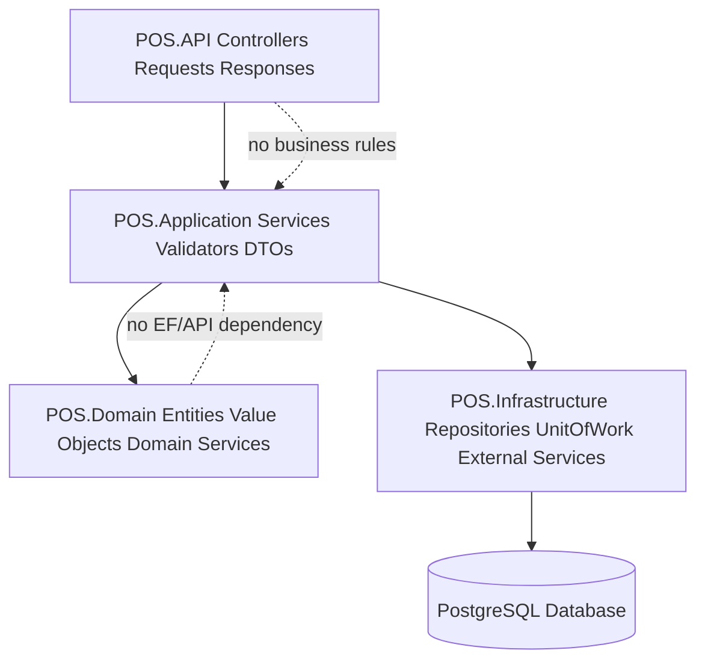

# Backend Documentation Index

Purpose: Defines how backend documentation must be read and applied for the enterprise Unified Commerce backend.

This document is written for the Unified Commerce backend: a multi-tenant SaaS platform combining POS, E-Commerce, inventory, payment, refund, receipt, return, exchange, offline sync, reporting and audit capabilities.

Related reading: [[backend-overview]], [[backend-folder-structure]], [[clean-architecture-rules]], [[authentication-authorization]], [[feature-access-handling]], [[repository-layer-rules]], [[service-layer-rules]], [[offline-sync-backend-rules]]

## Architecture Position

- Backend implementation follows Clean Architecture with explicit Application Services and Repositories.
- CQRS is not part of this backend design.
- MediatR is not part of this backend design.
- The backend is the final authority for tenant isolation, RBAC, feature access, stock, tax, payment, refund, sync and audit.
- Frontend visibility is allowed for usability, but it is not security.
- Except platform-admin-only features, tenant-level features must be configurable by tenant roles, permissions and feature assignments.

## Approved Pattern



## System-Specific Responsibilities

| Area | Backend responsibility | Database anchor |
|---|---|---|
| Tenant foundation | Create tenants, outlets, document sequences and base settings | `tenants`, `outlets`, `outlet_addresses`, `document_sequences` |
| Identity and access | Staff identity, role assignment, permissions and tenant feature assignment | `users`, `roles`, `permissions`, `role_permissions`, `tenant_user_roles`, `outlet_user_roles` |
| Feature control | Entitlements, role feature access and runtime flags | `platform_features`, `tenant_feature_entitlements`, `role_feature_assignments`, `feature_flags` |
| Catalog | Product, variant, attribute, image, supplier and channel availability workflows | `products`, `product_variants`, `categories`, `brands`, `suppliers`, `product_images` |
| Tax and pricing | Tax class/rate resolution and price list selection | `tax_classes`, `tax_rates`, `tax_class_rates`, `price_lists`, `price_list_items` |
| Inventory | Outlet-wise stock balances, immutable stock movements, reservations and transfers | `inventory_balances`, `stock_movements`, `stock_reservations`, `stock_transfers` |
| POS operation | Device, till, session, sale, line and cash movement rules | `pos_devices`, `tills`, `till_sessions`, `sales`, `sale_lines`, `cash_movements` |
| Payments | Payment recording, allocation, gateway trace and refund records | `payments`, `payment_transactions`, `sale_payment_allocations`, `order_payment_allocations`, `refunds` |
| E-Commerce | Cart, order, address snapshot, order status and fulfillment readiness | `carts`, `cart_items`, `orders`, `order_items`, `order_addresses`, `deliveries` |
| Returns and exchanges | Return policy validation, refund allocation and stock re-entry rules | `returns`, `return_lines`, `exchanges`, `exchange_lines` |
| Offline sync | Sync batch processing, item staging, typed sale/payment queues and conflict records | `offline_sync_batches`, `offline_sync_items`, `offline_sale_sync_queue`, `offline_payment_sync_queue` |
| Audit and reports | Sensitive action audit and reporting read models | `audit_logs`, `daily_sales_summaries`, `daily_inventory_summaries` |

## Core Rules

- Do not introduce CQRS, MediatR, command handlers or query handlers for this backend.
- Use explicit services, repositories, validators, DTOs and UnitOfWork transactions.
- Follow SOLID: services depend on interfaces, domain stays pure, infrastructure is replaceable.

## 1. Reading order

Read backend documents in dependency order: overview, folder structure, Clean Architecture rules, service rules, repository rules, transaction rules, then module-specific implementation guidance.
Use `authentication-authorization.md` and `feature-access-handling.md` before implementing any protected endpoint.
Use `offline-sync-backend-rules.md` before writing any sync, POS device or offline queue feature.

## 2. Backend authority model

This area must follow the approved scope, database and backend architecture.
Implementation must stay tenant-scoped and permission-aware.
Avoid adding tables, patterns or modules that are not supported by the approved design.

## 3. Development boundaries

This area must follow the approved scope, database and backend architecture.
Implementation must stay tenant-scoped and permission-aware.
Avoid adding tables, patterns or modules that are not supported by the approved design.

## 4. Module dependency awareness

This area must follow the approved scope, database and backend architecture.
Implementation must stay tenant-scoped and permission-aware.
Avoid adding tables, patterns or modules that are not supported by the approved design.

## 5. How to use this folder with Cursor or AI IDE

Each backend module must keep API contracts, application DTOs, services, validators, domain models and infrastructure repositories separated.
The `Dtos` folder is mandatory inside each Application module when that module exposes request or response data.
Do not place DTOs directly beside controllers or repositories if they belong to application use cases.

## Implementation Example

```csharp
public sealed class ProductService : IProductService
{
    private readonly IProductRepository _products;
    private readonly IAccessDecisionService _access;
    private readonly IUnitOfWork _unitOfWork;

    public async Task<ProductDto> CreateAsync(CreateProductDto dto, RequestContext context)
    {
        await _access.RequireAsync(context, "catalog.product.create", "catalog.products");
        ProductValidator.ValidateCreate(dto);
        await _unitOfWork.BeginAsync();
        var product = Product.Create(context.TenantId, dto.Name, dto.ProductType);
        await _products.AddAsync(product);
        await _unitOfWork.CommitAsync();
        return ProductDto.From(product);
    }
}
```

## API Behavior Example

```http
POST /api/v1/{module}/{resource}
Authorization: Bearer <jwt>
X-Tenant-Id: <tenant-id>
Content-Type: application/json
```

## Tenant-Specific Behavior

- A platform admin may enable a feature for a tenant through tenant feature entitlements.
- A tenant admin configures roles and assigns permissions only inside that tenant boundary.
- Outlet-scoped users must be validated against `outlet_user_roles` where outlet context is required.
- Tenant-level users must be validated against `tenant_user_roles` for tenant-wide actions.
- Runtime flags may disable a feature for a tenant, outlet or user even when entitlement exists.
- Backend services must check this model on every protected write and sensitive read.

## Data Flow References

- `tenants` controls tenant lifecycle and operating mode.
- `platform_features` defines platform-owned feature catalog.
- `tenant_feature_entitlements` controls which features are available to each tenant.
- `roles` and `permissions` define configurable tenant access behavior.
- `role_permissions` and `role_feature_assignments` connect tenant roles to actions and features.
- `feature_flags` applies runtime tenant/outlet/user-level configuration.
- `audit_logs` records sensitive business or configuration changes.

## Implementation Considerations

- Keep controllers thin and move workflow orchestration into application services.
- Keep repositories persistence-focused and transaction-neutral.
- Keep domain models free from EF Core, HTTP and infrastructure concerns.
- Use UnitOfWork for workflows that span multiple tables or modules.
- Use stable permission codes instead of hardcoded role names.
- Use tenant id in all tenant-owned repository methods.
- Do not add generic cache tables or unsupported database shortcuts.
- Do not store secrets, plain OTP codes, card data or payment private keys in JSON columns.
- Record actor, tenant, outlet/device context and reason for sensitive actions.
- Prefer explicit validators over hidden validation inside controllers.

## Do Not Implement

- Do not implement CQRS handlers for this backend.
- Do not introduce MediatR pipelines.
- Do not hardcode cashier, manager or tenant admin capabilities in service logic.
- Do not trust frontend-calculated totals for final sale, order, refund or tax decisions.
- Do not bypass tenant ownership validation for any FK in request payloads.
- Do not create undocumented tables or generic cache tables.

## Review Questions

- Does this implementation preserve tenant isolation?
- Does the service check tenant entitlement, permission and runtime feature flags?
- Does the repository query include tenant id for tenant-owned records?
- Is the transaction boundary correct for all records written?
- Are DTOs separated from API request and database entity models?
- Are sensitive changes audited with actor and reason where required?

## Related Documents

- [[backend-overview]]
- [[backend-folder-structure]]
- [[clean-architecture-rules]]
- [[authentication-authorization]]
- [[feature-access-handling]]
- [[repository-layer-rules]]
- [[service-layer-rules]]
- [[offline-sync-backend-rules]]
