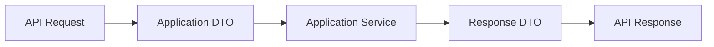

# DTO Handling

Purpose: Defines DTO placement, naming and separation of request DTOs, response DTOs and internal service DTOs.

This document is written for the Unified Commerce backend: a multi-tenant SaaS platform combining POS, E-Commerce, inventory, payment, refund, receipt, return, exchange, offline sync, reporting and audit capabilities.

Related reading: [[mapping-rules]], [[validation-rules]], [[backend-folder-structure]]

## Architecture Position

- Backend implementation follows Clean Architecture with explicit Application Services and Repositories.
- CQRS is not part of this backend design.
- MediatR is not part of this backend design.
- The backend is the final authority for tenant isolation, RBAC, feature access, stock, tax, payment, refund, sync and audit.
- Frontend visibility is allowed for usability, but it is not security.
- Except platform-admin-only features, tenant-level features must be configurable by tenant roles, permissions and feature assignments.

## Approved Pattern



## System-Specific Responsibilities

| DTO type | Folder | Example file |
|---|---|---|
| Create DTO | `POS.Application/Modules/Products/Dtos` | `CreateProductDto.cs` |
| Update DTO | `POS.Application/Modules/Products/Dtos` | `UpdateProductDto.cs` |
| Response DTO | `POS.Application/Modules/Products/Dtos` | `ProductDto.cs` |
| List item DTO | `POS.Application/Modules/Products/Dtos` | `ProductListItemDto.cs` |
| API request | `POS.API/Modules/Products/Requests` | `CreateProductRequest.cs` |

## Core Rules

- Do not introduce CQRS, MediatR, command handlers or query handlers for this backend.
- Use explicit services, repositories, validators, DTOs and UnitOfWork transactions.
- Follow SOLID: services depend on interfaces, domain stays pure, infrastructure is replaceable.
- DTO classes must be placed in a `Dtos` folder inside each Application module.
- Each DTO must be a separate `.cs` file.
- API request classes are not reused as application DTOs.

## 1. DTO folder rule

Each backend module must keep API contracts, application DTOs, services, validators, domain models and infrastructure repositories separated.
The `Dtos` folder is mandatory inside each Application module when that module exposes request or response data.
Do not place DTOs directly beside controllers or repositories if they belong to application use cases.

## 2. One DTO per C# file

API request models represent HTTP input shape.
Application DTOs represent service input and output.
Response DTOs must not expose password hashes, secret references, internal sync payloads or unauthorized tenant data.

## 3. Request vs application DTOs

API request models represent HTTP input shape.
Application DTOs represent service input and output.
Response DTOs must not expose password hashes, secret references, internal sync payloads or unauthorized tenant data.

## 4. Response shaping

API request models represent HTTP input shape.
Application DTOs represent service input and output.
Response DTOs must not expose password hashes, secret references, internal sync payloads or unauthorized tenant data.

## 5. DTO examples

API request models represent HTTP input shape.
Application DTOs represent service input and output.
Response DTOs must not expose password hashes, secret references, internal sync payloads or unauthorized tenant data.

## Implementation Example

```csharp
namespace POS.Application.Modules.Products.Dtos;

public sealed class CreateProductDto
{
    public Guid? CategoryId { get; init; }
    public Guid? BrandId { get; init; }
    public Guid? TaxClassId { get; init; }
    public Guid ReturnPolicyId { get; init; }
    public string ProductType { get; init; } = default!;
    public string Name { get; init; } = default!;
    public string Slug { get; init; } = default!;
    public bool IsSellablePos { get; init; }
    public bool IsSellableOnline { get; init; }
    public bool TrackInventory { get; init; }
}
```

## API Behavior Example

```http
POST /api/v1/{module}/{resource}
Authorization: Bearer <jwt>
X-Tenant-Id: <tenant-id>
Content-Type: application/json
```

## Tenant-Specific Behavior

- A platform admin may enable a feature for a tenant through tenant feature entitlements.
- A tenant admin configures roles and assigns permissions only inside that tenant boundary.
- Outlet-scoped users must be validated against `outlet_user_roles` where outlet context is required.
- Tenant-level users must be validated against `tenant_user_roles` for tenant-wide actions.
- Runtime flags may disable a feature for a tenant, outlet or user even when entitlement exists.
- Backend services must check this model on every protected write and sensitive read.

## Data Flow References

- `tenants` controls tenant lifecycle and operating mode.
- `platform_features` defines platform-owned feature catalog.
- `tenant_feature_entitlements` controls which features are available to each tenant.
- `roles` and `permissions` define configurable tenant access behavior.
- `role_permissions` and `role_feature_assignments` connect tenant roles to actions and features.
- `feature_flags` applies runtime tenant/outlet/user-level configuration.
- `audit_logs` records sensitive business or configuration changes.

## Implementation Considerations

- Keep controllers thin and move workflow orchestration into application services.
- Keep repositories persistence-focused and transaction-neutral.
- Keep domain models free from EF Core, HTTP and infrastructure concerns.
- Use UnitOfWork for workflows that span multiple tables or modules.
- Use stable permission codes instead of hardcoded role names.
- Use tenant id in all tenant-owned repository methods.
- Do not add generic cache tables or unsupported database shortcuts.
- Do not store secrets, plain OTP codes, card data or payment private keys in JSON columns.
- Record actor, tenant, outlet/device context and reason for sensitive actions.
- Prefer explicit validators over hidden validation inside controllers.
- Keep DTOs immutable where possible using `init` properties.
- Do not reuse database entity classes as response models.

## Do Not Implement

- Do not implement CQRS handlers for this backend.
- Do not introduce MediatR pipelines.
- Do not hardcode cashier, manager or tenant admin capabilities in service logic.
- Do not trust frontend-calculated totals for final sale, order, refund or tax decisions.
- Do not bypass tenant ownership validation for any FK in request payloads.
- Do not create undocumented tables or generic cache tables.

## Review Questions

- Does this implementation preserve tenant isolation?
- Does the service check tenant entitlement, permission and runtime feature flags?
- Does the repository query include tenant id for tenant-owned records?
- Is the transaction boundary correct for all records written?
- Are DTOs separated from API request and database entity models?
- Are sensitive changes audited with actor and reason where required?

## Related Documents

- [[mapping-rules]]
- [[validation-rules]]
- [[backend-folder-structure]]

- Note: Keep payment, stock and audit writes in the same workflow transaction when business consistency requires it.
- Note: Prefer explicit code over hidden magic for enterprise workflows.
- Note: Use database constraints as safety guarantees, not as the only business validation layer.
- Note: Keep feature configuration readable for support, audit and tenant administration.
- Note: Use structured logs with tenant id, actor id, trace id and module name.
