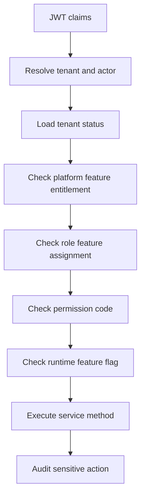

# Feature Access Handling

Purpose: Defines how tenant feature entitlements, role feature assignments, permissions and runtime flags are evaluated for every protected operation.

This document is written for the Unified Commerce backend: a multi-tenant SaaS platform combining POS, E-Commerce, inventory, payment, refund, receipt, return, exchange, offline sync, reporting and audit capabilities.

Related reading: [[authentication-authorization]], [[service-layer-rules]], [[validation-rules]]

## Architecture Position

- Backend implementation follows Clean Architecture with explicit Application Services and Repositories.
- CQRS is not part of this backend design.
- MediatR is not part of this backend design.
- The backend is the final authority for tenant isolation, RBAC, feature access, stock, tax, payment, refund, sync and audit.
- Frontend visibility is allowed for usability, but it is not security.
- Except platform-admin-only features, tenant-level features must be configurable by tenant roles, permissions and feature assignments.

## Approved Pattern



## System-Specific Responsibilities

| Access layer | Database source | Decision |
|---|---|---|
| Tenant status | `tenants.status` | Active tenant required for operational writes |
| Entitlement | `tenant_feature_entitlements` | Feature must be enabled for tenant |
| Role feature | `role_feature_assignments` | Tenant role must be allowed feature |
| Permission | `role_permissions` + `permissions` | Specific action permission required |
| Runtime flag | `feature_flags` | Tenant/outlet/user override may further restrict |

## Core Rules

- Do not introduce CQRS, MediatR, command handlers or query handlers for this backend.
- Use explicit services, repositories, validators, DTOs and UnitOfWork transactions.
- Follow SOLID: services depend on interfaces, domain stays pure, infrastructure is replaceable.
- Tenant entitlement is required before tenant-side role access is evaluated.
- A role may have permission but still be blocked if the feature is not enabled for the tenant.
- Runtime feature flags may restrict tenant, outlet or user behavior after entitlement is granted.

## 1. Access decision order

Access decisions must evaluate tenant entitlement, role feature assignment, permission code and runtime feature flag.
A tenant can customize operational roles such as cashier, outlet manager, inventory user or e-commerce operator.
Hardcoded role behavior is not acceptable for tenant-level features.

## 2. Tenant-specific behavior

This area must follow the approved scope, database and backend architecture.
Implementation must stay tenant-scoped and permission-aware.
Avoid adding tables, patterns or modules that are not supported by the approved design.

## 3. Feature entitlement rules

Access decisions must evaluate tenant entitlement, role feature assignment, permission code and runtime feature flag.
A tenant can customize operational roles such as cashier, outlet manager, inventory user or e-commerce operator.
Hardcoded role behavior is not acceptable for tenant-level features.

## 4. Permission examples

Access decisions must evaluate tenant entitlement, role feature assignment, permission code and runtime feature flag.
A tenant can customize operational roles such as cashier, outlet manager, inventory user or e-commerce operator.
Hardcoded role behavior is not acceptable for tenant-level features.

## 5. Backend enforcement points

This area must follow the approved scope, database and backend architecture.
Implementation must stay tenant-scoped and permission-aware.
Avoid adding tables, patterns or modules that are not supported by the approved design.

## Implementation Example

```csharp
await _access.RequireAsync(context,
    permissionCode: "pos.sale.void",
    featureKey: "pos.sales",
    outletId: context.OutletId);
```

## API Behavior Example

```http
POST /api/v1/tenant/users/{userId}/roles
Authorization: Bearer <jwt>
X-Tenant-Id: 2f4b7d1a-1111-4444-9999-21c62c5a8810
Content-Type: application/json
```

## Tenant-Specific Behavior

- A platform admin may enable a feature for a tenant through tenant feature entitlements.
- A tenant admin configures roles and assigns permissions only inside that tenant boundary.
- Outlet-scoped users must be validated against `outlet_user_roles` where outlet context is required.
- Tenant-level users must be validated against `tenant_user_roles` for tenant-wide actions.
- Runtime flags may disable a feature for a tenant, outlet or user even when entitlement exists.
- Backend services must check this model on every protected write and sensitive read.

## Data Flow References

- `tenants` controls tenant lifecycle and operating mode.
- `platform_features` defines platform-owned feature catalog.
- `tenant_feature_entitlements` controls which features are available to each tenant.
- `roles` and `permissions` define configurable tenant access behavior.
- `role_permissions` and `role_feature_assignments` connect tenant roles to actions and features.
- `feature_flags` applies runtime tenant/outlet/user-level configuration.
- `audit_logs` records sensitive business or configuration changes.

## Implementation Considerations

- Keep controllers thin and move workflow orchestration into application services.
- Keep repositories persistence-focused and transaction-neutral.
- Keep domain models free from EF Core, HTTP and infrastructure concerns.
- Use UnitOfWork for workflows that span multiple tables or modules.
- Use stable permission codes instead of hardcoded role names.
- Use tenant id in all tenant-owned repository methods.
- Do not add generic cache tables or unsupported database shortcuts.
- Do not store secrets, plain OTP codes, card data or payment private keys in JSON columns.
- Record actor, tenant, outlet/device context and reason for sensitive actions.
- Prefer explicit validators over hidden validation inside controllers.

## Do Not Implement

- Do not implement CQRS handlers for this backend.
- Do not introduce MediatR pipelines.
- Do not hardcode cashier, manager or tenant admin capabilities in service logic.
- Do not trust frontend-calculated totals for final sale, order, refund or tax decisions.
- Do not bypass tenant ownership validation for any FK in request payloads.
- Do not create undocumented tables or generic cache tables.

## Review Questions

- Does this implementation preserve tenant isolation?
- Does the service check tenant entitlement, permission and runtime feature flags?
- Does the repository query include tenant id for tenant-owned records?
- Is the transaction boundary correct for all records written?
- Are DTOs separated from API request and database entity models?
- Are sensitive changes audited with actor and reason where required?

## Related Documents

- [[authentication-authorization]]
- [[service-layer-rules]]
- [[validation-rules]]

- Note: Avoid circular service dependencies by moving shared pure logic into domain services or shared application services.
- Note: Do not mix platform admin operations with tenant staff operations in one authorization path.
- Note: Keep payment, stock and audit writes in the same workflow transaction when business consistency requires it.
- Note: Prefer explicit code over hidden magic for enterprise workflows.
- Note: Use database constraints as safety guarantees, not as the only business validation layer.
- Note: Keep feature configuration readable for support, audit and tenant administration.
- Note: Use structured logs with tenant id, actor id, trace id and module name.
